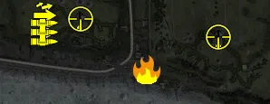

Static Ammo Crate

Pickup Kit

| Icon                      | SubCat            | Cat               | Name                       | Instance                           |   Flag |   X Pos |   Y Pos |    Z Pos |
|:--------------------------|:------------------|:------------------|:---------------------------|:-----------------------------------|-------:|--------:|--------:|---------:|
|     | Static Ammo Crate | Static Ammo Crate | ammo_crate                 | ammo_crate_0                       |      0 | 441.339 |  47.655 |  -25.476 |
|     | Static Ammo Crate | Static Ammo Crate | ammo_crate                 | ammo_crate_1                       |      0 | 136.991 |  39.221 |   12.763 |
|     | Static Ammo Crate | Static Ammo Crate | ammo_crate                 | ammo_crate_2                       |      0 | 171.988 |  60.770 |  658.753 |
|     | Static Ammo Crate | Static Ammo Crate | ammo_crate                 | ammo_crate_3                       |      0 |  66.136 |  59.831 |  561.247 |
|     | Static Ammo Crate | Static Ammo Crate | ammo_crate                 | ammo_crate_4                       |      0 | 269.557 |  23.114 |  -61.197 |
|     | Static Ammo Crate | Static Ammo Crate | ammo_crate                 | ammo_crate_5                       |      0 | 156.753 |  11.008 | -222.437 |
|     | Static Ammo Crate | Static Ammo Crate | ammo_crate                 | ammo_crate_6                       |      0 | 270.835 |  11.748 | -229.354 |
|     | Static Ammo Crate | Static Ammo Crate | ammo_crate                 | ammo_crate_7                       |      0 | 348.010 |  10.956 | -242.535 |
|     | Static Ammo Crate | Static Ammo Crate | ammo_crate                 | ammo_crate_8                       |      0 |  75.555 |  41.546 |   41.990 |
|  | Assault Kit       | Pickup Kit        | UW_PickUpAssaultM1Thompson | CP_16_omaha_wn71_DE_US_Assault     |    202 |  56.478 |  37.696 |  -15.761 |
|  | Assault Kit       | Pickup Kit        | UW_PickUpAssaultM1Thompson | CP_16_omaha_wn71_DE_US_Assault_0   |    202 |  57.406 |  40.998 |   22.669 |
|    | Flamethrower Kit  | Pickup Kit        | UW_PickUpFlamethrower      | CP_16_omaha_wn72_DE_US_Flame       |    201 | 286.264 |  20.010 |  -98.234 |
|       | MG Kit            | Pickup Kit        | UW_PickUpSupportM1918BAR   | CP_16_omaha_wn71_DE_US_SupportMG42 |    202 |  59.952 |  37.705 |  -16.585 |
|      | Deployable MG     | Pickup Kit        | UW_PickUp30Cal             | CP_16_omaha_wn73_DE_US_DepMG       |    203 | 443.173 |  47.951 |  -25.378 |
|      | Deployable MG     | Pickup Kit        | UW_PickUp30Cal             | CP_16_omaha_wn71_DE_US_DepMG       |    202 | 138.047 |  39.588 |   13.429 |
|   | Sniper Kit        | Pickup Kit        | UW_PickUpSniperSpringfield | CP_16_omaha_wn73_DE_US_Sniper      |    203 | 444.798 |  47.996 |  -25.050 |
|   | Sniper Kit        | Pickup Kit        | UW_PickUpSniperSpringfield | CP_16_omaha_wn71_DE_US_Sniper      |    202 | 139.029 |  40.001 |   14.470 |

