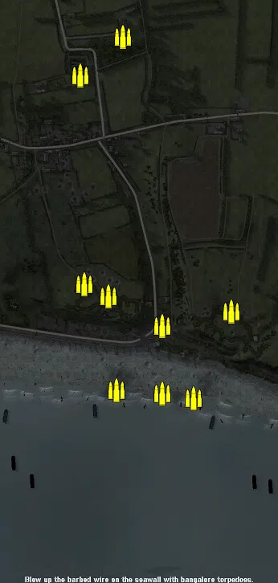
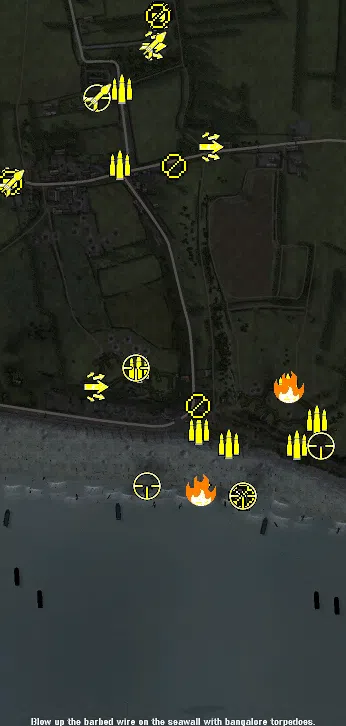
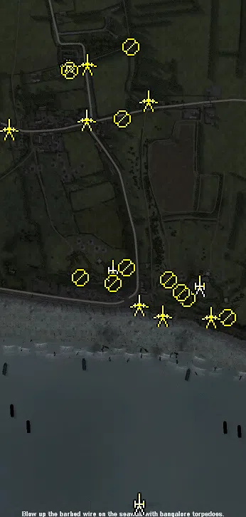
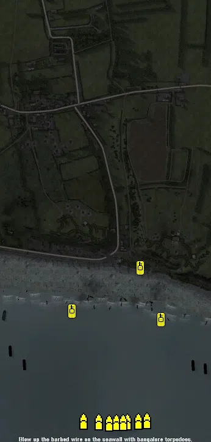

Static Ammo Crate

Pickup Kit

Static Emplacement

Vehicle

| gpo_subcat   | gpo_cat    | gpo_name                        |    pos_x |   pos_y |    pos_z |   flag | is_locked   |   team | instance                                  | gpo_cat_disp       | gpo_subcat_disp   |
|:-------------|:-----------|:--------------------------------|---------:|--------:|---------:|-------:|:------------|-------:|:------------------------------------------|:-------------------|:------------------|
| ammo_crate   | ammo_crate | ammo_crate                      |  441.339 |  47.655 |  -25.476 |      0 | False       |      0 | ammo_crate_0                              | Static Ammo Crate  | Static Ammo Crate |
| ammo_crate   | ammo_crate | ammo_crate                      |  136.991 |  39.221 |   12.763 |      0 | False       |      0 | ammo_crate_1                              | Static Ammo Crate  | Static Ammo Crate |
| ammo_crate   | ammo_crate | ammo_crate                      |  171.988 |  60.77  |  658.753 |      0 | False       |      0 | ammo_crate_2                              | Static Ammo Crate  | Static Ammo Crate |
| ammo_crate   | ammo_crate | ammo_crate                      |   66.136 |  59.831 |  561.247 |      0 | False       |      0 | ammo_crate_3                              | Static Ammo Crate  | Static Ammo Crate |
| ammo_crate   | ammo_crate | ammo_crate                      |  269.557 |  23.114 |  -61.197 |      0 | False       |      0 | ammo_crate_4                              | Static Ammo Crate  | Static Ammo Crate |
| ammo_crate   | ammo_crate | ammo_crate                      |  156.753 |  11.008 | -222.437 |      0 | False       |      0 | ammo_crate_5                              | Static Ammo Crate  | Static Ammo Crate |
| ammo_crate   | ammo_crate | ammo_crate                      |  270.835 |  11.748 | -229.354 |      0 | False       |      0 | ammo_crate_6                              | Static Ammo Crate  | Static Ammo Crate |
| ammo_crate   | ammo_crate | ammo_crate                      |  348.01  |  10.956 | -242.535 |      0 | False       |      0 | ammo_crate_7                              | Static Ammo Crate  | Static Ammo Crate |
| ammo_crate   | ammo_crate | ammo_crate                      |   75.555 |  41.546 |   41.99  |      0 | False       |      0 | ammo_crate_8                              | Static Ammo Crate  | Static Ammo Crate |
| ammo         | kit        | UW_PickUpAmmokit                |  110.205 |  59.445 |  572.917 |    108 | False       |      0 | CP_64_omaha_church_DE_US_Ammo             | Pickup Kit         | Ammo Kit          |
| ammo         | kit        | UW_PickUpAmmokit                |  105.009 |  52.466 |  419.184 |      2 | False       |      0 | CP_64_omaha_viervilleeast_DE_US_Ammo      | Pickup Kit         | Ammo Kit          |
| ammo         | kit        | UW_PickUpAmmokit                |  500.334 |  41.852 |  -89.309 |    103 | False       |      0 | CP_64_omaha_wn73_DE_US_Ammo               | Pickup Kit         | Ammo Kit          |
| ammo         | kit        | UW_PickUpAmmokit                |  459.89  |  32.57  | -140.304 |    103 | False       |      0 | CP_64_omaha_wn73_DE_US_Ammo_0             | Pickup Kit         | Ammo Kit          |
| ammo         | kit        | UW_PickUpAmmokit                |  323.108 |  17.336 | -138.931 |    101 | False       |      0 | CP_64_omaha_wn72_DE_US_Ammo               | Pickup Kit         | Ammo Kit          |
| ammo         | kit        | UW_PickUpAmmokit                |  264.507 |  18.284 | -110.361 |    101 | False       |      0 | CP_64_omaha_wn72_DE_US_Ammo_0             | Pickup Kit         | Ammo Kit          |
| ammo         | kit        | UW_PickUpAmmokit                |  144.372 |  39.134 |   14.753 |    102 | False       |      0 | CP_64_omaha_wn71_DE_US_Ammo               | Pickup Kit         | Ammo Kit          |
| ammo         | kit        | UW_PickUpAmmokit                |  442.258 |  47.658 |  -26.798 |    103 | False       |      0 | CP_64_omaha_wn73_DE_US_Ammo3              | Pickup Kit         | Ammo Kit          |
| arty_dep     | kit        | UW_PickUpMortar                 |  269.99  |  11.124 | -230.835 |      1 | False       |      0 | CP_64_omaha_beach_us_fleet_DE_US_Mortar   | Pickup Kit         | Deployable Arty   |
| arty_dep     | kit        | UW_PickUpMortar                 |  350.476 |  11.058 | -243.221 |      1 | False       |      0 | CP_64_omaha_beach_us_fleet_DE_US_Mortar2  | Pickup Kit         | Deployable Arty   |
| assault      | kit        | UW_PickUpAssaultM1Thompson      |  285.962 |  55.589 |  456.971 |      2 | False       |      0 | CP_64_omaha_viervilleeast_Sniper          | Pickup Kit         | Assault Kit       |
| assault      | kit        | UW_PickUpAssaultM1Thompson      | -113.28  |  55.159 |  385.448 |    107 | False       |      0 | CP_64_omaha_vierville_DE_US_AssaultGrease | Pickup Kit         | Assault Kit       |
| assault      | kit        | UW_PickUpAssaultM1Thompson      |   56.348 |  37.139 |  -24.516 |    102 | False       |      0 | CP_64_omaha_wn71_DE_US_Sniper             | Pickup Kit         | Assault Kit       |
| assault      | kit        | UW_PickUpAssaultM1Thompson      |  181.319 |  59.503 |  718.552 |    108 | False       |      0 | CP_64_omaha_church_DE_US_Sniper_0         | Pickup Kit         | Assault Kit       |
| assault      | kit        | UW_PickUpAssaultM1Thompson      |  171.301 |  61.607 |  658.82  |    108 | False       |      0 | CP_64_omaha_church_DE_US_Assault          | Pickup Kit         | Assault Kit       |
| flame        | kit        | UW_PickUpFlamethrower           |  267.804 |  11.134 | -229.057 |      1 | False       |      0 | CP_64_omaha_beach_Flame                   | Pickup Kit         | Flamethrower Kit  |
| flame        | kit        | UW_PickUpFlamethrower           |  444.725 |  47.992 |  -24.992 |    103 | False       |      0 | CP_64_omaha_wn73_DE_STG44                 | Pickup Kit         | Flamethrower Kit  |
| mg           | kit        | GW_PickUpSupportMG42            |  183.424 |  59.502 |  719.541 |    108 | False       |      0 | CP_64_omaha_church_DE_US_SupportMG42      | Pickup Kit         | MG Kit            |
| mg_dep       | kit        | UW_PickUp30Cal                  |  349.444 |  11.608 | -241.515 |    105 | False       |      0 | CP_64_omaha_beach_right_PortableMG        | Pickup Kit         | Deployable MG     |
| mg_dep       | kit        | UW_PickUp30Cal                  |  262.74  |  23.961 |  -62.009 |    101 | False       |      0 | CP_64_omaha_wn72_MG                       | Pickup Kit         | Deployable MG     |
| mg_dep       | kit        | UW_PickUp30Cal                  |  213.859 |  50.81  |  417.18  |      2 | False       |      0 | CP_64_omaha_viervilleeast_DE_US_DepMG     | Pickup Kit         | Deployable MG     |
| mg_dep       | kit        | UW_PickUp30Cal                  | -113.262 |  55.167 |  384.63  |    107 | False       |      0 | CP_64_omaha_vierville_DE_US_DepMG         | Pickup Kit         | Deployable MG     |
| mg_dep       | kit        | UW_PickUp30Cal                  |  182.416 |  59.511 |  718.763 |    108 | False       |      0 | CP_64_omaha_church_DE_US_DepMG            | Pickup Kit         | Deployable MG     |
| sniper       | kit        | UW_PickUpSniperSpringfield      |  138.925 |  40.004 |   14.497 |    102 | False       |      0 | CP_64_omaha_wn71_Sniper                   | Pickup Kit         | Sniper Kit        |
| sniper       | kit        | UW_PickUpSniperSpringfield      |   59.818 |  63.748 |  553.289 |    108 | False       |      0 | CP_64_omaha_church_DE_US_Sniper           | Pickup Kit         | Sniper Kit        |
| sniper       | kit        | UW_PickUpSniperSpringfield      |  508.159 |  42.043 | -142.81  |    103 | False       |      0 | CP_64_omaha_wn73_DE_US_Sniper             | Pickup Kit         | Sniper Kit        |
| sniper       | kit        | UW_PickUpSniperSpringfield      |  351.164 |  11.416 | -241.937 |      1 | False       |      0 | CP_64_omaha_beach_us_fleet_DE_US_Sniper2  | Pickup Kit         | Sniper Kit        |
| sniper       | kit        | UW_PickUpSniperSpringfield      |  159.631 |  11.668 | -222.175 |      1 | False       |      0 | CP_64_omaha_beach_us_fleet_DE_US_Sniper   | Pickup Kit         | Sniper Kit        |
| zooka        | kit        | UW_PickUpBazooka                | -112.788 |  55.201 |  383.689 |    107 | False       |      0 | CP_64_omaha_vierville_DE_GB_Antitank      | Pickup Kit         | HEAT Thrower      |
| zooka        | kit        | UW_PickUpBazooka                |   61.995 |  63.356 |  555.642 |    108 | False       |      0 | CP_64_omaha_church_DE_US_Antitank         | Pickup Kit         | HEAT Thrower      |
| zooka        | kit        | UW_PickUpBazooka                |  171.482 |  61.84  |  660.938 |    108 | False       |      0 | CP_64_omaha_church_DE_GB_Antitank         | Pickup Kit         | HEAT Thrower      |
| noidea       | noidea     | fw190_flyover                   | -713.939 |  71.421 |  -51.879 |    105 | False       |      0 | CP_64_omaha_beach_right_flyover           | FIXME UNASSIGNED   | FIXME UNASSIGNED  |
| noidea       | noidea     | fw190_flyover                   | -844.957 |  74.628 |  -84.537 |    105 | False       |      0 | CP_64_omaha_beach_right_fw1902            | FIXME UNASSIGNED   | FIXME UNASSIGNED  |
| arty         | static     | sgwr34_france                   |  182.859 |  38.666 |   -8.219 |    102 | True        |      0 | CP_64_omaha_wn71_Mortar_1                 | Static Emplacement | Artillery         |
| arty         | static     | sgwr34_france                   |  425.492 |  48.424 |  -52.137 |    103 | True        |      0 | CP_64_omaha_wn73_Mortar_2                 | Static Emplacement | Artillery         |
| arty         | static     | dd_gleaversclass_Measure21_Arty |  255.977 |  11.163 | -663.651 |      1 | True        |      0 | CP_64_omaha_beach_us_fleet_ship           | Static Emplacement | Artillery         |
| flak         | static     | sd_ah_51_flak38                 |   59.808 |  60.005 |  561.2   |    108 | False       |      0 | CP_64_omaha_church_aa                     | Static Emplacement | Anti-aircraft Gun |
| mg_nest      | static     | mg42_bipod                      |  184.437 |  36.442 |  -46.917 |    102 | False       |      0 | CP_64_omaha_wn71_MG_1                     | Static Emplacement | Static MG         |
| mg_nest      | static     | mg42_lafette                    |   91.966 |  39.256 |  -29.482 |    102 | False       |      0 | CP_64_omaha_wn71_MG_2                     | Static Emplacement | Static MG         |
| mg_nest      | static     | mg42_bipod                      |  392.567 |  42.526 |  -88.792 |    103 | False       |      0 | CP_64_omaha_wn73_MG_1                     | Static Emplacement | Static MG         |
| mg_nest      | static     | mg42_lafette                    |  375.604 |  44.617 |  -71.204 |    103 | False       |      0 | CP_64_omaha_wn73_MG_2                     | Static Emplacement | Static MG         |
| mg_nest      | static     | mg42_bipod                      |  209.456 |  54.832 |  416.723 |      2 | False       |      0 | CP_64_omaha_viervilleeast_mg              | Static Emplacement | Static MG         |
| mg_nest      | static     | mg34_bipod                      |   62.247 |  64.005 |  551.578 |    108 | False       |      0 | CP_64_omaha_church_statmg                 | Static Emplacement | Static MG         |
| mg_nest      | static     | mg34_bipod                      |  505.613 |  42.743 | -142.445 |    103 | False       |      0 | CP_64_omaha_wn73_mg3                      | Static Emplacement | Static MG         |
| mg_nest      | static     | mg34_bunker_nosight             |  221.45  |  39.605 |   -2.448 |    101 | False       |      0 | CP_64_omaha_wn72_bunkermg                 | Static Emplacement | Static MG         |
| mg_nest      | static     | mg34_bunker_nosight             |  340.592 |  45.263 |  -35.773 |    101 | False       |      0 | CP_64_omaha_wn72_bunkermg2                | Static Emplacement | Static MG         |
| mg_nest      | static     | mg42_lafette                    |  234.832 |  58.493 |  617.637 |    108 | False       |      0 | CP_64_omaha_church_lafette                | Static Emplacement | Static MG         |
| pak          | static     | kwk_5cm                         |  322.609 |  17.446 | -135.707 |    101 | True        |      0 | CP_64_omaha_wn72_5cm1                     | Static Emplacement | Anti-tank Gun     |
| pak          | static     | pak40_static                    |  256.446 |  19.5   | -106.793 |    101 | True        |      0 | CP_64_omaha_wn72_88                       | Static Emplacement | Anti-tank Gun     |
| pak          | static     | pak38_static_fr                 |  457.081 |  33.003 | -139.05  |    103 | True        |      0 | CP_64_omaha_wn73_pak                      | Static Emplacement | Anti-tank Gun     |
| pak          | static     | pak35_stgr41                    |  282.956 |  54.831 |  468.701 |      2 | True        |      0 | CP_64_omaha_viervilleeast_at              | Static Emplacement | Anti-tank Gun     |
| pak          | static     | pak38_static_fr                 |  107.01  |  52.652 |  414.323 |      2 | True        |      0 | CP_64_omaha_viervilleeast_at50            | Static Emplacement | Anti-tank Gun     |
| pak          | static     | pak35_stgr41                    | -109.518 |  54.618 |  388.328 |    107 | True        |      0 | CP_64_omaha_vierville_atgun               | Static Emplacement | Anti-tank Gun     |
| pak          | static     | pak40_static                    |  110.266 |  59.905 |  570.247 |    108 | True        |      0 | CP_64_omaha_church_atgun                  | Static Emplacement | Anti-tank Gun     |
| ship         | vehicle    | lcvp                            |  250.887 |  11     | -637.645 |      1 | True        |      0 | CP_64_omaha_beach_us_fleet_lc1            | Vehicle            | Ship              |
| ship         | vehicle    | lcvp                            |  285.491 |  11     | -636.43  |      1 | True        |      0 | CP_64_omaha_beach_us_fleet_lc2            | Vehicle            | Ship              |
| ship         | vehicle    | lcvp                            |  192.517 |  11     | -636.033 |      1 | True        |      0 | CP_64_omaha_beach_us_fleet_lc3            | Vehicle            | Ship              |
| ship         | vehicle    | lcvp                            |  322.466 |  11     | -634.901 |      1 | True        |      0 | CP_64_omaha_beach_us_fleet_lcvp           | Vehicle            | Ship              |
| ship         | vehicle    | lcvp                            |  142.336 |  10.826 | -633.188 |      1 | True        |      0 | CP_64_omaha_beach_us_fleet_lc5            | Vehicle            | Ship              |
| ship         | vehicle    | lcvp                            |  225.138 |  10.804 | -639.36  |      1 | True        |      0 | CP_64_omaha_beach_us_fleet_lc6            | Vehicle            | Ship              |
| ship         | vehicle    | lcvp                            |  271.483 |  10.528 | -638.411 |      1 | True        |      0 | CP_64_omaha_beach_us_fleet_lc7            | Vehicle            | Ship              |
| ship         | vehicle    | lcvp                            |  350.312 |  10.852 | -632.275 |      1 | True        |      0 | CP_64_omaha_beach_us_fleet_lc8            | Vehicle            | Ship              |
| tank         | vehicle    | m5a1_stuart                     |  101.83  |  11.55  | -272.874 |    110 | True        |      0 | CP_Sector1_Sherman1                       | Vehicle            | Tank              |
| tank         | vehicle    | m5a1_stuart                     |  394.311 |  11.711 | -299.749 |    110 | True        |      0 | CP_Sector1_Sherman2                       | Vehicle            | Tank              |
| tank         | vehicle    | h39_tobruk                      |  325.316 |  21.854 | -129.845 |    101 | True        |      0 | CP_64_omaha_wn72_Somuaturret              | Vehicle            | Tank              |

