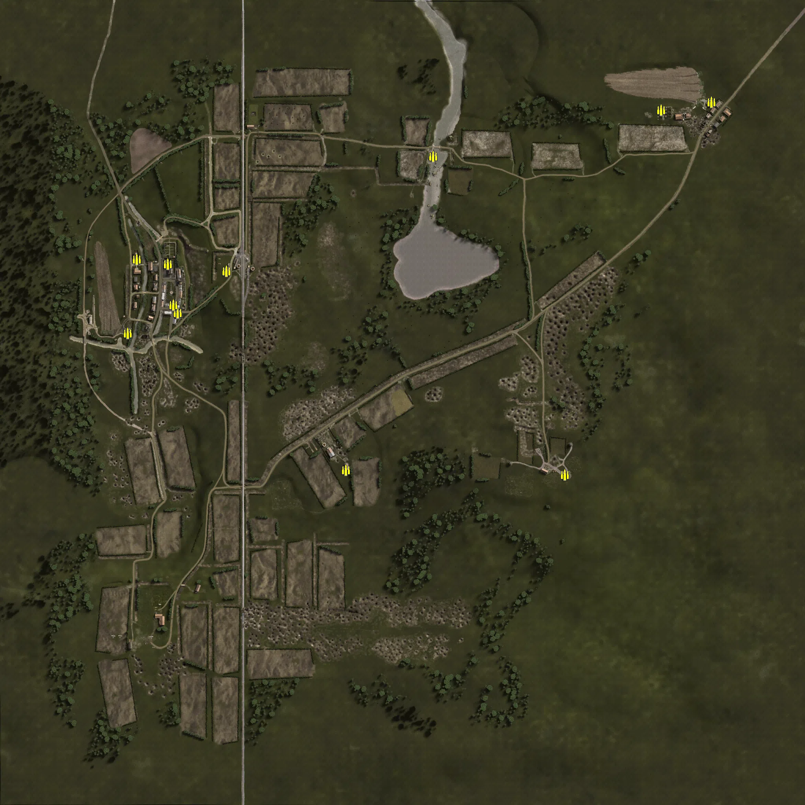
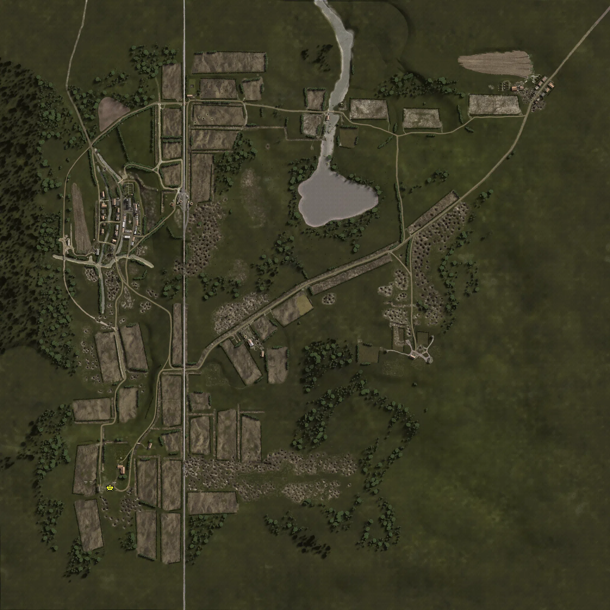
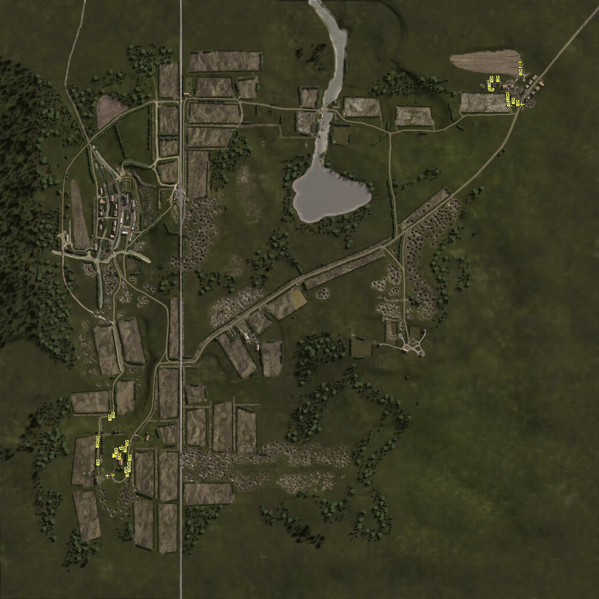

Static Ammo Crate

Static Emplacement

Vehicle

| gpo_subcat   | gpo_cat    | gpo_name         |    pos_x |   pos_y |    pos_z |   flag | is_locked   |   team | instance                                    | gpo_cat_disp       | gpo_subcat_disp   |
|:-------------|:-----------|:-----------------|---------:|--------:|---------:|-------:|:------------|-------:|:--------------------------------------------|:-------------------|:------------------|
| ammo_crate   | ammo_crate | ammo_crate       | -572.451 |   2.86  |  227.896 |      0 | False       |      0 | ammo_crate_0                                | Static Ammo Crate  | Static Ammo Crate |
| ammo_crate   | ammo_crate | ammo_crate       | -698.508 |   7.486 |  176.327 |      0 | False       |      0 | ammo_crate_1                                | Static Ammo Crate  | Static Ammo Crate |
| ammo_crate   | ammo_crate | ammo_crate       | -676.314 |   2.481 |  363.66  |      0 | False       |      0 | ammo_crate_2                                | Static Ammo Crate  | Static Ammo Crate |
| ammo_crate   | ammo_crate | ammo_crate       | -597.335 |   9.046 |  352.463 |      0 | False       |      0 | ammo_crate_3                                | Static Ammo Crate  | Static Ammo Crate |
| ammo_crate   | ammo_crate | ammo_crate       | -448.151 |  25.063 |  334.064 |      0 | False       |      0 | ammo_crate_4                                | Static Ammo Crate  | Static Ammo Crate |
| ammo_crate   | ammo_crate | ammo_crate       | -582.737 |   5.79  |  247.7   |      0 | False       |      0 | ammo_crate_5                                | Static Ammo Crate  | Static Ammo Crate |
| ammo_crate   | ammo_crate | ammo_crate       | -143.637 |  29.298 | -171.944 |      0 | False       |      0 | ammo_crate_6                                | Static Ammo Crate  | Static Ammo Crate |
| ammo_crate   | ammo_crate | ammo_crate       |   78.344 |   5.283 |  626.285 |      0 | False       |      0 | ammo_crate_7                                | Static Ammo Crate  | Static Ammo Crate |
| ammo_crate   | ammo_crate | ammo_crate       |  785.976 |  24.99  |  764.392 |      0 | False       |      0 | ammo_crate_8                                | Static Ammo Crate  | Static Ammo Crate |
| ammo_crate   | ammo_crate | ammo_crate       |  657.595 |  26.544 |  744.207 |      0 | False       |      0 | ammo_crate_9                                | Static Ammo Crate  | Static Ammo Crate |
| ammo_crate   | ammo_crate | ammo_crate       |  413.067 |  56.92  | -183.536 |      0 | False       |      0 | ammo_crate_10                               | Static Ammo Crate  | Static Ammo Crate |
| flak         | static     | flakvierling_ard | -653.794 |  23.062 | -613.327 |    301 | False       |      0 | CP_32_cobra_germainbase_flak                | Static Emplacement | Anti-aircraft Gun |
| flak_sp      | vehicle    | sdkfz7_flak_camo | -605.659 |  23.055 | -506.631 |    301 | False       |      0 | CP_32_cobra_germainbase_mobileAA            | Vehicle            | Mobile FlaK       |
| flak_sp      | vehicle    | m16_mgmc         |  656.786 |  26.33  |  718.692 |    302 | False       |      0 | CP_32_cobra_alliedbase_mobileAA             | Vehicle            | Mobile FlaK       |
| pak_sp       | vehicle    | m4a1_76mm        |  758.921 |  24.649 |  667.741 |    302 | True        |      0 | CP_32_cobra_alliedbase_m4a1_76_1            | Vehicle            | Mobile PaK        |
| pak_sp       | vehicle    | m4a1_76mm        |  713.622 |  24.873 |  678.016 |    302 | True        |      0 | CP_32_cobra_alliedbase_m4a1_76              | Vehicle            | Mobile PaK        |
| pak_sp       | vehicle    | m4a1_76mm        |  716.843 |  24.77  |  663.027 |    302 | True        |      0 | CP_32_cobra_alliedbase_m4a1_76_0            | Vehicle            | Mobile PaK        |
| pak_sp       | vehicle    | m4a1_76mm        |  649.361 |  26.552 |  743.279 |    302 | True        |      0 | CP_32_cobra_alliedbase_m4a1_763             | Vehicle            | Mobile PaK        |
| pak_sp       | vehicle    | m4a1_76mm        |  648.74  |  26.552 |  749.974 |    302 | True        |      0 | CP_32_cobra_alliedbase_m4a1_764             | Vehicle            | Mobile PaK        |
| plane        | vehicle    | aix_p51d_bombs   |  754.022 |  25.018 |  792.573 |    302 | True        |      0 | CP_32_cobra_alliedbase_fighterbomber        | Vehicle            | Airplane          |
| plane        | vehicle    | aix_p51d_bombs   |  753.512 |  25.254 |  811.113 |    302 | True        |      0 | CP_32_cobra_alliedbase_fighterbomber_extra  | Vehicle            | Airplane          |
| plane        | vehicle    | fw190_alt        | -656.824 |  23.055 | -602.898 |    301 | True        |      0 | CP_32_cobra_germainbase_fighterbomber       | Vehicle            | Airplane          |
| plane        | vehicle    | fw190_alt        | -637.755 |  23.055 | -601.394 |    301 | True        |      0 | CP_32_cobra_germainbase_fighterbomber_extra | Vehicle            | Airplane          |
| recon        | vehicle    | puma             | -626.316 |  23.055 | -530.131 |    301 | True        |      0 | CP_32_cobra_germainbase_marderI_0           | Vehicle            | Scout Vehicle     |
| tank         | vehicle    | pzivh_noskirt    | -589.488 |  25     | -595.638 |    301 | True        |      0 | CP_32_cobra_germainbase_pantherg_0          | Vehicle            | Tank              |
| tank         | vehicle    | pzivh_noskirt    | -636.766 |  12.14  | -394.647 |    301 | True        |      0 | CP_32_cobra_germainbase_pziv2_0             | Vehicle            | Tank              |
| tank         | vehicle    | pzivh_noskirt    | -688.748 |  24.878 | -476.784 |    301 | True        |      0 | CP_32_cobra_germainbase_pziv3_0             | Vehicle            | Tank              |
| tank         | vehicle    | pzivh_noskirt    | -647.833 |  12.14  | -404.142 |    301 | True        |      0 | CP_32_cobra_germainbase_pziv4_0             | Vehicle            | Tank              |
| tank         | vehicle    | pzivh_noskirt    | -581.542 |  25     | -553.388 |    301 | True        |      0 | CP_32_cobra_germainbase_pziv5_0             | Vehicle            | Tank              |
| tank         | vehicle    | pzivh_noskirt    | -616.34  |  23.055 | -537.489 |    301 | True        |      0 | CP_32_cobra_germainbase_pziv6_0             | Vehicle            | Tank              |
| tank         | vehicle    | pzivh_noskirt    | -580.042 |  25     | -540.782 |    301 | True        |      0 | CP_32_cobra_germainbase_pziv7_0             | Vehicle            | Tank              |
| tank         | vehicle    | pzivh_noskirt    | -589.871 |  23.492 | -490.676 |    301 | True        |      0 | CP_32_cobra_germainbase_pziv8_0             | Vehicle            | Tank              |
| tank         | vehicle    | pantherg         | -582.768 |  25     | -567.238 |    301 | True        |      0 | CP_32_cobra_germainbase_pantherg_1          | Vehicle            | Tank              |
| tank         | vehicle    | pantherg         | -688.767 |  25     | -557.469 |    301 | True        |      0 | CP_32_cobra_germainbase_pantherg2_0         | Vehicle            | Tank              |
| tank         | vehicle    | pantherg         | -596.302 |  23.408 | -511.553 |    301 | True        |      0 | CP_32_cobra_germainbase_pantherg3_0         | Vehicle            | Tank              |
| tank         | vehicle    | stug_iv          | -593.445 |  25     | -582.69  |    301 | True        |      0 | CP_32_cobra_germainbase_stugiv_0            | Vehicle            | Tank              |
| tank         | vehicle    | stug_iv          | -582.827 |  25     | -579.938 |    301 | True        |      0 | CP_32_cobra_germainbase_stugiv2_0           | Vehicle            | Tank              |
| tank         | vehicle    | stug_iv          | -690.559 |  25     | -496.373 |    301 | True        |      0 | CP_32_cobra_germainbase_stugiv3_0           | Vehicle            | Tank              |
| tank         | vehicle    | stug_iv          | -626.976 |  23.055 | -517.6   |    301 | True        |      0 | CP_32_cobra_germainbase_stugiv4_0           | Vehicle            | Tank              |
| tank         | vehicle    | m4a3             |  650.033 |  26.518 |  724.66  |    302 | True        |      0 | CP_32_cobra_alliedbase_m4a3                 | Vehicle            | Tank              |
| tank         | vehicle    | m4a3             |  649.221 |  26.552 |  730.936 |    302 | True        |      0 | CP_32_cobra_alliedbase_m4a32                | Vehicle            | Tank              |
| tank         | vehicle    | m4a3             |  649.064 |  26.552 |  736.976 |    302 | True        |      0 | CP_32_cobra_alliedbase_m4a33                | Vehicle            | Tank              |
| tank         | vehicle    | m4a3             |  714.85  |  24.819 |  671.084 |    302 | True        |      0 | CP_32_cobra_alliedbase_m4a34                | Vehicle            | Tank              |
| tank         | vehicle    | m4a3             |  656.833 |  26.515 |  752.668 |    302 | True        |      0 | CP_32_cobra_alliedbase_m4a36                | Vehicle            | Tank              |
| tank         | vehicle    | m4a3             |  713.26  |  24.929 |  685.307 |    302 | True        |      0 | CP_32_cobra_alliedbase_m4a37                | Vehicle            | Tank              |
| tank         | vehicle    | m4a3             |  710.876 |  25     |  697.917 |    302 | True        |      0 | CP_32_cobra_alliedbase_m4a38                | Vehicle            | Tank              |
| tank         | vehicle    | m18_hellcat      |  677.873 |  26.657 |  754.099 |    302 | True        |      0 | CP_32_cobra_alliedbase_m18                  | Vehicle            | Tank              |
| tank         | vehicle    | m18_hellcat      |  745.536 |  24.966 |  672.308 |    302 | True        |      0 | CP_32_cobra_alliedbase_m18_0                | Vehicle            | Tank              |
| tank         | vehicle    | m18_hellcat      |  730.803 |  25     |  678.958 |    302 | True        |      0 | CP_32_cobra_alliedbase_m18_1                | Vehicle            | Tank              |
| tank         | vehicle    | m4a3_105         |  712.394 |  24.985 |  691.893 |    302 | True        |      0 | CP_32_cobra_alliedbase_m4a3_105             | Vehicle            | Tank              |
| tank         | vehicle    | m51              |  755.974 |  25.1   |  776.819 |    302 | False       |      0 | CP_32_cobra_alliedbase_m51                  | Vehicle            | Tank              |

