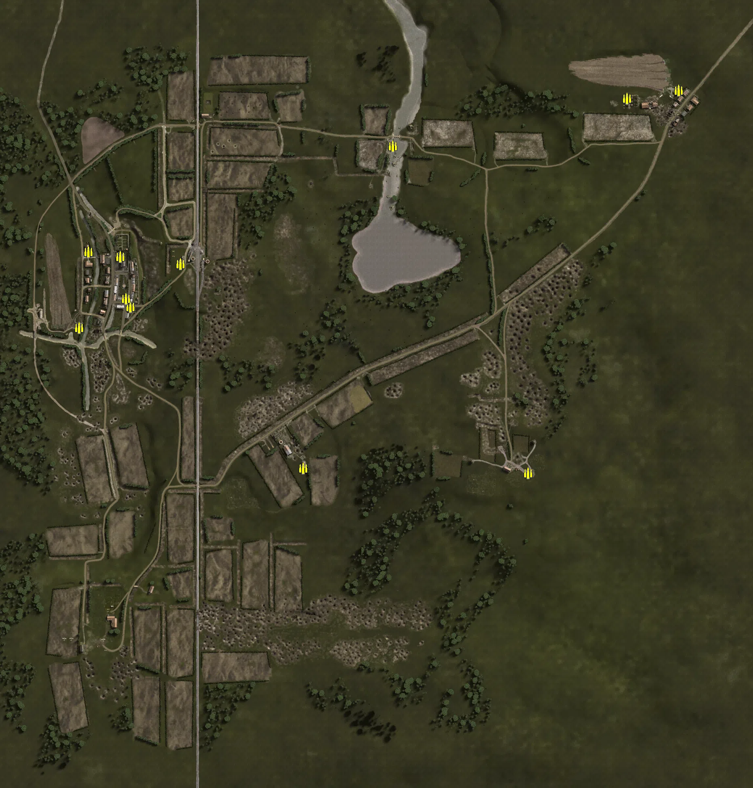
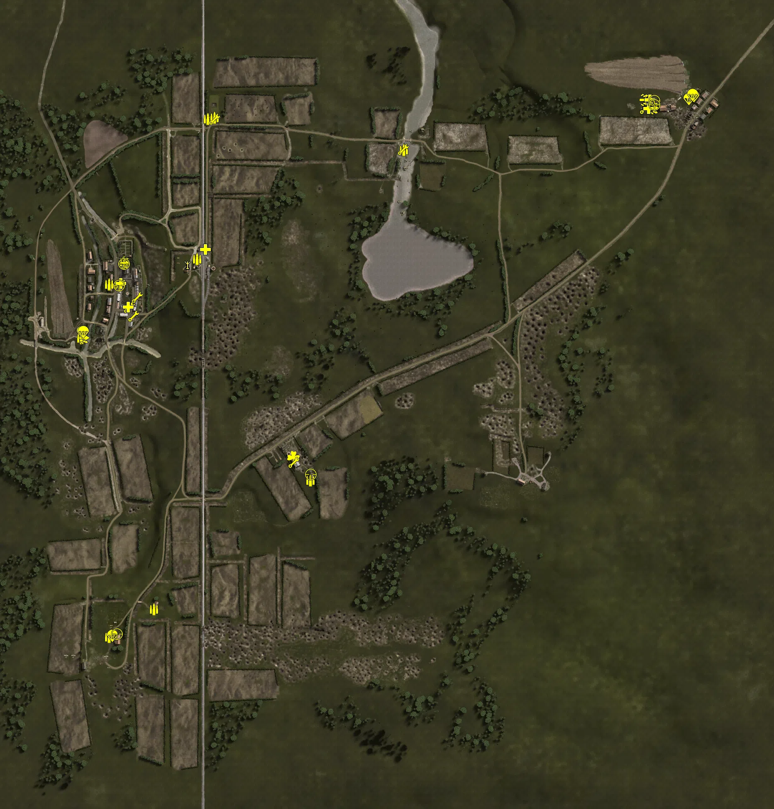
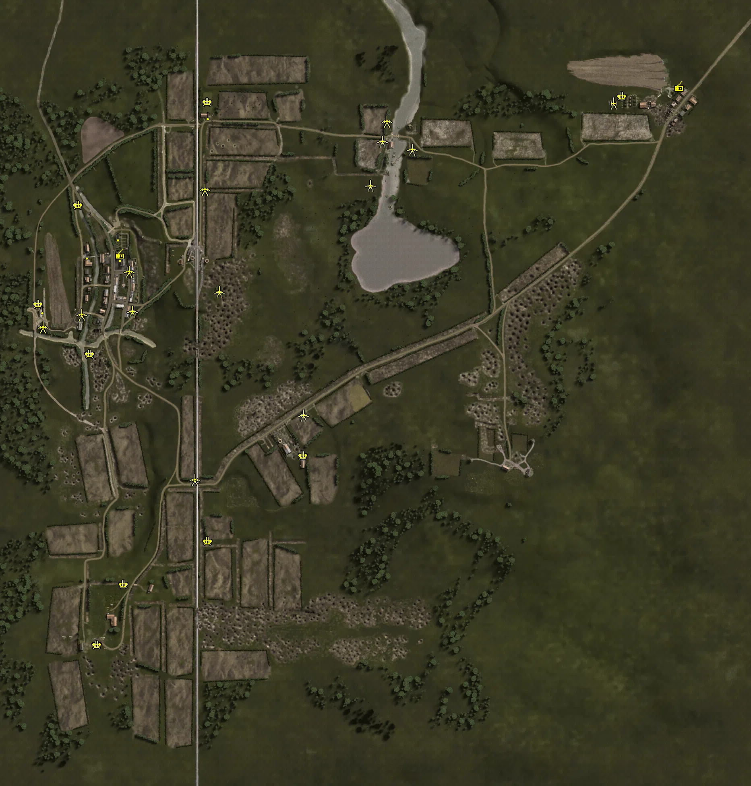
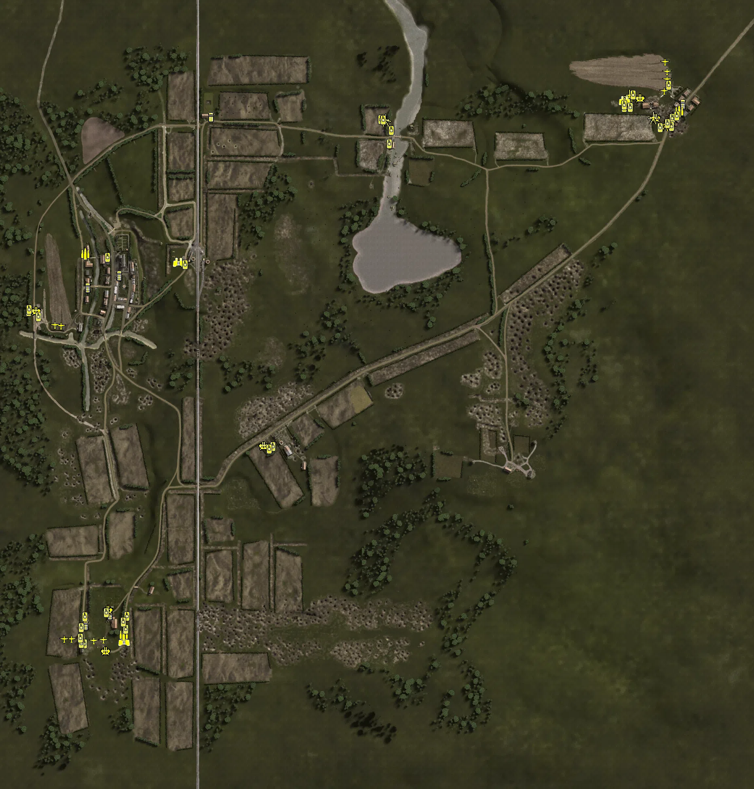

Static Ammo Crate

Pickup Kit

Static Emplacement

Vehicle

| gpo_subcat   | gpo_cat    | gpo_name                    |    pos_x |   pos_y |    pos_z |   flag | is_locked   |   team | instance                                    | gpo_cat_disp       | gpo_subcat_disp   |
|:-------------|:-----------|:----------------------------|---------:|--------:|---------:|-------:|:------------|-------:|:--------------------------------------------|:-------------------|:------------------|
| ammo_crate   | ammo_crate | ammo_crate                  | -572.451 |   2.86  |  227.896 |      0 | False       |      0 | ammo_crate_0                                | Static Ammo Crate  | Static Ammo Crate |
| ammo_crate   | ammo_crate | ammo_crate                  | -698.508 |   7.486 |  176.327 |      0 | False       |      0 | ammo_crate_1                                | Static Ammo Crate  | Static Ammo Crate |
| ammo_crate   | ammo_crate | ammo_crate                  | -676.314 |   2.481 |  363.66  |      0 | False       |      0 | ammo_crate_2                                | Static Ammo Crate  | Static Ammo Crate |
| ammo_crate   | ammo_crate | ammo_crate                  | -597.335 |   9.046 |  352.463 |      0 | False       |      0 | ammo_crate_3                                | Static Ammo Crate  | Static Ammo Crate |
| ammo_crate   | ammo_crate | ammo_crate                  | -448.151 |  25.063 |  334.064 |      0 | False       |      0 | ammo_crate_4                                | Static Ammo Crate  | Static Ammo Crate |
| ammo_crate   | ammo_crate | ammo_crate                  | -582.737 |   5.79  |  247.7   |      0 | False       |      0 | ammo_crate_5                                | Static Ammo Crate  | Static Ammo Crate |
| ammo_crate   | ammo_crate | ammo_crate                  | -143.637 |  29.298 | -171.944 |      0 | False       |      0 | ammo_crate_6                                | Static Ammo Crate  | Static Ammo Crate |
| ammo_crate   | ammo_crate | ammo_crate                  |   78.344 |   5.283 |  626.285 |      0 | False       |      0 | ammo_crate_7                                | Static Ammo Crate  | Static Ammo Crate |
| ammo_crate   | ammo_crate | ammo_crate                  |  785.976 |  24.99  |  764.392 |      0 | False       |      0 | ammo_crate_8                                | Static Ammo Crate  | Static Ammo Crate |
| ammo_crate   | ammo_crate | ammo_crate                  |  657.595 |  26.544 |  744.207 |      0 | False       |      0 | ammo_crate_9                                | Static Ammo Crate  | Static Ammo Crate |
| ammo_crate   | ammo_crate | ammo_crate                  |  413.067 |  56.92  | -183.536 |      0 | False       |      0 | ammo_crate_10                               | Static Ammo Crate  | Static Ammo Crate |
| ammo         | kit        | UW_PickUpAmmokit            |   78.384 |   2.096 |  625.914 |      8 | False       |      0 | CP_64_cobra_watermill_kit_amo               | Pickup Kit         | Ammo Kit          |
| ammo         | kit        | UW_PickUpAmmokit            | -523.577 |  26.006 | -481.945 |      5 | False       |      0 | CP_64_cobra_germanbase_amokit               | Pickup Kit         | Ammo Kit          |
| ammo         | kit        | GW_PickUpAmmokit            | -632.376 |  24.062 | -548.645 |      5 | False       |      0 | CP_64_cobra_germanbase_amokit2              | Pickup Kit         | Ammo Kit          |
| ammo         | kit        | UW_PickUpAmmokit            | -631.519 |   2.716 |  302.26  |     10 | False       |      0 | CP_64_cobra_Hebecrevonchurch_amokit         | Pickup Kit         | Ammo Kit          |
| ammo         | kit        | UW_PickUpAmmokit            | -394.017 |  29.134 |  700.909 |      4 | False       |      0 | CP_64_cobra_trainstation_amokitbarn         | Pickup Kit         | Ammo Kit          |
| ammo         | kit        | UW_PickUpAmmokit            | -420.443 |  26.532 |  363.285 |      4 | False       |      0 | CP_64_cobra_trainstation_amokit             | Pickup Kit         | Ammo Kit          |
| ammo         | kit        | UW_PickUpAmmokit            | -699.379 |   6.686 |  172.106 |      9 | False       |      0 | CP_64_cobra_Hebecrevonairfield_amokit       | Pickup Kit         | Ammo Kit          |
| ammo         | kit        | UW_PickUpAmmokit            | -595.665 |   8.954 |  356.235 |     10 | False       |      0 | CP_64_cobra_Hebecrevonchurch_amokit_0       | Pickup Kit         | Ammo Kit          |
| ammo         | kit        | UW_PickUpAmmokit            | -146.621 |  25     | -171.463 |      7 | False       |      0 | CP_64_cobra_farmhouse_amokit                | Pickup Kit         | Ammo Kit          |
| ammo         | kit        | UW_PickUpAmmokit            | -377.958 |  25     |  703.726 |    104 | False       |      0 | CP_64_cobra_crossroad_ammokit               | Pickup Kit         | Ammo Kit          |
| arty_dep     | kit        | GW_PickUpMortar             | -443.719 |  24.993 |  350.915 |      4 | False       |      0 | CP_64_cobra_trainstation_pickup_at          | Pickup Kit         | Deployable Arty   |
| assault      | kit        | UW_PickUpAssaultM3Greasegun | -594.957 |   9.225 |  353.434 |     10 | False       |      0 | CP_64_cobra_Hebecrevonchurch_stg            | Pickup Kit         | Assault Kit       |
| assault      | kit        | UW_PickUpAssaultM3Greasegun | -693.413 |   7.168 |  173.274 |      9 | False       |      0 | CP_64_cobra_Hebecrevonairfield_stg          | Pickup Kit         | Assault Kit       |
| assault      | kit        | UW_PickUpAssaultM3Greasegun |  680.03  |  27.137 |  727.242 |      1 | False       |      0 | CP_64_cobra_alliedbase_greasegun2           | Pickup Kit         | Assault Kit       |
| assault      | kit        | UW_PickUpAssaultM3Greasegun |  657.322 |  27.095 |  747.09  |      1 | False       |      0 | CP_64_cobra_alliedbase_greasegun3           | Pickup Kit         | Assault Kit       |
| easteregg    | kit        | GW_PickUpFarmer             | -188.396 |  25.008 | -116.085 |      7 | False       |      0 | CP_64_cobra_farmhouse_farmerkit             | Pickup Kit         | Easteregg         |
| engineer     | kit        | UW_PickUpEngineer           | -564.263 |   6.513 |  270.269 |     10 | False       |      0 | CP_64_cobra_Hebecrevonchurch_engineerkit    | Pickup Kit         | Engineer Kit      |
| engineer     | kit        | UW_PickUpEngineer           | -606.794 |   6.48  |  303.645 |     10 | False       |      0 | CP_64_cobra_Hebecrevonchurch_kitdesthouse2  | Pickup Kit         | Engineer Kit      |
| engineer     | kit        | UW_PickUpEngineer           |   77.394 |   5.287 |  627.18  |      8 | False       |      0 | CP_64_cobra_watermill_at_kit                | Pickup Kit         | Engineer Kit      |
| engineer     | kit        | UW_PickUpEngineer           | -186.9   |  28.45  | -128.07  |      7 | False       |      0 | CP_64_cobra_farmhouse_atkit2                | Pickup Kit         | Engineer Kit      |
| engineer     | kit        | UW_PickUpEngineer           | -572.54  |   2.871 |  224.782 |      9 | False       |      0 | CP_64_cobra_Hebecrevonairfield_atkit3       | Pickup Kit         | Engineer Kit      |
| engineer     | kit        | UW_PickUpEngineer           | -583.328 |   5.807 |  246.356 |     10 | False       |      0 | CP_64_cobra_Hebecrevonchurch_atkit4         | Pickup Kit         | Engineer Kit      |
| engineer     | kit        | UW_PickUpEngineer           |  659.691 |  27.136 |  725.629 |      1 | False       |      0 | CP_64_cobra_alliedbase_egnineer             | Pickup Kit         | Engineer Kit      |
| engineer     | kit        | UW_PickUpEngineer           | -378.173 |  25.362 |  699.667 |    104 | False       |      0 | CP_64_cobra_crossroad_atkit                 | Pickup Kit         | Engineer Kit      |
| medic        | kit        | UW_PickUpMedicColt1911      | -400.217 |  29.243 |  386.042 |      4 | False       |      0 | CP_64_cobra_trainstation_medicpu            | Pickup Kit         | Medic Kit         |
| medic        | kit        | UW_PickUpMedicColt1911      | -585.855 |   6.526 |  246.975 |     10 | False       |      0 | CP_64_cobra_Hebecrevonchurch_medickit       | Pickup Kit         | Medic Kit         |
| medic        | kit        | UW_PickUpMedicColt1911      | -603.801 |   6.431 |  304.19  |     10 | False       |      0 | CP_64_cobra_Hebecrevonchurch_kitdesthouse3  | Pickup Kit         | Medic Kit         |
| medic        | kit        | UW_PickUpMedicColt1911      |  668.383 |  27.133 |  725.974 |      1 | False       |      0 | CP_64_cobra_alliedbase_medic                | Pickup Kit         | Medic Kit         |
| medic        | kit        | UW_PickUpMedicColt1911      |  671.136 |  27.083 |  746.592 |      1 | False       |      0 | CP_64_cobra_alliedbase_medic2               | Pickup Kit         | Medic Kit         |
| parachute    | kit        | UW_PickUpPilotcolt1911      |  765.457 |  25.594 |  749.069 |      1 | False       |      0 | CP_64_cobra_alliedbase_kitpilot             | Pickup Kit         | Parachute Kit     |
| parachute    | kit        | UW_PickUpPilotcolt1911      |  775.74  |  25     |  757.634 |      1 | False       |      0 | CP_64_cobra_alliedbase_kitpilot2            | Pickup Kit         | Parachute Kit     |
| parachute    | kit        | GA_PickUpPilotP08           | -696.794 |   2.487 |  187.401 |      9 | False       |      0 | CP_64_cobra_Hebecrevonairfield_pilotgerman  | Pickup Kit         | Parachute Kit     |
| parachute    | kit        | GA_PickUpPilotP08           | -694.218 |   2.487 |  187.048 |      9 | False       |      0 | CP_64_cobra_Hebecrevonairfield_pilotgerman2 | Pickup Kit         | Parachute Kit     |
| parachute    | kit        | GA_PickUpPilotP08           | -624.353 |  23.373 | -546.425 |      5 | False       |      0 | CP_64_cobra_germanbase_pilogerman3          | Pickup Kit         | Parachute Kit     |
| parachute    | kit        | UW_PickUpPilotcolt1911      |  777.018 |  25     |  756.242 |      1 | False       |      0 | CP_64_cobra_alliedbase_kitpilo3             | Pickup Kit         | Parachute Kit     |
| parachute    | kit        | UW_PickUpPilotcolt1911      |  774.358 |  25     |  758.678 |      1 | False       |      0 | CP_64_cobra_alliedbase_kitpilo4             | Pickup Kit         | Parachute Kit     |
| sniper       | kit        | UW_PickUpSniperSpringfield  |  682.45  |  27.133 |  744.54  |      1 | False       |      0 | CP_64_cobra_alliedbase_kit_sniper           | Pickup Kit         | Sniper Kit        |
| sniper       | kit        | UW_PickUpSniperSpringfield  | -146.423 |  29.682 | -156.956 |      7 | False       |      0 | CP_64_cobra_farmhouse_sniper                | Pickup Kit         | Sniper Kit        |
| sniper       | kit        | UW_PickUpSniperSpringfield  | -595.518 |  13.102 |  351.016 |     10 | False       |      0 | CP_64_cobra_Hebecrevonchurch_sniperkit      | Pickup Kit         | Sniper Kit        |
| sniper       | kit        | UW_PickUpSniperSpringfield  | -607.665 |   9.389 |  299.309 |     10 | False       |      0 | CP_64_cobra_Hebecrevonchurch_kitdesthouse   | Pickup Kit         | Sniper Kit        |
| sniper       | kit        | GW_PickUpSniperK98_GWood    | -612.941 |  23.058 | -541.825 |      5 | False       |      0 | CP_64_cobra_germanbase_sniper_0             | Pickup Kit         | Sniper Kit        |
| sniper       | kit        | UW_PickUpSniperSpringfield  |  681.984 |  27.132 |  735.23  |      1 | False       |      0 | CP_64_cobra_alliedbase_sniper2              | Pickup Kit         | Sniper Kit        |
| misc         | noidea     | gercommradio                | -596.774 |   9.002 |  356.416 |     10 | False       |      0 | CP_64_cobra_Hebecrevonchurch_comandradio    | FIXME UNASSIGNED   | MISCELLANEOUS     |
| misc         | noidea     | britcommradio               |  790.821 |  24.851 |  771.721 |      1 | False       |      0 | CP_64_cobra_alliedbase_britradio            | FIXME UNASSIGNED   | MISCELLANEOUS     |
| noidea       | noidea     |                             |  659.653 |  27.091 |  737.068 |      1 | False       |      0 | CP_64_cobra_alliedbase_greasegun1           | FIXME UNASSIGNED   | FIXME UNASSIGNED  |
| arty         | static     | m2a1_howitzer_105mm         |  627.933 |  26.252 |  732.251 |      1 | False       |      0 | CP_64_cobra_alliedbase_arty2                | Static Emplacement | Artillery         |
| flak         | static     | flak18_fr                   | -587.781 |  25.089 | -462.766 |      5 | False       |      0 | CP_64_cobra_germanbase_88                   | Static Emplacement | Anti-aircraft Gun |
| flak         | static     | flak18_fr                   | -378.557 |  26.222 | -355.608 |      5 | False       |      0 | CP_64_cobra_germanbase_882                  | Static Emplacement | Anti-aircraft Gun |
| flak         | static     | flakvierling38_france       | -653.693 |  23.06  | -613.231 |      5 | False       |      0 | CP_64_cobra_germanbase_flak                 | Static Emplacement | Anti-aircraft Gun |
| flak         | static     | flakvierling38_france       | -800.482 |   1.577 |  233.368 |      9 | False       |      0 | CP_64_cobra_Hebecrevonairfield_flak         | Static Emplacement | Anti-aircraft Gun |
| flak         | static     | flak18_fr                   | -701.369 |   2.955 |  479.342 |     10 | False       |      0 | CP_64_cobra_Hebecrevonchurch_88             | Static Emplacement | Anti-aircraft Gun |
| flak         | static     | flakvierling38_france       | -380.033 |  23.65  |  734.975 |    104 | False       |      0 | CP_64_cobra_crossroad_AA                    | Static Emplacement | Anti-aircraft Gun |
| flak         | static     | flak18_fr                   | -671.853 |   2.007 |  109.016 |      9 | False       |      0 | CP_64_cobra_Hebecrevonairfield_pak3         | Static Emplacement | Anti-aircraft Gun |
| flak         | static     | flak18_fr                   | -141.663 |  25.01  | -143.44  |      7 | False       |      0 | CP_64_cobra_farmhouse_88                    | Static Emplacement | Anti-aircraft Gun |
| flak         | static     | bofors40mm_eu               |  649.697 |  26.889 |  748.512 |      1 | False       |      0 | CP_64_cobra_alliedbase_bofors               | Static Emplacement | Anti-aircraft Gun |
| mg_nest      | static     | mg42_lafette                | -679.351 |   2.498 |  355.924 |     10 | False       |      0 | CP_64_cobra_Hebecrevonchurch_static         | Static Emplacement | Static MG         |
| mg_nest      | static     | mg34_bipod                  | -596.812 |  19.228 |  350.072 |     10 | False       |      0 | CP_64_cobra_Hebecrevonchurch_mg             | Static Emplacement | Static MG         |
| mg_nest      | static     | mg42_lafette                | -602.095 |   2.545 |  400.541 |     10 | False       |      0 | CP_64_cobra_Hebecrevonchurch_mg42la         | Static Emplacement | Static MG         |
| mg_nest      | static     | mg34_bipod                  | -790.277 |  10.319 |  220.347 |      9 | False       |      0 | CP_64_cobra_Hebecrevonairfield_mg           | Static Emplacement | Static MG         |
| mg_nest      | static     | mg34_bipod                  | -378.954 |  30.485 |  701.938 |    104 | False       |      0 | CP_64_cobra_crossroad_MG                    | Static Emplacement | Static MG         |
| pak          | static     | pak40_static                | -412.063 |  25.539 | -202.658 |      7 | False       |      0 | CP_64_cobra_farmhouse_pak                   | Static Emplacement | Anti-tank Gun     |
| pak          | static     | pak40_static                | -141.632 |  25.386 |  -42.726 |      7 | False       |      0 | CP_64_cobra_farmhouse_pak2                  | Static Emplacement | Anti-tank Gun     |
| pak          | static     | pak38_static_fr             |   54.282 |   3.953 |  637.389 |      8 | False       |      0 | CP_64_cobra_watermill_at                    | Static Emplacement | Anti-tank Gun     |
| pak          | static     | pak40_static                | -566.758 |   3.025 |  215.113 |      9 | False       |      0 | CP_64_cobra_Hebecrevonairfield_pak          | Static Emplacement | Anti-tank Gun     |
| pak          | static     | pak40_static                | -575.27  |   3.023 |  313.54  |     10 | False       |      0 | CP_64_cobra_Hebecrevonchurch_pak2           | Static Emplacement | Anti-tank Gun     |
| pak          | static     | pak40_static                | -351.264 |  25.133 |  263.476 |      4 | False       |      0 | CP_64_cobra_trainstation_pak2               | Static Emplacement | Anti-tank Gun     |
| pak          | static     | pak40_static                |   23.805 |   5.792 |  526.819 |      8 | False       |      0 | CP_64_cobra_watermill_pak2                  | Static Emplacement | Anti-tank Gun     |
| pak          | static     | pak40_static                |  128.2   |   3.979 |  617.342 |      8 | False       |      0 | CP_64_cobra_watermill_pak3                  | Static Emplacement | Anti-tank Gun     |
| pak          | static     | pak40_static                | -788.72  |   5.27  |  175.969 |      9 | False       |      0 | CP_64_cobra_Hebecrevonairfield_pak_0        | Static Emplacement | Anti-tank Gun     |
| pak          | static     | pak40_static                | -692.955 |   3.01  |  207.18  |      9 | False       |      0 | CP_64_cobra_Hebecrevonairfield_AT           | Static Emplacement | Anti-tank Gun     |
| pak          | static     | pak38_static_fr             | -387.444 |  26.353 |  518.497 |    104 | False       |      0 | CP_64_cobra_crossroad_pak                   | Static Emplacement | Anti-tank Gun     |
| pak          | static     | pak40_static                |   65.366 |   4.541 |  686.604 |      8 | False       |      0 | CP_64_cobra_watermill_pak                   | Static Emplacement | Anti-tank Gun     |
| apc          | vehicle    | sdkfz7_camo                 | -373.056 |  25     |  697.716 |    104 | False       |      0 | CP_64_cobra_crossroad_apc                   | Vehicle            | APC               |
| car          | vehicle    | opelblitz_fr_slats          | -682.821 |  25     | -559.352 |      5 | False       |      0 | CP_64_cobra_germanbase_opel2                | Vehicle            | Car               |
| car          | vehicle    | kettenkrad_fr               | -600.193 |   2.487 |  305.779 |     10 | False       |      0 | CP_64_cobra_Hebecrevonchurch_kettkrad       | Vehicle            | Car               |
| car          | vehicle    | kubelwagen_fr               | -623.179 |  23.055 | -532.554 |      5 | False       |      0 | CP_64_cobra_germanbase_kubel                | Vehicle            | Car               |
| car          | vehicle    | willysmb_us                 |  793.946 |  24.673 |  730.217 |      1 | False       |      0 | CP_64_cobra_alliedbase_willy                | Vehicle            | Car               |
| civilian     | vehicle    | rideable_bicycle            | -678.437 |   2.487 |  276.172 |      9 | False       |      0 | CP_64_cobra_Hebecrevonairfield_bicy         | Vehicle            | Civilian Vehicle  |
| flak_sp      | vehicle    | m16_mgmc                    | -805.334 |   3.012 |  218.982 |      9 | False       |      0 | CP_64_cobra_Hebecrevonairfield_251          | Vehicle            | Mobile FlaK       |
| flak_sp      | vehicle    | m16_mgmc                    | -242.036 |  24.967 | -114.812 |      7 | False       |      0 | CP_64_cobra_farmhouse_opel                  | Vehicle            | Mobile FlaK       |
| flak_sp      | vehicle    | m16_mgmc                    |  727.977 |  24.999 |  695.677 |      1 | False       |      0 | CP_64_cobra_windmill_quad50                 | Vehicle            | Mobile FlaK       |
| flak_sp      | vehicle    | m16_mgmc                    |  689.33  |  26.763 |  744.865 |      1 | False       |      0 | CP_64_cobra_alliedbase_quadaa               | Vehicle            | Mobile FlaK       |
| flak_sp      | vehicle    | sdkfz7_flak_camo            | -626.977 |  23.055 | -520.857 |      5 | False       |      0 | CP_64_cobra_germanbase_flak_0               | Vehicle            | Mobile FlaK       |
| flak_sp      | vehicle    | sdkfz7_flak_camo            | -633.226 |  23.055 | -622.808 |      5 | False       |      0 | CP_64_cobra_germanbase_AAveh                | Vehicle            | Mobile FlaK       |
| pak_sp       | vehicle    | m4a1_76mm                   |   58.343 |   3.52  |  690.984 |      8 | True        |      0 | CP_64_cobra_watermill_spc                   | Vehicle            | Mobile PaK        |
| pak_sp       | vehicle    | m4a1_76mm                   |  720.356 |  25     |  697.312 |      7 | True        |      0 | CP_64_cobra_windmill_firefly                | Vehicle            | Mobile PaK        |
| pak_sp       | vehicle    | m4a1_76mm                   |  748.975 |  25.006 |  680.443 |      1 | True        |      0 | CP_64_cobra_windmill_sherman_0              | Vehicle            | Mobile PaK        |
| pak_sp       | vehicle    | m4a1_76mm                   |  649.282 |  26.552 |  733.876 |      1 | True        |      0 | CP_64_cobra_alliedbase_76                   | Vehicle            | Mobile PaK        |
| pak_sp       | vehicle    | m4a1_76mm                   |  660.827 |  26.552 |  751.77  |      1 | True        |      0 | CP_64_cobra_alliedbase_76_0                 | Vehicle            | Mobile PaK        |
| plane        | vehicle    | p47_d                       |  754.592 |  27.147 |  811.031 |      1 | True        |      0 | CP_64_cobra_alliedbase_P47_rocket_0         | Vehicle            | Airplane          |
| plane        | vehicle    | fw190                       | -663.318 |  23.062 | -596.643 |      5 | True        |      0 | CP_64_cobra_germanbase_zerbombed            | Vehicle            | Airplane          |
| plane        | vehicle    | aix_p51d                    | -744.483 |   1.279 |  182.259 |      9 | True        |      0 | CP_64_cobra_Hebecrevonairfield_0_3          | Vehicle            | Airplane          |
| plane        | vehicle    | pipercub_us                 | -759.173 |   2.487 |  183.96  |      9 | True        |      0 | CP_64_cobra_Hebecrevonairfield_0_4          | Vehicle            | Airplane          |
| plane        | vehicle    | AIX_P51D                    |  748.342 |  26.969 |  763.027 |      1 | True        |      0 | CP_64_cobra_alliedbase_air2                 | Vehicle            | Airplane          |
| plane        | vehicle    | p47_d_alt                   |  750.454 |  25.444 |  834.714 |      7 | True        |      0 | CP_64_cobra_alliedbase_bomber               | Vehicle            | Airplane          |
| plane        | vehicle    | aix_p51d_bombs              |  755.498 |  27.1   |  791.56  |      1 | True        |      0 | CP_64_cobra_alliedbase_P51_bomb             | Vehicle            | Airplane          |
| plane        | vehicle    | bf109g2                     | -639.401 |  23.055 | -595.437 |      5 | True        |      0 | CP_64_cobra_germanbase_fw                   | Vehicle            | Airplane          |
| plane        | vehicle    | fw190_alt                   | -718.423 |  24.51  | -593.27  |      5 | True        |      0 | CP_64_cobra_townlinks_dummy_2               | Vehicle            | Airplane          |
| plane        | vehicle    | fw190_alt                   | -735.749 |  24.777 | -593.47  |      7 | True        |      0 | CP_64_cobra_germanbase_fwextra              | Vehicle            | Airplane          |
| recon        | vehicle    | m8_greyhoundnf              |  649.77  |  26.552 |  739.24  |      1 | True        |      0 | CP_64_cobra_alliedbase_greyhound            | Vehicle            | Scout Vehicle     |
| recon        | vehicle    | m8_greyhound                | -453.458 |  25     |  338.685 |      4 | True        |      0 | CP_64_cobra_watermill_p4                    | Vehicle            | Scout Vehicle     |
| recon        | vehicle    | puma                        | -588.138 |  25     | -598.858 |      5 | True        |      0 | CP_64_cobra_germanbase_puma                 | Vehicle            | Scout Vehicle     |
| supply       | vehicle    | gmc_ammo                    |  784.849 |  24.66  |  713.405 |      1 | False       |      0 | CP_64_cobra_alliedbase_truck                | Vehicle            | Supply Vehicle    |
| supply       | vehicle    | opelblitz_fr_ammo           | -589.106 |  25     | -582.155 |      5 | False       |      0 | CP_64_cobra_germanbase_truck                | Vehicle            | Supply Vehicle    |
| supply       | vehicle    | opelblitz_fr_ammo           | -684.375 |   2.487 |  359.909 |     10 | False       |      0 | CP_64_cobra_Hebecrevonchurch_opel_amo       | Vehicle            | Supply Vehicle    |
| tank         | vehicle    | m4a3                        |  648.953 |  26.332 |  722.173 |      1 | True        |      0 | CP_64_cobra_alliedbase_0_1                  | Vehicle            | Tank              |
| tank         | vehicle    | m3a1                        | -437.187 |  25     |  333.27  |      4 | False       |      0 | CP_64_cobra_trainstation_s                  | Vehicle            | Tank              |
| tank         | vehicle    | stug_iv_alt                 | -823.552 |   3.245 |  216.604 |      9 | True        |      0 | CP_64_cobra_Hebecrevonairfield_stug         | Vehicle            | Tank              |
| tank         | vehicle    | pantherg                    | -628.939 |   2.487 |  350.814 |     10 | True        |      0 | CP_64_cobra_Hebecrevonchurch_stug3          | Vehicle            | Tank              |
| tank         | vehicle    | pzivh                       | -799.786 |   3.024 |  204.414 |      9 | True        |      0 | CP_64_cobra_trainstation_pak                | Vehicle            | Tank              |
| tank         | vehicle    | m10                         |  768.182 |  24.66  |  694.777 |      1 | True        |      0 | CP_64_cobra_alliedbase_tankdest             | Vehicle            | Tank              |
| tank         | vehicle    | m4a3                        |  778.62  |  24.66  |  701.236 |      1 | True        |      0 | CP_64_cobra_alliedbase_sherman              | Vehicle            | Tank              |
| tank         | vehicle    | m4a3                        | -219.967 |  25.01  | -116.977 |      7 | True        |      0 | CP_64_cobra_farmhouse_panther               | Vehicle            | Tank              |
| tank         | vehicle    | m3a1                        | -228.901 |  24.985 | -122.517 |      7 | False       |      0 | CP_64_cobra_farmhouse_stug                  | Vehicle            | Tank              |
| tank         | vehicle    | pantherg                    | -822.689 |   3.246 |  221.565 |      9 | True        |      0 | CP_64_cobra_trainstation_panther2           | Vehicle            | Tank              |
| tank         | vehicle    | m4a3                        |   67.955 |   1.568 |  631.532 |      8 | True        |      0 | CP_64_cobra_watermill_1_1                   | Vehicle            | Tank              |
| tank         | vehicle    | m10                         |   73.474 |   1.687 |  665.301 |      8 | True        |      0 | CP_64_cobra_watermill_2_1                   | Vehicle            | Tank              |
| tank         | vehicle    | pantherg                    | -685.208 |  25     | -537.775 |      5 | True        |      0 | CP_64_cobra_germanbase_tiger                | Vehicle            | Tank              |
| tank         | vehicle    | m18_hellcat                 |  765.797 |  25.038 |  674.807 |      7 | True        |      0 | CP_64_cobra_windmill_sherman2               | Vehicle            | Tank              |
| tank         | vehicle    | m18_hellcat                 |  738.407 |  24.816 |  672.04  |      1 | True        |      0 | CP_64_cobra_alliedbase_m10_2                | Vehicle            | Tank              |
| tank         | vehicle    | m4a3                        |  649.116 |  26.552 |  727.817 |      1 | True        |      0 | CP_64_cobra_alliedbase_sherman5             | Vehicle            | Tank              |
| tank         | vehicle    | m3a1                        |  671.313 |  26.552 |  752.905 |      1 | False       |      0 | CP_64_cobra_alliedbase_halftruck            | Vehicle            | Tank              |
| tank         | vehicle    | m4a3_105                    |  755.747 |  24.798 |  681.539 |      1 | True        |      0 | CP_64_cobra_windmill_m5                     | Vehicle            | Tank              |
| tank         | vehicle    | m3a1                        |   47.128 |   2.656 |  691.657 |      8 | False       |      0 | CP_64_cobra_watermill_schwimmwagen          | Vehicle            | Tank              |
| tank         | vehicle    | m51                         |  664.022 |  26.761 |  721.527 |      1 | False       |      0 | CP_64_cobra_alliedbase_aa                   | Vehicle            | Tank              |
| tank         | vehicle    | m51                         |  758.959 |  25.304 |  776.834 |      1 | False       |      0 | CP_64_cobra_alliedbase_quadtrailer2         | Vehicle            | Tank              |
| tank         | vehicle    | pzivh_noskirt               | -694.244 |  25     | -564.646 |      5 | True        |      0 | CP_64_cobra_germanbase_pnt                  | Vehicle            | Tank              |
| tank         | vehicle    | stug_iv                     | -581.312 |  25     | -537.086 |      7 | True        |      0 | CP_64_cobra_trainstation_dummy_0            | Vehicle            | Tank              |
| tank         | vehicle    | pzivh_noskirt               | -583.979 |  25     | -568.825 |      5 | True        |      0 | CP_64_cobra_trainstation_dummy_1            | Vehicle            | Tank              |
| tank         | vehicle    | pantherg                    | -589.813 |  25     | -550.943 |      7 | True        |      0 | CP_64_cobra_trainstation_dummy_2            | Vehicle            | Tank              |
| tank         | vehicle    | stug_iv                     | -685.989 |  25     | -604.935 |      5 | True        |      0 | CP_64_cobra_townlinks_dummy_0               | Vehicle            | Tank              |
| tank         | vehicle    | pzivh_noskirt               | -694.04  |  25     | -604.303 |      5 | True        |      0 | CP_64_cobra_townlinks_dummy_1               | Vehicle            | Tank              |
| tank         | vehicle    | m3a1                        |   52.579 |   2.819 |  691.429 |      8 | False       |      0 | CP_64_cobra_watermill_transp                | Vehicle            | Tank              |
| tank         | vehicle    | pantherg                    | -696.285 |  24.999 | -591.495 |      5 | True        |      0 | CP_64_cobra_germanbase_panther              | Vehicle            | Tank              |
| tank         | vehicle    | stug_iv                     | -631.983 |  23.055 | -528.087 |      5 | True        |      0 | CP_64_cobra_germanbase_stug                 | Vehicle            | Tank              |

