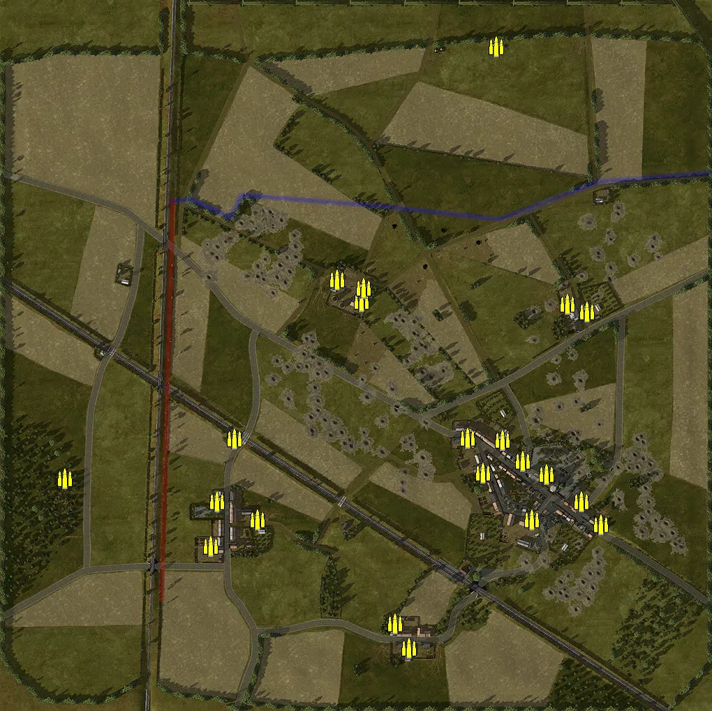
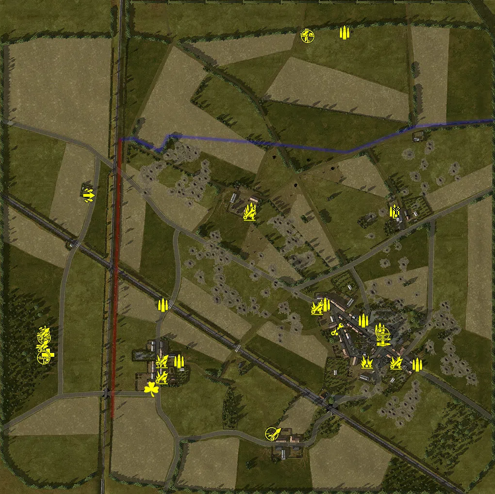
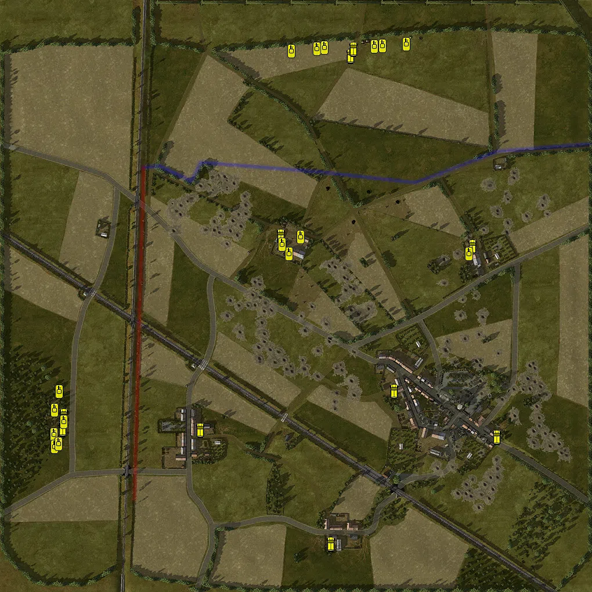

Static Ammo Crate

Pickup Kit

Static Emplacement

Vehicle

| Icon                        | SubCat            | Cat                | Name                         | Instance                                            |   Flag |    X Pos |   Y Pos |    Z Pos |
|:----------------------------|:------------------|:-------------------|:-----------------------------|:----------------------------------------------------|-------:|---------:|--------:|---------:|
|       | Static Ammo Crate | Static Ammo Crate  | ammo_crate                   | ammo_crate_0                                        |      0 |  180.854 |  39.008 | -168.207 |
|       | Static Ammo Crate | Static Ammo Crate  | ammo_crate                   | ammo_crate_1                                        |      0 | -417.544 |  28.428 | -175.616 |
|       | Static Ammo Crate | Static Ammo Crate  | ammo_crate                   | ammo_crate_2                                        |      0 | -174.762 |  33.297 | -119.223 |
|       | Static Ammo Crate | Static Ammo Crate  | ammo_crate                   | ammo_crate_3                                        |      0 |   54.750 |  46.445 | -384.500 |
|       | Static Ammo Crate | Static Ammo Crate  | ammo_crate                   | ammo_crate_4                                        |      0 |  199.920 |  28.029 |  443.177 |
|       | Static Ammo Crate | Static Ammo Crate  | ammo_crate                   | ammo_crate_5                                        |      0 |  271.782 |  37.908 | -170.430 |
|       | Static Ammo Crate | Static Ammo Crate  | ammo_crate                   | ammo_crate_6                                        |      0 |  349.911 |  39.679 | -242.304 |
|       | Static Ammo Crate | Static Ammo Crate  | ammo_crate                   | ammo_crate_7                                        |      0 |  237.592 |  37.890 | -150.787 |
|       | Static Ammo Crate | Static Ammo Crate  | ammo_crate                   | ammo_crate_8                                        |      0 | -142.186 |  37.333 | -235.097 |
|       | Static Ammo Crate | Static Ammo Crate  | ammo_crate                   | ammo_crate_9                                        |      0 |    6.632 |  31.238 |   78.058 |
|       | Static Ammo Crate | Static Ammo Crate  | ammo_crate                   | ammo_crate_10                                       |      0 |    9.633 |  31.428 |   97.033 |
|       | Static Ammo Crate | Static Ammo Crate  | ammo_crate                   | ammo_crate_11                                       |      0 |  -27.650 |  30.741 |  109.131 |
|       | Static Ammo Crate | Static Ammo Crate  | ammo_crate                   | ammo_crate_12                                       |      0 |  159.497 |  36.709 | -118.386 |
|       | Static Ammo Crate | Static Ammo Crate  | ammo_crate                   | ammo_crate_13                                       |      0 |  322.399 |  38.126 | -208.555 |
|       | Static Ammo Crate | Static Ammo Crate  | ammo_crate                   | ammo_crate_14                                       |      0 |  250.598 |  40.906 | -235.214 |
|       | Static Ammo Crate | Static Ammo Crate  | ammo_crate                   | ammo_crate_15                                       |      0 |   75.333 |  46.483 | -419.255 |
|       | Static Ammo Crate | Static Ammo Crate  | ammo_crate                   | ammo_crate_16                                       |      0 | -208.579 |  33.671 | -272.809 |
|       | Static Ammo Crate | Static Ammo Crate  | ammo_crate                   | ammo_crate_17                                       |      0 | -199.924 |  37.031 | -208.728 |
|       | Static Ammo Crate | Static Ammo Crate  | ammo_crate                   | ammo_crate_18                                       |      0 |  209.175 |  36.596 | -121.082 |
|       | Static Ammo Crate | Static Ammo Crate  | ammo_crate                   | ammo_crate_19                                       |      0 |  302.153 |  32.773 |   73.966 |
|       | Static Ammo Crate | Static Ammo Crate  | ammo_crate                   | ammo_crate_20                                       |      0 |  330.098 |  31.215 |   63.395 |
|       | Ammo Kit          | Pickup Kit         | BW_PickUpAmmokit             | CP_64_Goodwood_LePrieure_Ammokit                    |      5 |  302.150 |  33.035 |   73.973 |
|       | Ammo Kit          | Pickup Kit         | BW_PickUpAmmokit             | CP_64_Goodwood_LeMesnilFrementel_Ammo               |      4 |    6.652 |  31.499 |   78.014 |
|       | Ammo Kit          | Pickup Kit         | BW_PickUpAmmokit             | CP_64_Goodwood_CagnyEast_Ammo                       |      3 |  349.239 |  39.646 | -242.314 |
|       | Ammo Kit          | Pickup Kit         | BW_PickUpAmmokit             | CP_64_Goodwood_CagnyEast_Ammo_0                     |      3 |  272.030 |  37.907 | -169.719 |
|       | Ammo Kit          | Pickup Kit         | BW_PickUpAmmokit             | CP_64_Goodwood_CagnyWest_Ammo                       |      1 |  237.589 |  38.157 | -150.821 |
|       | Ammo Kit          | Pickup Kit         | BW_PickUpAmmokit             | CP_64_Goodwood_CagnyWest_Ammo_0                     |      1 |  159.494 |  36.975 | -118.367 |
|       | Ammo Kit          | Pickup Kit         | BW_PickUpAmmokit             | CP_64_Goodwood_Grentheville_Ammo                    |      7 | -142.199 |  37.601 | -235.137 |
|       | Ammo Kit          | Pickup Kit         | BW_PickUpAmmokit             | CP_64_Goodwood_AxisMain_Ammo                        |      8 | -417.536 |  28.695 | -175.667 |
|       | Ammo Kit          | Pickup Kit         | BW_PickUpAmmokit             | CP_64_Goodwood_AlliedBase_ammo                      |      6 |  198.656 |  28.040 |  442.889 |
|       | Ammo Kit          | Pickup Kit         | BW_PickUpAmmokit             | CP_64_Goodwood_Grentheville_ammo_0                  |      7 | -174.699 |  33.551 | -119.241 |
|       | Tankhunter Kit    | Pickup Kit         | BW_PickUpSapperSten_GWood    | CP_64_Goodwood_Grentheville_G43Sten                 |      7 | -177.854 |  38.823 | -235.202 |
|       | Tankhunter Kit    | Pickup Kit         | BW_PickUpSapperSten_GWood    | CP_64_Goodwood_Grentheville_Mp40Sten                |      7 | -178.439 |  35.533 | -267.979 |
|       | Tankhunter Kit    | Pickup Kit         | BW_PickUpSapperSten_GWood    | CP_64_Goodwood_CagnyWest_Mortar                     |      1 |  142.333 |  37.242 | -125.484 |
|       | Tankhunter Kit    | Pickup Kit         | BW_PickUpSapperSten_GWood    | CP_64_Goodwood_CagnyEast_G43Sten                    |      3 |  305.048 |  39.196 | -238.063 |
|       | Tankhunter Kit    | Pickup Kit         | BW_PickUpSapperSten_GWood    | CP_64_Goodwood_CagnyEast_Mortar                     |      3 |  244.764 |  41.711 | -236.129 |
|       | Tankhunter Kit    | Pickup Kit         | BW_PickUpSapperSten_GWood    | CP_64_Goodwood_LeMesnilFrementel_MP40Sten           |      4 |    2.564 |  35.021 |   69.480 |
|   | Deployable Arty   | Pickup Kit         | BA_PickUpMortar              | CP_64_Goodwood_LePrieure_LafetteMortar              |      5 |  305.267 |  33.505 |   75.015 |
|    | Assault Kit       | Pickup Kit         | GW_PickUpAssaultG41_GWood    | CP_64_Goodwood_AxisMain_G43                         |      8 | -420.423 |  30.306 | -227.946 |
|    | Assault Kit       | Pickup Kit         | GW_PickUpAssaultG41_GWood    | CP_64_Goodwood_AxisMain_G43_0                       |      8 | -424.683 |  30.370 | -204.380 |
|    | Assault Kit       | Pickup Kit         | GW_PickUpAssaultG41_GWood    | CP_64_Goodwood_AxisMain_G43_2                       |      8 | -420.536 |  29.928 | -186.537 |
|    | Assault Kit       | Pickup Kit         | GW_PickUpAssaultG41_GWood    | CP_64_Goodwood_AxisMain_G43_3                       |      8 | -422.939 |  29.520 | -179.158 |
|    | Assault Kit       | Pickup Kit         | GW_PickUpAssaultStG44        | CP_64_Goodwood_FirstLine_Dummy_Stg                  |    101 | -329.401 |  24.361 |  106.698 |
|  | Easteregg         | Pickup Kit         | GW_PickUpFarmer              | CP_64_Goodwood_Grentheville_farmsmg                 |      7 | -199.370 |  33.118 | -292.529 |
|   | Engineer Kit      | Pickup Kit         | BW_PickUpEngineer            | CP_64_Goodwood_Grentheville_Explosive               |      7 | -177.785 |  35.531 | -268.074 |
|   | Engineer Kit      | Pickup Kit         | BW_PickUpEngineer            | CP_64_Goodwood_CagnyWest_Explosive                  |      1 |  183.687 |  39.798 | -168.746 |
|   | Engineer Kit      | Pickup Kit         | BW_PickUpEngineer            | CP_64_Goodwood_CagnyWest_Mines                      |      1 |  142.878 |  37.242 | -125.445 |
|   | Engineer Kit      | Pickup Kit         | BW_PickUpEngineer            | CP_64_Goodwood_CagnyEast_Mines                      |      3 |  305.807 |  39.195 | -238.414 |
|   | Engineer Kit      | Pickup Kit         | BW_PickUpEngineer            | CP_64_Goodwood_LeMesnilFrementel_G43Explosives      |      4 |    2.624 |  35.017 |   70.319 |
|      | Medic Kit         | Pickup Kit         | GW_PickUpMedicP08            | CP_64_Goodwood_AxisMain_kitmedic                    |      8 | -412.392 |  30.492 | -221.939 |
|      | Medic Kit         | Pickup Kit         | BW_PickUpMedicWebley         | CP_64_Goodwood_AlliedBase_medicbrit                 |      6 |  120.864 |  28.097 |  438.498 |
|         | MG Kit            | Pickup Kit         | GW_PickUpSupportMG26         | CP_64_Goodwood_CagnyEast_mg_0                       |      3 |  280.212 |  38.845 | -189.870 |
|        | Deployable MG     | Pickup Kit         | BA_PickUpVickers303          | CP_64_Goodwood_CagnyWest_Lafette                    |      1 |  183.012 |  39.804 | -169.261 |
|        | Deployable MG     | Pickup Kit         | BA_PickUpVickers303          | CP_64_Goodwood_CagnyEast_Lafette                    |      3 |  245.043 |  41.624 | -235.381 |
|        | Deployable MG     | Pickup Kit         | BA_PickUpVickers303          | CP_64_Goodwood_LePrieure_Panzerfaust                |      5 |  304.633 |  33.574 |   74.766 |
|        | Deployable MG     | Pickup Kit         | BA_PickUpVickers303          | CP_64_Goodwood_AlliedBase_Lafette                   |      6 |  124.480 |  27.460 |  435.348 |
|     | Sniper Kit        | Pickup Kit         | BW_PickUpSniperNo4_GWood     | CP_64_Goodwood_CagnyEast_sniper                     |      3 |  278.010 |  49.253 | -179.288 |
|     | Sniper Kit        | Pickup Kit         | BW_PickUpSniperNo4_GWood     | CP_64_Goodwood_AxisMain_Sniper                      |      8 | -421.283 |  30.307 | -227.918 |
|     | Sniper Kit        | Pickup Kit         | GW_PickUp_K98hZF41           | CP_64_Goodwood_AxisMain_G43_1                       |      8 | -419.635 |  29.928 | -186.521 |
|     | Sniper Kit        | Pickup Kit         | BW_PickUpSniperNo4_GWood     | CP_64_Goodwood_AlliedBase_Sniper                    |      6 |  123.457 |  28.053 |  435.167 |
|     | Sniper Kit        | Pickup Kit         | BW_PickUpSniperNo4_GWood     | CP_64_Goodwood_LePoirier_Sniper                     |      2 |   48.668 |  50.593 | -384.994 |
|     | HEAT Thrower      | Pickup Kit         | GW_PickUpPanzerschreck       | CP_64_Goodwood_Cagny_Dummy_Panzerschreck            |    102 | -423.835 |  30.518 | -204.067 |
|     | HEAT Thrower      | Pickup Kit         | GW_PickUpPanzerschreck       | CP_64_Goodwood_Cagny_Dummy_Panzerschreck_0          |    102 | -422.323 |  29.669 | -178.534 |
|     | HEAT Thrower      | Pickup Kit         | BW_PickUpAntitankPiat        | CP_64_Goodwood_Grentheville_PanzerfaustPiat         |      7 | -176.820 |  38.811 | -235.217 |
|     | HEAT Thrower      | Pickup Kit         | BW_PickUpAntitankPiat        | CP_64_Goodwood_LePoirier_panzerschreckpiat          |      2 |   54.614 |  46.467 | -385.597 |
|       | Artillery         | Static Emplacement | nebelwerfer                  | CP_64_Goodwood_Grentheville_nebelwerfer             |      7 | -115.398 |  38.248 | -222.213 |
|       | Artillery         | Static Emplacement | 25pdr_mkiv                   | CP_64_Goodwood_AlliedBase_Howitzer                  |      6 |  222.602 |  29.140 |  436.741 |
|       | Artillery         | Static Emplacement | 25pdr_mkiv                   | CP_64_Goodwood_AlliedBase_howitzer_0                |      6 |  244.180 |  29.243 |  432.976 |
|       | Artillery         | Static Emplacement | nebelwerfer                  | CP_64_Goodwood_AxisMain_Nebelwerfer                 |      7 | -411.132 |  28.325 | -140.085 |
|       | Anti-aircraft Gun | Static Emplacement | flak18_fr                    | CP_64_Goodwood_CagnyWest_flak88                     |      1 |  260.236 |  37.907 | -128.332 |
|       | Anti-aircraft Gun | Static Emplacement | flak18_fr                    | CP_64_Goodwood_CagnyEast_flak88                     |      3 |  283.671 |  38.033 | -126.333 |
|        | Static MG         | Static Emplacement | mg42_bipod                   | CP_64_Goodwood_CagnyEast_MG                         |      3 |  235.580 |  38.560 | -175.797 |
|        | Anti-tank Gun     | Static Emplacement | pak40_static                 | CP_64_Goodwood_CagnyWest_88                         |      1 |  224.866 |  37.870 | -126.933 |
|        | Anti-tank Gun     | Static Emplacement | pak40_static                 | CP_64_Goodwood_CagnyEast_88                         |      3 |  360.148 |  41.278 | -213.782 |
|        | Anti-tank Gun     | Static Emplacement | pak40_static                 | CP_64_Goodwood_Grentheville_pak40                   |      7 | -163.024 |  33.667 | -101.739 |
|        | Anti-tank Gun     | Static Emplacement | pak40_static                 | CP_64_Goodwood_CagnyWest_pak                        |      1 |  145.189 |  37.851 | -152.840 |
|        | Anti-tank Gun     | Static Emplacement | 6pdr_mkiv                    | CP_64_Goodwood_LeMesnilFrementel_pakmove            |      4 |   -8.916 |  30.980 |  118.704 |
|        | Anti-tank Gun     | Static Emplacement | 6pdr_mkiv                    | CP_64_Goodwood_LePrieure_pak                        |      5 |  302.398 |  32.293 |   93.660 |
|        | Anti-tank Gun     | Static Emplacement | 6pdr_mkiv                    | CP_64_Goodwood_FirstLine_Dummy_Pak40                |      2 |   85.086 |  46.637 | -399.722 |
|        | APC               | Vehicle            | m5a1_halftrack               | CP_64_Goodwood_AlliedBase_halftrack                 |      6 |   92.991 |  27.460 |  414.086 |
|        | APC               | Vehicle            | m5a1_halftrack               | CP_64_Goodwood_AlliedBase_halftrack_0               |      6 |   97.593 |  27.473 |  426.245 |
|        | APC               | Vehicle            | sdkfz251_d                   | CP_64_Goodwood_Grentheville_Sdkfz251                |      7 | -166.067 |  37.588 | -230.434 |
|        | APC               | Vehicle            | sdkfz251_d                   | CP_64_Goodwood_LePoirier_sdkfz251                   |      2 |   58.854 |  46.482 | -425.910 |
|        | APC               | Vehicle            | sdkfz251_d                   | CP_64_Goodwood_AxisMain_sdkfz251                    |      8 | -403.110 |  29.525 | -227.927 |
|        | APC               | Vehicle            | sdkfz251_d                   | CP_64_Goodwood_AxisMain_sdkfz251_0                  |      8 | -401.382 |  29.450 | -205.189 |
|        | APC               | Vehicle            | m5a1_halftrack               | CP_64_Goodwood_LeMesnilFrementel_halftrack          |      4 |  -27.139 |  30.745 |  104.171 |
|        | APC               | Vehicle            | m5a1_halftrack               | CP_64_Goodwood_LePrieure_halftrack                  |      5 |  302.602 |  32.206 |   85.854 |
|        | APC               | Vehicle            | universalcarrier_france_bren | CP_64_Goodwood_CagnyWest_transport                  |      1 |  167.911 |  37.159 | -163.370 |
|        | APC               | Vehicle            | universalcarrier_france_bren | CP_64_Goodwood_CagnyEast_transport                  |      3 |  345.137 |  39.431 | -242.245 |
|       | Tank              | Vehicle            | sherman_vc_early_olive       | CP_64_Goodwood_Alliedfour_dummy_firefly_0           |    104 |  189.286 |  28.048 |  434.458 |
|       | Tank              | Vehicle            | sherman_vc_early_olive       | CP_64_Goodwood_Alliedfour_dummy_firefly             |      6 |   -8.902 |  28.354 |  422.056 |
|       | Tank              | Vehicle            | cromwell                     | CP_64_Goodwood_AlliedBase_sherman_2                 |    104 |   34.726 |  27.843 |  425.628 |
|       | Tank              | Vehicle            | marder1_39                   | CP_64_Goodwood_LeMesnilFrementel_marder             |      4 |    7.484 |  30.778 |  101.881 |
|       | Tank              | Vehicle            | sherman_v_late_alt_olive     | CP_64_Goodwood_AlliedBase_sherman                   |      6 |  133.832 |  27.783 |  429.740 |
|       | Tank              | Vehicle            | cromwell_irishguard          | CP_64_Goodwood_AlliedBase_sherman_0                 |      6 |  147.835 |  27.978 |  431.122 |
|       | Tank              | Vehicle            | panthera_late_alt            | CP_64_Goodwood_Cagny_Dummy_panther                  |    102 | -416.711 |  29.366 | -196.049 |
|       | Tank              | Vehicle            | pzivh                        | CP_64_Goodwood_FirstLine_Dummy_PanzerIV             |    101 | -409.412 |  27.707 | -163.816 |
|       | Tank              | Vehicle            | panthera_late                | CP_64_Goodwood_FirstLine_Dummy_panther              |    101 | -418.034 |  29.474 | -237.705 |
|       | Tank              | Vehicle            | sherman_v_late_olive         | CP_64_Goodwood_AlliedBase_sherman_4                 |      6 |   47.961 |  27.657 |  427.818 |
|       | Tank              | Vehicle            | marder1_39                   | CP_64_Goodwood_LeMesnilFrementel_Marder_0           |      4 |  -12.537 |  30.852 |   72.784 |
|       | Tank              | Vehicle            | stug40_g                     | CP_64_Goodwood_Cagny_Dummy_Stug                     |    102 | -416.895 |  30.282 | -259.157 |
|       | Tank              | Vehicle            | kingtiger_1944fall           | CP_64_Goodwood_fourflagscombined_dummy_koenigstiger |    103 | -400.859 |  29.528 | -215.898 |
|       | Tank              | Vehicle            | m4a1mid_eu_brit              | CP_64_Goodwood_LePrieure_sherman                    |      5 |  297.384 |  31.980 |   73.239 |
|       | Tank              | Vehicle            | m4a1mid_eu_brit              | CP_64_Goodwood_LeMesnilFrementel_sherman            |      4 |  -24.933 |  30.745 |   88.941 |
|       | Tank              | Vehicle            | marder1_39                   | CP_64_Goodwood_fourflagscombined_dummy_panzeriv     |    103 | -410.247 |  30.012 | -254.054 |

