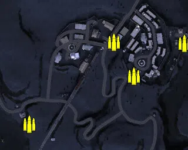
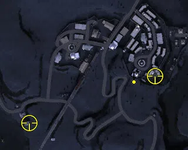
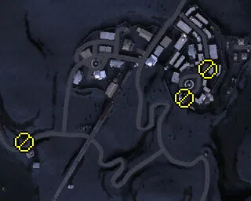

Static Ammo Crate

Pickup Kit

Static Emplacement

| gpo_subcat   | gpo_cat    | gpo_name               |    pos_x |   pos_y |   pos_z |   flag | is_locked   |   team | instance                              | gpo_cat_disp       | gpo_subcat_disp   |
|:-------------|:-----------|:-----------------------|---------:|--------:|--------:|-------:|:------------|-------:|:--------------------------------------|:-------------------|:------------------|
| ammo_crate   | ammo_crate | ammo_crate             |   76.639 |  15.038 | 154.394 |      0 | False       |      0 | ammo_crate_0                          | Static Ammo Crate  | Static Ammo Crate |
| ammo_crate   | ammo_crate | ammo_crate             | -315.748 |  16.099 | 241.821 |      0 | False       |      0 | ammo_crate_1                          | Static Ammo Crate  | Static Ammo Crate |
| ammo_crate   | ammo_crate | ammo_crate             |  220.625 |  20.159 | 294.113 |      0 | False       |      0 | ammo_crate_2                          | Static Ammo Crate  | Static Ammo Crate |
| ammo_crate   | ammo_crate | ammo_crate             |  340.527 |  15.782 | 292.085 |      0 | False       |      0 | ammo_crate_3                          | Static Ammo Crate  | Static Ammo Crate |
| ammo_crate   | ammo_crate | ammo_crate             |  255.416 |  21.963 | 236.144 |      0 | False       |      0 | ammo_crate_4                          | Static Ammo Crate  | Static Ammo Crate |
| mg_dep       | kit        | IA_PickUpBredaM37      |  254.9   |  21.958 | 236.437 |    304 | False       |      0 | CP_16_Hyacinth_Barce_DE_GB_PickUpMG   | Pickup Kit         | Deployable MG     |
| sniper       | kit        | IA_PickUpSniperPattern |  291.496 |  26.775 | 235.748 |    304 | False       |      0 | CP_16_Hyacinth_Base_DE_GB_Sniper      | Pickup Kit         | Sniper Kit        |
| sniper       | kit        | BA_PickUpSniperNo4     |   76.639 |  14.272 | 156.096 |    301 | False       |      0 | CP_16_Hyacinth_LRDG_DE_GB_Sniper      | Pickup Kit         | Sniper Kit        |
| mg_nest      | static     | lewis_bipod            |   57.594 |  23.207 | 184.925 |    301 | False       |      0 | CP_16_Hyacinth_LRDG_DE_GB_LightMG     | Static Emplacement | Static MG         |
| mg_nest      | static     | bredam37_bipod         |  292.248 |  19.766 | 277.734 |    304 | False       |      0 | CP_16_Hyacinth_Base_DE_GB_LightMG     | Static Emplacement | Static MG         |
| mg_nest      | static     | bredam37_bipod         |  262.089 |  25.627 | 240.921 |    304 | False       |      0 | CP_16_Hyacinth_Barce_DE_GB_LightMG    | Static Emplacement | Static MG         |
| radio        | static     | gercommradio           |  334.216 |  15.138 | 316.029 |    304 | False       |      0 | CP_16_Hyacinth_Base_DE_GB_CommRadio   | Static Emplacement | Radio             |
| radio        | static     | gercommradio           |  253.245 |  24.891 | 240.11  |    304 | False       |      0 | CP_16_Hyacinth_Base_DE_GB_CommRadio_0 | Static Emplacement | Radio             |
| radio        | static     | britcommradio          |   69.544 |  14.27  | 154.06  |    301 | False       |      0 | CP_16_Hyacinth_LRDG_DE_GB_CommRadio   | Static Emplacement | Radio             |
| radio        | static     | oldradioaxis           |  257.008 |  22.728 | 237.058 |    304 | False       |      0 | CP_16_Hyacinth_Barce_DE_GB_OldRadio   | Static Emplacement | Radio             |

