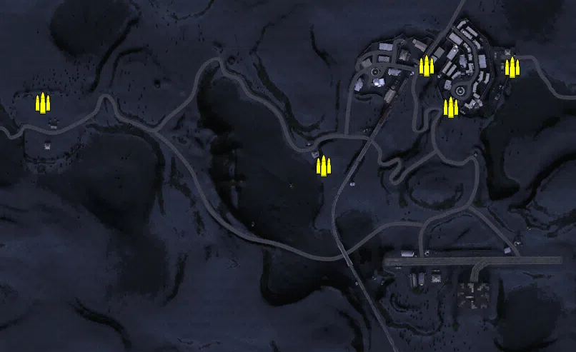
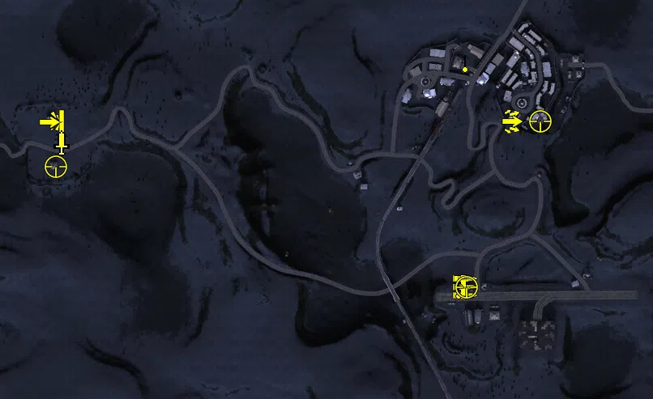
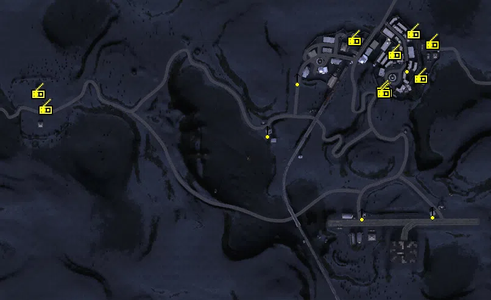
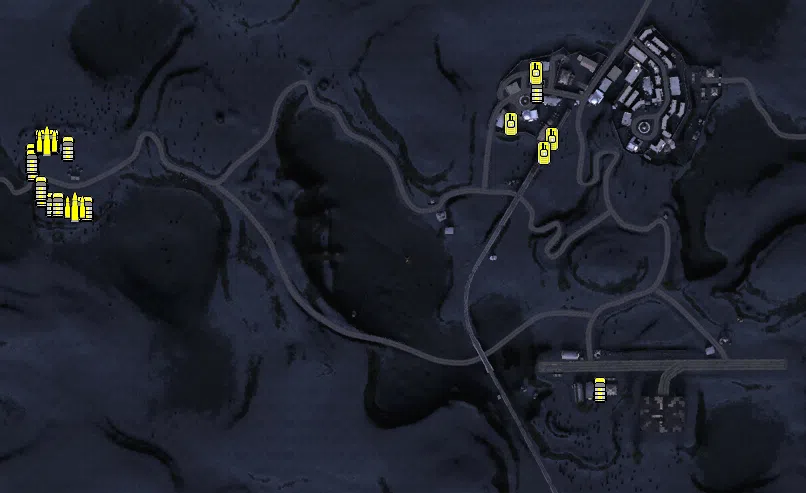

Static Ammo Crate

Pickup Kit

Static Emplacement

Vehicle

| Icon                      | SubCat            | Cat                | Name                      | Instance                              |   Flag |    X Pos |   Y Pos |   Z Pos |
|:--------------------------|:------------------|:-------------------|:--------------------------|:--------------------------------------|-------:|---------:|--------:|--------:|
|     | Static Ammo Crate | Static Ammo Crate  | ammo_crate                | ammo_crate_0                          |      0 |   76.639 |  15.038 | 154.394 |
|     | Static Ammo Crate | Static Ammo Crate  | ammo_crate                | ammo_crate_1                          |      0 | -315.748 |  16.099 | 241.821 |
|     | Static Ammo Crate | Static Ammo Crate  | ammo_crate                | ammo_crate_2                          |      0 |  220.625 |  20.159 | 294.113 |
|     | Static Ammo Crate | Static Ammo Crate  | ammo_crate                | ammo_crate_3                          |      0 |  340.527 |  15.782 | 292.085 |
|     | Static Ammo Crate | Static Ammo Crate  | ammo_crate                | ammo_crate_4                          |      0 |  255.416 |  21.963 | 236.144 |
|  | Assault Kit       | Pickup Kit         | IA_PickUpAssaultCarcano91 | CP_64_Hyacinth_Barce_Assault          |      9 |  254.900 |  21.958 | 236.437 |
|   | AT Rifle          | Pickup Kit         | BA_PickUpAntitankBoys     | CP_64_Hyacinth_LRDG_AntitankBoys      |    201 | -311.840 |  16.101 | 234.790 |
|    | Commando Kit      | Pickup Kit         | BA_PickUpCommandoTommyD   | CP_64_Hyacinth_LRDG_Commando          |    201 | -300.248 |  15.123 | 208.856 |
|       | MG Kit            | Pickup Kit         | IA_PickUpSupportBreda     | CP_64_Hyacinth_Airfield_LMG           |      1 |  198.045 |  19.693 |  30.900 |
|      | Deployable MG     | Pickup Kit         | IA_PickUpBredaM37         | CP_64_Hyacinth_Airfield_PickUpMG      |      1 |  189.555 |  19.695 |  30.398 |
|      | Deployable MG     | Pickup Kit         | IA_PickUpBredaM37         | CP_64_Hyacinth_Station_PickUpMG       |      3 |  197.996 |  17.478 | 309.912 |
|   | Sniper Kit        | Pickup Kit         | IA_PickUpSniperPattern    | CP_64_Hyacinth_Barce_Sniper           |      9 |  291.456 |  26.775 | 235.748 |
|   | Sniper Kit        | Pickup Kit         | BA_PickUpSniperNo4        | CP_64_Hyacinth_LRDG_Sniper            |    201 | -306.828 |  14.946 | 180.468 |
|   | Sniper Kit        | Pickup Kit         | IA_PickUpSniperPattern    | CP_64_Hyacinth_Airfield_Sniper        |      1 |  199.508 |  19.699 |  30.986 |
|     | MISCELLANEOUS     | FIXME UNASSIGNED   | spotlight                 | CP_64_Hyacinth_Airfield_Spotlight1    |      1 |  347.486 |  23.687 |  45.843 |
|     | MISCELLANEOUS     | FIXME UNASSIGNED   | spotlight                 | CP_64_Hyacinth_Airfield_Spotlight2    |      1 |  220.242 |  25.210 |  35.570 |
|     | MISCELLANEOUS     | FIXME UNASSIGNED   | spotlight                 | CP_64_Hyacinth_Forward_Spotlight1     |    202 |   54.693 |  23.052 | 184.554 |
|     | FIXME UNASSIGNED  | FIXME UNASSIGNED   | mc202_objective           | CP_64_Hyacinth_Airfield_Objective1    |      1 |  172.162 |  18.785 |  19.192 |
|     | FIXME UNASSIGNED  | FIXME UNASSIGNED   | mc202_objective           | CP_64_Hyacinth_Airfield_Objective2    |      1 |  197.797 |  18.085 |   9.385 |
|     | FIXME UNASSIGNED  | FIXME UNASSIGNED   | mc202_objective           | CP_64_Hyacinth_Airfield_Objective3    |      1 |  352.695 |  16.102 |  12.276 |
|     | FIXME UNASSIGNED  | FIXME UNASSIGNED   | mc202_objective           | CP_64_Hyacinth_Airfield_Objective4    |      1 |  276.848 |  18.580 | -33.336 |
|     | FIXME UNASSIGNED  | FIXME UNASSIGNED   | mc202_objective           | CP_64_Hyacinth_Airfield_Objective5    |      1 |  369.802 |  17.380 |  31.249 |
|     | FIXME UNASSIGNED  | FIXME UNASSIGNED   | mc202_objective           | CP_64_Hyacinth_Airfield_Objective6    |      1 |  291.952 |  18.564 | -36.607 |
|      | Static MG         | Static Emplacement | bredam37_bipod            | CP_64_Hyacinth_Forward_mg             |    202 |   62.937 |  14.916 | 171.158 |
|      | Static MG         | Static Emplacement | bredam37_bipod            | CP_64_Hyacinth_Airfield_MG1           |      1 |  217.734 |  18.124 |  35.419 |
|      | Static MG         | Static Emplacement | bredam37_bipod            | CP_64_Hyacinth_Barce_MG1              |      9 |  262.089 |  25.627 | 240.921 |
|      | Static MG         | Static Emplacement | bredam37_bipod            | CP_64_Hyacinth_Barce_MG2              |      9 |  292.249 |  19.788 | 277.809 |
|      | Static MG         | Static Emplacement | bredam37_bipod            | CP_64_Hyacinth_Airfield_MG2           |      1 |  333.795 |  17.568 |  38.428 |
|      | Static MG         | Static Emplacement | bredam37_bipod            | CP_64_Hyacinth_Station_MG1            |      3 |  112.432 |  17.314 | 256.721 |
|    | Radio             | Static Emplacement | gercommradio              | CP_64_Hyacinth_Station_CommRadio1     |      3 |  205.779 |  17.580 | 322.445 |
|    | Radio             | Static Emplacement | britcommradio             | CP_64_Hyacinth_LRDG_CommRadio1        |    201 | -300.911 |  14.325 | 208.697 |
|    | Radio             | Static Emplacement | britcommradio             | CP_64_Hyacinth_LRDG_CommRadio2        |    201 | -312.916 |  16.099 | 234.512 |
|    | Radio             | Static Emplacement | gercommradio              | CP_64_Hyacinth_Barce_CommRadio1       |      9 |  334.216 |  15.138 | 316.029 |
|    | Radio             | Static Emplacement | oldradioaxis              | CP_64_Hyacinth_Barce_OldRadio         |      9 |  257.008 |  22.733 | 237.058 |
|    | Radio             | Static Emplacement | hqradio1                  | CP_64_Hyacinth_Barce_RadioObj1        |      9 |  302.725 |  18.216 | 332.583 |
|    | Radio             | Static Emplacement | hqradio2                  | CP_64_Hyacinth_Barce_RadioObj2        |      9 |  314.928 |  15.286 | 260.364 |
|    | Radio             | Static Emplacement | gercommradio              | CP_64_Hyacinth_Barce_CommRadio2       |      9 |  253.245 |  24.891 | 240.110 |
|    | Radio             | Static Emplacement | hqradio1                  | CP_64_Hyacinth_Barce_RadioObj3        |      9 |  271.961 |  20.044 | 299.438 |
|    | Radio             | Static Emplacement | hqradio1                  | CP_64_Hyacinth_Barce_RadioObj4        |      9 |  254.450 |  24.842 | 236.023 |
|      | Car               | Vehicle            | fiat626                   | CP_64_Hyacinth_Station_Truck          |      3 |  160.892 |  16.367 | 296.341 |
|      | Car               | Vehicle            | chevy30cwt                | CP_64_Hyacinth_LRDG_Chevy1            |    201 | -344.414 |  14.698 | 231.165 |
|      | Car               | Vehicle            | chevy30cwt                | CP_64_Hyacinth_LRDG_Chevy2            |    201 | -333.810 |  13.994 | 192.026 |
|      | Car               | Vehicle            | chevy30cwt                | CP_64_Hyacinth_LRDG_Chevy3            |    201 | -296.078 |  14.074 | 178.128 |
|      | Car               | Vehicle            | chevy30cwt                | CP_64_Hyacinth_LRDG_Chevy4            |    201 | -323.750 |  13.995 | 181.750 |
|      | Car               | Vehicle            | chevy30cwt                | CP_64_Hyacinth_LRDG_Chevy5            |    201 | -343.113 |  13.325 | 218.455 |
|      | Car               | Vehicle            | willysmb                  | CP_64_Hyacinth_LRDG_Willys2           |    201 | -317.500 |  13.995 | 181.500 |
|      | Car               | Vehicle            | willysmbsas               | CP_64_Hyacinth_LRDG_willysSAS1        |    201 | -344.500 |  14.698 | 224.865 |
|      | Car               | Vehicle            | willysmbsas               | CP_64_Hyacinth_LRDG_willysSAS2        |    201 | -289.111 |  13.666 | 177.888 |
|      | Car               | Vehicle            | willysmbsas               | CP_64_Hyacinth_LRDG_willysSAS3        |    201 | -334.655 |  13.994 | 198.370 |
|      | Car               | Vehicle            | bedfordoyd_nocanvas       | CP_64_Hyacinth_LRDG_Truck1            |    201 | -335.253 |  16.123 | 244.770 |
|      | Car               | Vehicle            | bedfordoyd_nocanvas       | CP_64_Hyacinth_LRDG_Truck2            |    201 | -323.370 |  16.247 | 244.963 |
|      | Car               | Vehicle            | willysmb                  | CP_64_Hyacinth_LRDG_Willys            |    201 | -308.364 |  15.888 | 238.500 |
|      | Car               | Vehicle            | fiat626                   | CP_64_Hyacinth_Airfield_Truck         |      1 |  223.637 |  17.660 |  -2.556 |
|     | Supply Vehicle    | Vehicle            | Chevy30cwt_ammo           | CP_64_Hyacinth_LRDG_ChevyAmmo1        |    201 | -301.478 |  14.228 | 179.117 |
|     | Supply Vehicle    | Vehicle            | bedfordoyd_ammo           | CP_64_Hyacinth_LRDG_TruckAmmo         |    201 | -329.041 |  16.228 | 244.872 |
|     | Tank              | Vehicle            | carrom13_40               | CP_64_Hyacinth_Station_ObjectiveTank1 |      3 |  159.617 |  16.346 | 313.050 |
|     | Tank              | Vehicle            | carrom13_40               | CP_64_Hyacinth_Station_ObjectiveTank3 |      3 |  176.090 |  18.599 | 247.166 |
|     | Tank              | Vehicle            | carrom13_40               | CP_64_Hyacinth_Station_ObjectiveTank4 |      3 |  134.823 |  16.346 | 262.292 |
|     | Tank              | Vehicle            | carrom13_40               | CP_64_Hyacinth_Station_ObjectiveTank5 |      3 |  168.029 |  18.599 | 233.194 |

