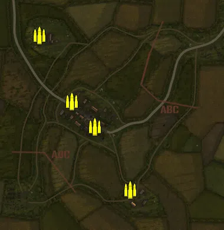
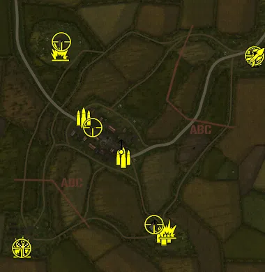
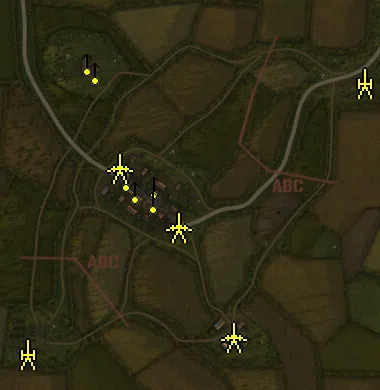
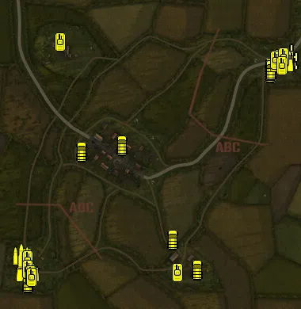

Static Ammo Crate

Pickup Kit

Static Emplacement

Vehicle

| Icon                       | SubCat            | Cat                | Name                       | Instance                                          |   Flag |    X Pos |   Y Pos |    Z Pos |
|:---------------------------|:------------------|:-------------------|:---------------------------|:--------------------------------------------------|-------:|---------:|--------:|---------:|
|      | Static Ammo Crate | Static Ammo Crate  | ammo_crate                 | ammo_crate_0                                      |      0 |   77.209 |  15.120 | -280.316 |
|      | Static Ammo Crate | Static Ammo Crate  | ammo_crate                 | ammo_crate_1                                      |      0 | -119.976 |  13.017 |   20.874 |
|      | Static Ammo Crate | Static Ammo Crate  | ammo_crate                 | ammo_crate_2                                      |      0 |  -42.738 |  13.038 |  -66.041 |
|      | Static Ammo Crate | Static Ammo Crate  | ammo_crate                 | ammo_crate_3                                      |      0 | -229.262 |  14.674 |  243.592 |
|      | Ammo Kit          | Pickup Kit         | UW_PickUpAmmokit           | CP_64_luttich_axismain_DE_US_Ammo                 |      1 |  364.854 |  12.720 |  204.984 |
|      | Ammo Kit          | Pickup Kit         | UW_PickUpAmmokit           | CP_64_luttich_eastmortain_DE_US_Ammo              |      2 |  -10.282 |  12.637 |  -87.042 |
|      | Ammo Kit          | Pickup Kit         | UW_PickUpAmmokit           | CP_64_luttich_westmortain_DE_US_Ammo              |    101 | -124.868 |  12.640 |   25.473 |
|      | Ammo Kit          | Pickup Kit         | UW_PickUpAmmokit           | CP_64_luttich_farm_DE_US_Ammo                     |    102 |  106.552 |  12.904 | -310.142 |
|      | Ammo Kit          | Pickup Kit         | UW_PickUpAmmokit           | CP_64_luttich_alliedmain_DE_US_Ammo               |      3 | -298.567 |  14.879 | -344.171 |
|      | Tankhunter Kit    | Pickup Kit         | UW_PickUpHawkinsM1Thompson | CP_64_luttich_alliedmain_pickup_zook1             |      3 | -302.073 |  15.689 | -346.308 |
|      | Tankhunter Kit    | Pickup Kit         | UW_PickUpHawkinsM1Thompson | CP_64_luttich_farm_pickupzook2                    |    102 |  116.798 |  12.926 | -291.941 |
|      | Tankhunter Kit    | Pickup Kit         | UW_PickUpHawkinsM1Thompson | CP_64_luttich_abbayeblanche_pickupzook3           |    103 | -191.888 |  11.757 |  218.174 |
|  | Deployable Arty   | Pickup Kit         | BA_PickUpMortar            | CP_64_luttich_axismain_DE_US_Mortar               |      1 |  366.595 |  12.720 |  197.193 |
|  | Deployable Arty   | Pickup Kit         | UW_PickUpMortar            | CP_64_luttich_alliedmain_DE_US_Mortar             |      3 | -300.463 |  14.880 | -345.315 |
|   | Assault Kit       | Pickup Kit         | UW_PickUpAssaultM1Thompson | CP_64_luttich_axismain_DE_US_Assault              |      1 |  366.620 |  13.539 |  201.272 |
|       | Deployable MG     | Pickup Kit         | UW_PickUp30Cal             | CP_64_luttich_eastmortain_DE_US_DepMG             |      2 |  -15.805 |  15.723 |  -52.283 |
|       | Deployable MG     | Pickup Kit         | UW_PickUp30Cal             | CP_64_luttich_farm_DE_US_DepMG                    |    102 |   79.384 |  15.138 | -281.305 |
|       | Deployable MG     | Pickup Kit         | UW_PickUp30Cal             | CP_64_luttich_axismain_DE_US_DepMG                |      1 |  365.276 |  12.725 |  199.352 |
|    | Sniper Kit        | Pickup Kit         | UW_PickUpSniperSpringfield | CP_64_luttich_westmortain_DE_US_Sniper            |    101 |  -97.661 |  18.753 |   -1.963 |
|    | Sniper Kit        | Pickup Kit         | UW_PickUpSniperSpringfield | CP_64_luttich_farm_DE_US_Sniper                   |    102 |   77.970 |  15.905 | -280.060 |
|    | Sniper Kit        | Pickup Kit         | UW_PickUpSniperSpringfield | CP_64_luttich_abbayeblanche_DE_US_Sniper          |    103 | -188.937 |  27.836 |  243.900 |
|    | Sniper Kit        | Pickup Kit         | UW_PickUpSniperSpringfield | CP_64_luttich_alliedmain_DE_US_Sniper             |      3 | -302.166 |  15.671 | -348.345 |
|    | Sniper Kit        | Pickup Kit         | UW_PickUpSniperSpringfield | CP_64_luttich_axismain_DE_US_Sniper               |      1 |  366.486 |  13.518 |  203.100 |
|    | HEAT Thrower      | Pickup Kit         | GW_PickUpPanzerschreck     | CP_64_luttich_axismain_DE_US_Antitank             |      1 |  368.428 |  13.574 |  200.113 |
|      | Artillery         | Static Emplacement | sGWR34_france              | CP_64_luttich_axismain_DE_US_StationaryMortar     |      1 |  363.881 |  12.807 |  198.471 |
|      | Artillery         | Static Emplacement | 81mm_mortar_m1             | CP_64_luttich_alliedmain_DE_US_StationaryMortar   |      3 | -310.097 |  14.957 | -344.415 |
|       | Static MG         | Static Emplacement | 50cal_tripod               | CP_64_luttich_westmortain_DE_US_LightMG           |    101 |  -93.129 |  12.501 |  -15.132 |
|       | Static MG         | Static Emplacement | mg42_bipod                 | CP_64_luttich_abbayeblanche_DE_US_LightMG         |    103 | -189.630 |  28.744 |  240.459 |
|       | Static MG         | Static Emplacement | 50cal_tripod               | CP_64_luttich_abbayeblanche_DE_US_LightMG_0       |    103 | -174.630 |  11.939 |  222.727 |
|       | Static MG         | Static Emplacement | mg42_bipod                 | CP_64_luttich_westmortain_DE_US_LightMG_1         |    101 | -111.791 |  16.777 |    8.911 |
|       | Static MG         | Static Emplacement | mg42_bipod                 | CP_64_luttich_westmortain_DE_US_LightMG_0         |    101 |  -55.685 |  13.273 |   -5.414 |
|       | Static MG         | Static Emplacement | 50cal_tripod               | CP_64_luttich_eastmortain_50caltripod             |      2 |  -58.005 |  12.772 |  -35.368 |
|       | Anti-tank Gun     | Static Emplacement | 57mm_m1_atgun_static       | CP_64_luttich_eastmortain_DE_GB_LightArtillery1   |      2 |   -7.737 |  12.990 |  -89.308 |
|       | Anti-tank Gun     | Static Emplacement | 57mm_m1_atgun_static       | CP_64_luttich_westmortain_DE_GB_LightArtillery2   |    101 | -126.611 |  12.999 |   28.098 |
|       | Anti-tank Gun     | Static Emplacement | 76mm_m5_atgun              | CP_64_luttich_farm_DE_US_LightArtillery           |    102 |  102.830 |  13.310 | -309.849 |
|       | APC               | Vehicle            | sdkfz251_d                 | CP_64_luttich_axismain_apc                        |      1 |  319.229 |  12.418 |  194.213 |
|       | APC               | Vehicle            | sdkfz251_d                 | CP_64_luttich_axismain_apc2                       |      1 |  318.523 |  12.632 |  181.528 |
|      | Mobile Arty       | Vehicle            | sdkfz251_d_sf              | CP_64_luttich_axismain_DE_US_PersonelCarrier      |      1 |  370.281 |  12.698 |  222.777 |
|       | Car               | Vehicle            | kubelwagen_fr              | CP_64_luttich_axismain_DE_US_Car                  |      1 |  320.861 |  12.592 |  187.651 |
|       | Car               | Vehicle            | willysmb_us                | CP_64_luttich_alliedmain_DE_US_Car                |      3 | -296.371 |  15.956 | -285.988 |
|       | Car               | Vehicle            | citroen_11cv_rust          | CP_64_luttich_westmortain_DE_US_Car               |    101 | -157.886 |  12.497 |  -18.251 |
|       | Car               | Vehicle            | opelblitz_fr_slats         | CP_64_luttich_axismain_DE_US_Truck                |      1 |  365.346 |  12.678 |  212.190 |
|       | Car               | Vehicle            | opelblitz_fr               | CP_64_luttich_axismain_DE_US_Truck_0              |      1 |  359.850 |  12.683 |  211.711 |
|       | Car               | Vehicle            | GMC                        | CP_64_luttich_alliedmain_DE_US_Truck              |      3 | -293.119 |  14.844 | -348.652 |
|       | Civilian Vehicle  | Vehicle            | redtractor                 | CP_64_luttich_farm_DE_US_Tractor                  |    102 |   72.991 |  11.177 | -239.018 |
|       | Civilian Vehicle  | Vehicle            | rideable_bicycle           | CP_64_luttich_westmortain_DE_US_Bicyle            |    101 |  -56.668 |  12.422 |   -2.143 |
|       | Civilian Vehicle  | Vehicle            | rideable_bicycle           | CP_64_luttich_farm_DE_US_Bicyle                   |    102 |  133.297 |  12.414 | -315.494 |
|       | Mobile PaK        | Vehicle            | m4a1_76mm                  | CP_64_luttich_alliedmain_m10                      |      3 | -295.321 |  16.052 | -307.582 |
|     | Scout Vehicle     | Vehicle            | puma                       | CP_64_luttich_axismain_DE_US_ArmouredCar          |      1 |  348.466 |  12.465 |  206.731 |
|     | Scout Vehicle     | Vehicle            | m8_greyhound               | CP_64_luttich_alliedmain_DE_US_ArmouredCar_0      |      3 | -294.075 |  15.990 | -323.460 |
|      | Supply Vehicle    | Vehicle            | gmc_ammo                   | CP_64_luttich_alliedmain_DE_US_Truck_0            |      3 | -309.868 |  15.506 | -282.471 |
|      | Tank              | Vehicle            | panthera_late              | CP_64_luttich_axismain_DE_US_HeavyTank2           |      1 |  341.790 |  12.184 |  216.311 |
|      | Tank              | Vehicle            | m4a1mid_eu                 | CP_64_luttich_alliedmain_DE_US_MediumTank         |      3 | -293.994 |  16.895 | -299.567 |
|      | Tank              | Vehicle            | m4a1early_eu               | CP_64_luttich_alliedmain_DE_US_MediumTank_0       |      3 | -293.361 |  16.976 | -291.159 |
|      | Tank              | Vehicle            | m5a1_stuart                | CP_64_luttich_alliedmain_DE_US_TankDestroyer      |      3 | -291.524 |  15.763 | -327.209 |
|      | Tank              | Vehicle            | m10                        | CP_64_luttich_alliedmain_DE_US_TankDestroyer_0    |      3 | -294.996 |  16.163 | -316.573 |
|      | Tank              | Vehicle            | panthera_late_alt          | CP_64_luttich_axismain_DE_US_MediumHeavyTank      |      1 |  331.073 |  12.284 |  212.331 |
|      | Tank              | Vehicle            | m3a1                       | CP_64_luttich_abbayeblanche_DE_US_Personalcarrier |    103 | -212.610 |  10.955 |  257.245 |
|      | Tank              | Vehicle            | PZIVH                      | CP_64_luttich_axismain_DE_US_MediumTank           |      1 |  351.107 |  12.274 |  220.283 |
|      | Tank              | Vehicle            | stug40_g                   | CP_64_luttich_axismain_DE_US_TankDestroyer        |      1 |  348.379 |  12.668 |  198.374 |
|      | Tank              | Vehicle            | m3a1                       | CP_64_luttich_alliedmain_apc                      |      3 | -286.484 |  15.418 | -329.747 |
|      | Tank              | Vehicle            | m3a1                       | CP_64_luttich_alliedmain_apc2                     |      3 | -283.141 |  15.094 | -335.494 |
|      | Tank              | Vehicle            | m3a1                       | CP_64_luttich_farm_apc                            |    102 |   83.485 |  13.006 | -324.759 |

