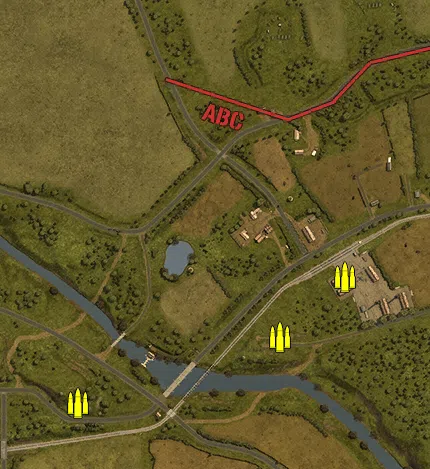
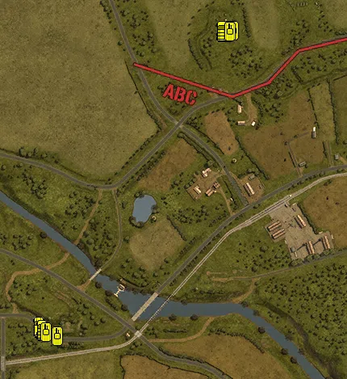

Static Ammo Crate

Vehicle

| Icon                   | SubCat            | Cat               | Name                         | Instance                            |   Flag |    X Pos |   Y Pos |    Z Pos |
|:-----------------------|:------------------|:------------------|:-----------------------------|:------------------------------------|-------:|---------:|--------:|---------:|
|  | Static Ammo Crate | Static Ammo Crate | ammo_crate                   | ammo_crate_0                        |      0 |  139.946 |  52.750 | -303.124 |
|  | Static Ammo Crate | Static Ammo Crate | ammo_crate                   | ammo_crate_1                        |      0 | -178.078 |  37.255 |  -48.506 |
|  | Static Ammo Crate | Static Ammo Crate | ammo_crate                   | ammo_crate_2                        |      0 |  356.227 |  26.093 |  204.833 |
|  | Static Ammo Crate | Static Ammo Crate | ammo_crate                   | ammo_crate_3                        |      0 |  226.328 |  30.755 |   84.236 |
|   | APC               | Vehicle           | sdkfz251_d                   | CP_16_totalize_germanmain_apc       |    305 | -237.336 |  32.656 |  -50.121 |
|   | APC               | Vehicle           | universalcarrier_france_bren | CP_16_totalize_alliedmain_apc       |    301 |  230.463 |  36.505 |  682.209 |
|   | Car               | Vehicle           | opelblitz_fr                 | CP_16_totalize_germanmain_truck     |    305 | -229.229 |  32.437 |  -57.571 |
|   | Car               | Vehicle           | bedford_qlt                  | CP_16_totalize_alliedmain_truck     |    301 |  216.815 |  36.505 |  682.478 |
|  | Tank              | Vehicle           | stug40_g                     | CP_16_totalize_germanmain_stug      |    305 | -220.902 |  32.283 |  -64.927 |
|  | Tank              | Vehicle           | pzivh                        | CP_16_totalize_germanmain_panzeriv  |    305 | -191.134 |  31.870 |  -73.507 |
|  | Tank              | Vehicle           | sherman_v_late_olive         | CP_16_totalize_alliedmain_sherman_1 |    301 |  243.552 |  36.505 |  681.244 |
|  | Tank              | Vehicle           | sherman_v_late_olive         | CP_16_totalize_alliedmain_sherman_2 |    301 |  236.538 |  36.505 |  680.146 |

