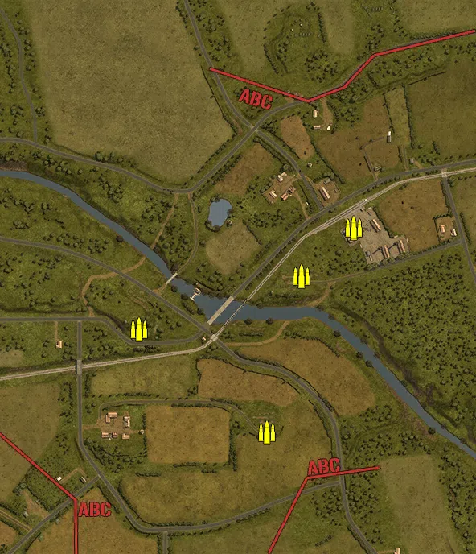
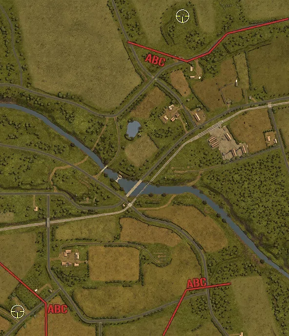
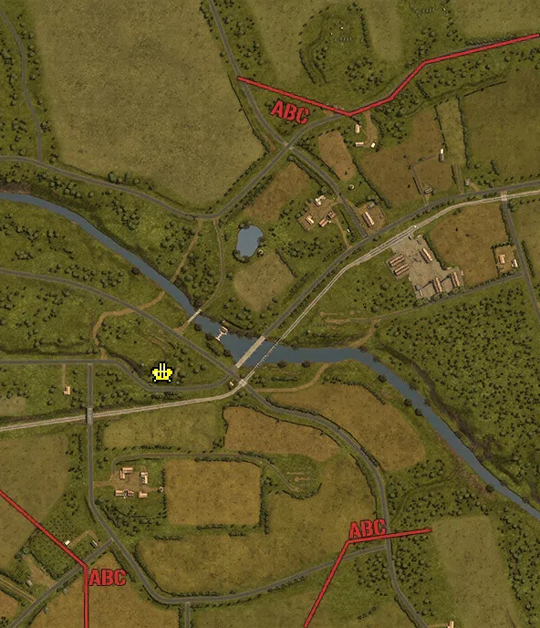
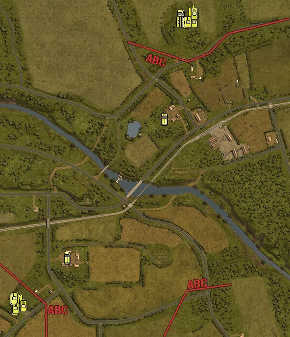

Static Ammo Crate

Pickup Kit

Static Emplacement

Vehicle

| gpo_subcat   | gpo_cat    | gpo_name                 |    pos_x |   pos_y |    pos_z |   flag | is_locked   |   team | instance                              | gpo_cat_disp       | gpo_subcat_disp   |
|:-------------|:-----------|:-------------------------|---------:|--------:|---------:|-------:|:------------|-------:|:--------------------------------------|:-------------------|:------------------|
| ammo_crate   | ammo_crate | ammo_crate               |  139.946 |  52.75  | -303.124 |      0 | False       |      0 | ammo_crate_0                          | Static Ammo Crate  | Static Ammo Crate |
| ammo_crate   | ammo_crate | ammo_crate               | -178.078 |  37.255 |  -48.506 |      0 | False       |      0 | ammo_crate_1                          | Static Ammo Crate  | Static Ammo Crate |
| ammo_crate   | ammo_crate | ammo_crate               |  356.227 |  26.093 |  204.833 |      0 | False       |      0 | ammo_crate_2                          | Static Ammo Crate  | Static Ammo Crate |
| ammo_crate   | ammo_crate | ammo_crate               |  226.328 |  30.755 |   84.236 |      0 | False       |      0 | ammo_crate_3                          | Static Ammo Crate  | Static Ammo Crate |
| sniper       | kit        | GW_PickUpSniperg43_zf    | -452.237 |  32.213 | -506.139 |    206 | False       |      0 | CP_32_totalize_germanmain_sniper      | Pickup Kit         | Sniper Kit        |
| sniper       | kit        | BW_PickUpSniperNo4       |  223.433 |  36.665 |  704.03  |    201 | False       |      0 | CP_32_totalize_alliedmain_sniper      | Pickup Kit         | Sniper Kit        |
| flak         | static     | flak18ns_fr              | -165.133 |  36.275 |  -45.091 |    204 | False       |      0 | CP_32_totalize_flakposition_88        | Static Emplacement | Anti-aircraft Gun |
| apc          | vehicle    | sdkfz251_d               | -432.62  |  31.62  | -474.569 |    206 | False       |      0 | CP_32_totalize_germanmain_hanomag     | Vehicle            | APC               |
| apc          | vehicle    | universalcarrier_france  |  217.844 |  36.505 |  705.991 |    201 | False       |      0 | CP_32_totalize_alliedmain_apc         | Vehicle            | APC               |
| apc          | vehicle    | universalcarrier_france  |  147.338 |  26.21  |  284.331 |    202 | False       |      0 | CP_32_totalize_yard_apc               | Vehicle            | APC               |
| apc          | vehicle    | sdkfz251_d               | -249.863 |  33.283 | -282.753 |    205 | False       |      0 | CP_32_totalize_communicationhq_apc    | Vehicle            | APC               |
| car          | vehicle    | opelblitz_fr             | -449.012 |  29.835 | -455.443 |    206 | False       |      0 | CP_32_totalize_germanmain_truck       | Vehicle            | Car               |
| car          | vehicle    | bedford_qlt              |  212.815 |  36.505 |  705.77  |    201 | False       |      0 | CP_32_totalize_alliedmain_truck       | Vehicle            | Car               |
| supply       | vehicle    | opelblitz_fr_ammo        | -452.704 |  29.733 | -451.68  |    206 | False       |      0 | CP_32_totalize_germanmain_ammotruck   | Vehicle            | Supply Vehicle    |
| supply       | vehicle    | bedford_qlt_ammo         |  266.362 |  36.505 |  719.941 |    201 | False       |      0 | CP_32_totalize_alliedmain_ammotruck   | Vehicle            | Supply Vehicle    |
| tank         | vehicle    | pzivh                    | -461.063 |  31.063 | -495.101 |    206 | True        |      0 | CP_32_totalize_germanmain_panzeriv_1  | Vehicle            | Tank              |
| tank         | vehicle    | pzivh                    | -428.241 |  31.62  | -480.34  |    206 | True        |      0 | CP_32_totalize_germanmain_panzeriv_2  | Vehicle            | Tank              |
| tank         | vehicle    | stug40_g_alt             | -460.014 |  31.214 | -487.553 |    206 | True        |      0 | CP_32_totalize_germanmain_stug        | Vehicle            | Tank              |
| tank         | vehicle    | panthera_alt             | -470.996 |  30.575 | -452.63  |    206 | True        |      0 | CP_32_totalize_germanmain_panther_1   | Vehicle            | Tank              |
| tank         | vehicle    | panthera                 | -466.072 |  29.281 | -448.62  |    206 | True        |      0 | CP_32_totalize_germanmain_panther_2   | Vehicle            | Tank              |
| tank         | vehicle    | churchillmkiv_6pdr       |  210.38  |  36.505 |  680.372 |    201 | True        |      0 | CP_32_totalize_alliedmain_churchill_1 | Vehicle            | Tank              |
| tank         | vehicle    | churchillmkiv_75mm       |  267.622 |  36.505 |  680.085 |    201 | True        |      0 | CP_32_totalize_alliedmain_churchill_2 | Vehicle            | Tank              |
| tank         | vehicle    | sherman_v_late_alt_olive |  222.468 |  36.505 |  679.494 |    201 | True        |      0 | CP_32_totalize_alliedmain_sherman_1   | Vehicle            | Tank              |
| tank         | vehicle    | sherman_v_late_olive     |  229.965 |  36.505 |  679.627 |    201 | True        |      0 | CP_32_totalize_alliedmain_sherman_2   | Vehicle            | Tank              |
| tank         | vehicle    | sherman_v_late_alt_olive |  236.038 |  36.505 |  678.843 |    201 | True        |      0 | CP_32_totalize_alliedmain_sherman_3   | Vehicle            | Tank              |
| tank         | vehicle    | sherman_vc_early_olive   |  243.363 |  36.505 |  680.101 |    201 | True        |      0 | CP_32_totalize_alliedmain_firefly     | Vehicle            | Tank              |
| tank         | vehicle    | achilles_iic             |  270.792 |  36.505 |  708.784 |    201 | True        |      0 | CP_32_totalize_alliedmain_achilles    | Vehicle            | Tank              |
| tank         | vehicle    | sherman_v_late_olive     |  269.209 |  36.505 |  714.221 |    201 | True        |      0 | CP_32_totalize_alliedmain_sherman_4   | Vehicle            | Tank              |

