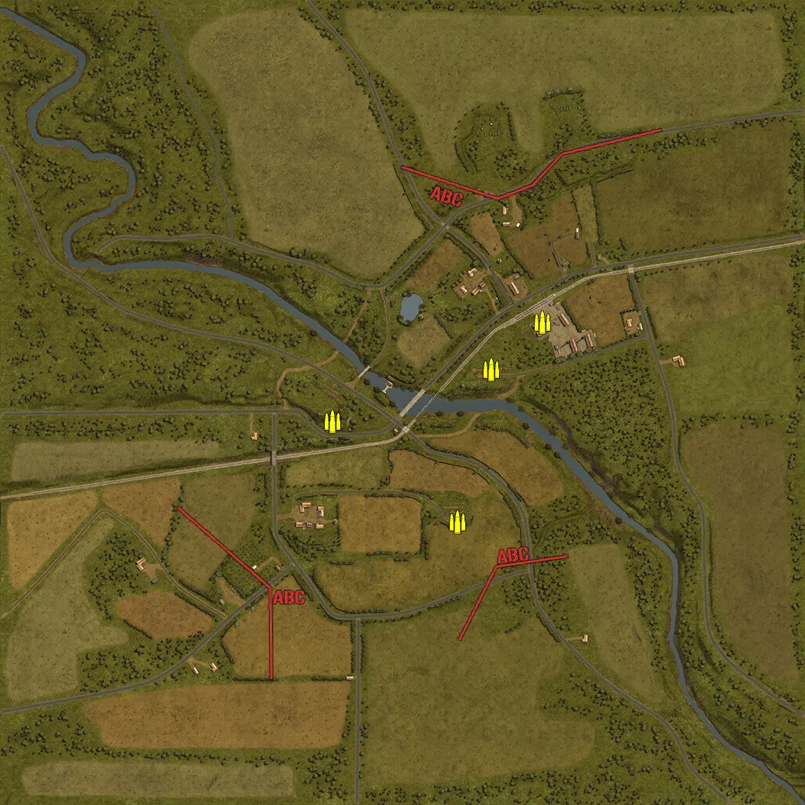
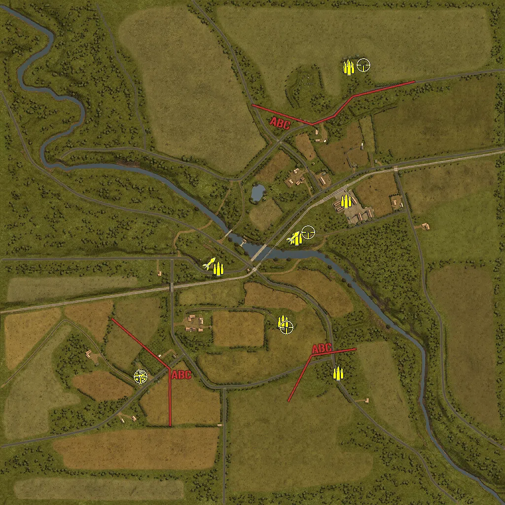
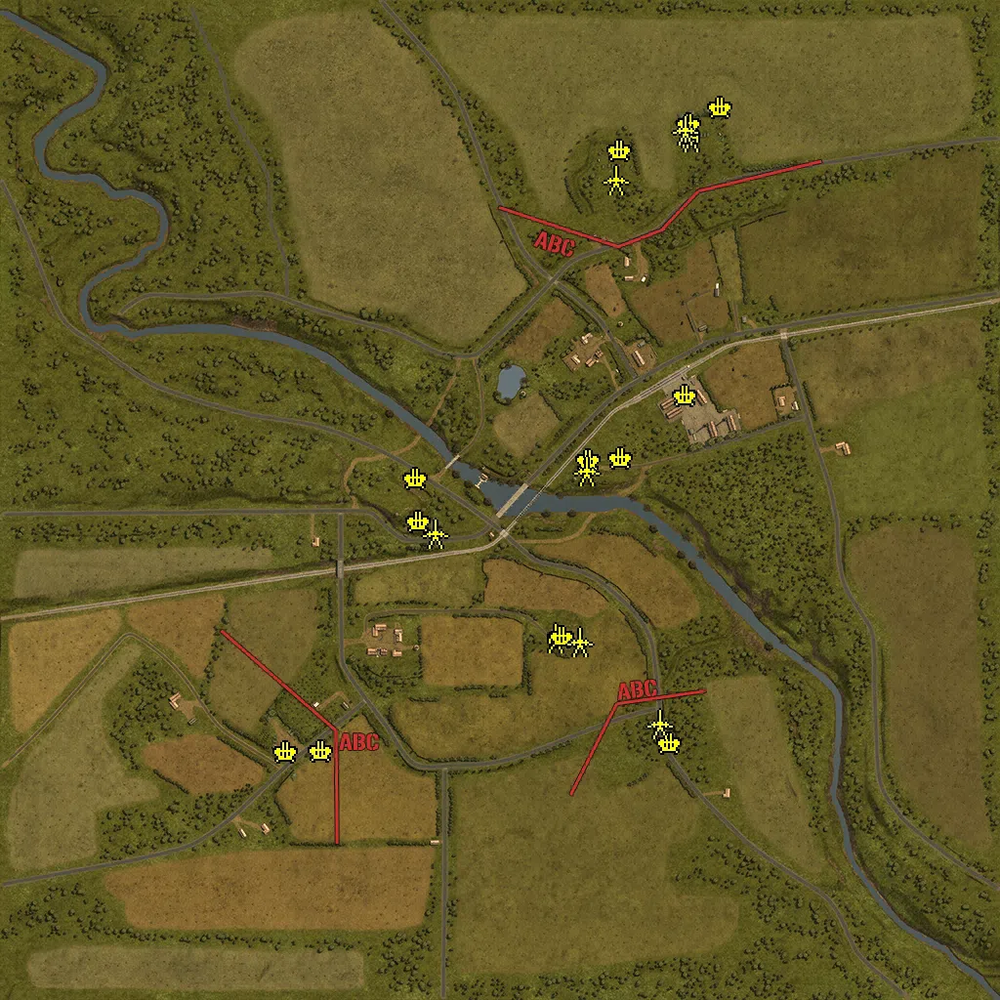
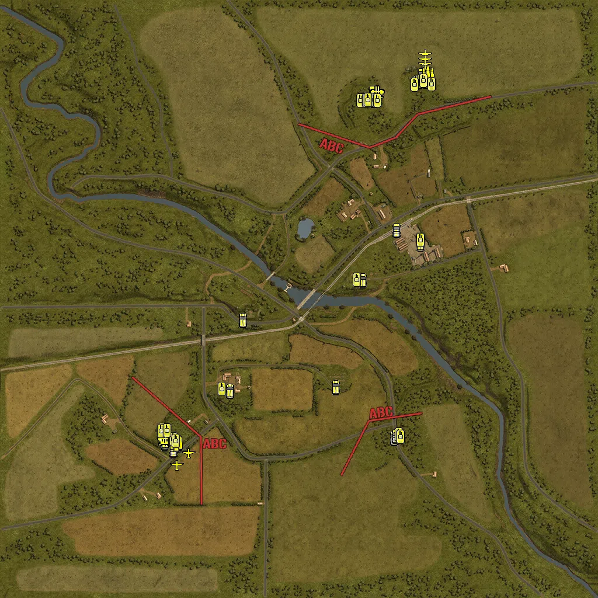

Static Ammo Crate

Pickup Kit

Static Emplacement

Vehicle

| Icon                      | SubCat            | Cat                | Name                         | Instance                                           |   Flag |    X Pos |   Y Pos |    Z Pos |
|:--------------------------|:------------------|:-------------------|:-----------------------------|:---------------------------------------------------|-------:|---------:|--------:|---------:|
|     | Static Ammo Crate | Static Ammo Crate  | ammo_crate                   | ammo_crate_0                                       |      0 |  139.946 |  52.750 | -303.124 |
|     | Static Ammo Crate | Static Ammo Crate  | ammo_crate                   | ammo_crate_1                                       |      0 | -178.078 |  37.255 |  -48.506 |
|     | Static Ammo Crate | Static Ammo Crate  | ammo_crate                   | ammo_crate_2                                       |      0 |  356.227 |  26.093 |  204.833 |
|     | Static Ammo Crate | Static Ammo Crate  | ammo_crate                   | ammo_crate_3                                       |      0 |  226.328 |  30.755 |   84.236 |
|     | Ammo Kit          | Pickup Kit         | BW_PickUpAmmokit             | CP_64_totalize_outpostwest_DE_GB_Ammo              |    102 | -137.007 |  31.895 |  -66.716 |
|     | Ammo Kit          | Pickup Kit         | BW_PickUpAmmokit             | CP_64_totalize_windmill_DE_GB_Ammo                 |    101 |  179.066 |  30.577 |   57.349 |
|     | Ammo Kit          | Pickup Kit         | BW_PickUpAmmokit             | CP_64_totalize_factory_DE_GB_Ammo                  |      5 |  379.516 |  25.892 |  207.226 |
|     | Ammo Kit          | Pickup Kit         | BW_PickUpAmmokit             | CP_64_totalize_alliedmain_DE_GB_Ammo               |      1 |  388.631 |  40.655 |  753.241 |
|     | Ammo Kit          | Pickup Kit         | BW_PickUpAmmokit             | CP_64_totalize_alliedmain_DE_GB_Ammo_0             |      1 |  392.314 |  40.655 |  748.211 |
|     | Ammo Kit          | Pickup Kit         | GW_PickUpAmmokit             | CP_64_totalize_germanmain_DE_GB_Ammo               |      2 | -454.563 |  31.206 | -503.182 |
|     | Ammo Kit          | Pickup Kit         | BW_PickUpAmmokit             | CP_64_totalize_outposteast_DE_GB_Ammo              |    103 |  124.633 |  51.855 | -281.900 |
|     | Ammo Kit          | Pickup Kit         | GW_PickUpAmmokit             | CP_64_totalize_heavytank_DE_GB_Ammo                |      3 |  348.951 |  51.275 | -489.146 |
|  | Assault Kit       | Pickup Kit         | GW_PickUpAssaultStG44        | CP_64_totalize_germanmain_DE_GB_Assault            |      2 | -455.621 |  31.208 | -501.649 |
|   | Sniper Kit        | Pickup Kit         | BW_PickUpSniperNo4           | CP_64_totalize_windmill_DE_GB_Sniper               |    101 |  226.263 |  30.755 |   81.549 |
|   | Sniper Kit        | Pickup Kit         | GW_PickUpSniperg43_ZF        | CP_64_totalize_germanmain_DE_GB_Sniper             |      2 | -453.303 |  31.205 | -504.516 |
|   | Sniper Kit        | Pickup Kit         | BW_PickUpSniperNo4           | CP_64_totalize_outposteast_DE_GB_Sniper2           |    103 |  138.817 |  52.750 | -303.279 |
|   | Sniper Kit        | Pickup Kit         | BW_PickUpSniperNo4           | CP_64_totalize_alliedmain_DE_GB_Sniper             |      1 |  450.099 |  41.446 |  759.103 |
|   | HEAT Thrower      | Pickup Kit         | BW_PickUpAntitankPiat        | CP_64_totalize_outpostwest_DE_GB_Antitank          |    102 | -176.284 |  37.255 |  -46.328 |
|   | HEAT Thrower      | Pickup Kit         | BW_PickUpAntitankPiat        | CP_64_totalize_windmill_DE_GB_Antitank2            |    101 |  164.554 |  30.126 |   59.367 |
|     | Artillery         | Static Emplacement | 25pdr_mkiv                   | CP_64_totalize_britmain_DE_GB_Howitzer             |      1 |  385.407 |  41.106 |  751.273 |
|     | Artillery         | Static Emplacement | 25pdr_mkiv                   | CP_64_totalize_britmain_DE_GB_Howitzer_0           |      1 |  390.679 |  41.110 |  744.721 |
|     | Artillery         | Static Emplacement | nebelwerfer                  | CP_64_totalize_germanmain_nebel                    |    103 |  112.372 |  54.664 | -282.235 |
|     | Anti-aircraft Gun | Static Emplacement | flak18ns_fr                  | CP_64_totalize_factory_DE_GB_HeavyArtillery        |      5 |  380.318 |  25.962 |  213.414 |
|     | Anti-aircraft Gun | Static Emplacement | flak38_france                | CP_64_totalize_windmilll_DE_GB_StaticArtillery     |    101 |  247.975 |  29.002 |   86.353 |
|     | Anti-aircraft Gun | Static Emplacement | flakvierling38_france        | CP_64_totalize_heavytank_flak39                    |      3 |  347.602 |  51.301 | -498.245 |
|     | Anti-aircraft Gun | Static Emplacement | bofors40mm_eu                | CP_64_totalize_alliedmain_bofors                   |      1 |  452.222 |  41.022 |  803.118 |
|     | Anti-aircraft Gun | Static Emplacement | bofors40mm_eu                | CP_64_totalize_alliedmain_bofors2                  |      1 |  388.133 |  41.019 |  770.339 |
|     | Anti-aircraft Gun | Static Emplacement | flakvierling38_france        | CP_64_totalize_germanmain_vierling                 |      2 | -366.350 |  34.838 | -513.637 |
|     | Anti-aircraft Gun | Static Emplacement | flakvierling38_france        | CP_64_totalize_germanmain_vierling_0               |      2 | -438.669 |  31.295 | -515.208 |
|     | Anti-aircraft Gun | Static Emplacement | bofors40mm_eu                | CP_64_totalize_alliedmain_bofors2_0                |      1 |  245.700 |  36.861 |  716.382 |
|     | Anti-aircraft Gun | Static Emplacement | flak18ns_fr                  | CP_64_totalize_windmill_flak88                     |    101 |  182.258 |  28.850 |   82.654 |
|     | Anti-aircraft Gun | Static Emplacement | flak18ns_fr                  | CP_64_totalize_outpostwest_88mm                    |    102 | -171.714 |  29.679 |   44.458 |
|     | Anti-aircraft Gun | Static Emplacement | flak18ns_fr                  | CP_64_totalize_outposteast_falk                    |    103 |  127.015 |  51.996 | -280.114 |
|     | Anti-aircraft Gun | Static Emplacement | flak18ns_fr                  | CP_64_totalize_outpostwest_flak                    |    102 | -165.521 |  36.400 |  -44.682 |
|      | Anti-tank Gun     | Static Emplacement | 6pdr_mkiv_static             | CP_64_totalize_britmain_DE_GB_StaticArtillery      |      1 |  236.959 |  36.860 |  655.790 |
|      | Anti-tank Gun     | Static Emplacement | pak40_static                 | CP_64_totalize_germanoutpost_DE_GB_StaticArtillery |    102 | -134.214 |  32.437 |  -68.769 |
|      | Anti-tank Gun     | Static Emplacement | 6pdr_mkiv_static             | CP_64_totalize_britmain_DE_GB_StaticArtillery_0    |      1 |  377.307 |  40.928 |  757.349 |
|      | Anti-tank Gun     | Static Emplacement | pak40_static                 | CP_64_totalize_windmill_pak40                      |    101 |  175.623 |  31.140 |   60.017 |
|      | Anti-tank Gun     | Static Emplacement | 6pdr_mkiv                    | CP_64_totalize_outposteast_pak40mov                |    103 |  161.830 |  52.823 | -289.618 |
|      | Anti-tank Gun     | Static Emplacement | pak40_static                 | CP_64_totalize_heavytank_pak40                     |      3 |  326.126 |  51.605 | -457.419 |
|      | APC               | Vehicle            | universalcarrier_wasp        | CP_64_totalize_gasstation_DE_GB_MediumTank         |      5 |  415.291 |  25.870 |  190.220 |
|      | APC               | Vehicle            | universalcarrier_france_bren | CP_64_totalize_windmilll_DE_GB_PersonelCarrier     |    101 |  218.711 |  29.810 |   63.485 |
|      | APC               | Vehicle            | universalcarrier_france_bren | CP_64_totalize_outpostwest_apc                     |    102 | -191.771 |  31.868 |  -72.591 |
|      | APC               | Vehicle            | sdkfz251_d                   | CP_64_totalize_heavytank_apc                       |      3 |  325.928 |  51.254 | -476.556 |
|      | APC               | Vehicle            | universalcarrier_france_bren | CP_64_totalize_alliedmain_brancarier1              |      1 |  255.531 |  36.505 |  681.221 |
|      | APC               | Vehicle            | universalcarrier_wasp        | CP_64_totalize_alliedmain_brencarrier3             |      1 |  436.669 |  40.655 |  748.522 |
|      | APC               | Vehicle            | universalcarrier_france_bren | CP_64_totalize_outposteast_apc                     |    103 |  125.265 |  53.005 | -301.359 |
|      | APC               | Vehicle            | universalcarrier_france_bren | CP_64_totalize_southfarm_apc                       |    104 | -235.600 |  33.708 | -314.043 |
|      | APC               | Vehicle            | sdkfz251_d                   | CP_64_totalize_germanmain_apc                      |      2 | -460.667 |  31.136 | -494.649 |
|      | APC               | Vehicle            | sdkfz251_d                   | CP_64_totalize_germanmain_apc2                     |      2 | -458.421 |  31.282 | -487.474 |
|     | Mobile Arty       | Vehicle            | wespe                        | CP_64_totalize_germanmain_wespe                    |      2 | -467.010 |  30.028 | -469.499 |
|      | Car               | Vehicle            | kubelwagen_fr                | CP_64_totalize_germanmain_car                      |      2 | -416.710 |  31.530 | -497.196 |
|      | Car               | Vehicle            | opelblitz_fr                 | CP_64_totalize_germanmain_truck                    |      2 | -423.586 |  31.542 | -494.674 |
|      | Car               | Vehicle            | willysmb_france              | CP_64_totalize_alliedmain_car                      |      1 |  251.673 |  36.505 |  687.922 |
|      | Car               | Vehicle            | kubelwagen_fr                | CP_64_totalize_heavytank_car                       |      3 |  331.164 |  51.114 | -470.227 |
|      | Car               | Vehicle            | opelblitz_fr_slats           | CP_64_totalize_germanmain_opel2                    |      2 | -430.615 |  31.295 | -518.516 |
|      | Car               | Vehicle            | bedford_qlt                  | CP_64_totalize_alliedmain_truck                    |      1 |  424.539 |  40.655 |  767.901 |
|      | Car               | Vehicle            | bedford_qlt                  | CP_64_totalize_alliedmain_truck3                   |      1 |  419.321 |  40.655 |  766.595 |
|      | Car               | Vehicle            | bedford_qlt                  | CP_64_totalize_alliedmain_truck4                   |      1 |  251.832 |  36.505 |  705.066 |
|      | Car               | Vehicle            | bedford_qlt                  | CP_64_totalize_alliedmain_truck5                   |      1 |  260.680 |  36.505 |  696.401 |
|      | Civilian Vehicle  | Vehicle            | wr360c14_europe              | CP_64_totalize_factory_train                       |      5 |  333.701 |  25.635 |  236.737 |
|     | Mobile FlaK       | Vehicle            | wirbelwind                   | CP_64_totalize_germanmain_antiair1                 |      2 | -458.733 |  31.209 | -480.872 |
|     | Mobile FlaK       | Vehicle            | crusadermk3_aa               | CP_64_totalize_alliedmain_crusaderAA               |      1 |  269.215 |  36.505 |  707.623 |
|    | Airplane          | Vehicle            | fw190                        | CP_64_totalize_germanmain_DE_GB_FighterPlane       |      2 | -377.859 |  34.685 | -527.814 |
|    | Airplane          | Vehicle            | typhoon_mk1b_late            | CP_64_totalize_britmain_DE_GB_FighterPlane         |      1 |  432.883 |  40.775 |  837.122 |
|    | Airplane          | Vehicle            | typhoon_mk1b_late            | CP_64_totalize_britmain_DE_GB_FighterPlane_0       |      1 |  432.981 |  41.184 |  803.265 |
|    | Airplane          | Vehicle            | fw190_alt                    | CP_64_totalize_germanmain_fw190                    |      2 | -418.258 |  34.685 | -568.773 |
|    | Airplane          | Vehicle            | spitfire_ix                  | CP_64_totalize_alliedmain_spitfire                 |      1 |  431.754 |  40.956 |  820.386 |
|     | Supply Vehicle    | Vehicle            | opelblitz_fr_ammo            | CP_64_totalize_germanmain_trcuk2                   |      2 | -420.315 |  31.535 | -491.543 |
|     | Supply Vehicle    | Vehicle            | bedford_qlt_ammo             | CP_64_totalize_alliedmain_ammoruck                 |      1 |  441.214 |  40.655 |  769.637 |
|     | Tank              | Vehicle            | cromwell_polish              | CP_64_totalize_britmain_DE_GB_MediumTank           |      1 |  222.302 |  36.505 |  682.079 |
|     | Tank              | Vehicle            | sherman_v_late_olive         | CP_64_totalize_britmain_DE_GB_MediumTank_0         |      1 |  243.567 |  36.505 |  681.568 |
|     | Tank              | Vehicle            | achilles_iic                 | CP_64_totalize_britmain_DE_GB_HeavyTank            |      1 |  210.653 |  36.505 |  679.296 |
|     | Tank              | Vehicle            | tiger_late_222               | CP_64_totalize_germanmain2_DE_GB_HeavyTank         |      3 |  342.096 |  51.275 | -463.732 |
|     | Tank              | Vehicle            | cromwell_polish              | CP_64_totalize_windmilll_DE_GB_MediumTank          |    101 |  197.613 |  28.465 |   66.967 |
|     | Tank              | Vehicle            | sherman_v_late_alt_olive     | CP_64_totalize_britmain_DE_GB_MediumTank_1         |      1 |  230.259 |  36.505 |  680.654 |
|     | Tank              | Vehicle            | tiger_late_132               | CP_64_totalize_germanmain2_DE_GB_HeavyTank_0       |      3 |  348.328 |  51.275 | -472.564 |
|     | Tank              | Vehicle            | cromwell_polish              | CP_64_totalize_britmain_DE_GB_MediumTank_2         |      1 |  236.376 |  36.505 |  681.369 |
|     | Tank              | Vehicle            | sherman_vc_early_olive       | CP_64_totalize_britmain_DE_GB_HeavyTank_0          |      1 |  454.538 |  40.655 |  736.138 |
|     | Tank              | Vehicle            | panthera_alt                 | CP_64_totalize_germanmain_pantherg                 |      2 | -468.221 |  29.337 | -448.753 |
|     | Tank              | Vehicle            | sherman_v_mid_olive          | CP_64_totalize_alliedmain_sherman                  |      1 |  404.347 |  40.655 |  742.948 |
|     | Tank              | Vehicle            | sherman_v_late_alt_olive     | CP_64_totalize_alliedmain_sherman_0                |      1 |  411.961 |  40.655 |  744.692 |
|     | Tank              | Vehicle            | cromwell_polish              | CP_64_totalize_alliedmain_crowell                  |      1 |  418.120 |  40.655 |  746.108 |
|     | Tank              | Vehicle            | cromwell_95                  | CP_64_totalize_alliedmain_crowell_0                |      1 |  425.246 |  40.655 |  747.020 |
|     | Tank              | Vehicle            | panthera                     | CP_64_totalize_germanmain_panther                  |      2 | -472.793 |  29.313 | -452.407 |
|     | Tank              | Vehicle            | pzivh_noskirt                | CP_64_totalize_germanmain_panzeriv                 |    104 | -264.635 |  33.708 | -308.622 |
|     | Tank              | Vehicle            | pzivh_noskirt                | CP_64_totalize_germanmain_pziv                     |      2 | -433.839 |  31.413 | -475.465 |
|     | Tank              | Vehicle            | sherman_v_mid_olive          | CP_64_totalize_factory_sherman                     |      5 |  416.345 |  25.870 |  202.176 |
|     | Tank              | Vehicle            | churchillmkiv_6pdr           | CP_64_totalize_alliedmain_churchill                |      1 |  268.441 |  36.505 |  679.322 |
|     | Tank              | Vehicle            | pzivh_noskirt                | CP_64_totalize_reinforcements_panzer4              |    106 | -429.269 |  31.620 | -480.987 |
|     | Tank              | Vehicle            | churchillmkiv_75mm           | CP_64_totalize_alliedmain_churchill75              |      1 |  396.324 |  40.655 |  733.306 |
|     | Tank              | Vehicle            | marder_i                     | CP_64_totalize_germanmain_marder                   |    105 | -422.516 |  31.620 | -485.488 |
|     | Tank              | Vehicle            | stug40_g                     | CP_64_totalize_germanmain_stug                     |      6 | -452.456 |  29.684 | -450.239 |

