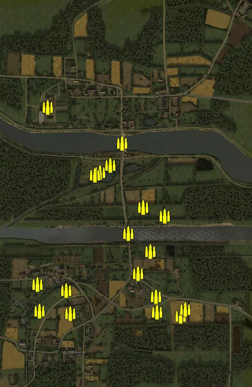
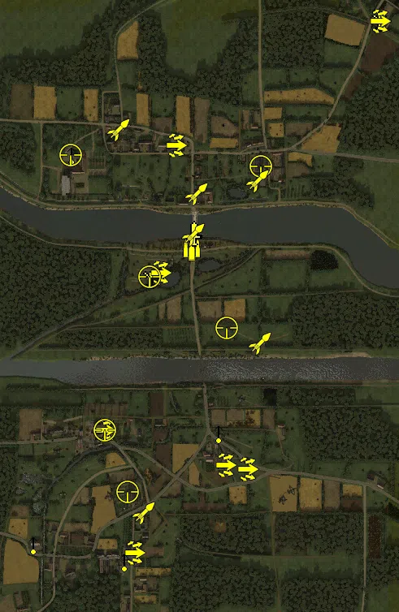
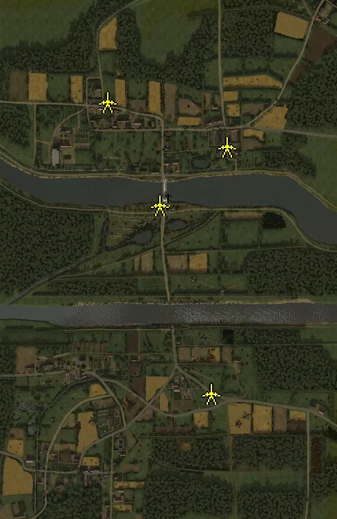
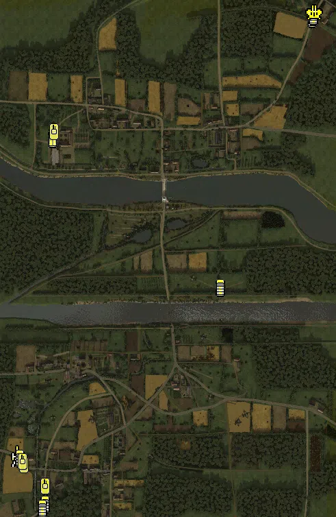

Static Ammo Crate

Pickup Kit

Static Emplacement

Vehicle

| gpo_subcat   | gpo_cat    | gpo_name                   |    pos_x |   pos_y |    pos_z |   flag | is_locked   |   team | instance                                 | gpo_cat_disp       | gpo_subcat_disp   |
|:-------------|:-----------|:---------------------------|---------:|--------:|---------:|-------:|:------------|-------:|:-----------------------------------------|:-------------------|:------------------|
| ammo_crate   | ammo_crate | ammo_crate                 |  141.859 |  25.373 | -204.044 |      0 | False       |      0 | ammo_crate_0                             | Static Ammo Crate  | Static Ammo Crate |
| ammo_crate   | ammo_crate | ammo_crate                 |  198.139 |  25.167 |  -66.805 |      0 | False       |      0 | ammo_crate_1                             | Static Ammo Crate  | Static Ammo Crate |
| ammo_crate   | ammo_crate | ammo_crate                 |  113.795 |  25.484 |  -32.196 |      0 | False       |      0 | ammo_crate_2                             | Static Ammo Crate  | Static Ammo Crate |
| ammo_crate   | ammo_crate | ammo_crate                 |   93.857 |  30.185 | -290.8   |      0 | False       |      0 | ammo_crate_3                             | Static Ammo Crate  | Static Ammo Crate |
| ammo_crate   | ammo_crate | ammo_crate                 |  164.032 |  31.837 | -379.861 |      0 | False       |      0 | ammo_crate_4                             | Static Ammo Crate  | Static Ammo Crate |
| ammo_crate   | ammo_crate | ammo_crate                 | -290.793 |  32.823 | -435.327 |      0 | False       |      0 | ammo_crate_5                             | Static Ammo Crate  | Static Ammo Crate |
| ammo_crate   | ammo_crate | ammo_crate                 | -169.07  |  36.254 | -445.833 |      0 | False       |      0 | ammo_crate_6                             | Static Ammo Crate  | Static Ammo Crate |
| ammo_crate   | ammo_crate | ammo_crate                 | -185.18  |  35.652 | -356.317 |      0 | False       |      0 | ammo_crate_7                             | Static Ammo Crate  | Static Ammo Crate |
| ammo_crate   | ammo_crate | ammo_crate                 | -297.97  |  30.638 | -332.215 |      0 | False       |      0 | ammo_crate_8                             | Static Ammo Crate  | Static Ammo Crate |
| ammo_crate   | ammo_crate | ammo_crate                 |  167.256 |  32.061 | -439.204 |      0 | False       |      0 | ammo_crate_9                             | Static Ammo Crate  | Static Ammo Crate |
| ammo_crate   | ammo_crate | ammo_crate                 |  260.157 |  31.881 | -456.233 |      0 | False       |      0 | ammo_crate_10                            | Static Ammo Crate  | Static Ammo Crate |
| ammo_crate   | ammo_crate | ammo_crate                 |  278.773 |  33.52  | -429.977 |      0 | False       |      0 | ammo_crate_11                            | Static Ammo Crate  | Static Ammo Crate |
| ammo_crate   | ammo_crate | ammo_crate                 |  -53.091 |  23.659 |  103.015 |      0 | False       |      0 | ammo_crate_12                            | Static Ammo Crate  | Static Ammo Crate |
| ammo_crate   | ammo_crate | ammo_crate                 |  -73.974 |  23.082 |   93.678 |      0 | False       |      0 | ammo_crate_13                            | Static Ammo Crate  | Static Ammo Crate |
| ammo_crate   | ammo_crate | ammo_crate                 |  -14.279 |  23.409 |  132.972 |      0 | False       |      0 | ammo_crate_14                            | Static Ammo Crate  | Static Ammo Crate |
| ammo_crate   | ammo_crate | ammo_crate                 |   32.669 |  25.02  |  218.903 |      0 | False       |      0 | ammo_crate_15                            | Static Ammo Crate  | Static Ammo Crate |
| ammo_crate   | ammo_crate | ammo_crate                 | -257.551 |  27.663 |  357.646 |      0 | False       |      0 | ammo_crate_16                            | Static Ammo Crate  | Static Ammo Crate |
| ammo_crate   | ammo_crate | ammo_crate                 |   55.186 |  27.981 | -134.701 |      0 | False       |      0 | ammo_crate_17                            | Static Ammo Crate  | Static Ammo Crate |
| ammo         | kit        | BW_PickUpAmmokit           |   27.575 |  24.917 |  163.985 |    106 | False       |      0 | CP_64_pegasus_pegasus_bridge_ammo        | Pickup Kit         | Ammo Kit          |
| arty_dep     | kit        | GW_PickUpMortar            |  487.968 |  36.339 |  726.129 |    110 | False       |      0 | CP_64_pegasus_reinforcements_mortar      | Pickup Kit         | Deployable Arty   |
| arty_dep     | kit        | BA_PickUpMortar            |  -76.967 |  23.646 |   92.978 |    106 | False       |      0 | CP_64_pegasus_pegasus_bridge_mortargb    | Pickup Kit         | Deployable Arty   |
| assault      | kit        | GW_PickUpAssaultK98hZf41   |  -11.026 |  28.538 |  417.056 |    107 | False       |      0 | CP_64_pegasus_crossroads_assaultger      | Pickup Kit         | Assault Kit       |
| assault      | kit        | GW_PickUpAssaultG43        |  489.134 |  37.231 |  724.44  |    110 | False       |      0 | CP_64_pegasus_reinforcements_assault     | Pickup Kit         | Assault Kit       |
| assault      | kit        | BW_PickUpAssaultCarbine    |  -50.279 |  23.55  |  103.816 |    106 | False       |      0 | CP_64_pegasus_pegasus_bridge_glider      | Pickup Kit         | Assault Kit       |
| assault      | kit        | GW_PickUpAssaultG43        | -185.733 |  31.413 | -283.429 |    102 | False       |      0 | CP_64_pegasus_ranville_le_bas_assaultger | Pickup Kit         | Assault Kit       |
| assault      | kit        | BW_PickUpAssaultCarbine    | -113.88  |  35.155 | -585.353 |    101 | False       |      0 | CP_64_pegasus_ranville_assaultgb         | Pickup Kit         | Assault Kit       |
| assault      | kit        | BW_PickUpAssaultCarbine    |  164.052 |  32.104 | -379.723 |    103 | False       |      0 | CP_64_pegasus_longueville_glider         | Pickup Kit         | Assault Kit       |
| assault      | kit        | GW_PickUpAssaultG43        |  109.81  |  33.015 | -370.061 |    103 | False       |      0 | CP_64_pegasus_longueville_assaultger     | Pickup Kit         | Assault Kit       |
| commando     | kit        | BW_PickUpCommandoPegasus   |   34.866 |  35.833 |  199.115 |    106 | False       |      0 | CP_64_pegasus_pegasus_bridge_lordlovat   | Pickup Kit         | Commando Kit      |
| mg_dep       | kit        | GW_PickUpMG42Lafette       | -268.224 |  27.662 |  395.562 |    111 | False       |      0 | CP_64_pegasus_chateau_benouville_lafette | Pickup Kit         | Deployable MG     |
| mg_dep       | kit        | BA_PickUpVickers303        | -138.07  |  34.833 | -606.04  |    101 | False       |      0 | CP_64_pegasus_ranville_mggb              | Pickup Kit         | Deployable MG     |
| mg_dep       | kit        | BA_PickUpVickers303        |   93.899 |  30.464 | -290.683 |    103 | False       |      0 | CP_64_pegasus_longueville_MGGB           | Pickup Kit         | Deployable MG     |
| mg_dep       | kit        | GW_PickUpMG42Lafette       | -361.885 |  33.122 | -564.69  |      1 | False       |      0 | CP_64_pegasus_le_mariquet_mgger          | Pickup Kit         | Deployable MG     |
| sniper       | kit        | GW_PickUpSniperK98         | -269.305 |  28.461 |  393.521 |    111 | False       |      0 | CP_64_pegasus_chateau_benouville_sniper  | Pickup Kit         | Sniper Kit        |
| sniper       | kit        | GW_PickUpSniperK98         |  198.631 |  44.82  |  365.723 |    109 | False       |      0 | CP_64_pegasus_le_port_sniperger          | Pickup Kit         | Sniper Kit        |
| sniper       | kit        | BW_PickUpSniperNo4_colt    |  -76.171 |  23.119 |   94.075 |    106 | False       |      0 | CP_64_pegasus_pegasus_bridge_snipergb    | Pickup Kit         | Sniper Kit        |
| sniper       | kit        | GW_PickUpSniperK98         | -185.568 |  31.409 | -284.607 |    102 | False       |      0 | CP_64_pegasus_ranville_le_bas_sniperger  | Pickup Kit         | Sniper Kit        |
| sniper       | kit        | BW_PickUpSniperNo4_colt    |  113.688 |  25.759 |  -32.1   |    105 | False       |      0 | CP_64_pegasus_horsa_bridge_snipergb      | Pickup Kit         | Sniper Kit        |
| sniper       | kit        | BW_PickUpSniperNo4_colt    | -129.576 |  52.792 | -435.646 |    104 | False       |      0 | CP_64_pegasus_church_snipergb            | Pickup Kit         | Sniper Kit        |
| zooka        | kit        | BW_PickUpAntitankPiat_colt | -151.123 |  27.938 |  456.904 |    108 | False       |      0 | CP_64_pegasus_benouville_piat            | Pickup Kit         | HEAT Thrower      |
| zooka        | kit        | BW_PickUpPanzerfaust30m    |   39.799 |  25.315 |  297.407 |    107 | False       |      0 | CP_64_pegasus_crossroads_faustgb         | Pickup Kit         | HEAT Thrower      |
| zooka        | kit        | BW_PickUpAntitankPiat_colt |  190.223 |  28.309 |  329.417 |    109 | False       |      0 | CP_64_pegasus_le_port_piat               | Pickup Kit         | HEAT Thrower      |
| zooka        | kit        | BW_PickUpPanzerfaust30m    |   32.464 |  25.655 |  197.205 |    106 | False       |      0 | CP_64_pegasus_pegasus_bridge_faustgb     | Pickup Kit         | HEAT Thrower      |
| zooka        | kit        | BW_PickUpAntitankPiat_colt |  196.023 |  25.404 |  -70.614 |    105 | False       |      0 | CP_64_pegasus_horsa_bridge_piat          | Pickup Kit         | HEAT Thrower      |
| zooka        | kit        | BW_PickUpPanzerfaust30m    |  -90.797 |  36.673 | -487.588 |    104 | False       |      0 | CP_64_pegasus_church_faustgb             | Pickup Kit         | HEAT Thrower      |
| noidea       | noidea     | FH_explosion_spawnable     |  232.791 |  25     |  145.585 |    114 | False       |      0 | CP_64_pegasus_pegasus_bombimpact1        | FIXME UNASSIGNED   | FIXME UNASSIGNED  |
| noidea       | noidea     | FH_explosion_spawnable     | -164.59  |  24.208 |   72.903 |    114 | False       |      0 | bomb2                                    | FIXME UNASSIGNED   | FIXME UNASSIGNED  |
| noidea       | noidea     | FH_explosion_spawnable     | -159.149 |  24.094 |  143.021 |    114 | False       |      0 | bomb3                                    | FIXME UNASSIGNED   | FIXME UNASSIGNED  |
| noidea       | noidea     | FH_explosion_spawnable     |  -37.418 |  22.472 |  188.499 |    114 | False       |      0 | bomb5                                    | FIXME UNASSIGNED   | FIXME UNASSIGNED  |
| noidea       | noidea     | FH_explosion_spawnable     |   92.706 |  22.772 |  191.259 |    114 | False       |      0 | bomb6                                    | FIXME UNASSIGNED   | FIXME UNASSIGNED  |
| noidea       | noidea     | FH_explosion_spawnable     |  206.366 |  23.672 | -167.4   |    114 | False       |      0 | bomb7                                    | FIXME UNASSIGNED   | FIXME UNASSIGNED  |
| noidea       | noidea     | FH_explosion_spawnable     |  -41.078 |  22.444 | -168.022 |    114 | False       |      0 | bomb8                                    | FIXME UNASSIGNED   | FIXME UNASSIGNED  |
| noidea       | noidea     | FH_explosion_spawnable     |  -52.483 |  24.701 |  -93.481 |    114 | False       |      0 | bomb9                                    | FIXME UNASSIGNED   | FIXME UNASSIGNED  |
| noidea       | noidea     | FH_explosion_spawnable     |  281.845 |  22.835 | -103.448 |    114 | False       |      0 | bomb10                                   | FIXME UNASSIGNED   | FIXME UNASSIGNED  |
| noidea       | noidea     | typhoon_mk1b_late_flyover  |  193.667 |  57.436 | 1014.57  |    114 | False       |      2 | CP_64_pegasus_flyovertyphoon             | FIXME UNASSIGNED   | FIXME UNASSIGNED  |
| mg_nest      | static     | mg34_bipod                 |   46.643 |  29.288 |  195.276 |    106 | False       |      0 | CP_64_pegasus_pegasus_bridge_mg          | Static Emplacement | Static MG         |
| pak          | static     | kwk_5cm_fr                 |   19.161 |  24.117 |  179.654 |    106 | False       |      0 | CP_64_pegasus_pegasus_bridge_kwk         | Static Emplacement | Anti-tank Gun     |
| pak          | static     | 6pdr_mkiv                  |  169.754 |  31.116 | -367.792 |    103 | False       |      0 | CP_64_pegasus_longueville_at             | Static Emplacement | Anti-tank Gun     |
| pak          | static     | 6pdr_mkiv                  | -131.596 |  27.772 |  479.773 |    108 | False       |      0 | CP_64_pegasus_benouville_at              | Static Emplacement | Anti-tank Gun     |
| pak          | static     | 6pdr_mkiv                  |  215.754 |  27.444 |  350.245 |    109 | False       |      0 | CP_64_pegasus_le_port_at                 | Static Emplacement | Anti-tank Gun     |
| apc          | vehicle    | sdkfz251_d                 | -288.53  |  27.499 |  380.994 |    111 | False       |      0 | CP_64_pegasus_chateau_benouville_apc1    | Vehicle            | APC               |
| apc          | vehicle    | sdkfz251_d                 | -289.77  |  27.557 |  371.02  |    111 | False       |      0 | CP_64_pegasus_chateau_benouville_apc2    | Vehicle            | APC               |
| apc          | vehicle    | sdkfz251_d                 |  468.296 |  36.256 |  721.008 |    110 | False       |      0 | CP_64_pegasus_reinforcements_apc         | Vehicle            | APC               |
| arty_sp      | vehicle    | renault_ue_zu_fuss         | -395.879 |  32.649 | -553.748 |      1 | True        |      0 | CP_64_pegasus_le_mariquet_arti           | Vehicle            | Mobile Arty       |
| car          | vehicle    | opelblitz_fr               |  472.214 |  36.447 |  729.863 |    110 | False       |      0 | CP_64_pegasus_reinforcements_truck1      | Vehicle            | Car               |
| car          | vehicle    | opelblitz_fr               | -312.269 |  31.81  | -693.078 |      1 | False       |      0 | CP_64_pegasus_le_mariquet_truck1         | Vehicle            | Car               |
| car          | vehicle    | opelblitz_fr               | -319.483 |  32.025 | -705.311 |      1 | False       |      0 | CP_64_pegasus_le_mariquet_truck2         | Vehicle            | Car               |
| car          | vehicle    | opelblitz_fr               | -385.372 |  33.344 | -560.237 |      1 | False       |      0 | CP_64_pegasus_le_mariquet_truck3         | Vehicle            | Car               |
| car          | vehicle    | willysmb_france            |  199.806 |  25     |  -61.804 |    105 | False       |      0 | CP_64_pegasus_horsa_bridge_jeep          | Vehicle            | Car               |
| flak_sp      | vehicle    | opelblitz_flak38           |  476.418 |  36.611 |  739.794 |    110 | False       |      0 | CP_64_pegasus_reinforcements_truck2      | Vehicle            | Mobile FlaK       |
| tank         | vehicle    | pzivh                      | -285.703 |  27.585 |  392.086 |    111 | True        |      0 | CP_64_pegasus_chateau_benouville_piv     | Vehicle            | Tank              |
| tank         | vehicle    | somuas35                   | -374.679 |  32.86  | -579.894 |      1 | True        |      0 | CP_64_pegasus_le_mariquet_s35            | Vehicle            | Tank              |
| tank         | vehicle    | pzivh                      | -311.49  |  31.77  | -642.037 |      1 | True        |      0 | CP_64_pegasus_le_mariquet_piv            | Vehicle            | Tank              |
| tank         | vehicle    | marder1_39                 | -378.277 |  32.237 | -569.436 |      1 | True        |      0 | CP_64_pegasus_le_mariquet_marder         | Vehicle            | Tank              |

