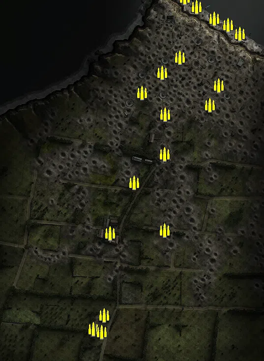
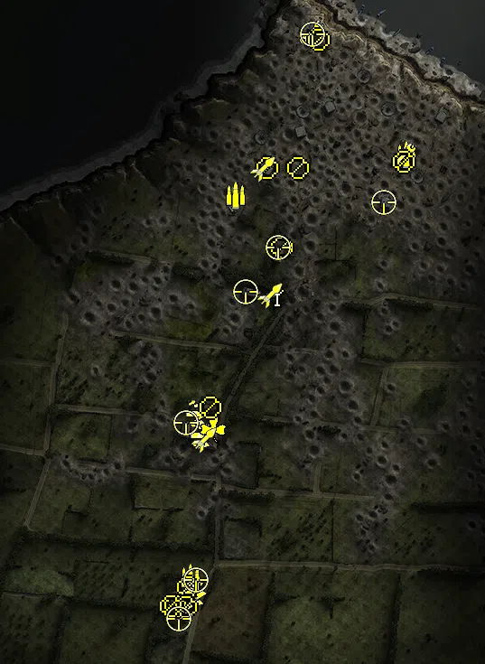
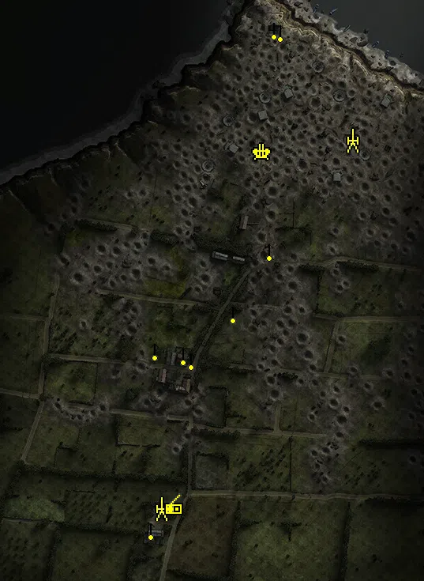
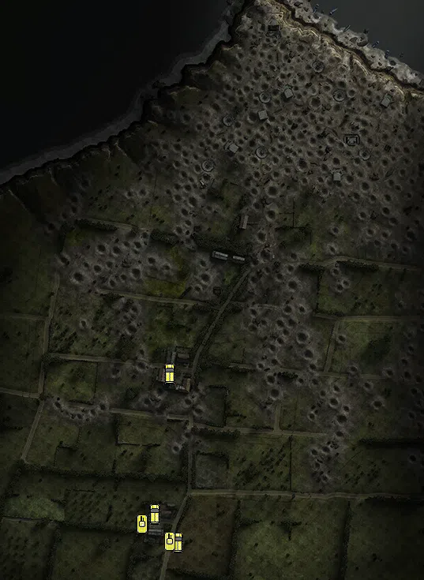

Static Ammo Crate

Pickup Kit

Static Emplacement

Vehicle

| gpo_subcat   | gpo_cat    | gpo_name                    |    pos_x |   pos_y |    pos_z |   flag | is_locked   |   team | instance                                         | gpo_cat_disp       | gpo_subcat_disp   |
|:-------------|:-----------|:----------------------------|---------:|--------:|---------:|-------:|:------------|-------:|:-------------------------------------------------|:-------------------|:------------------|
| ammo_crate   | ammo_crate | ammo_crate                  |    8.077 |  66.717 |  165.772 |      0 | False       |      0 | ammo_crate_0                                     | Static Ammo Crate  | Static Ammo Crate |
| ammo_crate   | ammo_crate | ammo_crate                  |  -27.549 |  68.804 |  135.379 |      0 | False       |      0 | ammo_crate_1                                     | Static Ammo Crate  | Static Ammo Crate |
| ammo_crate   | ammo_crate | ammo_crate                  |   69.153 |  72.608 |   69.048 |      0 | False       |      0 | ammo_crate_2                                     | Static Ammo Crate  | Static Ammo Crate |
| ammo_crate   | ammo_crate | ammo_crate                  |   87.403 |  68.166 |  108.916 |      0 | False       |      0 | ammo_crate_3                                     | Static Ammo Crate  | Static Ammo Crate |
| ammo_crate   | ammo_crate | ammo_crate                  |  -22.448 |  73.705 |   49.968 |      0 | False       |      0 | ammo_crate_4                                     | Static Ammo Crate  | Static Ammo Crate |
| ammo_crate   | ammo_crate | ammo_crate                  |  -69.133 |  70.803 |   93.833 |      0 | False       |      0 | ammo_crate_5                                     | Static Ammo Crate  | Static Ammo Crate |
| ammo_crate   | ammo_crate | ammo_crate                  |  -22.693 |  74.95  |  -30.739 |      0 | False       |      0 | ammo_crate_6                                     | Static Ammo Crate  | Static Ammo Crate |
| ammo_crate   | ammo_crate | ammo_crate                  |  -85.027 |  71.473 |  -88.664 |      0 | False       |      0 | ammo_crate_7                                     | Static Ammo Crate  | Static Ammo Crate |
| ammo_crate   | ammo_crate | ammo_crate                  |  -23.422 |  73.464 | -185.81  |      0 | False       |      0 | ammo_crate_8                                     | Static Ammo Crate  | Static Ammo Crate |
| ammo_crate   | ammo_crate | ammo_crate                  | -134.158 |  72.385 | -191.599 |      0 | False       |      0 | ammo_crate_9                                     | Static Ammo Crate  | Static Ammo Crate |
| ammo_crate   | ammo_crate | ammo_crate                  | -168.302 |  80.835 | -387.321 |      0 | False       |      0 | ammo_crate_10                                    | Static Ammo Crate  | Static Ammo Crate |
| ammo_crate   | ammo_crate | ammo_crate                  | -146.367 |  78.002 | -358.877 |      0 | False       |      0 | ammo_crate_11                                    | Static Ammo Crate  | Static Ammo Crate |
| ammo_crate   | ammo_crate | ammo_crate                  | -150.985 |  80.874 | -392.507 |      0 | False       |      0 | ammo_crate_12                                    | Static Ammo Crate  | Static Ammo Crate |
| ammo_crate   | ammo_crate | ammo_crate                  |   87.365 |  68.433 |  108.889 |      0 | False       |      0 | ammo_crate_13                                    | Static Ammo Crate  | Static Ammo Crate |
| ammo_crate   | ammo_crate | ammo_crate                  |  129.917 |   7.645 |  214.061 |      0 | False       |      0 | ammo_crate_14                                    | Static Ammo Crate  | Static Ammo Crate |
| ammo_crate   | ammo_crate | ammo_crate                  |  105.934 |   7.867 |  231.512 |      0 | False       |      0 | ammo_crate_15                                    | Static Ammo Crate  | Static Ammo Crate |
| ammo_crate   | ammo_crate | ammo_crate                  |   78     |   8.574 |  244.698 |      0 | False       |      0 | ammo_crate_16                                    | Static Ammo Crate  | Static Ammo Crate |
| ammo_crate   | ammo_crate | ammo_crate                  |   41.616 |   7.605 |  269.122 |      0 | False       |      0 | ammo_crate_17                                    | Static Ammo Crate  | Static Ammo Crate |
| ammo_crate   | ammo_crate | ammo_crate                  |   17.799 |   7.56  |  288.07  |      0 | False       |      0 | ammo_crate_18                                    | Static Ammo Crate  | Static Ammo Crate |
| ammo         | kit        | UW_PickUpAmmokit            |  -96.504 |  68.864 |   67.454 |    201 | False       |      0 | 32_OS_bunkers1_AmmoCrates                        | Pickup Kit         | Ammo Kit          |
| ammo         | kit        | UW_PickUpAmmokit            |   92.307 |  68.201 |  111.552 |    202 | False       |      0 | 32_OS_bunkers2_AmmoCrates                        | Pickup Kit         | Ammo Kit          |
| ammo         | kit        | GW_PickUpAmmokit            | -147.101 |  77.582 | -356.242 |    206 | False       |      0 | 32_OS_farm2_Ammokit                              | Pickup Kit         | Ammo Kit          |
| arty_dep     | kit        | UW_PickUpMortar             |  -51.695 |  72.339 |  -43.813 |    203 | False       |      0 | 32_OS_bunkers3_Mortar_1                          | Pickup Kit         | Deployable Arty   |
| assault      | kit        | GW_PickUpAssaultG43         | -162.205 |  81.351 | -389.022 |    206 | False       |      0 | 32_OS_farm2_DE_US_RifleAssault                   | Pickup Kit         | Assault Kit       |
| assault      | kit        | GW_PickUpAssaultG43         | -144.009 |  78.416 | -373.987 |    206 | False       |      0 | 32_OS_farm2_DE_US_RifleAssault_0                 | Pickup Kit         | Assault Kit       |
| assault      | kit        | GW_PickUpAssaultG43         | -142.955 |  78.416 | -374.078 |    206 | False       |      0 | 32_OS_farm2_DE_US_RifleAssault_1                 | Pickup Kit         | Assault Kit       |
| assault      | kit        | GW_PickUpAssaultG43         | -158.322 |  81.192 | -388.208 |    206 | False       |      0 | 32_OS_farm2_DE_US_RifleAssault_2                 | Pickup Kit         | Assault Kit       |
| assault      | kit        | GW_PickUpAssaultG43         | -136.167 |  73.085 | -198.535 |    205 | False       |      0 | 32_OS_farm1_DE_US_RifleAssault                   | Pickup Kit         | Assault Kit       |
| assault      | kit        | UW_PickUpAssaultM1Garand    | -141.387 |  73.869 | -174.804 |    205 | False       |      0 | 32_OS_farm1_DE_US_RifleAssault_0                 | Pickup Kit         | Assault Kit       |
| easteregg    | kit        | GW_PickUpFarmer             | -121.925 |  72.521 | -191.636 |    205 | False       |      0 | 32_OS_farm1_Shotgun                              | Pickup Kit         | Easteregg         |
| engineer     | kit        | UW_PickUpEngineerWinchester |   88.507 |  68.971 |  111.468 |    202 | False       |      0 | 32_OS_bunkers2_ShotgunUSA                        | Pickup Kit         | Engineer Kit      |
| engineer     | kit        | UW_PickUpEngineerWinchester |  -12.712 |  57.151 |  247.31  |    204 | False       |      0 | 32_OS_observationbunker_ShotgunUSA               | Pickup Kit         | Engineer Kit      |
| mg           | kit        | UW_PickUpSupportM1918BAR    |  -28.35  |  70.854 |   96.595 |    201 | False       |      0 | 32_OS_bunkers1_Support                           | Pickup Kit         | MG Kit            |
| mg           | kit        | UW_PickUpSupportM1918BAR    |  -45.647 |  76.376 |    8.549 |    203 | False       |      0 | 32_OS_bunkers3_Support                           | Pickup Kit         | MG Kit            |
| mg           | kit        | GW_PickUpSupportMG42        | -163.931 |  81.176 | -387.511 |    205 | False       |      0 | 32_OS_farm1_SupportGer                           | Pickup Kit         | MG Kit            |
| mg           | kit        | GW_PickUpSupportMG42        | -150.349 |  81.967 | -367.162 |    205 | False       |      0 | 32_OS_farm1_0                                    | Pickup Kit         | MG Kit            |
| mg           | kit        | GW_PickUpSupportMG42        | -125.194 |  76.696 | -168.235 |    205 | False       |      0 | 32_OS_farm1_DE_US_Support                        | Pickup Kit         | MG Kit            |
| mg_dep       | kit        | GW_PickUpMG42Lafette        |  -62.259 |  70.337 |   97.487 |    201 | False       |      0 | 32_OS_bunkers1_HSupport                          | Pickup Kit         | Deployable MG     |
| mg_dep       | kit        | GA_PickUpMG34Lafette        | -152.171 |  81.165 | -388.779 |    206 | False       |      0 | 32_OS_farm2_LafetteKit                           | Pickup Kit         | Deployable MG     |
| mg_dep       | kit        | GW_PickUpMG42Lafette        | -169.095 |  84.253 | -387.881 |    206 | False       |      0 | 32_OS_farm2_HSupport                             | Pickup Kit         | Deployable MG     |
| mg_dep       | kit        | UW_PickUp30Cal              |   -4.753 |  55.401 |  239.07  |    204 | False       |      0 | 32_OS_observationbunker_DE_US_HSupport           | Pickup Kit         | Deployable MG     |
| mg_dep       | kit        | UW_PickUp30Cal              |   89.397 |  68.176 |  103.52  |    202 | False       |      0 | 32_OS_bunkers2_DE_US_HSupport                    | Pickup Kit         | Deployable MG     |
| sniper       | kit        | UW_PickUpSniperSpringfield  |   67.418 |  72.52  |   59.376 |    202 | False       |      0 | 32_OS_bunkers2_Sniper                            | Pickup Kit         | Sniper Kit        |
| sniper       | kit        | UW_PickUpSniperSpringfield  |  -86.29  |  72.646 |  -39.623 |    203 | False       |      0 | 32_OS_bunkers3_Sniper2                           | Pickup Kit         | Sniper Kit        |
| sniper       | kit        | UW_PickUpSniperSpringfield  |  -49.56  |  76.743 |    8.861 |    203 | False       |      0 | 32_OS_bunkers3_Sniper                            | Pickup Kit         | Sniper Kit        |
| sniper       | kit        | UW_PickUpSniperSpringfield  |  -11.667 |  57.136 |  244.873 |    204 | False       |      0 | 32_OS_observationbunker_Sniper                   | Pickup Kit         | Sniper Kit        |
| sniper       | kit        | GW_PickUpSniperK98_GWood    | -152.19  |  76.769 | -184.506 |    205 | False       |      0 | 32_OS_farm1_Sniper                               | Pickup Kit         | Sniper Kit        |
| sniper       | kit        | GW_PickUp_K98hZf41          | -160.323 |  81.632 | -402.349 |    206 | False       |      0 | 32_OS_farm2_Sniper5                              | Pickup Kit         | Sniper Kit        |
| sniper       | kit        | GW_PickUpSniperK98_GWood    | -140.981 |  79.013 | -359.383 |    206 | False       |      0 | 32_OS_farm2_DE_US_Sniper                         | Pickup Kit         | Sniper Kit        |
| zooka        | kit        | UW_PickUpBazooka            | -132.187 |  73.063 | -203.918 |    205 | False       |      0 | 32_OS_farm1_DE_US_AT                             | Pickup Kit         | HEAT Thrower      |
| zooka        | kit        | UW_PickUpBazooka            |  -59.377 |  72.763 |  -44.203 |    203 | False       |      0 | 32_OS_bunkers3_DE_US_AT                          | Pickup Kit         | HEAT Thrower      |
| zooka        | kit        | UW_PickUpBazooka            |  -67.112 |  71.502 |   96.398 |    201 | False       |      0 | 32_OS_bunkers1_DE_US_AT                          | Pickup Kit         | HEAT Thrower      |
| noidea       | noidea     | commander_mortar_allied     |  225.76  |  73.383 | -215.351 |    206 | True        |      0 | 32_OS_farm2_DE_GB_CommMortar                     | FIXME UNASSIGNED   | FIXME UNASSIGNED  |
| noidea       | noidea     | commander_mortar_allied     |  226.521 |  73.445 | -208.992 |    206 | True        |      0 | 32_OS_farm2_DE_GB_CommMortar_0                   | FIXME UNASSIGNED   | FIXME UNASSIGNED  |
| noidea       | noidea     | commander_smoke_allied      |  225.961 |  73.395 | -212.105 |    206 | True        |      0 | 32_OS_farm2_DE_GB_CommSmoke                      | FIXME UNASSIGNED   | FIXME UNASSIGNED  |
| noidea       | noidea     | usair_c47_flyover           |  167.553 | 136.188 |  598.512 |    204 | False       |      0 | 32_OS_observationbunker_DE_US_LightbomberPlane   | FIXME UNASSIGNED   | FIXME UNASSIGNED  |
| noidea       | noidea     | usair_c47_flyover           |  214.467 | 126.933 |  626.902 |    204 | False       |      0 | 32_OS_observationbunker_DE_US_LightbomberPlane_0 | FIXME UNASSIGNED   | FIXME UNASSIGNED  |
| noidea       | noidea     | usair_c47_flyover           |  143.223 | 132.46  |  640.164 |    204 | False       |      0 | 32_OS_observationbunker_DE_US_LightbomberPlane_1 | FIXME UNASSIGNED   | FIXME UNASSIGNED  |
| noidea       | noidea     | p51d_flyover                |  229.576 | 108.988 |  763.712 |    204 | False       |      0 | 32_OS_bunkers3_DE_US_LightbomberPlane            | FIXME UNASSIGNED   | FIXME UNASSIGNED  |
| noidea       | noidea     | p51d_flyover                |  253.216 | 114.955 |  775.069 |    204 | False       |      0 | 32_OS_observationbunker_DE_US_LightbomberPlane_2 | FIXME UNASSIGNED   | FIXME UNASSIGNED  |
| arty         | static     | 81mm_mortar_m1              |   88.204 |  68.249 |  105.842 |    202 | False       |      0 | 32_OS_bunkers2_Mortar                            | Static Emplacement | Artillery         |
| arty         | static     | sgwr34_france               | -153.685 |  78.02  | -359.796 |    205 | False       |      0 | 32_OS_farm1_Mortar                               | Static Emplacement | Artillery         |
| flak         | static     | flakvierling38_france       |  -26.275 |  71.068 |   90.718 |    201 | False       |      0 | 32_OS_bunkers1_Vierling                          | Static Emplacement | Anti-aircraft Gun |
| mg_nest      | static     | mg42_bipod                  |  -17.323 |  75.966 |  -33.907 |    203 | False       |      0 | 32_OS_bunkers3_MG                                | Static Emplacement | Static MG         |
| mg_nest      | static     | mg34_bipod                  |  -63.186 |  73.332 | -113.361 |    203 | False       |      0 | 32_OS_bunkers3_MG2                               | Static Emplacement | Static MG         |
| mg_nest      | static     | mg34_bipod                  |   -3.108 |  57.733 |  242.765 |    204 | False       |      0 | 32_OS_observationbunker_MG2                      | Static Emplacement | Static MG         |
| mg_nest      | static     | mg42_bipod                  |  -10.544 |  53.494 |  245.612 |    204 | False       |      0 | 32_OS_observationbunker_MG                       | Static Emplacement | Static MG         |
| mg_nest      | static     | mg34_bipod                  | -162.41  |  73.194 | -159.646 |    205 | False       |      0 | 32_OS_farm1_MG                                   | Static Emplacement | Static MG         |
| mg_nest      | static     | mg34_bipod                  | -115.62  |  72.847 | -172.184 |    205 | False       |      0 | 32_OS_farm1_MG2                                  | Static Emplacement | Static MG         |
| mg_nest      | static     | mg42_bipod                  | -166.927 |  85.039 | -386.916 |    206 | False       |      0 | 32_OS_farm2_MG                                   | Static Emplacement | Static MG         |
| mg_nest      | static     | mg42_lafette                | -126.339 |  76.025 | -165.902 |    205 | False       |      0 | 32_OS_farm1_DE_GB_LightMG                        | Static Emplacement | Static MG         |
| radio        | static     | gercommradio                | -137.774 |  78.306 | -357.177 |    206 | False       |      0 | 32_OS_farm2_DE_GB_CommRadio                      | Static Emplacement | Radio             |
| apc          | vehicle    | sdkfz251_d                  | -143.376 |  72.436 | -189.55  |    205 | False       |      0 | 32_OS_farm1_CivilianTruck                        | Vehicle            | APC               |
| apc          | vehicle    | sdkfz251_d                  | -161.541 |  78.616 | -367.617 |    206 | False       |      0 | 32_OS_farm2_DE_US_ArmCar                         | Vehicle            | APC               |
| apc          | vehicle    | sdkfz251_d                  | -133.359 |  80.701 | -404.072 |    206 | False       |      0 | 32_OS_farm2_DE_US_ArmCar_0                       | Vehicle            | APC               |
| tank         | vehicle    | stug40_g                    | -142.854 |  79.47  | -403.264 |    206 | True        |      0 | 32_OS_farm2_DE_US_HeavyTank                      | Vehicle            | Tank              |
| tank         | vehicle    | stug40_g                    | -177.955 |  80.606 | -380.714 |    206 | True        |      0 | 32_OS_farm2_DE_US_HeavyTank_0                    | Vehicle            | Tank              |

