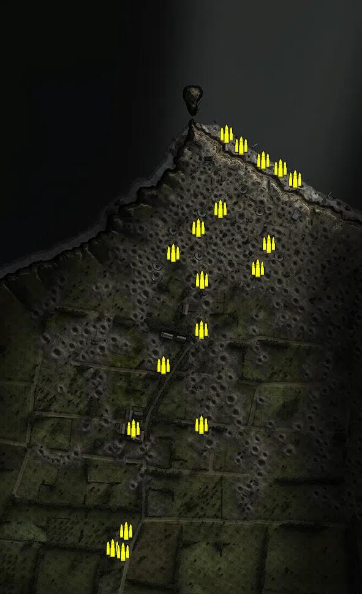
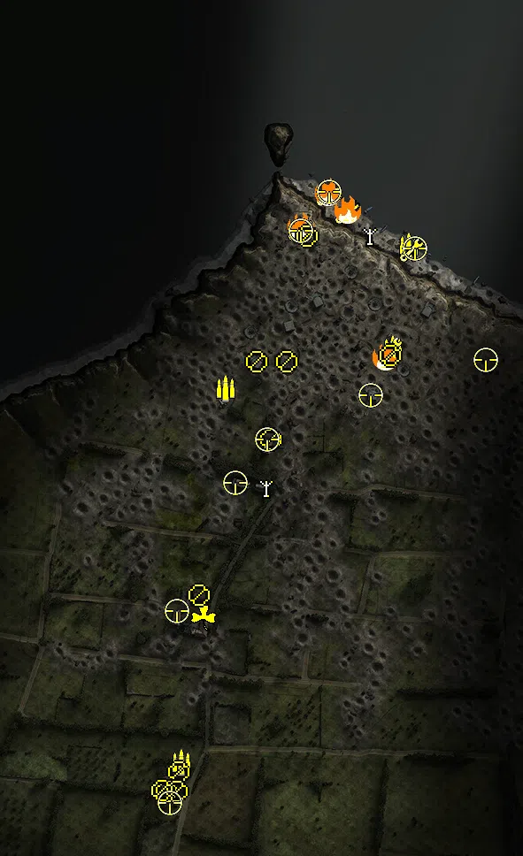
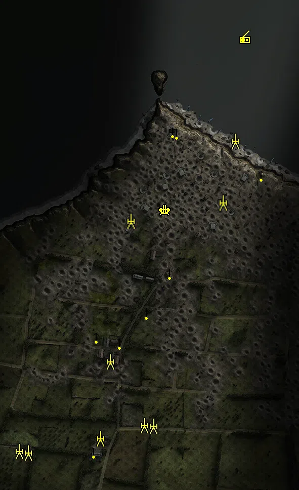
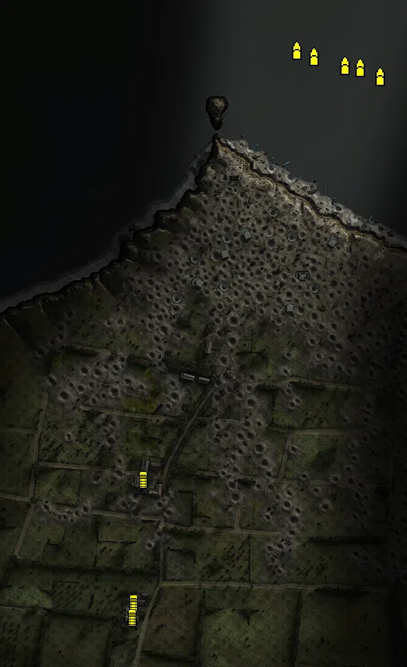

Static Ammo Crate

Pickup Kit

Static Emplacement

Vehicle

| Icon                        | SubCat            | Cat                | Name                            | Instance                                   |   Flag |    X Pos |   Y Pos |    Z Pos |
|:----------------------------|:------------------|:-------------------|:--------------------------------|:-------------------------------------------|-------:|---------:|--------:|---------:|
|       | Static Ammo Crate | Static Ammo Crate  | ammo_crate                      | ammo_crate_0                               |      0 |    8.077 |  66.717 |  165.772 |
|       | Static Ammo Crate | Static Ammo Crate  | ammo_crate                      | ammo_crate_1                               |      0 |  -27.549 |  68.804 |  135.379 |
|       | Static Ammo Crate | Static Ammo Crate  | ammo_crate                      | ammo_crate_2                               |      0 |   69.153 |  72.608 |   69.048 |
|       | Static Ammo Crate | Static Ammo Crate  | ammo_crate                      | ammo_crate_3                               |      0 |   87.403 |  68.166 |  108.916 |
|       | Static Ammo Crate | Static Ammo Crate  | ammo_crate                      | ammo_crate_4                               |      0 |  -22.448 |  73.705 |   49.968 |
|       | Static Ammo Crate | Static Ammo Crate  | ammo_crate                      | ammo_crate_5                               |      0 |  -69.133 |  70.803 |   93.833 |
|       | Static Ammo Crate | Static Ammo Crate  | ammo_crate                      | ammo_crate_6                               |      0 |  -22.693 |  74.950 |  -30.739 |
|       | Static Ammo Crate | Static Ammo Crate  | ammo_crate                      | ammo_crate_7                               |      0 |  -85.027 |  71.473 |  -88.664 |
|       | Static Ammo Crate | Static Ammo Crate  | ammo_crate                      | ammo_crate_8                               |      0 |  -23.422 |  73.464 | -185.810 |
|       | Static Ammo Crate | Static Ammo Crate  | ammo_crate                      | ammo_crate_9                               |      0 | -134.158 |  72.385 | -191.599 |
|       | Static Ammo Crate | Static Ammo Crate  | ammo_crate                      | ammo_crate_10                              |      0 | -168.302 |  80.835 | -387.321 |
|       | Static Ammo Crate | Static Ammo Crate  | ammo_crate                      | ammo_crate_11                              |      0 | -146.367 |  78.002 | -358.877 |
|       | Static Ammo Crate | Static Ammo Crate  | ammo_crate                      | ammo_crate_12                              |      0 | -150.985 |  80.874 | -392.507 |
|       | Static Ammo Crate | Static Ammo Crate  | ammo_crate                      | ammo_crate_13                              |      0 |   87.365 |  68.433 |  108.889 |
|       | Static Ammo Crate | Static Ammo Crate  | ammo_crate                      | ammo_crate_14                              |      0 |  129.917 |   7.645 |  214.061 |
|       | Static Ammo Crate | Static Ammo Crate  | ammo_crate                      | ammo_crate_15                              |      0 |  105.934 |   7.867 |  231.512 |
|       | Static Ammo Crate | Static Ammo Crate  | ammo_crate                      | ammo_crate_16                              |      0 |   78.000 |   8.574 |  244.698 |
|       | Static Ammo Crate | Static Ammo Crate  | ammo_crate                      | ammo_crate_17                              |      0 |   41.616 |   7.605 |  269.122 |
|       | Static Ammo Crate | Static Ammo Crate  | ammo_crate                      | ammo_crate_18                              |      0 |   17.799 |   7.560 |  288.070 |
|       | Ammo Kit          | Pickup Kit         | GW_PickUpAmmokit                | 64_OS_farm2_DE_Ammokit                     |    108 | -147.101 |  77.582 | -356.242 |
|       | Ammo Kit          | Pickup Kit         | UW_PickUpAmmokit                | 64_OS_Beachbase_DE_US_AmmoCrates           |    101 |  109.892 |   7.503 |  227.832 |
|       | Ammo Kit          | Pickup Kit         | UW_PickUpAmmokit                | 64_OS_bunkers2_DE_US_AmmoCrates            |    104 |   92.307 |  68.202 |  111.552 |
|       | Ammo Kit          | Pickup Kit         | UW_PickUpAmmokit                | 64_OS_bunkers1_DE_US_AmmoCrates            |      1 |  -96.504 |  68.864 |   67.454 |
|   | Deployable Arty   | Pickup Kit         | UW_PickUpMortar                 | 64_OS_bunkers3_DE_US_Mortar                |    105 |  -51.695 |  72.340 |  -43.813 |
|   | Deployable Arty   | Pickup Kit         | UW_PickUpMortar                 | 64_OS_Beachbase_DE_US_Mortar               |    101 |   65.217 |  10.200 |  240.567 |
|  | Easteregg         | Pickup Kit         | GW_PickUpFarmer                 | 64_OS_farm1_DE_US_Shotgun                  |    107 | -121.925 |  72.521 | -191.636 |
|   | Engineer Kit      | Pickup Kit         | UW_PickUpEngineerHook           | 64_OS_Beachbase_DE_US_HookCarbine          |    101 |   18.741 |   8.181 |  286.359 |
|   | Engineer Kit      | Pickup Kit         | UW_PickUpEngineerHook           | 64_OS_Beachbase_DE_US_HookCarbine_0        |    101 |   19.587 |   8.116 |  286.138 |
|   | Engineer Kit      | Pickup Kit         | UW_PickUpEngineerHook           | 64_OS_Beachbase_DE_US_HookCarbine_1        |    101 |   41.101 |   8.102 |  267.145 |
|   | Engineer Kit      | Pickup Kit         | UW_PickUpEngineerHook           | 64_OS_Beachbase_DE_US_HookCarbine_2        |    101 |   40.672 |   7.887 |  266.031 |
|   | Engineer Kit      | Pickup Kit         | UW_PickUpEngineerHook           | 64_OS_Beachbase_DE_US_HookCarbine_3        |    101 |  113.355 |   7.817 |  223.920 |
|   | Engineer Kit      | Pickup Kit         | UW_PickUpEngineerHook           | 64_OS_Beachbase_DE_US_HookCarbine_4        |    101 |  113.840 |   7.817 |  223.338 |
|   | Engineer Kit      | Pickup Kit         | UW_PickUpEngineerHook           | 64_OS_Beachbase_DE_US_HookCarbine_5        |    101 |   40.245 |   8.145 |  267.433 |
|   | Engineer Kit      | Pickup Kit         | UW_PickUpEngineerWinchesterHook | 64_OS_Beachbase_DE_US_HookShottie          |    101 |   18.893 |   8.159 |  285.538 |
|   | Engineer Kit      | Pickup Kit         | UW_PickUpEngineerWinchesterHook | 64_OS_Beachbase_DE_US_HookShottie_0        |    101 |   40.027 |   7.948 |  266.308 |
|   | Engineer Kit      | Pickup Kit         | UW_PickUpEngineerWinchesterHook | 64_OS_Beachbase_DE_US_HookShottie_1        |    101 |  113.373 |   7.815 |  223.115 |
|   | Engineer Kit      | Pickup Kit         | UW_PickUpEngineerWinchester     | 64_OS_observationbunker_DE_US_ShotgunUSA   |    106 |  -12.712 |  57.152 |  247.310 |
|   | Engineer Kit      | Pickup Kit         | UW_PickUpEngineerWinchester     | 64_OS_bunkers2_DE_US_ShotgunUSA            |    104 |   88.507 |  68.967 |  111.468 |
|      | Flamethrower Kit  | Pickup Kit         | UW_PickUpFlamethrower           | 64_OS_Beachbase_DE_US_Flamethrower         |    101 |   19.299 |   7.396 |  288.902 |
|      | Flamethrower Kit  | Pickup Kit         | UW_PickUpFlamethrower           | 64_OS_observationbunker_DE_US_Flamethrower |    101 |   40.912 |   7.853 |  268.519 |
|      | Flamethrower Kit  | Pickup Kit         | UW_PickUpFlamethrower           | 64_OS_observationbunker_ft                 |    106 |  -12.093 |  53.035 |  249.964 |
|      | Flamethrower Kit  | Pickup Kit         | UW_PickUpFlamethrower           | 64_OS_bunkers2_ft                          |    104 |   84.489 |  68.893 |  103.021 |
|         | MG Kit            | Pickup Kit         | UW_PickUpSupportM1918BAR        | 64_OS_bunkers3_DE_US_Support               |    105 |  -45.647 |  76.383 |    8.549 |
|         | MG Kit            | Pickup Kit         | UW_PickUpSupportM1918BAR        | 64_OS_bunkers1_DE_US_Support               |      1 |  -28.350 |  70.854 |   96.595 |
|         | MG Kit            | Pickup Kit         | GW_PickUpSupportMG42            | 64_OS_bunkers3_DE_US_SupportGer            |    105 | -126.807 |  75.842 | -166.554 |
|         | MG Kit            | Pickup Kit         | GW_PickUpSupportMG42            | 64_OS_farm1_DE_US_SupportGer               |    107 | -163.570 |  80.405 | -388.631 |
|         | MG Kit            | Pickup Kit         | GW_PickUpSupportMG42            | 64_OS_farm1_DE_US_SupportGer_0             |    107 | -150.349 |  81.967 | -367.162 |
|        | Deployable MG     | Pickup Kit         | GA_PickUpMG34Lafette            | 64_OS_farm2_DE_LafetteKit                  |    108 | -152.220 |  81.164 | -388.773 |
|        | Deployable MG     | Pickup Kit         | GW_PickUpMG42Lafette            | 64_OS_bunkers1_DE_US_HSupport              |      1 |  -62.259 |  70.335 |   97.487 |
|        | Deployable MG     | Pickup Kit         | GW_PickUpMG42Lafette            | 64_OS_farm2_DE_US_HSupport                 |    108 | -169.095 |  84.251 | -387.881 |
|        | Deployable MG     | Pickup Kit         | UW_PickUp30Cal                  | 64_OS_bunkers2_DE_US_HSupport              |    104 |   89.397 |  68.176 |  103.520 |
|        | Deployable MG     | Pickup Kit         | UW_PickUp30Cal                  | 64_OS_observationbunker_DE_US_HSupport     |    106 |   -4.753 |  55.401 |  239.070 |
|     | Sniper Kit        | Pickup Kit         | GW_PickUpSniperK98_GWood        | 64_OS_farm1_DE_Sniper                      |    107 | -152.190 |  76.768 | -184.506 |
|     | Sniper Kit        | Pickup Kit         | UW_PickUpSniperSpringfield      | 64_US_OS_Cliffs4_US_Sniper                 |    101 |  116.940 |   8.131 |  225.180 |
|     | Sniper Kit        | Pickup Kit         | UW_PickUpSniperSpringfield      | 64_US_OS_Cliffs1_US_Sniper                 |    101 |   20.491 |   7.632 |  288.956 |
|     | Sniper Kit        | Pickup Kit         | UW_PickUpSniperSpringfield      | 64_OS_observationbunker_US_Sniper          |    106 |  -11.667 |  57.142 |  244.873 |
|     | Sniper Kit        | Pickup Kit         | UW_PickUpSniperSpringfield      | 64_OS_bunkers2_US_Sniper                   |    104 |   67.418 |  72.529 |   59.376 |
|     | Sniper Kit        | Pickup Kit         | UW_PickUpSniperSpringfield      | 64_OS_bunkers3_US_Sniper2                  |    105 |  -86.305 |  72.649 |  -39.623 |
|     | Sniper Kit        | Pickup Kit         | UW_PickUpSniperSpringfield      | 64_OS_bunkers3_DE_US_Sniper                |    105 |  -49.560 |  76.741 |    8.861 |
|     | Sniper Kit        | Pickup Kit         | GW_PickUp_K98hZf41              | 64_OS_farm2_DE_US_Sniper5                  |    108 | -160.323 |  81.636 | -402.349 |
|     | Sniper Kit        | Pickup Kit         | UW_PickUpSniperSpringfield      | 64_OS_Cliffs3_sniper                       |    110 |  197.224 |  63.290 |   98.865 |
|       | FIXME UNASSIGNED  | FIXME UNASSIGNED   | commander_artillery_allied      | 64_OS_Beachbase_DE_GB_CommArtillery        |    101 |  282.371 |  74.944 | -108.319 |
|       | FIXME UNASSIGNED  | FIXME UNASSIGNED   | commander_artillery_allied      | 64_OS_Beachbase_DE_GB_CommArtillery_0      |    101 |  282.850 |  75.159 |  -98.453 |
|       | FIXME UNASSIGNED  | FIXME UNASSIGNED   | commander_artillery_allied      | 64_OS_Beachbase_DE_GB_CommArtillery_1      |    101 |  283.403 |  74.748 |  -90.032 |
|       | FIXME UNASSIGNED  | FIXME UNASSIGNED   | usair_c47_flyover               | 64_OS_Cliffs3_DE_US_LightbomberPlane       |    101 |  105.455 | 132.297 |  719.884 |
|       | FIXME UNASSIGNED  | FIXME UNASSIGNED   | usair_c47_flyover               | 64_OS_Beachbase_DE_US_LightbomberPlane     |    101 |  343.394 | 147.907 |  793.351 |
|       | FIXME UNASSIGNED  | FIXME UNASSIGNED   | usair_c47_damaged_flyover       | 64_OS_Beachbase_DE_US_LightbomberPlane_0   |    109 |  110.725 | 105.667 |  603.734 |
|       | FIXME UNASSIGNED  | FIXME UNASSIGNED   | usair_c47_flyover               | 64_OS_Beachbase_DE_US_LightbomberPlane_1   |    101 |  326.983 | 128.681 |  651.500 |
|       | FIXME UNASSIGNED  | FIXME UNASSIGNED   | usair_c47_flyover               | 64_OS_Beachbase_DE_US_LightbomberPlane_2   |    101 |  172.225 | 139.423 |  604.797 |
|       | FIXME UNASSIGNED  | FIXME UNASSIGNED   | usair_c47_flyover               | 64_OS_Beachbase_DE_US_LightbomberPlane_3   |    101 |  179.582 | 192.772 |  732.815 |
|       | FIXME UNASSIGNED  | FIXME UNASSIGNED   | usair_c47_flyover               | 64_OS_Beachbase_DE_US_LightbomberPlane_4   |    101 |  143.223 | 132.460 |  640.164 |
|       | FIXME UNASSIGNED  | FIXME UNASSIGNED   | usair_c47_flyover               | 64_OS_Beachbase_DE_US_LightbomberPlane_5   |    101 |  214.467 | 126.933 |  626.902 |
|       | FIXME UNASSIGNED  | FIXME UNASSIGNED   | usair_c47_flyover               | 64_OS_Beachbase_DE_US_LightbomberPlane_6   |    101 |  375.855 | 121.377 |  667.436 |
|       | FIXME UNASSIGNED  | FIXME UNASSIGNED   | usair_c47_damaged_flyover       | 64_OS_Beachbase_DE_US_LightbomberPlane_7   |    101 |  309.723 | 122.372 |  695.953 |
|       | FIXME UNASSIGNED  | FIXME UNASSIGNED   | p51d_flyover                    | 64_OS_Beachbase_DE_US_LightbomberPlane_8   |    109 |  229.576 | 108.988 |  763.712 |
|       | FIXME UNASSIGNED  | FIXME UNASSIGNED   | p51d_flyover                    | 64_OS_Beachbase_DE_US_LightbomberPlane_9   |    109 |  253.216 | 114.955 |  775.069 |
|       | Artillery         | Static Emplacement | sgwr34_france                   | 64_OS_bunkers3_DE2_Mortar                  |      1 | -134.883 |  75.982 | -208.380 |
|       | Artillery         | Static Emplacement | 81mm_mortar_m1                  | 64_OS_Beachbase_US_Mortar2                 |    101 |  112.557 |   7.337 |  227.503 |
|       | Artillery         | Static Emplacement | sgwr34_france                   | 64_OS_farm1_DE2_Mortar                     |    105 | -153.685 |  78.020 | -359.796 |
|       | Artillery         | Static Emplacement | 81mm_mortar_m1                  | 64_OS_bunkers2_US_Mortar                   |    104 |   88.204 |  68.249 |  105.842 |
|       | Artillery         | Static Emplacement | 81mm_mortar_m1                  | 64_OS_bunkers3_US_Mortar                   |    105 |  -94.349 |  68.360 |   70.141 |
|       | Artillery         | Static Emplacement | gpf_155mm                       | 64_OS_farm2_DE_GB_Howitzer                 |    115 | -296.894 |  77.471 | -388.073 |
|       | Artillery         | Static Emplacement | gpf_155mm                       | 64_OS_farm2_DE_GB_Howitzer_0               |    115 | -314.595 |  76.480 | -385.492 |
|       | Artillery         | Static Emplacement | gpf_155mm                       | 64_OS_farm2_DE_GB_Howitzer_1               |    115 |  -66.790 |  75.687 | -333.727 |
|       | Artillery         | Static Emplacement | gpf_155mm                       | 64_OS_farm2_DE_GB_Howitzer_2               |    115 |  -48.970 |  76.549 | -334.907 |
|       | Anti-aircraft Gun | Static Emplacement | flakvierling38_france           | 64_OS_bunkers1_DE_Vierling                 |      1 |  -26.275 |  71.068 |   90.718 |
|        | Static MG         | Static Emplacement | mg42_bipod                      | 64_OS_farm2_DE_US_MG                       |    108 | -166.927 |  85.028 | -386.916 |
|        | Static MG         | Static Emplacement | mg34_bipod                      | 64_OS_farm1_DE_US_MG                       |    107 | -162.410 |  73.194 | -159.646 |
|        | Static MG         | Static Emplacement | mg34_bipod                      | 64_OS_farm1_DE_US_MG2                      |    107 | -115.620 |  72.847 | -172.184 |
|        | Static MG         | Static Emplacement | mg42_bipod                      | 64_OS_bunkers3_DE_US_MG                    |    105 |  -17.323 |  75.966 |  -33.907 |
|        | Static MG         | Static Emplacement | mg34_bipod                      | 64_OS_bunkers3_DE_US_MG2                   |    105 |  -63.186 |  73.332 | -113.361 |
|        | Static MG         | Static Emplacement | mg34_bipod                      | 64_OS_bunkers2_DE_MG                       |    104 |  164.446 |  50.836 |  159.723 |
|        | Static MG         | Static Emplacement | mg34_bipod                      | 64_OS_observationbunker_MG2                |    106 |   -3.108 |  57.733 |  242.765 |
|        | Static MG         | Static Emplacement | mg42_bipod                      | 64_OS_observationbunker_MG                 |    106 |  -10.544 |  53.494 |  245.612 |
|      | Radio             | Static Emplacement | britcommradio                   | 64_OS_Beachbase_DE_GB_CommRadio            |    101 |  131.700 |  10.221 |  431.216 |
|        | Car               | Vehicle            | civcoupe_green                  | 64_OS_farm2_DE_CivilianCabrio              |    108 | -158.129 |  78.446 | -369.326 |
|        | Car               | Vehicle            | civtruck                        | 64_OS_farm1_DE_US_CivilianTruck            |    107 | -143.978 |  72.473 | -189.888 |
|        | Civilian Vehicle  | Vehicle            | redtractor                      | 64_OS_farm2_DE_Tractor                     |    108 | -160.259 |  80.419 | -389.915 |
|       | Ship              | Vehicle            | landingcraftassault             | 64_OS_Beachbase_DE_US_TransportBoat        |    101 |  201.358 |   7.365 |  394.967 |
|       | Ship              | Vehicle            | landingcraftassault             | 64_OS_Beachbase_DE_US_TransportBoat_0      |    101 |  172.072 |   7.356 |  408.007 |
|       | Ship              | Vehicle            | landingcraftassault             | 64_OS_Beachbase_DE_US_TransportBoat_1      |    101 |  149.656 |   7.369 |  411.418 |
|       | Ship              | Vehicle            | landingcraftassault             | 64_OS_Beachbase_DE_US_TransportBoat_2      |    101 |  105.113 |   7.416 |  424.304 |
|       | Ship              | Vehicle            | landingcraftassault             | 64_OS_Beachbase_DE_US_TransportBoat_3      |    101 |   80.380 |   7.377 |  433.389 |

