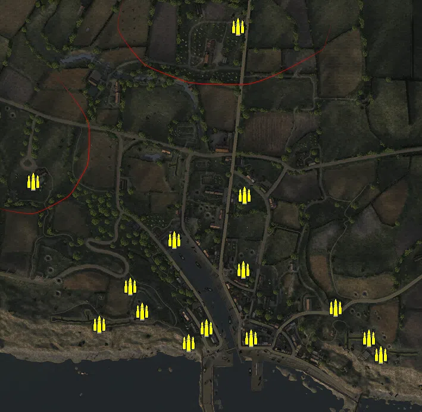
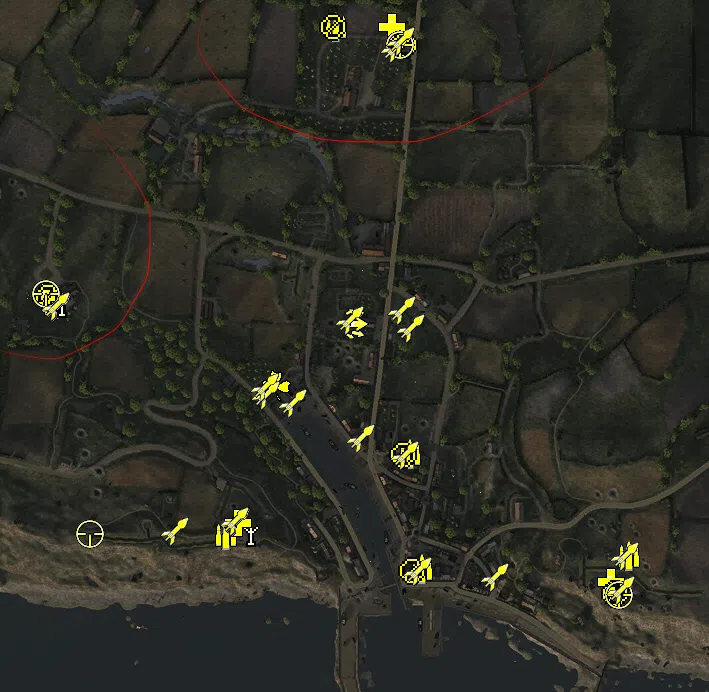
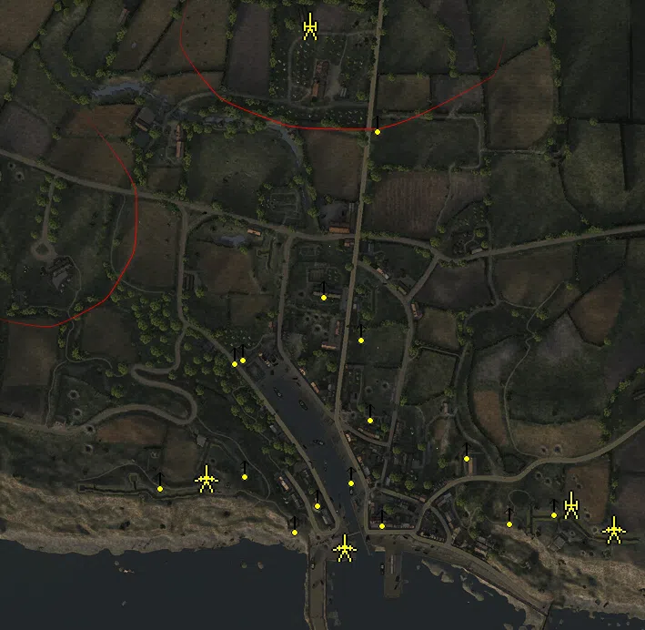
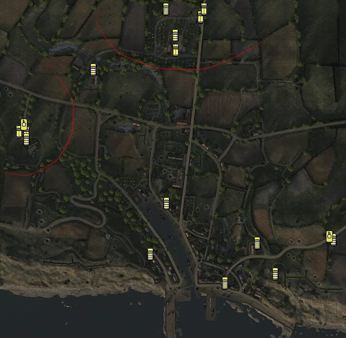

Static Ammo Crate

Pickup Kit

Static Emplacement

Vehicle

| gpo_subcat   | gpo_cat    | gpo_name                        |    pos_x |   pos_y |    pos_z |   flag | is_locked   |   team | instance                                 | gpo_cat_disp       | gpo_subcat_disp   |
|:-------------|:-----------|:--------------------------------|---------:|--------:|---------:|-------:|:------------|-------:|:-----------------------------------------|:-------------------|:------------------|
| ammo_crate   | ammo_crate | ammo_crate                      |  168.39  |  12.504 |  -83.865 |      0 | False       |      0 | ammo_crate_0                             | Static Ammo Crate  | Static Ammo Crate |
| ammo_crate   | ammo_crate | ammo_crate                      |  170.036 |  11.208 |   40.843 |      0 | False       |      0 | ammo_crate_1                             | Static Ammo Crate  | Static Ammo Crate |
| ammo_crate   | ammo_crate | ammo_crate                      |  180.618 |  12.954 | -199.348 |      0 | False       |      0 | ammo_crate_2                             | Static Ammo Crate  | Static Ammo Crate |
| ammo_crate   | ammo_crate | ammo_crate                      |   75.736 |  20.49  | -207.125 |      0 | False       |      0 | ammo_crate_3                             | Static Ammo Crate  | Static Ammo Crate |
| ammo_crate   | ammo_crate | ammo_crate                      |   -2.084 |  32.042 | -153.958 |      0 | False       |      0 | ammo_crate_4                             | Static Ammo Crate  | Static Ammo Crate |
| ammo_crate   | ammo_crate | ammo_crate                      |  -74.341 |  33.006 | -175.589 |      0 | False       |      0 | ammo_crate_5                             | Static Ammo Crate  | Static Ammo Crate |
| ammo_crate   | ammo_crate | ammo_crate                      | -184.776 |  14.171 |   64.296 |      0 | False       |      0 | ammo_crate_6                             | Static Ammo Crate  | Static Ammo Crate |
| ammo_crate   | ammo_crate | ammo_crate                      |  378.681 |  31.282 | -199.211 |      0 | False       |      0 | ammo_crate_7                             | Static Ammo Crate  | Static Ammo Crate |
| ammo_crate   | ammo_crate | ammo_crate                      |  322.9   |  28.515 | -148.22  |      0 | False       |      0 | ammo_crate_8                             | Static Ammo Crate  | Static Ammo Crate |
| ammo_crate   | ammo_crate | ammo_crate                      |  -21.636 |  25.475 | -111.925 |      0 | False       |      0 | ammo_crate_9                             | Static Ammo Crate  | Static Ammo Crate |
| ammo_crate   | ammo_crate | ammo_crate                      |  159.915 |  12.481 |  324.001 |      0 | False       |      0 | ammo_crate_10                            | Static Ammo Crate  | Static Ammo Crate |
| ammo_crate   | ammo_crate | ammo_crate                      |  159.308 |  12.167 |  323.668 |      0 | False       |      0 | ammo_crate_11                            | Static Ammo Crate  | Static Ammo Crate |
| ammo_crate   | ammo_crate | ammo_crate                      |  399.487 |  35.187 | -227.132 |      0 | False       |      0 | ammo_crate_12                            | Static Ammo Crate  | Static Ammo Crate |
| ammo_crate   | ammo_crate | ammo_crate                      |  106.36  |  15.978 | -181.696 |      0 | False       |      0 | ammo_crate_13                            | Static Ammo Crate  | Static Ammo Crate |
| ammo_crate   | ammo_crate | ammo_crate                      |   52.324 |  12.358 |  -33.806 |      0 | False       |      0 | ammo_crate_14                            | Static Ammo Crate  | Static Ammo Crate |
| ammo         | kit        | BW_PickUpAmmokit                |   95.33  |  12.127 |  342.436 |    302 | False       |      0 | cq64_roadtoescures_DE_GB_Ammo            | Pickup Kit         | Ammo Kit          |
| ammo         | kit        | BW_PickUpAmmokit                | -185.579 |  14.149 |   65.26  |    301 | False       |      0 | cq64_roadtocommes_DE_GB_Ammo             | Pickup Kit         | Ammo Kit          |
| ammo         | kit        | BW_PickUpAmmokit                |  169.198 |  12.514 |  -85.077 |    305 | False       |      0 | cq64_outskirts_DE_GB_Ammo                | Pickup Kit         | Ammo Kit          |
| ammo         | kit        | BW_PickUpAmmokit                |  181.257 |  13.456 | -199.529 |    306 | False       |      0 | cq64_portenbessin_DE_GB_Ammo             | Pickup Kit         | Ammo Kit          |
| ammo         | kit        | BW_PickUpAmmokit                |  388.086 |  31.43  | -187.428 |    308 | False       |      0 | cq64_wn57_DE_GB_Ammo                     | Pickup Kit         | Ammo Kit          |
| ammo         | kit        | BW_PickUpAmmokit                |  -14.686 |  32.536 | -165.712 |    307 | False       |      0 | cq64_wn56_DE_GB_Ammo                     | Pickup Kit         | Ammo Kit          |
| arty_dep     | kit        | BA_PickUpMortar                 | -179.53  |  14.628 |   65.216 |    301 | False       |      0 | cq64_roadtocommes_DE_GB_Mortar           | Pickup Kit         | Deployable Arty   |
| arty_dep     | kit        | GW_PickUpMortar                 |    9.013 |  31.576 | -163.905 |    307 | False       |      0 | cq64_wn56_DE_GB_Mortar                   | Pickup Kit         | Deployable Arty   |
| assault      | kit        | BW_PickUpAssault                |  112.708 |  15.228 |   45.342 |    303 | False       |      0 | cq64_church_DE_GB_Assault                | Pickup Kit         | Assault Kit       |
| easteregg    | kit        | GW_PickUpFarmer                 |   34.502 |  12.355 |  -17.36  |    304 | False       |      0 | cq64_shipyard_DE_GB_Sniper2              | Pickup Kit         | Easteregg         |
| medic        | kit        | BA_PickUpMedicWebley            |  151.25  |  13.097 |  342.034 |    302 | False       |      0 | cq64_roadtoescures_DE_GB_Medic           | Pickup Kit         | Medic Kit         |
| medic        | kit        | BA_PickUpMedicWebley            | -194.932 |  13.104 |   71.818 |    301 | False       |      0 | cq64_roadtocommes_DE_GB_Medic            | Pickup Kit         | Medic Kit         |
| medic        | kit        | BA_PickUpMedicWebley            |  370.022 |  34.264 | -213.304 |    308 | False       |      0 | cq64_wn57_DE_GB_Medic                    | Pickup Kit         | Medic Kit         |
| medic        | kit        | BA_PickUpMedicWebley            |   -3.203 |  32.048 | -153.872 |    307 | False       |      0 | cq64_wn56_DE_GB_Medic                    | Pickup Kit         | Medic Kit         |
| mg           | kit        | BW_PickUpSupportBrenMK2         |   91.991 |  12.632 |  341.917 |    302 | False       |      0 | cq64_roadtoescures_DE_GB_SupportMG42     | Pickup Kit         | MG Kit            |
| mg           | kit        | BW_PickUpSupportBrenMK2         | -192.988 |  12.875 |   71.937 |    301 | False       |      0 | cq64_roadtocommes_DE_GB_SupportMG42      | Pickup Kit         | MG Kit            |
| mg           | kit        | BW_PickUpSupportBrenMK2         |  162.339 |  12.347 |  -85.652 |    305 | False       |      0 | cq64_outskirts_DE_GB_SupportMG42         | Pickup Kit         | MG Kit            |
| mg           | kit        | BW_PickUpSupportBrenMK2         |  171.496 |  16.092 | -202.033 |    306 | False       |      0 | cq64_portenbessin_DE_GB_SupportMG42      | Pickup Kit         | MG Kit            |
| mg_dep       | kit        | BA_PickUpVickers303             |  162.705 |  12.609 |  324.237 |    302 | False       |      0 | cq64_roadtoescures_DE_GB_DepMG           | Pickup Kit         | Deployable MG     |
| mg_dep       | kit        | GW_PickUpMG42Lafette            |  373.983 |  32.259 | -225.407 |    308 | False       |      0 | cq64_wn57_DE_GB_DepMG                    | Pickup Kit         | Deployable MG     |
| sniper       | kit        | BW_PickUpSniperNo4_colt         |  159.345 |  12.407 |  323.693 |    302 | False       |      0 | cq64_roadtoescures_DE_GB_Sniper          | Pickup Kit         | Sniper Kit        |
| sniper       | kit        | BW_PickUpSniperNo4_colt         | -194.75  |  13.135 |   75.467 |    301 | False       |      0 | cq64_roadtocommes_DE_GB_Sniper           | Pickup Kit         | Sniper Kit        |
| sniper       | kit        | BW_PickUpSniperNo4_colt         |  377.57  |  32.312 | -225.982 |    308 | False       |      0 | cq64_wn57_DE_GB_Sniper                   | Pickup Kit         | Sniper Kit        |
| sniper       | kit        | GW_PickUpSniperg43_ZF           | -151.274 |  31.264 | -165.116 |    307 | False       |      0 | cq64_wn56_DE_GB_Sniper                   | Pickup Kit         | Sniper Kit        |
| zooka        | kit        | BW_PickUpAntitankPiat_colt      |  153.77  |  12.535 |  320.682 |    302 | False       |      0 | cq64_roadtoescures_DE_GB_AntitankFaust   | Pickup Kit         | HEAT Thrower      |
| zooka        | kit        | BW_PickUpAntitankPiat_colt      |  160.059 |  13.084 |  327.779 |    302 | False       |      0 | cq64_roadtoescures_DE_GB_AntitankFaust_0 | Pickup Kit         | HEAT Thrower      |
| zooka        | kit        | BW_PickUpAntitankPiat_colt      | -183.929 |  14.29  |   61.907 |    301 | False       |      0 | cq64_roadtocommes_DE_GB_AntitankFaust    | Pickup Kit         | HEAT Thrower      |
| zooka        | kit        | BW_PickUpAntitankPiat_colt      | -184.667 |  14.905 |   63.261 |    301 | False       |      0 | cq64_roadtocommes_DE_GB_AntitankFaust_0  | Pickup Kit         | HEAT Thrower      |
| zooka        | kit        | BW_PickUpAntitankPiat_colt      |  109.236 |  14.442 |   48.716 |    303 | False       |      0 | cq64_church_DE_GB_AntitankFaust          | Pickup Kit         | HEAT Thrower      |
| zooka        | kit        | GW_PickUpPanzerfaust30m         |  170.07  |  11.453 |   40.807 |    303 | False       |      0 | cq64_church_DE_GB_AntitankFaust_0        | Pickup Kit         | HEAT Thrower      |
| zooka        | kit        | BW_PickUpAntitankPiat_colt      |   25.329 |  13.268 |  -25.963 |    304 | False       |      0 | cq64_shipyard_DE_GB_AntitankFaust        | Pickup Kit         | HEAT Thrower      |
| zooka        | kit        | GW_PickUpPanzerfaust30m         |   52.391 |  12.602 |  -33.824 |    304 | False       |      0 | cq64_shipyard_DE_GB_AntitankFaust_0      | Pickup Kit         | HEAT Thrower      |
| zooka        | kit        | BW_PickUpAntitankPiat_colt      |  164.286 |  12.442 |  -85.814 |    305 | False       |      0 | cq64_outskirts_DE_GB_AntitankFaust       | Pickup Kit         | HEAT Thrower      |
| zooka        | kit        | BW_PickUpAntitankPiat_colt      |  120.274 |  13.152 |  -68.745 |    305 | False       |      0 | cq64_outskirts_DE_GB_AntitankFaust_0     | Pickup Kit         | HEAT Thrower      |
| zooka        | kit        | BW_PickUpAntitankPiat_colt      |  253.668 |  15.29  | -207.763 |    306 | False       |      0 | cq64_portenbessin_DE_GB_AntitankFaust    | Pickup Kit         | HEAT Thrower      |
| zooka        | kit        | BW_PickUpAntitankPiat_colt      |  176.92  |  14.135 | -202.235 |    306 | False       |      0 | cq64_portenbessin_DE_GB_AntitankFaust_0  | Pickup Kit         | HEAT Thrower      |
| zooka        | kit        | BW_PickUpAntitankPiat_colt      |  380.333 |  34.155 | -221.407 |    308 | False       |      0 | cq64_wn57_DE_GB_AntitankFaust            | Pickup Kit         | HEAT Thrower      |
| zooka        | kit        | BW_PickUpAntitankPiat_colt      |  384.034 |  31.404 | -187.114 |    308 | False       |      0 | cq64_wn57_DE_GB_AntitankFaust_0          | Pickup Kit         | HEAT Thrower      |
| zooka        | kit        | BW_PickUpAntitankPiat_colt      |   -5.265 |  32.032 | -153.417 |    307 | False       |      0 | cq64_wn56_DE_GB_AntitankFaust            | Pickup Kit         | HEAT Thrower      |
| zooka        | kit        | BW_PickUpAntitankPiat_colt      |  -65.549 |  32.98  | -162.167 |    307 | False       |      0 | cq64_wn56_DE_GB_AntitankFaust_0          | Pickup Kit         | HEAT Thrower      |
| zooka        | kit        | GW_PickUpPanzerschreck          |   -6.356 |  32.194 | -152.085 |    307 | False       |      0 | cq64_wn56_schreck                        | Pickup Kit         | HEAT Thrower      |
| zooka        | kit        | GW_PickUpPanzerschreck          |   24.148 |  12.635 |  -17.523 |    304 | False       |      0 | cq64_shipyard_schreck                    | Pickup Kit         | HEAT Thrower      |
| zooka        | kit        | GW_PickUpPanzerschreck          |  160.768 |  11.506 |   59.41  |    303 | False       |      0 | cq64_church_schreck                      | Pickup Kit         | HEAT Thrower      |
| noidea       | noidea     | typhoon_mk1b_late_flyover       |  170.614 |  75.065 | -516.979 |    301 | False       |      0 | cq64_roadtocommes_flyover                | FIXME UNASSIGNED   | FIXME UNASSIGNED  |
| noidea       | noidea     | typhoon_mk1b_late_flyover       |  190.939 |  85.524 | -519.698 |    301 | False       |      0 | cq64_roadtocommes_flyover_0              | FIXME UNASSIGNED   | FIXME UNASSIGNED  |
| noidea       | noidea     | typhoon_mk1b_late_flyover       | -459.126 |  56.798 | -292.055 |    301 | False       |      0 | cq64_roadtocommes_flyover_1              | FIXME UNASSIGNED   | FIXME UNASSIGNED  |
| noidea       | noidea     | typhoon_mk1b_late_flyover       | -478.686 |  51.381 | -276.149 |    301 | False       |      0 | cq64_roadtocommes_flyover_2              | FIXME UNASSIGNED   | FIXME UNASSIGNED  |
| arty         | static     | 3inchmortar                     |   98.92  |  12.223 |  341.253 |    302 | False       |      0 | cq64_roadtoescures_3inch                 | Static Emplacement | Artillery         |
| arty         | static     | sgwr34_france                   |  386.121 |  31.735 | -185.338 |    308 | False       |      0 | cq64_wn57_sgwr34                         | Static Emplacement | Artillery         |
| mg_nest      | static     | mg42_bipod                      |  368.175 |  34.081 | -187.32  |    308 | False       |      0 | cq64_wn57_mg42                           | Static Emplacement | Static MG         |
| mg_nest      | static     | mg34_bipod                      |  -65.092 |  33.745 | -157.914 |    307 | False       |      0 | cq64_wn56_mg34                           | Static Emplacement | Static MG         |
| mg_nest      | static     | mg42_bipod                      |   28.032 |  28.88  | -145.279 |    307 | False       |      0 | cq64_wn56_mg42                           | Static Emplacement | Static MG         |
| mg_nest      | static     | mg34_bipod                      |   82.955 |  21.728 | -205.66  |    307 | False       |      0 | cq64_wn56_mg34_0                         | Static Emplacement | Static MG         |
| mg_nest      | static     | mg34_bipod                      |  318.516 |  31.854 | -196.97  |    308 | False       |      0 | cq64_wn57_mg34                           | Static Emplacement | Static MG         |
| mg_nest      | static     | mg34_bipod                      |  272.276 |  25.861 | -125.065 |    308 | False       |      0 | cq64_wn57_mg34_0                         | Static Emplacement | Static MG         |
| mg_nest      | static     | mg42_bipod                      |  179.393 |  17.035 | -198.674 |    306 | False       |      0 | cq64_portenbessin_mg42                   | Static Emplacement | Static MG         |
| mg_nest      | static     | mg34_bipod                      |  107.831 |  16.87  | -176.79  |    306 | False       |      0 | cq64_portenbessin_mg34                   | Static Emplacement | Static MG         |
| mg_nest      | static     | mg34_bipod                      |  144.951 |  13.141 | -152.273 |    306 | False       |      0 | cq64_portenbessin_mg34_0                 | Static Emplacement | Static MG         |
| mg_nest      | static     | mg42_lafette                    |  165.953 |  12.704 |  -82.995 |    305 | False       |      0 | cq64_outskirts_mg42                      | Static Emplacement | Static MG         |
| mg_nest      | static     | mg42_bipod                      |  173.945 |  13.545 |  234.227 |    302 | False       |      0 | cq64_roadtoescures_mg42                  | Static Emplacement | Static MG         |
| mg_nest      | static     | mg42_bipod                      |  115.341 |  25.546 |   52.208 |    303 | False       |      0 | cq64_church_mg42                         | Static Emplacement | Static MG         |
| mg_nest      | static     | mg34_bipod                      |  156.23  |  12.541 |    5.117 |    303 | False       |      0 | cq64_church_mg34                         | Static Emplacement | Static MG         |
| mg_nest      | static     | mg42_bipod                      |   17.085 |  13.286 |  -20.988 |    304 | False       |      0 | cq64_shipyard_mg42                       | Static Emplacement | Static MG         |
| mg_nest      | static     | mg34_bipod                      |   26.414 |  16.396 |  -17.087 |    304 | False       |      0 | cq64_shipyard_mg34                       | Static Emplacement | Static MG         |
| pak          | static     | kwk_5cm_fr                      |  433.475 |  39.13  | -212.111 |    308 | False       |      0 | cq64_wn57_kwk5                           | Static Emplacement | Anti-tank Gun     |
| pak          | static     | kwk_5cm_fr                      |  -15.008 |  32.431 | -155.721 |    307 | False       |      0 | cq64_wn56_kwk5                           | Static Emplacement | Anti-tank Gun     |
| pak          | static     | kwk_5cm_fr                      |  136.723 |  11.909 | -231.676 |    306 | False       |      0 | cq64_portenbessin_kwk5                   | Static Emplacement | Anti-tank Gun     |
| radio        | static     | gercommradio                    |  178.373 |  16.319 | -200.985 |    306 | False       |      0 | cq64_portenbessin_commradio              | Static Emplacement | Radio             |
| apc          | vehicle    | universalcarrier_france_bren    | -187.41  |  12.213 |   98.353 |    301 | True        |      0 | cq64_roadtocommes_universalcarrier       | Vehicle            | APC               |
| apc          | vehicle    | universalcarrier_france_bren    |  169.922 |  12.831 |  335.07  |    302 | True        |      0 | cq64_roadtoescures_universalcarrier      | Vehicle            | APC               |
| apc          | vehicle    | universalcarrier_france_vickers | -201.51  |  12.328 |   99.888 |    301 | True        |      0 | cq64_roadtocommes_universalcarrier_0     | Vehicle            | APC               |
| apc          | vehicle    | universalcarrier_france_vickers |  119.012 |  12.791 |  266.529 |    302 | True        |      0 | cq64_roadtoescures_universalcarrier_0    | Vehicle            | APC               |
| apc          | vehicle    | universalcarrier_wasp           |  176.633 |  13.029 |  350.653 |    302 | True        |      0 | cq64_roadtoescures_uc_wasp               | Vehicle            | APC               |
| car          | vehicle    | citroen_11cv_peach              | -187.304 |  12.355 |   83.531 |    301 | False       |      0 | cq64_roadtocommes_citroen                | Vehicle            | Car               |
| car          | vehicle    | civtruck                        |  118.258 |  13.388 |  297.175 |    302 | False       |      0 | cq64_roadtoescures_civtruck              | Vehicle            | Car               |
| car          | vehicle    | civtruck                        |  285.544 |  25.077 | -128.464 |    308 | False       |      0 | cq64_wn57_civtruck                       | Vehicle            | Car               |
| car          | vehicle    | fiat626_ard                     |  441.512 |  32.402 | -120.91  |    308 | False       |      0 | cq64_wn57_truck                          | Vehicle            | Car               |
| car          | vehicle    | citroen_11cv_peach              |  219.728 |  12.503 | -209.697 |    306 | False       |      0 | cq64_portenbessin_citroen                | Vehicle            | Car               |
| car          | vehicle    | civtruck                        |  100.292 |  12.439 |  -47.213 |    305 | False       |      0 | cq64_outskirts_civtruck                  | Vehicle            | Car               |
| civilian     | vehicle    | rideable_bicycle                |   99.406 |  11.846 |  350.816 |    302 | False       |      0 | cq64_roadtoescures_bicycle               | Vehicle            | Civilian Vehicle  |
| civilian     | vehicle    | rideable_bicycle                |  -49.65  |  11.487 |  226.707 |    301 | False       |      0 | cq64_roadtocommes_bicycle                | Vehicle            | Civilian Vehicle  |
| civilian     | vehicle    | rideable_bicycle                |  322.511 |  30.87  | -191.232 |    308 | False       |      0 | cq64_wn57_bicycle                        | Vehicle            | Civilian Vehicle  |
| civilian     | vehicle    | rideable_bicycle                |   67.045 |  18.025 | -151.339 |    307 | False       |      0 | cq64_wn56_bicycle                        | Vehicle            | Civilian Vehicle  |
| tank         | vehicle    | marder_iii_m                    |  434.406 |  32.06  | -114.847 |    308 | True        |      0 | cq64_wn57_stug                           | Vehicle            | Tank              |
| tank         | vehicle    | sherman_v_mid                   | -192.231 |  12.053 |  114.378 |    301 | True        |      0 | cq64_roadtocommes_sherman                | Vehicle            | Tank              |

