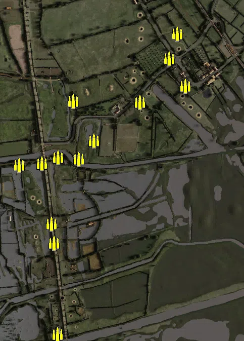
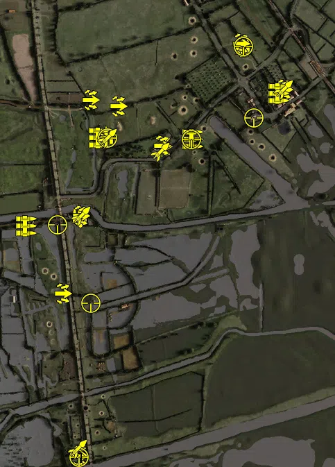
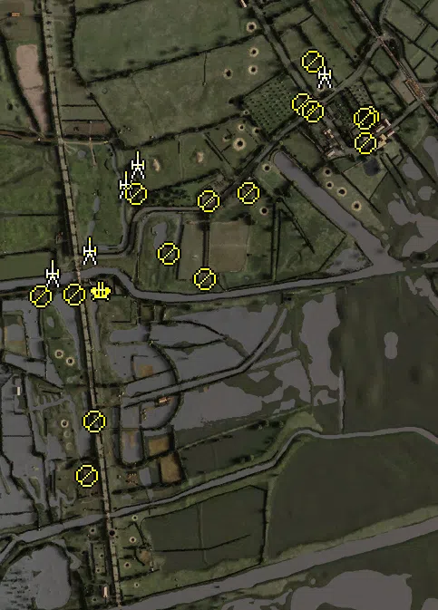
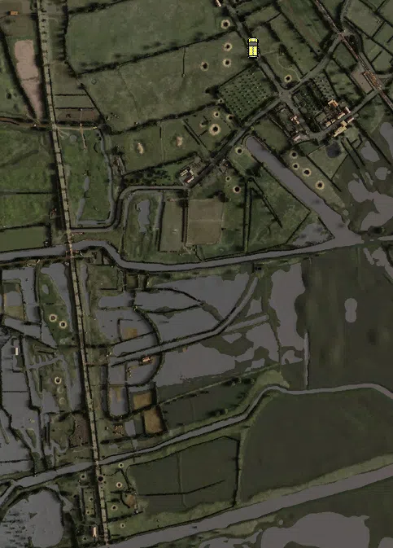

Static Ammo Crate

Pickup Kit

Static Emplacement

Vehicle

| Icon                       | SubCat            | Cat                | Name                       | Instance                          |   Flag |    X Pos |   Y Pos |    Z Pos |
|:---------------------------|:------------------|:-------------------|:---------------------------|:----------------------------------|-------:|---------:|--------:|---------:|
|      | Static Ammo Crate | Static Ammo Crate  | ammo_crate                 | ammo_crate_0                      |      0 | -174.279 |  86.307 | -599.381 |
|      | Static Ammo Crate | Static Ammo Crate  | ammo_crate                 | ammo_crate_1                      |      0 |  268.327 |  93.412 |  488.464 |
|      | Static Ammo Crate | Static Ammo Crate  | ammo_crate                 | ammo_crate_2                      |      0 |  299.326 |  92.858 |  585.177 |
|      | Static Ammo Crate | Static Ammo Crate  | ammo_crate                 | ammo_crate_3                      |      0 |  331.568 |  93.320 |  379.612 |
|      | Static Ammo Crate | Static Ammo Crate  | ammo_crate                 | ammo_crate_4                      |      0 |  -29.116 |  87.660 |  163.428 |
|      | Static Ammo Crate | Static Ammo Crate  | ammo_crate                 | ammo_crate_5                      |      0 |  -90.886 |  87.089 |   92.650 |
|      | Static Ammo Crate | Static Ammo Crate  | ammo_crate                 | ammo_crate_6                      |      0 | -171.858 |  85.439 |   98.597 |
|      | Static Ammo Crate | Static Ammo Crate  | ammo_crate                 | ammo_crate_7                      |      0 | -326.444 |  86.095 |   68.101 |
|      | Static Ammo Crate | Static Ammo Crate  | ammo_crate                 | ammo_crate_8                      |      0 | -198.328 |  88.355 | -163.564 |
|      | Static Ammo Crate | Static Ammo Crate  | ammo_crate                 | ammo_crate_9                      |      0 | -187.725 |  88.385 | -240.200 |
|      | Static Ammo Crate | Static Ammo Crate  | ammo_crate                 | ammo_crate_10                     |      0 | -235.585 |  86.367 |   73.866 |
|      | Static Ammo Crate | Static Ammo Crate  | ammo_crate                 | ammo_crate_11                     |      0 | -112.329 |  87.183 |  320.458 |
|      | Static Ammo Crate | Static Ammo Crate  | ammo_crate                 | ammo_crate_12                     |      0 |  152.953 |  91.459 |  315.147 |
|      | Ammo Kit          | Pickup Kit         | UW_PickUpAmmokit           | bridge_no_4_PHL_Ammokit           |    201 | -171.699 |  85.436 |   99.465 |
|      | Ammo Kit          | Pickup Kit         | UW_PickUpAmmokit           | fjr_defense_position_ammokit      |    208 |  -95.703 |  87.865 |  326.132 |
|      | Ammo Kit          | Pickup Kit         | UW_PickUpAmmokit           | crossroad_PHL_Ammokit             |    203 |  298.654 |  92.190 |  585.214 |
|  | Deployable Arty   | Pickup Kit         | UW_PickUpMortarPara        | 502_main_PHL_Mortarkit            |      1 | -172.569 |  86.825 | -598.625 |
|   | Assault Kit       | Pickup Kit         | GW_PickUpAssaultG43        | causeway_PHL_G43PICKUP_0          |      2 | -221.864 |  86.296 | -126.627 |
|   | Assault Kit       | Pickup Kit         | GW_PickUpAssaultG43        | fjr_defense_position_G43_pickup   |    208 | -116.288 |  86.441 |  322.552 |
|   | Assault Kit       | Pickup Kit         | GW_PickUpAssaultG43        | ingouf_farm_PHL_G43PICKUP         |    204 |   68.174 |  89.634 |  298.282 |
|   | Assault Kit       | Pickup Kit         | GW_PickUpAssaultG43        | orchard_PHL_G43PICKUP             |    206 |  415.877 |  92.029 |  461.696 |
|   | Assault Kit       | Pickup Kit         | GW_PickUpAssaultG43        | crossroad_PHL_G43PICKUP           |    203 |  291.004 |  92.989 |  594.368 |
|   | Assault Kit       | Pickup Kit         | GW_PickUpAssaultBeretta    | bridge_no_4_beretta               |    201 | -169.070 |  85.860 |   98.937 |
|   | Assault Kit       | Pickup Kit         | UW_PickUpWinchester        | farm_shotgun                      |    204 |   63.059 |  91.950 |  300.082 |
|   | Assault Kit       | Pickup Kit         | GW_PickUpAssaultBeretta    | fjr_defense_position_beretta_0    |    208 |  -62.246 |  87.479 |  414.612 |
|   | Assault Kit       | Pickup Kit         | GW_PickUpAssaultBeretta    | fjr_defense_position_beretta      |    208 | -142.772 |  86.795 |  432.964 |
|   | Assault Kit       | Pickup Kit         | GW_PickUpAssaultBeretta    | crossroad_beretta                 |    203 |  292.118 |  92.980 |  594.827 |
|   | Assault Kit       | Pickup Kit         | UW_PickUpWinchester        | 502_main_shottie                  |      1 | -173.772 |  87.655 | -594.078 |
|        | MG Kit            | Pickup Kit         | GW_PickUpSupportMG42       | bridge_no_4_MG42_pickup           |    201 | -326.516 |  86.095 |   67.493 |
|        | MG Kit            | Pickup Kit         | GA_PickUpSupportMG34       | fjr_defense_position_mg34_pickup  |    208 | -115.168 |  86.211 |  322.603 |
|        | MG Kit            | Pickup Kit         | GA_PickUpSupportMG34       | orchard_MG34_pickup               |    206 |  402.072 |  93.076 |  450.522 |
|        | MG Kit            | Pickup Kit         | GW_PickUpSupportMG42       | ingouf_farm_mg42kit               |    204 |  153.723 |  90.932 |  318.038 |
|       | Deployable MG     | Pickup Kit         | UW_PickUp30Cal             | 502_main_pickup_mg_0              |      1 | -168.754 |  86.307 | -599.048 |
|       | Deployable MG     | Pickup Kit         | UW_PickUp30Cal             | bridge4_pickup_mg_0               |    201 | -170.726 |  85.333 |   90.494 |
|    | Sniper Kit        | Pickup Kit         | UW_PickUpSniperSpringfield | bridge_no_4_PHL_Sniperkit_US      |    201 | -235.028 |  86.953 |   71.911 |
|    | Sniper Kit        | Pickup Kit         | UW_PickUpSniperSpringfield | 502_main_PHL_Sniperkit_US         |      1 | -174.718 |  87.118 | -598.282 |
|    | Sniper Kit        | Pickup Kit         | GW_PickUpSniperg43_ZF      | causeway_PHL_Sniperkit_GW         |      2 | -140.549 |  85.848 | -153.120 |
|    | Sniper Kit        | Pickup Kit         | GW_PickUpSniperg43_ZF      | fjr_defense_position_axis_sniper  |    208 |  -92.752 |  88.680 |  322.445 |
|    | Sniper Kit        | Pickup Kit         | GW_PickUpSniperg43_ZF      | orchard_PHL_Sniperkit_GW          |    204 |  330.502 |  93.704 |  379.592 |
|    | Sniper Kit        | Pickup Kit         | GW_PickUpSniperfg42_ZF     | ingouf_farm_fg42_z                |    204 |  150.355 |  91.222 |  318.504 |
|    | Sniper Kit        | Pickup Kit         | GW_PickUpSniperfg42_ZF     | crossroad_fg42_z                  |    203 |  300.141 |  92.874 |  585.171 |
|    | HEAT Thrower      | Pickup Kit         | UW_PickUpBazooka           | bridge_no_4_zook_0                |    201 | -168.671 |  85.905 |   98.812 |
|    | HEAT Thrower      | Pickup Kit         | UW_PickUpBazooka           | 502_main_zook_0                   |      1 | -177.176 |  87.181 | -574.182 |
|    | HEAT Thrower      | Pickup Kit         | UW_PickUpBazooka           | ingouf_farm_zook                  |    204 |   60.665 |  89.110 |  281.268 |
|    | HEAT Thrower      | Pickup Kit         | UW_PickUpBazooka           | fjr_defense_position_zook         |    208 |  -92.598 |  88.730 |  322.404 |
|    | HEAT Thrower      | Pickup Kit         | UW_PickUpBazooka           | orchard_zook_0                    |    206 |  415.925 |  92.075 |  461.252 |
|      | Artillery         | Static Emplacement | sgwr34_france              | crossroad_axis_mortar             |    204 |  312.857 |  92.723 |  557.222 |
|      | Artillery         | Static Emplacement | sgwr34_france              | fjr_defense_position_mortar       |    208 |  -99.465 |  88.089 |  357.610 |
|      | Artillery         | Static Emplacement | 81mm_mortar_m1             | bridge_no_4_allied_mortar         |    201 | -288.383 |  85.431 |  117.968 |
|      | Artillery         | Static Emplacement | nebelwerfer                | defense_position_nebel            |      2 | -126.850 |  86.914 |  313.420 |
|      | Artillery         | Static Emplacement | sgwr34_france              | bridge_no_4_axis_LightMortar      |    201 | -205.472 |  85.203 |  167.418 |
|      | Anti-aircraft Gun | Static Emplacement | flak18_fr                  | bridge_no_4_88                    |    201 | -177.108 |  87.694 |   78.493 |
|       | Static MG         | Static Emplacement | mg34_bipod                 | orchard_axis_mg                   |    206 |  409.410 |  95.174 |  462.232 |
|       | Static MG         | Static Emplacement | mg42_bipod                 | ingouf_farm_axis_mg               |    204 |   58.096 |  93.582 |  275.283 |
|       | Static MG         | Static Emplacement | mg42_bipod                 | crossroad_axis_mg                 |    203 |  266.535 |  94.224 |  489.768 |
|       | Static MG         | Static Emplacement | mg34_bipod                 | bridge_no_4_mg                    |    201 | -312.530 |  85.940 |   65.742 |
|       | Static MG         | Static Emplacement | mg34_bipod                 | ingouf_farm_mg34                  |    204 |  145.509 |  91.330 |  294.812 |
|       | Static MG         | Static Emplacement | mg34_bipod                 | crossroad_axis_mg_0               |    203 |  288.772 |  94.885 |  584.310 |
|       | Static MG         | Static Emplacement | mg34_bipod                 | orchard_mg_Axis                   |    206 |  403.546 |  93.505 |  404.017 |
|       | Static MG         | Static Emplacement | mg34_bipod                 | orchard_axis_mg_0                 |    206 |  402.717 |  92.799 |  457.814 |
|       | Static MG         | Static Emplacement | mg34_bipod                 | crossroad_axis_mg_1               |    203 |  287.916 |  93.942 |  473.724 |
|       | Static MG         | Static Emplacement | mg34_bipod                 | bridge_no_3_axis_mg               |    202 | -210.697 |  86.346 | -329.825 |
|       | Static MG         | Static Emplacement | mg34_bipod                 | causeway_axis_mg                  |      2 | -193.345 |  89.168 | -210.227 |
|       | Static MG         | Static Emplacement | mg34_bipod                 | ingouf_farm_axis_mg_0             |    204 |   49.467 |  87.754 |  103.367 |
|       | Static MG         | Static Emplacement | mg34_lafette               | bridge_no_4_axis_MG               |    201 | -238.901 |  86.030 |   70.075 |
|       | Static MG         | Static Emplacement | mg42_lafette               | farm_lafette_mg42                 |    204 |  -30.430 |  87.147 |  159.473 |
|       | Static MG         | Static Emplacement | mg42_lafette               | fjr_defense_position_lafette_mg42 |    208 | -102.957 |  88.406 |  292.623 |
|       | APC               | Vehicle            | sdkfz251_d                 | orchard_apc                       |    204 |  219.253 |  90.224 |  604.246 |

