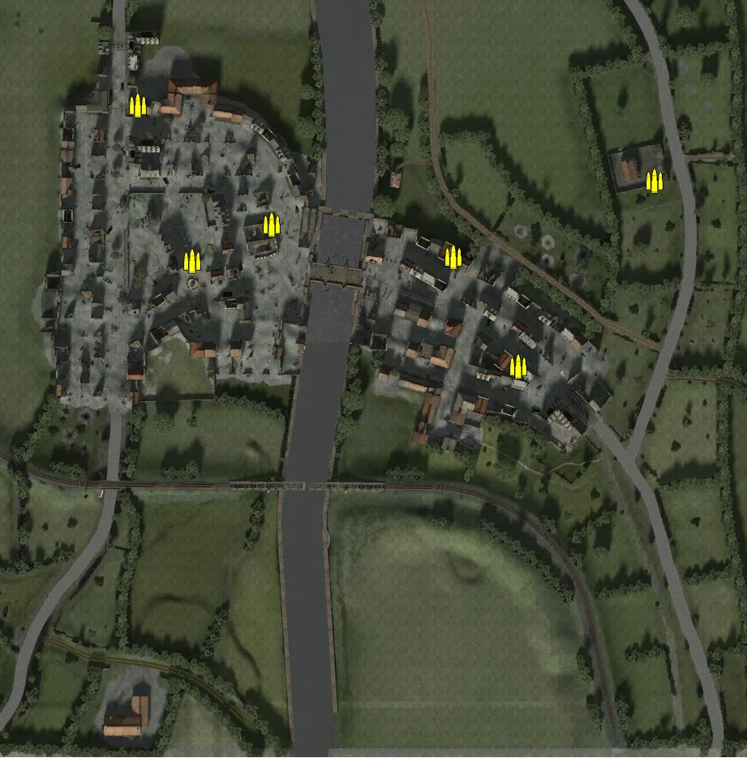
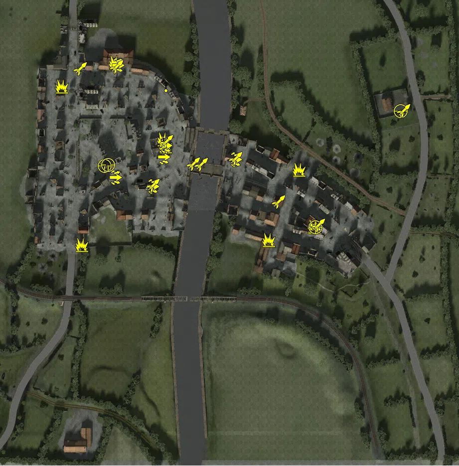
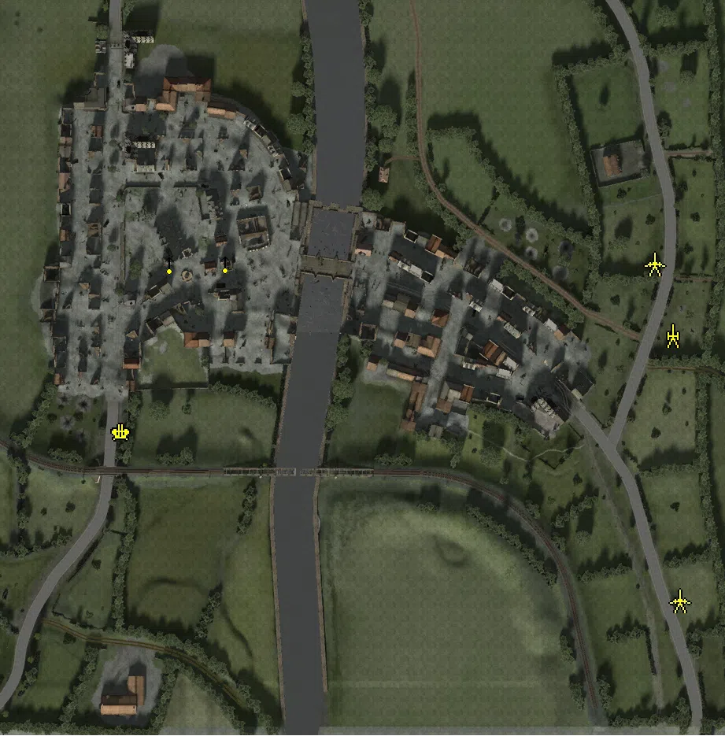

Static Ammo Crate

Pickup Kit

Static Emplacement

Vehicle

| gpo_subcat   | gpo_cat    | gpo_name                    |    pos_x |   pos_y |    pos_z |   flag | is_locked   |   team | instance                                     | gpo_cat_disp       | gpo_subcat_disp   |
|:-------------|:-----------|:----------------------------|---------:|--------:|---------:|-------:|:------------|-------:|:---------------------------------------------|:-------------------|:------------------|
| ammo_crate   | ammo_crate | ammo_crate                  |  109.971 |  25.994 |  -14.932 |      0 | False       |      0 | ammo_crate_0                                 | Static Ammo Crate  | Static Ammo Crate |
| ammo_crate   | ammo_crate | ammo_crate                  |  -42.056 |  25.26  |   72.41  |      0 | False       |      0 | ammo_crate_1                                 | Static Ammo Crate  | Static Ammo Crate |
| ammo_crate   | ammo_crate | ammo_crate                  |   70.069 |  26.142 |   52.54  |      0 | False       |      0 | ammo_crate_2                                 | Static Ammo Crate  | Static Ammo Crate |
| ammo_crate   | ammo_crate | ammo_crate                  |  -91.105 |  25     |   49.786 |      0 | False       |      0 | ammo_crate_3                                 | Static Ammo Crate  | Static Ammo Crate |
| ammo_crate   | ammo_crate | ammo_crate                  |  193.927 |  25.797 |   99.359 |      0 | False       |      0 | ammo_crate_4                                 | Static Ammo Crate  | Static Ammo Crate |
| ammo_crate   | ammo_crate | ammo_crate                  | -124.436 |  25.507 |  146.159 |      0 | False       |      0 | ammo_crate_5                                 | Static Ammo Crate  | Static Ammo Crate |
| antitank     | kit        | UW_PickUpMolotov            |  106.253 |  26.888 |  -16.732 |    204 | False       |      0 | CP_64_Ramelle_Historical_Center_molotov      | Pickup Kit         | Tankhunter Kit    |
| antitank     | kit        | UW_PickUpMolotov            |  -45.294 |  26.172 |   71.413 |    207 | False       |      0 | CP_64_Ramelle_Bridge_molotov2                | Pickup Kit         | Tankhunter Kit    |
| antitank     | kit        | UW_PickUpMolotov            |   90.513 |  26.283 |   41.142 |    203 | False       |      0 | CP_64_Ramelle_Alamo_molotov                  | Pickup Kit         | Tankhunter Kit    |
| antitank     | kit        | UW_PickUpMolotov            | -147.266 |  29.491 |  124.581 |    201 | False       |      0 | CP_64_Ramelle_Right_Flank_molotov            | Pickup Kit         | Tankhunter Kit    |
| antitank     | kit        | UW_PickUpMolotov            |   59.754 |  29.588 |  -29.554 |    203 | False       |      0 | CP_64_Ramelle_Historical_Center_molotov_0    | Pickup Kit         | Tankhunter Kit    |
| antitank     | kit        | UW_PickUpHawkinsM1Thompson  |  -43.535 |  26.053 |   64.424 |    207 | False       |      0 | CP_64_Ramelle_Bridge_ATmine                  | Pickup Kit         | Tankhunter Kit    |
| antitank     | kit        | UW_PickUpHawkinsM1Thompson  |  105.444 |  26.884 |  -16.161 |    203 | False       |      0 | CP_64_Ramelle_Alamo_ATmine                   | Pickup Kit         | Tankhunter Kit    |
| antitank     | kit        | UW_PickUpHawkinsM1Thompson  |  -94.143 |  25.798 |  148.267 |    201 | False       |      0 | CP_64_Ramelle_Right_Flank_ATmine             | Pickup Kit         | Tankhunter Kit    |
| antitank     | kit        | UW_PickUpMolotov            | -127.561 |  32.174 |  -34.587 |      1 | False       |      0 | CP_64_Ramelle_Ruins_Molotov                  | Pickup Kit         | Tankhunter Kit    |
| assault      | kit        | GW_PickUpAssaultStG44       |  -93.803 |  26.362 |   33.153 |    207 | False       |      0 | CP_64_Ramelle_Fountain_DE_stg44              | Pickup Kit         | Assault Kit       |
| assault      | kit        | GW_PickUpAssaultStG44       |  -45.472 |  25.771 |   53.493 |    204 | False       |      0 | CP_64_Ramelle_Historical_Center_stg44        | Pickup Kit         | Assault Kit       |
| assault      | kit        | UW_PickUpAssaultM3Greasegun |   26.59  |  25.793 |   51.178 |    203 | False       |      0 | CP_64_Ramelle_Alamo_grease2                  | Pickup Kit         | Assault Kit       |
| assault      | kit        | UW_PickUpAssaultM3Greasegun |  -91.501 |  25.74  |  145.658 |    201 | False       |      0 | CP_64_Ramelle_Right_Flank_greaseGUN          | Pickup Kit         | Assault Kit       |
| assault      | kit        | GW_PickUpAssaultStG44       |  -56.565 |  26.353 |   24.155 |    207 | False       |      0 | CP_64_Ramelle_Bridge_stg44                   | Pickup Kit         | Assault Kit       |
| assault      | kit        | UW_PickUpAssaultM3Greasegun |  -43.507 |  26.051 |   65.114 |    207 | False       |      0 | CP_64_Ramelle_Bridge_winchester              | Pickup Kit         | Assault Kit       |
| mg_dep       | kit        | UW_PickUp30Cal              |  -45.516 |  26.08  |   68.328 |    202 | False       |      0 | CP_64_Ramelle_Fountain_DepMG                 | Pickup Kit         | Deployable MG     |
| mg_dep       | kit        | UW_PickUp30Cal              |  110.694 |  26.042 |  -14.091 |    207 | False       |      0 | MGaxisbridge                                 | Pickup Kit         | Deployable MG     |
| mg_dep       | kit        | UW_PickUp30Cal              |  -43.156 |  25.397 |  124.876 |    207 | False       |      0 | CP_64_Ramelle_Bridge_DepMg                   | Pickup Kit         | Deployable MG     |
| sniper       | kit        | UW_PickUpSniperSpringfield  | -104.49  |  40.799 |   44.398 |    202 | False       |      0 | CP_64_Ramelle_Fountain_Sniper                | Pickup Kit         | Sniper Kit        |
| sniper       | kit        | UW_PickUpSniperSpringfield  |  192.617 |  25.794 |   99.539 |    205 | False       |      0 | CP_64_Ramelle_US_Reinforcements_DE_US_Sniper | Pickup Kit         | Sniper Kit        |
| sniper       | kit        | GW_PickUpSniperK98          | -101.162 |  40.799 |   45.517 |    203 | False       |      0 | CP_64_Ramelle_Fountain_DE_US_Sniper          | Pickup Kit         | Sniper Kit        |
| sniper       | kit        | UW_PickUpSniperSpringfield  |  106.898 |  26.888 |  -17.102 |    204 | False       |      0 | CP_64_Ramelle_Historical_Center_shotgun      | Pickup Kit         | Sniper Kit        |
| zooka        | kit        | UW_PickUpBazooka            |  -42.718 |  26.095 |   68.954 |    207 | False       |      0 | CP_64_Ramelle_Bridge_bazooka                 | Pickup Kit         | HEAT Thrower      |
| zooka        | kit        | UW_PickUpBazooka            |   69.784 |  25.041 |    8.299 |    203 | False       |      0 | CP_64_Ramelle_Alamo_bazooka                  | Pickup Kit         | HEAT Thrower      |
| zooka        | kit        | UW_PickUpBazooka            |  -92.281 |  25.78  |  143.768 |    201 | False       |      0 | CP_64_Ramelle_Right_Flank_bazooka            | Pickup Kit         | HEAT Thrower      |
| zooka        | kit        | UW_PickUpBazooka            | -128.933 |  28.464 |  142.205 |    207 | False       |      0 | right_bazooka                                | Pickup Kit         | HEAT Thrower      |
| zooka        | kit        | UW_PickUpBazooka            |   -7.496 |  26.527 |   46.123 |    207 | False       |      0 | CP_64_Ramelle_Bridge_bazooka3                | Pickup Kit         | HEAT Thrower      |
| zooka        | kit        | GW_PickUpPanzerschreck      |   26.921 |  25.913 |   52.093 |    204 | False       |      0 | CP_64_Ramelle_Historical_Center_DE_Antitank  | Pickup Kit         | HEAT Thrower      |
| zooka        | kit        | UW_PickUpBazooka            |  109.902 |  26.299 |  -14.923 |    204 | False       |      0 | CP_64_Ramelle_Historical_Center_bazooka      | Pickup Kit         | HEAT Thrower      |
| zooka        | kit        | UW_PickUpBazooka            |  195.469 |  25.044 |   99.809 |    205 | False       |      0 | CP_64_Ramelle_US_Reinforcements_bazooka      | Pickup Kit         | HEAT Thrower      |
| zooka        | kit        | GW_PickUpPanzerschreck      |  -56.161 |  26.497 |   24.912 |    207 | False       |      0 | CP_64_Ramelle_Bridge_Panzerschreck           | Pickup Kit         | HEAT Thrower      |
| zooka        | kit        | GW_PickUpPanzerschreck      |  -15.38  |  26     |   46.455 |    203 | False       |      0 | CP_64_Ramelle_Bridge_Panzerschreck2          | Pickup Kit         | HEAT Thrower      |
| noidea       | noidea     | p51d_ramelle_flyover        | -398.746 |  46.495 |  -46.309 |    207 | False       |      0 | CP_64_Ramelle_Bridge_mustang2                | FIXME UNASSIGNED   | FIXME UNASSIGNED  |
| noidea       | noidea     | p51d_ramelle_flyover        | -396.513 |  44.539 |  -58.85  |    207 | False       |      0 | CP_64_Ramelle_Bridge_mustang3                | FIXME UNASSIGNED   | FIXME UNASSIGNED  |
| noidea       | noidea     | p51d_ramelle_flyover        | -351.949 |  53     |  250.874 |    207 | False       |      0 | CP_64_Ramelle_Bridge_mustang4                | FIXME UNASSIGNED   | FIXME UNASSIGNED  |
| noidea       | noidea     | p51d_ramelle_flyover        | -359.803 |  52     |  241.553 |    207 | False       |      0 | CP_64_Ramelle_Bridge_mustang5                | FIXME UNASSIGNED   | FIXME UNASSIGNED  |
| noidea       | noidea     | FH_House_fire_spawnable     |  -62.992 |  29.136 |   40.272 |    207 | False       |      0 | ramellefire1                                 | FIXME UNASSIGNED   | FIXME UNASSIGNED  |
| noidea       | noidea     | FH_House_fire_spawnable     | -174.27  |  29.055 |   11.281 |      1 | False       |      0 | fire1_0                                      | FIXME UNASSIGNED   | FIXME UNASSIGNED  |
| noidea       | noidea     | FH_House_fire_spawnable     | -164.932 |  28.984 |  128.159 |      1 | False       |      0 | fire3                                        | FIXME UNASSIGNED   | FIXME UNASSIGNED  |
| noidea       | noidea     | wrecksmoke_spawnable        | -117.724 |  25.014 |  113.746 |      1 | False       |      0 | Smoke3                                       | FIXME UNASSIGNED   | FIXME UNASSIGNED  |
| noidea       | noidea     | FH_House_fire_spawnable     | -128.91  |  35.326 |  182.444 |    201 | False       |      0 | fireright                                    | FIXME UNASSIGNED   | FIXME UNASSIGNED  |
| noidea       | noidea     | FH_House_fire_spawnable     |  -45.68  |  30.183 |  126.137 |    211 | False       |      0 | firechurch                                   | FIXME UNASSIGNED   | FIXME UNASSIGNED  |
| noidea       | noidea     | wrecksmoke_spawnable        |  -31.741 |  26.511 |   -2.181 |    207 | False       |      0 | brdigesmoke                                  | FIXME UNASSIGNED   | FIXME UNASSIGNED  |
| noidea       | noidea     | wrecksmoke_spawnable        | -111.072 |  26.154 |    3.915 |      1 | False       |      0 | ruinssmoke                                   | FIXME UNASSIGNED   | FIXME UNASSIGNED  |
| noidea       | noidea     | FH_House_fire_spawnable     |   60.429 |  28.999 |   32.934 |    203 | False       |      0 | brdigefire3                                  | FIXME UNASSIGNED   | FIXME UNASSIGNED  |
| noidea       | noidea     | wrecksmoke_spawnable        |   91.865 |  25.276 |  -12.13  |    203 | False       |      0 | alamosmoke                                   | FIXME UNASSIGNED   | FIXME UNASSIGNED  |
| noidea       | noidea     | FH_House_fire_spawnable     |  132.868 |  29.032 |    8.1   |    212 | False       |      0 | Clearingfire                                 | FIXME UNASSIGNED   | FIXME UNASSIGNED  |
| noidea       | noidea     | FH_House_fire_spawnable     |  140.389 |  34.7   |  -43.834 |    204 | False       |      0 | Historical_fire                              | FIXME UNASSIGNED   | FIXME UNASSIGNED  |
| noidea       | noidea     | FH_explosion_spawnable      |  -45.6   |  24.953 |   26.754 |    207 | False       |      0 | bridge_bomb2                                 | FIXME UNASSIGNED   | FIXME UNASSIGNED  |
| noidea       | noidea     | FH_explosion_spawnable      |  -42.388 |  27.32  |   14.46  |    207 | False       |      0 | bridge_bomb3                                 | FIXME UNASSIGNED   | FIXME UNASSIGNED  |
| noidea       | noidea     | FH_explosion_spawnable      |  -31.311 |  25.151 |   51.958 |    207 | False       |      0 | Bridge_bomb4                                 | FIXME UNASSIGNED   | FIXME UNASSIGNED  |
| noidea       | noidea     | FH_explosion_spawnable      |  -39.339 |  25.27  |   42.934 |    207 | False       |      0 | bridge_bomb5                                 | FIXME UNASSIGNED   | FIXME UNASSIGNED  |
| noidea       | noidea     | p51d_ramelle_flyover        |  331.915 |  52.366 |  210.406 |    207 | False       |      0 | bridge_mustang6                              | FIXME UNASSIGNED   | FIXME UNASSIGNED  |
| noidea       | noidea     | FH_explosion_spawnable      |  -60.459 |  25.359 |   33.552 |    207 | False       |      0 | Bridge_bomb6                                 | FIXME UNASSIGNED   | FIXME UNASSIGNED  |
| noidea       | noidea     | p51d_ramelle_flyover        |  304.059 |  49.142 | -195     |    207 | False       |      0 | mustang6b                                    | FIXME UNASSIGNED   | FIXME UNASSIGNED  |
| noidea       | noidea     | p51d_ramelle_flyover        | -464.946 |  53.458 | -113.26  |    207 | False       |      0 | mustang6c                                    | FIXME UNASSIGNED   | FIXME UNASSIGNED  |
| noidea       | noidea     | p51d_ramelle_flyover        | -489.631 |  52.289 |   62.634 |    207 | False       |      0 | mustang6d                                    | FIXME UNASSIGNED   | FIXME UNASSIGNED  |
| noidea       | noidea     | p51d_ramelle_flyover        |  131.782 |  50     | -351.269 |    207 | False       |      0 | mustang6e                                    | FIXME UNASSIGNED   | FIXME UNASSIGNED  |
| noidea       | noidea     | p51d_ramelle_flyover        |  331.963 |  58.085 |  210.332 |    207 | False       |      0 | mustang6g                                    | FIXME UNASSIGNED   | FIXME UNASSIGNED  |
| noidea       | noidea     | p51d_ramelle_flyover        |  131.863 |  53.972 | -351.441 |    207 | False       |      0 | mustang6f                                    | FIXME UNASSIGNED   | FIXME UNASSIGNED  |
| noidea       | noidea     | p51d_ramelle_flyover        | -464.839 |  56.35  | -113.137 |    207 | False       |      0 | mustang6h                                    | FIXME UNASSIGNED   | FIXME UNASSIGNED  |
| noidea       | noidea     | p51d_ramelle_flyover        | -489.628 |  53.994 |   62.59  |    207 | False       |      0 | mustang6i                                    | FIXME UNASSIGNED   | FIXME UNASSIGNED  |
| noidea       | noidea     | p51d_ramelle_flyover        |  303.701 |  51.408 | -194.802 |    207 | False       |      0 | mustang6j                                    | FIXME UNASSIGNED   | FIXME UNASSIGNED  |
| noidea       | noidea     | p51d_ramelle_flyover        |  244.202 |  49.196 | -205.802 |    207 | False       |      0 | mustang2b                                    | FIXME UNASSIGNED   | FIXME UNASSIGNED  |
| noidea       | noidea     | p51d_ramelle_flyover        |  247.164 |  47.452 | -192.015 |    207 | False       |      0 | mustang3b                                    | FIXME UNASSIGNED   | FIXME UNASSIGNED  |
| noidea       | noidea     | p51d_ramelle_flyover        |  313.409 |  50     |   66.291 |    207 | False       |      0 | mustang2c                                    | FIXME UNASSIGNED   | FIXME UNASSIGNED  |
| noidea       | noidea     | p51d_ramelle_flyover        |  320.178 |  50     |   54.277 |    207 | False       |      0 | mustang3c                                    | FIXME UNASSIGNED   | FIXME UNASSIGNED  |
| noidea       | noidea     | p51d_ramelle_flyover        |  155.346 |  50     | -279.569 |    207 | False       |      0 | mustang3d                                    | FIXME UNASSIGNED   | FIXME UNASSIGNED  |
| noidea       | noidea     | p51d_ramelle_flyover        |  147.549 |  50     | -290.935 |    207 | False       |      0 | mustang2d                                    | FIXME UNASSIGNED   | FIXME UNASSIGNED  |
| noidea       | noidea     | p51d_ramelle_flyover        | -305.987 |  50     | -226.678 |    207 | False       |      0 | mustang3e                                    | FIXME UNASSIGNED   | FIXME UNASSIGNED  |
| noidea       | noidea     | p51d_ramelle_flyover        | -318.524 |  50     | -220.959 |    207 | False       |      0 | mustang2e                                    | FIXME UNASSIGNED   | FIXME UNASSIGNED  |
| noidea       | noidea     | p51d_ramelle_flyover        |  309.864 |  55.509 |  -44.174 |    207 | False       |      0 | mustang3f                                    | FIXME UNASSIGNED   | FIXME UNASSIGNED  |
| noidea       | noidea     | p51d_ramelle_flyover        |  312.69  |  55.509 |  -57.661 |    207 | False       |      0 | mustang2f                                    | FIXME UNASSIGNED   | FIXME UNASSIGNED  |
| noidea       | noidea     | p51d_ramelle_flyover        |  248.054 |  51.727 |  231.549 |    207 | False       |      0 | mustang3g                                    | FIXME UNASSIGNED   | FIXME UNASSIGNED  |
| noidea       | noidea     | p51d_ramelle_flyover        |  259.723 |  51.727 |  224.22  |    207 | False       |      0 | mustang2g                                    | FIXME UNASSIGNED   | FIXME UNASSIGNED  |
| noidea       | noidea     | p51d_ramelle_flyover        | -370.623 |  49.247 |  170.06  |    207 | False       |      0 | mustang3h                                    | FIXME UNASSIGNED   | FIXME UNASSIGNED  |
| noidea       | noidea     | p51d_ramelle_flyover        | -369.989 |  49.247 |  183.824 |    207 | False       |      0 | mustang2h                                    | FIXME UNASSIGNED   | FIXME UNASSIGNED  |
| noidea       | noidea     | p51d_ramelle_flyover        |  298.436 |  54.333 |  225.479 |    207 | False       |      0 | mustang4b                                    | FIXME UNASSIGNED   | FIXME UNASSIGNED  |
| noidea       | noidea     | p51d_ramelle_flyover        |  291.906 |  54.333 |  234.767 |    207 | False       |      0 | mustang5b                                    | FIXME UNASSIGNED   | FIXME UNASSIGNED  |
| noidea       | noidea     | p51d_ramelle_flyover        | -109.111 |  50     | -322.449 |    207 | False       |      0 | mustang5c                                    | FIXME UNASSIGNED   | FIXME UNASSIGNED  |
| noidea       | noidea     | p51d_ramelle_flyover        | -120.522 |  50     | -318.175 |    207 | False       |      0 | mustang4c                                    | FIXME UNASSIGNED   | FIXME UNASSIGNED  |
| noidea       | noidea     | p51d_ramelle_flyover        |  328.177 |  50     |  -53.409 |    207 | False       |      0 | mustang5d                                    | FIXME UNASSIGNED   | FIXME UNASSIGNED  |
| noidea       | noidea     | p51d_ramelle_flyover        |  323.068 |  50     |  -64.473 |    207 | False       |      0 | mustang4d                                    | FIXME UNASSIGNED   | FIXME UNASSIGNED  |
| noidea       | noidea     | p51d_ramelle_flyover        |  176.934 |  55.919 | -264.177 |    207 | False       |      0 | mustang5e                                    | FIXME UNASSIGNED   | FIXME UNASSIGNED  |
| noidea       | noidea     | p51d_ramelle_flyover        |  165.885 |  55.919 | -269.322 |    207 | False       |      0 | mustang4e                                    | FIXME UNASSIGNED   | FIXME UNASSIGNED  |
| noidea       | noidea     | p51d_ramelle_flyover        | -342.862 |  65.491 | -170.462 |    207 | False       |      0 | mustang5f                                    | FIXME UNASSIGNED   | FIXME UNASSIGNED  |
| noidea       | noidea     | p51d_ramelle_flyover        | -348.206 |  65.491 | -159.511 |    207 | False       |      0 | mustang4f                                    | FIXME UNASSIGNED   | FIXME UNASSIGNED  |
| noidea       | noidea     | p51d_ramelle_flyover        |  -10.184 |  50     | -328.96  |    207 | False       |      0 | mustang5g                                    | FIXME UNASSIGNED   | FIXME UNASSIGNED  |
| noidea       | noidea     | p51d_ramelle_flyover        |  -22.314 |  50     | -327.807 |    207 | False       |      0 | mustang4g                                    | FIXME UNASSIGNED   | FIXME UNASSIGNED  |
| noidea       | noidea     | p51d_ramelle_flyover        |   39.188 |  50     | -321.978 |    207 | False       |      0 | mustang5h                                    | FIXME UNASSIGNED   | FIXME UNASSIGNED  |
| noidea       | noidea     | p51d_ramelle_flyover        |   27.007 |  50     | -322.43  |    207 | False       |      0 | mustang4h                                    | FIXME UNASSIGNED   | FIXME UNASSIGNED  |
| arty         | static     | 81mm_mortar_m1              |  217.551 |  25.286 |   -1.767 |    203 | False       |      0 | CP_64_Ramelle_Bridge_US_Mortar               | Static Emplacement | Artillery         |
| flak         | static     | sd_ah_51_flak38             | -132.638 |  24.518 |  -63.627 |      1 | False       |      0 | CP_64_Ramelle_Ruins_CartFlak                 | Static Emplacement | Anti-aircraft Gun |
| mg_nest      | static     | m1919a4notri                | -101.835 |  40.855 |   43.585 |    202 | False       |      0 | CP_64_Ramelle_Fountain_cal302                | Static Emplacement | Static MG         |
| mg_nest      | static     | m1919a4_emplaced            |  -66.644 |  28.45  |   44.165 |    202 | False       |      0 | CP_64_Ramelle_Fountain_cal30hole             | Static Emplacement | Static MG         |
| pak          | static     | 76mm_m5_atgun               |  205.985 |  25     |   43.388 |    205 | False       |      0 | CP_64_Ramelle_US_Reinforcements_AT           | Static Emplacement | Anti-tank Gun     |
| pak          | static     | 76mm_m5_atgun               |  222.178 |  27.015 | -170.508 |    213 | False       |      0 | CP_64_Ramelle_CrossRoads_at                  | Static Emplacement | Anti-tank Gun     |
| apc          | vehicle    | sdkfz251_d                  | -109.968 |  27.33  | -218.233 |    206 | False       |      1 | CP_64_Ramelle_Alamo_Hanomagspawn2            | Vehicle            | APC               |
| car          | vehicle    | kettenkrad_fr               |  -75.687 |  25     |    8.054 |    203 | False       |      0 | kettengrad                                   | Vehicle            | Car               |
| pak_sp       | vehicle    | m4a1_76mm                   |  175.68  |  25     |  141.993 |    205 | True        |      2 | CP_64_Ramelle_US_Reinforcements_Sherman1     | Vehicle            | Mobile PaK        |
| tank         | vehicle    | tiger_late                  | -108.719 |  26.657 | -201.58  |    206 | True        |      1 | CP_64_Ramelle_German_Position_Tiger1         | Vehicle            | Tank              |
| tank         | vehicle    | tiger_late_132              | -123.199 |  27.33  | -223.557 |    206 | True        |      1 | CP_64_Ramelle_German_Position_Tiger2         | Vehicle            | Tank              |
| tank         | vehicle    | marder_iii_m                | -143.532 |  27.317 | -217.966 |    206 | True        |      1 | CP_64_Ramelle_Alamo_MarderA                  | Vehicle            | Tank              |
| tank         | vehicle    | marder_iii_m                | -142.708 |  27.317 | -210.68  |    206 | True        |      1 | CP_64_Ramelle_German_Position_MarderB        | Vehicle            | Tank              |
| tank         | vehicle    | m3a1                        |  192.834 |  25     |  104.804 |    205 | False       |      2 | CP_64_Ramelle_US_Reinforcements_mgtruck      | Vehicle            | Tank              |
| tank         | vehicle    | m4a1early_eu                |  182.08  |  25     |  143.416 |    205 | True        |      2 | CP_64_Ramelle_US_Reinforcements_sherman2     | Vehicle            | Tank              |

