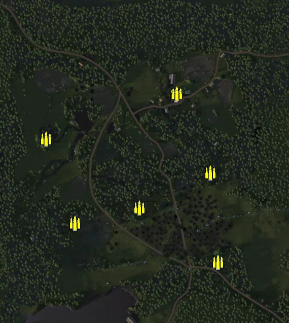
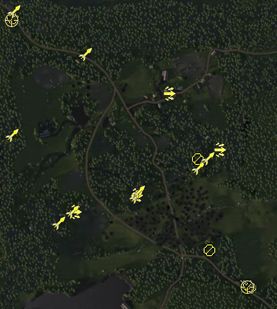
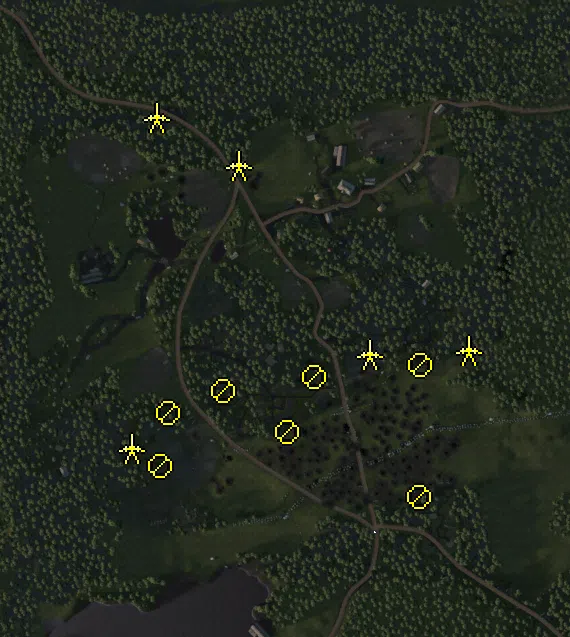
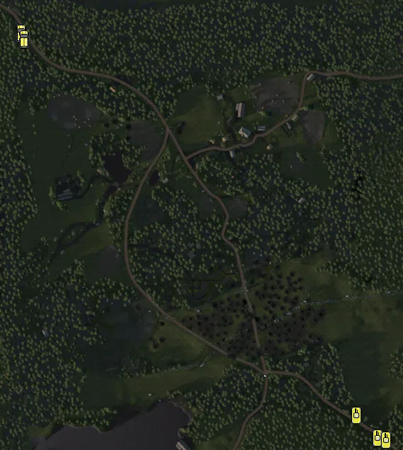

Static Ammo Crate

Pickup Kit

Static Emplacement

Vehicle

| Icon                       | SubCat            | Cat                | Name                      | Instance                                             |   Flag |    X Pos |   Y Pos |    Z Pos |
|:---------------------------|:------------------|:-------------------|:--------------------------|:-----------------------------------------------------|-------:|---------:|--------:|---------:|
|      | Static Ammo Crate | Static Ammo Crate  | ammo_crate                | ammo_crate_0                                         |      0 |  175.412 |  33.826 | -198.529 |
|      | Static Ammo Crate | Static Ammo Crate  | ammo_crate                | ammo_crate_1                                         |      0 |  160.417 |  48.005 |  -23.147 |
|      | Static Ammo Crate | Static Ammo Crate  | ammo_crate                | ammo_crate_2                                         |      0 |   19.959 |  46.817 |  -91.591 |
|      | Static Ammo Crate | Static Ammo Crate  | ammo_crate                | ammo_crate_3                                         |      0 | -107.756 |  45.720 | -122.563 |
|      | Static Ammo Crate | Static Ammo Crate  | ammo_crate                | ammo_crate_4                                         |      0 | -106.569 |  46.136 | -121.893 |
|      | Static Ammo Crate | Static Ammo Crate  | ammo_crate                | ammo_crate_5                                         |      0 | -164.244 |  33.142 |   43.846 |
|      | Static Ammo Crate | Static Ammo Crate  | ammo_crate                | ammo_crate_6                                         |      0 |   91.982 |  33.674 |  130.749 |
|      | Static Ammo Crate | Static Ammo Crate  | ammo_crate                | ammo_crate_7                                         |      0 |   94.059 |  33.327 |  133.046 |
|  | Deployable Arty   | Pickup Kit         | RE_PickUpMortar           | conq_64_37th_Guards_Army_Corp_Mironov_mortar         |      1 |  246.132 |  31.912 | -266.099 |
|   | Assault Kit       | Pickup Kit         | RE_PickUpAssaultPps42     | conq_64_vt_line_east_assault                         |      3 |  196.993 |  47.990 |    9.307 |
|   | Assault Kit       | Pickup Kit         | RE_PickUpAssaultPps42     | conq_64_vt_line_center_assault                       |      2 |   26.182 |  47.256 |  -84.680 |
|   | Assault Kit       | Pickup Kit         | RE_PickUpAssaultPps42     | conq_64_vt_line_west_assault                         |      7 |  -99.589 |  46.656 | -119.310 |
|   | Assault Kit       | Pickup Kit         | RE_PickUpAssaultPps42     | conq_64_Sammatus_village_assault                     |      4 |   93.365 |  33.456 |  124.951 |
|    | AT Rifle          | Pickup Kit         | RE_PickUpAntitankPTRD     | conq_64_37th_Guards_Inf_atrifle1                     |      8 |  175.585 |  33.033 | -197.533 |
|    | AT Rifle          | Pickup Kit         | RE_PickUpAntitankPTRD     | conq_64_37th_Guards_Army_Corp_Mironov_atrifle2       |      1 |  259.789 |  32.085 | -275.244 |
|        | MG Kit            | Pickup Kit         | SE_PickupMG_LS26          | conq_64_finnnish_base_mg                             |      6 | -229.436 |  30.922 |  279.920 |
|        | MG Kit            | Pickup Kit         | RE_PickupMG_DT            | conq_64_37th_Guards_Army_Corp_Mironov_mg             |      1 |  257.160 |  32.866 | -271.965 |
|        | MG Kit            | Pickup Kit         | SE_PickupMG_LS26          | conq_64_vt_line_east_mgkit                           |      3 |  152.348 |  48.406 |  -10.231 |
|    | Sniper Kit        | Pickup Kit         | RE_PickUpSniper           | conq_64_37th_Guards_Army_Corp_Mironov_sniperallies_1 |      1 |  253.804 |  32.715 | -273.804 |
|    | Sniper Kit        | Pickup Kit         | SE_PickUpSniper           | conq_64_finnnish_base_sniperfin                      |      6 | -231.260 |  31.171 |  275.836 |
|    | HEAT Thrower      | Pickup Kit         | SE_PickupTankhunter_faust | conq_64_vt_line_center_faustkit                      |      2 |   25.385 |  47.466 |  -88.250 |
|    | HEAT Thrower      | Pickup Kit         | SE_PickupTankhunter_faust | conq_64_vt_line_center_faustkit2                     |      2 |   29.789 |  46.984 |  -77.649 |
|    | HEAT Thrower      | Pickup Kit         | SE_PickupTankhunter_faust | conq_64_vt_line_west_faustkit1                       |      7 | -133.841 |  45.454 | -142.497 |
|    | HEAT Thrower      | Pickup Kit         | SE_PickupTankhunter_faust | conq_64_vt_line_west_faustkit2                       |      7 | -105.598 |  46.172 | -118.750 |
|    | HEAT Thrower      | Pickup Kit         | SE_PickupTankhunter_faust | conq_64_vt_line_east_faustkit1                       |      3 |  152.618 |  48.386 |  -28.719 |
|    | HEAT Thrower      | Pickup Kit         | SE_PickupTankhunter_faust | conq_64_vt_line_east_faustkit2                       |      3 |  173.402 |  47.401 |   -8.521 |
|    | HEAT Thrower      | Pickup Kit         | SE_PickupTankhunter_faust | conq_64_Lakehouse_faust                              |      5 | -229.982 |  42.041 |   39.440 |
|    | HEAT Thrower      | Pickup Kit         | SE_PickupTankhunter_faust | conq_64_fininf_faust2                                |    101 |  -78.676 |  29.850 |  206.076 |
|    | HEAT Thrower      | Pickup Kit         | SE_PickupPanzerschreck    | conq_64_finnnish_base_schreck                        |      6 | -225.958 |  30.780 |  294.302 |
|      | MISCELLANEOUS     | FIXME UNASSIGNED   | sf14_periscope            | conq_64_vt_line_west_bino                            |      7 | -101.086 |  45.720 | -122.483 |
|       | Static MG         | Static Emplacement | dt_bipod                  | conq_64_vt_line_center_mg1                           |      2 |   31.736 |  48.143 | -113.863 |
|       | Static MG         | Static Emplacement | maxim_mg_sandbag_ns       | conq_64_vt_line_east_mg1                             |      3 |  165.219 |  48.441 |  -46.525 |
|       | Static MG         | Static Emplacement | maxim_mg_sandbag_ns       | conq_64_vt_line_west_mg1                             |      7 |  -95.191 |  43.756 | -148.473 |
|       | Static MG         | Static Emplacement | dt_bipod                  | conq_64_vt_line_west_mg2                             |      7 |  -87.440 |  46.943 |  -94.573 |
|       | Static MG         | Static Emplacement | dp28_bipod                | conq_64_vt_line_center_mg3                           |      2 |   59.123 |  49.058 |  -58.991 |
|       | Static MG         | Static Emplacement | dp28_bipod                | conq_64_vt_line_center_allies_dp1                    |      2 |  -32.480 |  46.807 |  -72.848 |
|       | Static MG         | Static Emplacement | maxim_mg_sandbag          | conq_64_37th_Guards_Inf_max                          |      8 |  164.158 |  37.338 | -179.432 |
|       | Anti-tank Gun     | Static Emplacement | pak40_static_fi           | conq_64_vt_line_east_Pak40                           |      3 |  213.453 |  52.878 |  -32.435 |
|       | Anti-tank Gun     | Static Emplacement | pak40_static_fi           | conq_64_vt_line_west_Pak40                           |      7 | -123.972 |  47.469 | -129.910 |
|       | Anti-tank Gun     | Static Emplacement | m1937_45mm_static         | conq_64_vt_line_east_AT45mm                          |      3 |  114.355 |  47.900 |  -36.312 |
|       | Anti-tank Gun     | Static Emplacement | m1937_45mm_static         | conq_64_Sammatus_village_at45mm                      |      4 |  -17.250 |  31.775 |  153.400 |
|       | Anti-tank Gun     | Static Emplacement | pak40_fi                  | conq_64_fininf_pak                                   |    101 |  -99.371 |  30.021 |  200.696 |
|       | APC               | Vehicle            | t20                       | conq_64_finnnish_base_T20                            |      6 | -224.920 |  30.292 |  271.262 |
|       | APC               | Vehicle            | t20                       | conq_64_finnnish_base_t20_2                          |      6 | -221.166 |  30.288 |  262.877 |
|      | Tank              | Vehicle            | su_76m                    | conq_64_37th_Guards_Army_Corp_Mironov_su76           |      1 |  278.535 |  31.742 | -301.865 |
|      | Tank              | Vehicle            | t34_76_m41                | conq_64_37th_Guards_Army_Corp_Mironov_t34            |      1 |  249.234 |  31.817 | -270.356 |
|      | Tank              | Vehicle            | t34_76_m41                | conq_64_37th_Guards_Army_Corp_Mironov_t34b           |      1 |  290.678 |  32.114 | -304.914 |

