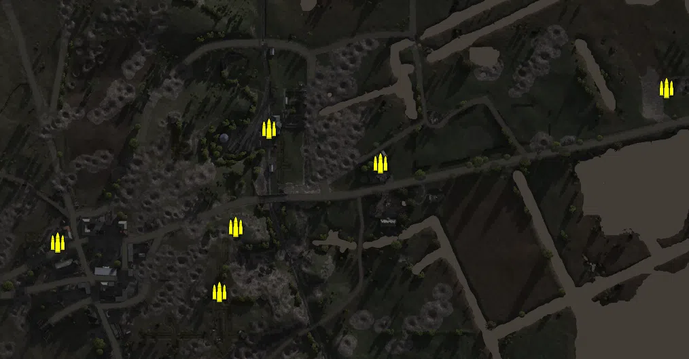
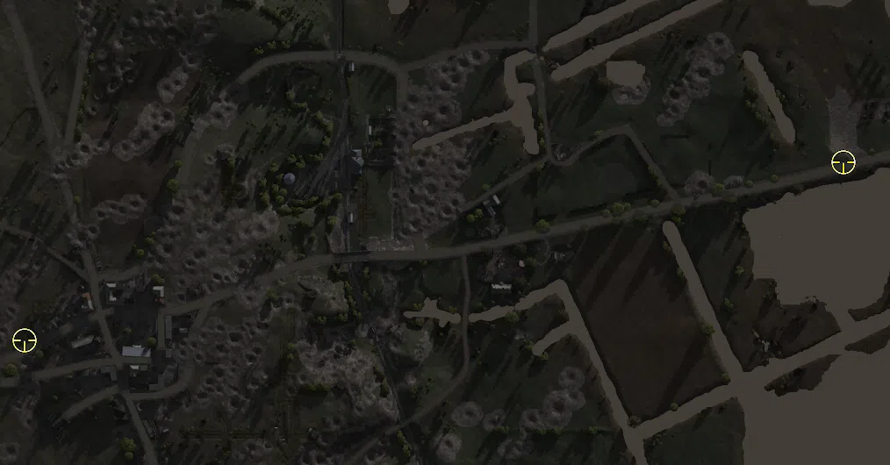
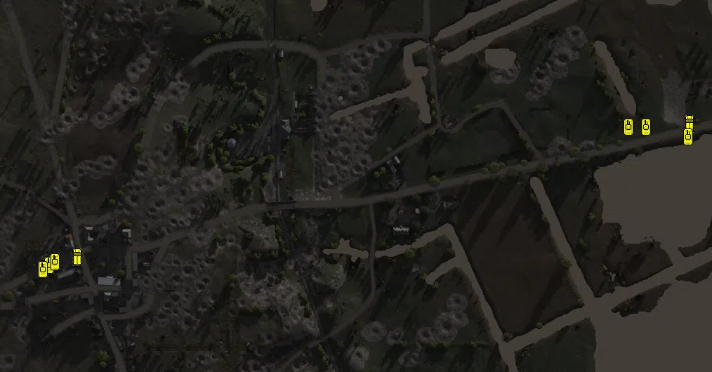

Static Ammo Crate

Pickup Kit

Vehicle

| gpo_subcat   | gpo_cat    | gpo_name              |    pos_x |   pos_y |   pos_z |   flag | is_locked   |   team | instance                       | gpo_cat_disp      | gpo_subcat_disp   |
|:-------------|:-----------|:----------------------|---------:|--------:|--------:|-------:|:------------|-------:|:-------------------------------|:------------------|:------------------|
| ammo_crate   | ammo_crate | ammo_crate            | -536.076 |  98.599 | -55.851 |      0 | False       |      0 | ammo_crate_0                   | Static Ammo Crate | Static Ammo Crate |
| ammo_crate   | ammo_crate | ammo_crate            | -485.539 | 103.261 | 128.562 |      0 | False       |      0 | ammo_crate_1                   | Static Ammo Crate | Static Ammo Crate |
| ammo_crate   | ammo_crate | ammo_crate            | -307.447 |  98.066 |   0.254 |      0 | False       |      0 | ammo_crate_2                   | Static Ammo Crate | Static Ammo Crate |
| ammo_crate   | ammo_crate | ammo_crate            |  -69.197 |  98.449 | -73.351 |      0 | False       |      0 | ammo_crate_3                   | Static Ammo Crate | Static Ammo Crate |
| ammo_crate   | ammo_crate | ammo_crate            |  -44.623 |  94.226 |  23.17  |      0 | False       |      0 | ammo_crate_4                   | Static Ammo Crate | Static Ammo Crate |
| ammo_crate   | ammo_crate | ammo_crate            |    4.475 |  71.981 | 168.094 |      0 | False       |      0 | ammo_crate_5                   | Static Ammo Crate | Static Ammo Crate |
| ammo_crate   | ammo_crate | ammo_crate            |  168.234 |  66.125 | 117.347 |      0 | False       |      0 | ammo_crate_6                   | Static Ammo Crate | Static Ammo Crate |
| ammo_crate   | ammo_crate | ammo_crate            |  589.005 |  64.719 | 228.096 |      0 | False       |      0 | ammo_crate_7                   | Static Ammo Crate | Static Ammo Crate |
| sniper       | kit        | RE_PickUpSniper       |  569.395 |  67.258 | 172.756 |    305 | False       |      0 | CP_32_seelow_alliedmain_sniper | Pickup Kit        | Sniper Kit        |
| sniper       | kit        | GW_PickUpSniperg43_ZF | -363.568 |  99.224 | -29.883 |    301 | False       |      0 | CP_32_seelow_seelow_sniper     | Pickup Kit        | Sniper Kit        |
| apc          | vehicle    | sdkfz251_d_ard        | -282.214 |  98.467 |  -8.294 |    301 | False       |      0 | CP_32_seelow_seelow_apc        | Vehicle           | APC               |
| apc          | vehicle    | m3_scoutcar_ru        |  589.925 |  66.566 | 182.221 |    305 | False       |      0 | CP_32_seelow_alliedmain_apc    | Vehicle           | APC               |
| tank         | vehicle    | t34_85_late           |  588.378 |  66.145 | 163.415 |    305 | True        |      0 | CP_32_seelow_alliedmain_t34a   | Vehicle           | Tank              |
| tank         | vehicle    | t34_85_late           |  503.102 |  66.156 | 177.388 |    305 | True        |      0 | CP_32_seelow_alliedmain_t34b   | Vehicle           | Tank              |
| tank         | vehicle    | is_2                  |  527.548 |  66.132 | 177.024 |    305 | True        |      0 | CP_32_seelow_alliedmain_su76   | Vehicle           | Tank              |
| tank         | vehicle    | hetzer_1945           | -322.429 |  98.479 | -19.87  |    301 | True        |      0 | CP_32_seelow_seelow_hetzer     | Vehicle           | Tank              |
| tank         | vehicle    | stug40                | -313.832 |  98.468 | -14.805 |    301 | True        |      0 | CP_32_seelow_seelow_stug       | Vehicle           | Tank              |
| tank         | vehicle    | Panther_G_1945        | -330.978 |  98.855 | -25.64  |    301 | True        |      0 | CP_32_seelow_seelow_panther    | Vehicle           | Tank              |

