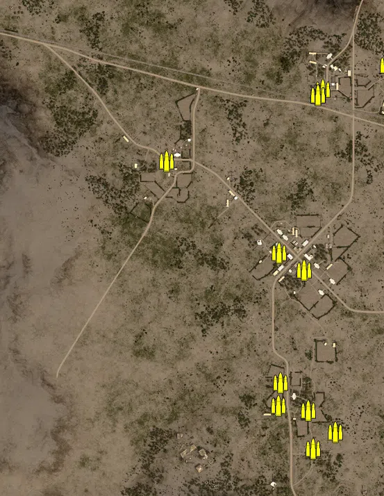
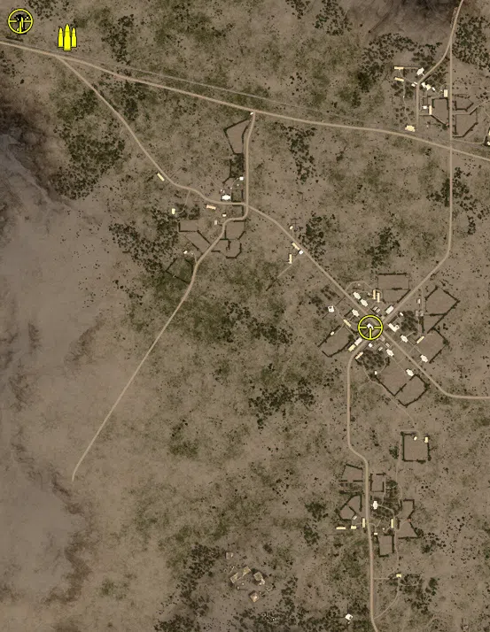
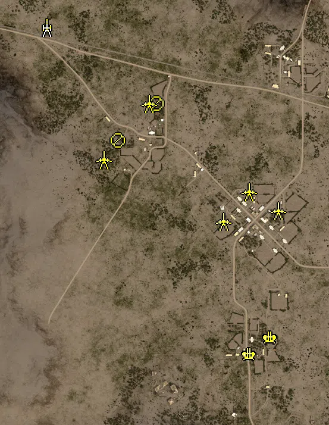
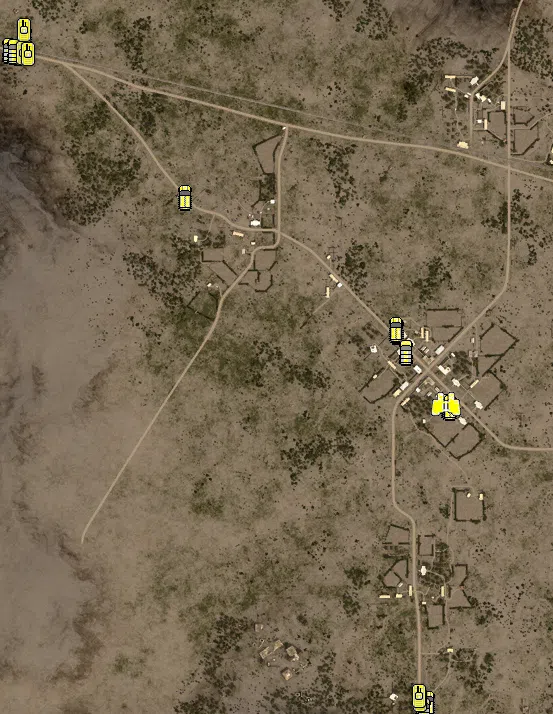

Static Ammo Crate

Pickup Kit

Static Emplacement

Vehicle

| gpo_subcat   | gpo_cat    | gpo_name               |    pos_x |   pos_y |    pos_z |   flag | is_locked   |   team | instance                        | gpo_cat_disp       | gpo_subcat_disp   |
|:-------------|:-----------|:-----------------------|---------:|--------:|---------:|-------:|:------------|-------:|:--------------------------------|:-------------------|:------------------|
| ammo_crate   | ammo_crate | ammo_crate             |  216.467 |  25.108 | -576.839 |      0 | False       |      0 | ammo_crate_0                    | Static Ammo Crate  | Static Ammo Crate |
| ammo_crate   | ammo_crate | ammo_crate             |  279.416 |  26.529 | -527.707 |      0 | False       |      0 | ammo_crate_1                    | Static Ammo Crate  | Static Ammo Crate |
| ammo_crate   | ammo_crate | ammo_crate             |  430.455 |  25.284 |  527.894 |      0 | False       |      0 | ammo_crate_2                    | Static Ammo Crate  | Static Ammo Crate |
| ammo_crate   | ammo_crate | ammo_crate             |  189.138 |  25.82  |  -62.477 |      0 | False       |      0 | ammo_crate_3                    | Static Ammo Crate  | Static Ammo Crate |
| ammo_crate   | ammo_crate | ammo_crate             |  116.151 |  25.427 | -451.057 |      0 | False       |      0 | ammo_crate_4                    | Static Ammo Crate  | Static Ammo Crate |
| ammo_crate   | ammo_crate | ammo_crate             | -205.933 |  30.222 |  252.251 |      0 | False       |      0 | ammo_crate_5                    | Static Ammo Crate  | Static Ammo Crate |
| ammo_crate   | ammo_crate | ammo_crate             |  201.872 |  27.225 | -466.602 |      0 | False       |      0 | ammo_crate_6                    | Static Ammo Crate  | Static Ammo Crate |
| ammo_crate   | ammo_crate | ammo_crate             |  118.608 |  26.427 |  -11.786 |      0 | False       |      0 | ammo_crate_7                    | Static Ammo Crate  | Static Ammo Crate |
| ammo_crate   | ammo_crate | ammo_crate             |  244.229 |  29.175 |  457.761 |      0 | False       |      0 | ammo_crate_8                    | Static Ammo Crate  | Static Ammo Crate |
| ammo_crate   | ammo_crate | ammo_crate             |  229.317 |  29.164 |  441.407 |      0 | False       |      0 | ammo_crate_9                    | Static Ammo Crate  | Static Ammo Crate |
| ammo_crate   | ammo_crate | ammo_crate             |  230.05  |  29.164 |  442.418 |      0 | False       |      0 | ammo_crate_10                   | Static Ammo Crate  | Static Ammo Crate |
| ammo_crate   | ammo_crate | ammo_crate             |  121.05  |  27.483 | -386.557 |      0 | False       |      0 | ammo_crate_11                   | Static Ammo Crate  | Static Ammo Crate |
| ammo         | kit        | UA_PickUpAmmokit       | -533.238 |  27.77  |  631.071 |    201 | False       |      0 | CP_32_bouzid_alliedmain_ammo    | Pickup Kit         | Ammo Kit          |
| arty_dep     | kit        | UW_PickUpMortar        | -638.932 |  30.282 |  666.01  |    201 | False       |      0 | CP_32_bouzid_alliedmain_mortar  | Pickup Kit         | Deployable Arty   |
| mg_dep       | kit        | UW_PickUpm1917a1       | -639.121 |  30.291 |  667.53  |    201 | False       |      0 | CP_32_bouzid_alliedmain_hmg     | Pickup Kit         | Deployable MG     |
| mg_dep       | kit        | UW_PickUp30Cal         | -641.924 |  30.266 |  667.606 |    201 | False       |      0 | CP_32_bouzid_alliedmain_mmg     | Pickup Kit         | Deployable MG     |
| sniper       | kit        | UA_PickUpScoutEnfield  | -640.096 |  31.075 |  668.107 |    201 | False       |      0 | CP_32_bouzid_alliedmain_sniper  | Pickup Kit         | Sniper Kit        |
| sniper       | kit        | UA_PickUpScoutEnfield  |  150.449 |  42.127 |  -24.686 |    203 | False       |      0 | CP_32_bouzid_sidibouzid_sniper  | Pickup Kit         | Sniper Kit        |
| arty         | static     | m2a1_howitzer_105mm    | -530.866 |  28.257 |  623.395 |    201 | False       |      0 | CP_32_bouzid_alliedmain_arti    | Static Emplacement | Artillery         |
| flak         | static     | flak18                 |  222.799 |  26.293 | -417.383 |    204 | True        |      1 | CP_32_bouzid_fallback_88a       | Static Emplacement | Anti-aircraft Gun |
| flak         | static     | flak18                 |  151.019 |  26.014 | -473.067 |    204 | True        |      1 | CP_32_bouzid_fallback_88b       | Static Emplacement | Anti-aircraft Gun |
| mg_nest      | static     | mg34_lafette           | -289.59  |  31.912 |  244.152 |    202 | False       |      0 | CP_32_bouzid_kern_lafette1      | Static Emplacement | Static MG         |
| mg_nest      | static     | mg34_lafette           | -160.774 |  29.944 |  367.879 |    202 | False       |      0 | CP_32_bouzid_kern_lafette2      | Static Emplacement | Static MG         |
| pak          | static     | pak40_static_ws        | -338.61  |  30.155 |  180.737 |    202 | True        |      1 | CP_32_bouzid_kern_atgun1        | Static Emplacement | Anti-tank Gun     |
| pak          | static     | pak40_static_ws        | -185.834 |  29.663 |  367.079 |    202 | True        |      1 | CP_32_bouzid_kern_atgun2        | Static Emplacement | Anti-tank Gun     |
| pak          | static     | pak40_static_ws        |   63.931 |  24.272 |  -27.158 |    203 | True        |      1 | CP_32_bouzid_sidibouzid_atgun1  | Static Emplacement | Anti-tank Gun     |
| pak          | static     | pak40_static_ws        |  150.712 |  26.62  |   72.948 |    203 | True        |      1 | CP_32_bouzid_sidibouzid_atgun2  | Static Emplacement | Anti-tank Gun     |
| pak          | static     | pak40_static_ws        |  248.939 |  28.636 |    7.424 |    203 | True        |      1 | CP_32_bouzid_sidibouzid_atgun3  | Static Emplacement | Anti-tank Gun     |
| apc          | vehicle    | gmc_m3_75mm            | -637.145 |  29.71  |  649.092 |    201 | True        |      0 | CP_32_bouzid_alliedmain_m3_75mm | Vehicle            | APC               |
| apc          | vehicle    | m3_scoutcar            | -636.195 |  29.228 |  640.742 |    201 | False       |      0 | CP_32_bouzid_alliedmain_apc1    | Vehicle            | APC               |
| apc          | vehicle    | m3_halftrack           | -648.203 |  29.06  |  611.965 |    201 | False       |      0 | CP_32_bouzid_alliedmain_apc2    | Vehicle            | APC               |
| apc          | vehicle    | m3_halftrack           | -315.639 |  28.958 |  322.999 |    202 | False       |      0 | CP_32_bouzid_kern_apc           | Vehicle            | APC               |
| apc          | vehicle    | sdkfz251_1             |  210.614 |  25.938 |  -95.624 |    203 | False       |      0 | CP_32_bouzid_sidibouzid_apc     | Vehicle            | APC               |
| apc          | vehicle    | sdkfz250_3_alt         |  213.967 |  26.047 |  -98.684 |    203 | False       |      0 | CP_32_bouzid_sidibouzid_apc2    | Vehicle            | APC               |
| apc          | vehicle    | gmc_m3_75mm            |  108.313 |  26.214 |   53.757 |    203 | True        |      0 | CP_32_bouzid_sidibouzid_m3_75mm | Vehicle            | APC               |
| apc          | vehicle    | m3_scoutcar            |  105.357 |  26.465 |   58.752 |    203 | False       |      0 | CP_32_bouzid_sidibouzid_apc_0   | Vehicle            | APC               |
| apc          | vehicle    | sdkfz251_1             |  157.903 |  25.418 | -695.506 |    204 | False       |      0 | CP_32_bouzid_fallback_apc       | Vehicle            | APC               |
| apc          | vehicle    | sdkfz251_10            |  169.75  |  26.235 | -690.006 |    204 | False       |      0 | CP_32_bouzid_fallback_gunapc    | Vehicle            | APC               |
| car          | vehicle    | gmc                    | -668.851 |  29.06  |  616.443 |    201 | False       |      0 | CP_32_bouzid_alliedmain_truck1  | Vehicle            | Car               |
| car          | vehicle    | gmc_nocanvas           | -658.081 |  29.06  |  614.099 |    201 | False       |      0 | CP_32_bouzid_alliedmain_truck2  | Vehicle            | Car               |
| car          | vehicle    | gmc_nocanvas           |  125.759 |  25.795 |   12.165 |    203 | False       |      0 | CP_32_bouzid_sidibouzid_truck1  | Vehicle            | Car               |
| car          | vehicle    | opelblitz_dak_nocanvas |  161.446 |  25.35  | -704     |    204 | False       |      0 | CP_32_bouzid_fallback_truck     | Vehicle            | Car               |
| recon        | vehicle    | sdkfz231_1             |  206.365 |  25.935 |  -91.373 |    202 | True        |      0 | CP_32_bouzid_kern_scout         | Vehicle            | Scout Vehicle     |
| tank         | vehicle    | m3_lee                 | -638.259 |  30.109 |  656.657 |    201 | True        |      0 | CP_32_bouzid_alliedmain_lee1    | Vehicle            | Tank              |
| tank         | vehicle    | m3_lee                 | -640.006 |  29.06  |  609.825 |    201 | True        |      0 | CP_32_bouzid_alliedmain_lee2    | Vehicle            | Tank              |
| tank         | vehicle    | m4a1_early             | -629.572 |  28.988 |  607.699 |    201 | True        |      0 | CP_32_bouzid_alliedmain_sherman | Vehicle            | Tank              |
| tank         | vehicle    | pziii_l_dak            |  154.417 |  25.541 | -684.944 |    204 | True        |      0 | CP_32_bouzid_fallback_pziii     | Vehicle            | Tank              |
| tank         | vehicle    | pzivf2                 |  152.611 |  25.653 | -675.578 |    204 | True        |      0 | CP_32_bouzid_fallback_pziv      | Vehicle            | Tank              |

