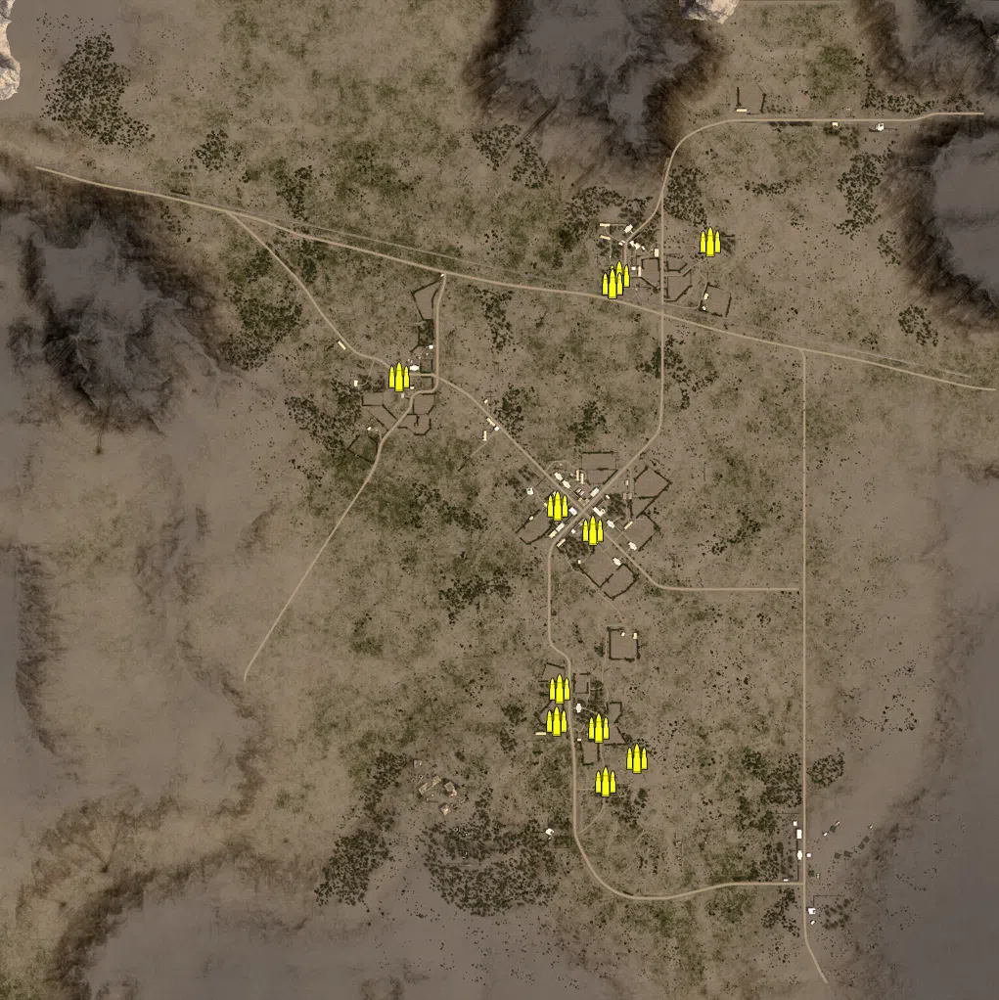
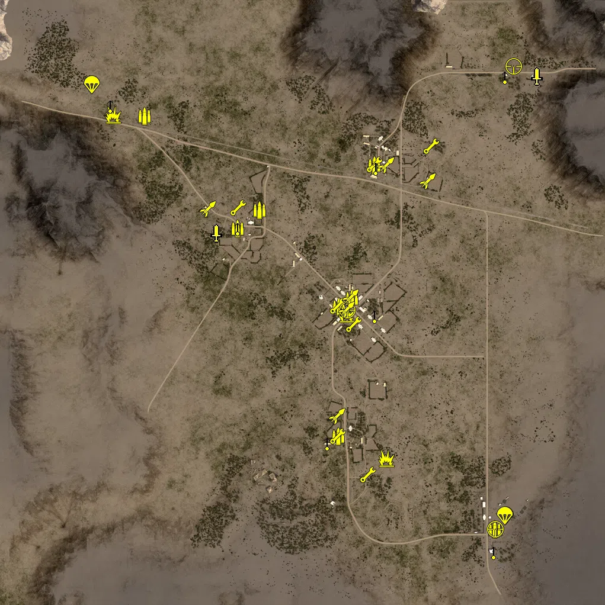
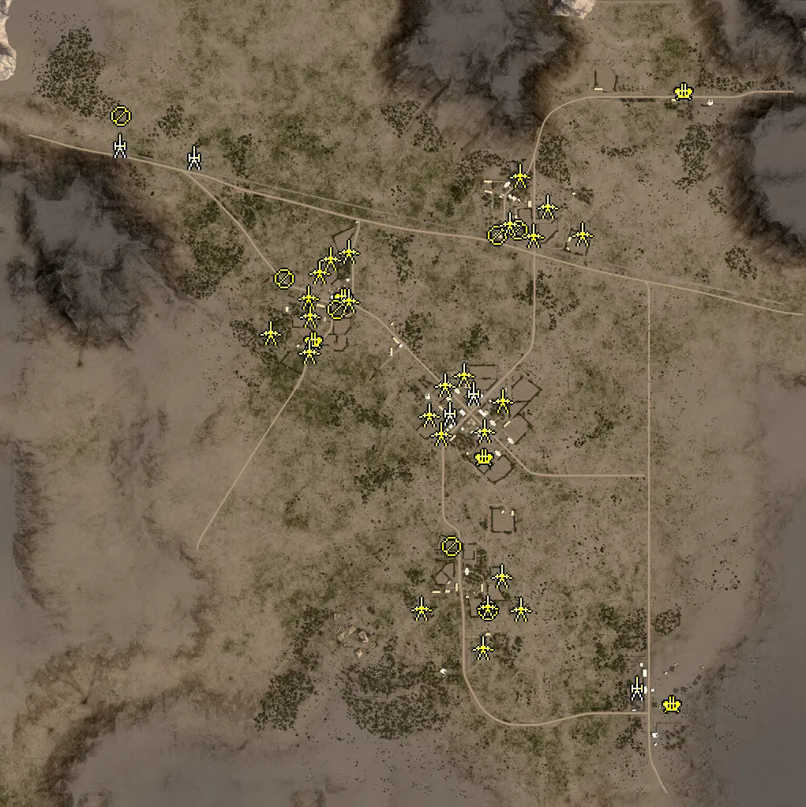
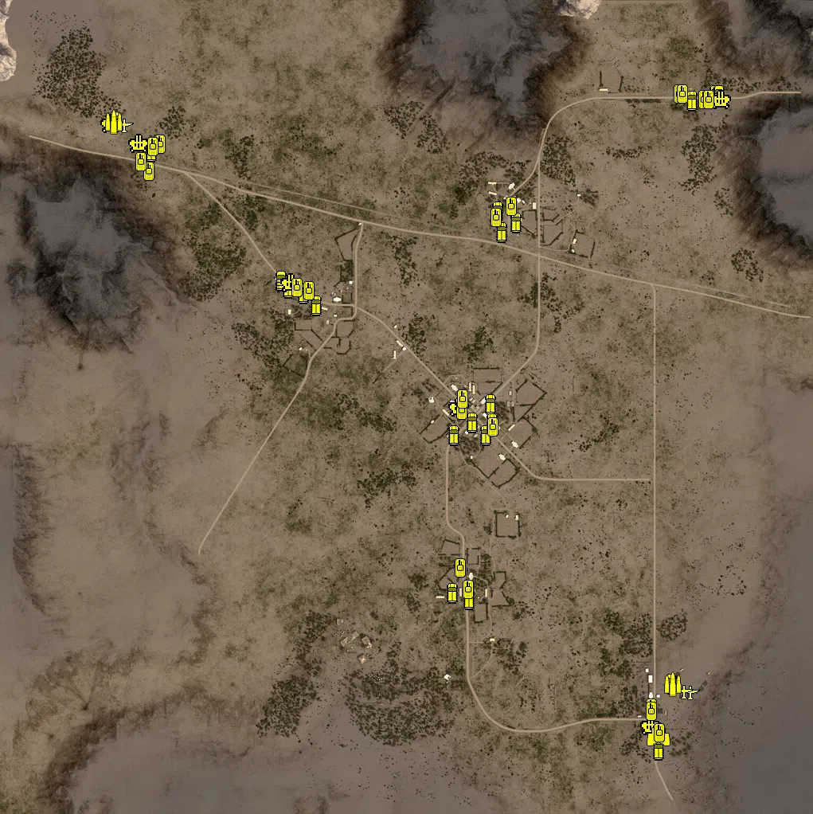

Static Ammo Crate

Pickup Kit

Static Emplacement

Vehicle

| gpo_subcat   | gpo_cat    | gpo_name                       |    pos_x |   pos_y |    pos_z |   flag | is_locked   |   team | instance                                                | gpo_cat_disp       | gpo_subcat_disp   |
|:-------------|:-----------|:-------------------------------|---------:|--------:|---------:|-------:|:------------|-------:|:--------------------------------------------------------|:-------------------|:------------------|
| ammo_crate   | ammo_crate | ammo_crate                     |  216.467 |  25.108 | -576.839 |      0 | False       |      0 | ammo_crate_0                                            | Static Ammo Crate  | Static Ammo Crate |
| ammo_crate   | ammo_crate | ammo_crate                     |  279.416 |  26.529 | -527.707 |      0 | False       |      0 | ammo_crate_1                                            | Static Ammo Crate  | Static Ammo Crate |
| ammo_crate   | ammo_crate | ammo_crate                     |  430.455 |  25.284 |  527.894 |      0 | False       |      0 | ammo_crate_2                                            | Static Ammo Crate  | Static Ammo Crate |
| ammo_crate   | ammo_crate | ammo_crate                     |  189.138 |  25.82  |  -62.477 |      0 | False       |      0 | ammo_crate_3                                            | Static Ammo Crate  | Static Ammo Crate |
| ammo_crate   | ammo_crate | ammo_crate                     |  116.151 |  25.427 | -451.057 |      0 | False       |      0 | ammo_crate_4                                            | Static Ammo Crate  | Static Ammo Crate |
| ammo_crate   | ammo_crate | ammo_crate                     | -205.933 |  30.222 |  252.251 |      0 | False       |      0 | ammo_crate_5                                            | Static Ammo Crate  | Static Ammo Crate |
| ammo_crate   | ammo_crate | ammo_crate                     |  201.872 |  27.225 | -466.602 |      0 | False       |      0 | ammo_crate_6                                            | Static Ammo Crate  | Static Ammo Crate |
| ammo_crate   | ammo_crate | ammo_crate                     |  118.608 |  26.427 |  -11.786 |      0 | False       |      0 | ammo_crate_7                                            | Static Ammo Crate  | Static Ammo Crate |
| ammo_crate   | ammo_crate | ammo_crate                     |  244.229 |  29.175 |  457.761 |      0 | False       |      0 | ammo_crate_8                                            | Static Ammo Crate  | Static Ammo Crate |
| ammo_crate   | ammo_crate | ammo_crate                     |  229.317 |  29.164 |  441.407 |      0 | False       |      0 | ammo_crate_9                                            | Static Ammo Crate  | Static Ammo Crate |
| ammo_crate   | ammo_crate | ammo_crate                     |  230.05  |  29.164 |  442.418 |      0 | False       |      0 | ammo_crate_10                                           | Static Ammo Crate  | Static Ammo Crate |
| ammo_crate   | ammo_crate | ammo_crate                     |  121.05  |  27.483 | -386.557 |      0 | False       |      0 | ammo_crate_11                                           | Static Ammo Crate  | Static Ammo Crate |
| ammo         | kit        | UA_PickUpAmmokit               |  122.575 |  25.82  |  -13.611 |    104 | False       |      0 | CP_64_SidiBouZid_SidiBouZid_ammo                        | Pickup Kit         | Ammo Kit          |
| ammo         | kit        | UA_PickUpAmmokit               |  165.068 |  26.6   |   14.854 |    104 | False       |      0 | CP_64_SidiBouZid_SidiBouZid_ammo_0                      | Pickup Kit         | Ammo Kit          |
| ammo         | kit        | UA_PickUpAmmokit               |  119.406 |  25.431 | -452.509 |    102 | False       |      0 | CP_64_SidiBouZid_Outpost_ammo                           | Pickup Kit         | Ammo Kit          |
| ammo         | kit        | UA_PickUpAmmokit               |  241.63  |  29.175 |  464.065 |    103 | False       |      0 | CP_64_SidiBouZid_PosteDeLessouda_ammo                   | Pickup Kit         | Ammo Kit          |
| ammo         | kit        | UA_PickUpAmmokit               | -220.523 |  30.418 |  249.776 |    105 | False       |      0 | CP_64_SidiBouZid_KernsCrossroads_ammo                   | Pickup Kit         | Ammo Kit          |
| ammo         | kit        | UA_PickUpAmmokit               | -145.836 |  28.816 |  311.889 |    105 | False       |      0 | CP_64_SidiBouZid_KernsCrossroads_ammo_0                 | Pickup Kit         | Ammo Kit          |
| ammo         | kit        | UA_PickUpAmmokit               | -534.524 |  27.77  |  630.893 |    106 | False       |      0 | CP_64_SidiBouZid_1stArmoredDivision_ammo                | Pickup Kit         | Ammo Kit          |
| ammo         | kit        | UA_PickUpAmmokit               |  648.69  |  40.991 | -765.441 |    101 | False       |      0 | CP_64_SidiBouZid_KGrSchuette_ammo                       | Pickup Kit         | Ammo Kit          |
| antitank     | kit        | UA_PickUpHawkinsThompson1928a1 |  281.216 |  26.706 | -526.184 |    107 | False       |      0 | CP_64_SidiBouZid_USSchuetteDummy_demolition             | Pickup Kit         | Tankhunter Kit    |
| antitank     | kit        | UA_PickUpHawkinsThompson1928a1 |  148.886 |  26.475 |  -37.731 |    104 | False       |      0 | CP_64_SidiBouZid_SidiBouZid_demolition                  | Pickup Kit         | Tankhunter Kit    |
| antitank     | kit        | UA_PickUpHawkinsThompson1928a1 | -640.174 |  29.642 |  634.734 |    106 | False       |      0 | CP_64_SidiBouZid_1stArmoredDivision_usdemolition        | Pickup Kit         | Tankhunter Kit    |
| commando     | kit        | GA_PickUpCommandoMp40          | -291.382 |  31.744 |  233.501 |    105 | False       |      0 | CP_64_SidiBouZid_KernsCrossroads_gerdemolition          | Pickup Kit         | Commando Kit      |
| commando     | kit        | GA_PickUpCommandoMp40          |  790.334 |  35.073 |  764.84  |      1 | False       |      0 | CP_64_SidiBouZid_KGrReimann_demoltion                   | Pickup Kit         | Commando Kit      |
| engineer     | kit        | UW_PickUpEngineerMines         |  219.18  |  25.739 | -581.739 |    107 | False       |      0 | CP_64_SidiBouZid_USSchuetteDummy_mines                  | Pickup Kit         | Engineer Kit      |
| engineer     | kit        | UW_PickUpEngineerMines         |  118.057 |  26.014 | -451.436 |    102 | False       |      0 | CP_64_SidiBouZid_Outpost_mines                          | Pickup Kit         | Engineer Kit      |
| engineer     | kit        | UW_PickUpEngineerMines         |  241.752 |  29.792 |  465.968 |    103 | False       |      0 | CP_64_SidiBouZid_PosteDeLessouda_mines                  | Pickup Kit         | Engineer Kit      |
| engineer     | kit        | UW_PickUpEngineerMines         |  118.401 |  26.455 |  -12.939 |    104 | False       |      0 | CP_64_SidiBouZid_SidiBouZid_mines                       | Pickup Kit         | Engineer Kit      |
| engineer     | kit        | UW_PickUpEngineerMines         |  172.044 |  26.415 |  -74.073 |    104 | False       |      0 | CP_64_SidiBouZid_SidiBouZid_mines_0                     | Pickup Kit         | Engineer Kit      |
| engineer     | kit        | UW_PickUpEngineerMines         |  433.503 |  25.617 |  528.986 |    108 | False       |      0 | CP_64_SidiBouZid_USReimannDummy_mines                   | Pickup Kit         | Engineer Kit      |
| engineer     | kit        | UW_PickUpEngineerMines         | -218.916 |  31.669 |  320.469 |    105 | False       |      0 | CP_64_SidiBouZid_KernsCrossroads_mines                  | Pickup Kit         | Engineer Kit      |
| mg_dep       | kit        | UW_PickUpm1917a1               |  246.303 |  29.755 |  456.589 |    103 | False       |      0 | CP_64_SidiBouZid_PosteDeLessouda_mgtripod               | Pickup Kit         | Deployable MG     |
| mg_dep       | kit        | UW_PickUpm1917a1               |  241.05  |  26.376 |  -43.306 |    104 | False       |      0 | CP_64_SidiBouZid_SidiBouZid_tripod                      | Pickup Kit         | Deployable MG     |
| mg_dep       | kit        | UW_PickUpm1917a1               |   82.559 |  26.943 | -473.119 |    102 | False       |      0 | CP_64_SidiBouZid_Outpost_tripod                         | Pickup Kit         | Deployable MG     |
| mg_dep       | kit        | UW_PickUpm1917a1               | -219.531 |  30.931 |  252.439 |    105 | False       |      0 | CP_64_SidiBouZid_KernsCrossroads_ustripod               | Pickup Kit         | Deployable MG     |
| mg_dep       | kit        | UW_PickUpm1917a1               | -649.417 |  30.588 |  665.041 |    106 | False       |      0 | CP_64_SidiBouZid_1stArmoredDivision_ustripod            | Pickup Kit         | Deployable MG     |
| mg_dep       | kit        | UW_PickUpm1917a1               |  644.941 |  41.09  | -841.208 |    101 | False       |      0 | CP_64_SidiBouZid_KGrSchuette_tripod                     | Pickup Kit         | Deployable MG     |
| mg_dep       | kit        | UW_PickUpm1917a1               |  682.898 |  29.826 |  764.826 |      1 | False       |      0 | CP_64_SidiBouZid_KGrReimann_tripod                      | Pickup Kit         | Deployable MG     |
| parachute    | kit        | UW_PickUpPilotcolt1911         | -712.903 |  30.812 |  735.688 |    106 | False       |      0 | CP_64_SidiBouZid_1stArmoredDivision_pilot               | Pickup Kit         | Parachute Kit     |
| parachute    | kit        | UW_PickUpPilotcolt1911         | -712.054 |  30.812 |  736.573 |    106 | False       |      0 | CP_64_SidiBouZid_1stArmoredDivision_pilot_0             | Pickup Kit         | Parachute Kit     |
| parachute    | kit        | UW_PickUpPilotcolt1911         |  683.641 |  41.741 | -719.233 |    101 | False       |      0 | CP_64_SidiBouZid_KGrSchuette_pilot                      | Pickup Kit         | Parachute Kit     |
| parachute    | kit        | UW_PickUpPilotcolt1911         |  682.68  |  41.745 | -720.873 |    101 | False       |      0 | CP_64_SidiBouZid_KGrSchuette_pilot_0                    | Pickup Kit         | Parachute Kit     |
| sniper       | kit        | UA_PickUpScoutEnfield          |  150.428 |  30.41  |  -25.078 |    104 | False       |      0 | CP_64_SidiBouZid_SidiBouZid_sniper                      | Pickup Kit         | Sniper Kit        |
| sniper       | kit        | UA_PickUpScoutEnfield          |  650.391 |  41.613 | -766.867 |    101 | False       |      0 | CP_64_SidiBouZid_KGrSchuette_gersniper                  | Pickup Kit         | Sniper Kit        |
| sniper       | kit        | UA_PickUpScoutEnfield          |  712.276 |  30.567 |  798.646 |      1 | False       |      0 | CP_64_SidiBouZid_KGrReimann_sniper                      | Pickup Kit         | Sniper Kit        |
| zooka        | kit        | UA_PickUpBazooka               |  161.166 |  26.607 |   17.199 |    104 | False       |      0 | CP_64_SidiBouZid_SidiBouZid_KitBazooka_1                | Pickup Kit         | HEAT Thrower      |
| zooka        | kit        | UA_PickUpBazooka               |  281.837 |  29.671 |  463.428 |    103 | False       |      0 | CP_64_SidiBouZid_PosteDeLessouda_bazooka                | Pickup Kit         | HEAT Thrower      |
| zooka        | kit        | UA_PickUpBazooka               |  421.917 |  29.161 |  409.67  |    108 | False       |      0 | CP_64_SidiBouZid_USReimannDummy_2_1                     | Pickup Kit         | HEAT Thrower      |
| zooka        | kit        | UA_PickUpBazooka               |  116.349 |  27.341 | -384.593 |    102 | False       |      0 | CP_64_SidiBouZid_Outpost_bazooka                        | Pickup Kit         | HEAT Thrower      |
| zooka        | kit        | UA_PickUpBazooka               |  148.506 |  29.967 |  -23.204 |    104 | False       |      0 | CP_64_SidiBouZid_SidiBouZid_bazooka                     | Pickup Kit         | HEAT Thrower      |
| zooka        | kit        | UA_PickUpBazooka               | -319.235 |  29.613 |  315.942 |    105 | False       |      0 | CP_64_SidiBouZid_KernsCrossroads_bazooka                | Pickup Kit         | HEAT Thrower      |
| noidea       | noidea     |                                | -696.172 |  30.477 |  693.839 |    106 | True        |      2 | CP_64_SidiBouZid_1stArmoredDivision_Counter_P40e        | FIXME UNASSIGNED   | FIXME UNASSIGNED  |
| noidea       | noidea     |                                | -647.85  |  29.501 |  600.807 |    106 | True        |      2 | CP_64_SidiBouZid_1stArmoredDivision_Counter_Stuart      | FIXME UNASSIGNED   | FIXME UNASSIGNED  |
| noidea       | noidea     |                                | -658.138 |  29.398 |  606.695 |    106 | True        |      2 | CP_64_SidiBouZid_1stArmoredDivision_Counter_Lee         | FIXME UNASSIGNED   | FIXME UNASSIGNED  |
| noidea       | noidea     |                                | -614.552 |  30.452 |  666.255 |    106 | True        |      2 | CP_64_SidiBouZid_1stArmoredDivision_Counter_Stuart_0    | FIXME UNASSIGNED   | FIXME UNASSIGNED  |
| noidea       | noidea     |                                | -625.182 |  30.408 |  655.358 |    106 | True        |      2 | CP_64_SidiBouZid_1stArmoredDivision_Counter_Sherman     | FIXME UNASSIGNED   | FIXME UNASSIGNED  |
| noidea       | noidea     |                                | -296.369 |  29.815 |  290.424 |    105 | True        |      0 | CP_64_SidiBouZid_KernsCrossroads_Counter_Sherman        | FIXME UNASSIGNED   | FIXME UNASSIGNED  |
| noidea       | noidea     |                                | -255.568 |  29.95  |  294.716 |    105 | True        |      0 | CP_64_SidiBouZid_KernsCrossroads_Counter_Sherman_0      | FIXME UNASSIGNED   | FIXME UNASSIGNED  |
| noidea       | noidea     |                                | -294.904 |  29.46  |  311.512 |    105 | False       |      0 | CP_64_SidiBouZid_KernsCrossroads_Counter_M3Halftrack    | FIXME UNASSIGNED   | FIXME UNASSIGNED  |
| noidea       | noidea     |                                | -258.711 |  29.84  |  281.792 |    105 | False       |      0 | CP_64_SidiBouZid_KernsCrossroads_Counter_M3Halftrack_0  | FIXME UNASSIGNED   | FIXME UNASSIGNED  |
| noidea       | noidea     |                                | -640.716 |  29.457 |  646.355 |    106 | False       |      0 | CP_64_SidiBouZid_1stArmoredDivision_Counter_M3Halftrack | FIXME UNASSIGNED   | FIXME UNASSIGNED  |
| noidea       | noidea     |                                | -652.68  |  29.06  |  612.579 |    106 | False       |      0 | CP_64_SidiBouZid_1stArmoredDivision_Counter_Scoutcar    | FIXME UNASSIGNED   | FIXME UNASSIGNED  |
| arty         | static     | nebelwerfer                    |  590.429 |  39.532 | -719.53  |    101 | False       |      0 | CP_64_SidiBouZid_KGrSchuette_Arty_1                     | Static Emplacement | Artillery         |
| arty         | static     | m2a1_howitzer_105mm            | -531.612 |  28.272 |  623.354 |    106 | False       |      0 | CP_64_SidiBouZid_1stArmoredDivision_Arty_1              | Static Emplacement | Artillery         |
| arty         | static     | m2a1_howitzer_105mm            | -720.331 |  29.668 |  653.198 |    106 | False       |      0 | CP_64_SidiBouZid_1stArmoredDivision_Arty_2              | Static Emplacement | Artillery         |
| arty         | static     | sgwr34                         |  115.079 |  25.898 |  -23.653 |    104 | False       |      0 | CP_64_SidiBouZid_SidiBouZid_Mortar                      | Static Emplacement | Artillery         |
| arty         | static     | sgwr34                         |  175.485 |  26.072 |   26.589 |    104 | False       |      0 | CP_64_SidiBouZid_SidiBouZid_mortar_0                    | Static Emplacement | Artillery         |
| flak         | static     | flakvierling38                 |  712.12  |  30.436 |  789.074 |      1 | False       |      0 | CP_64_SidiBouZid_KGrReimann_AntiAir_1                   | Static Emplacement | Anti-aircraft Gun |
| flak         | static     | flak38                         |  681.821 |  41.771 | -761.787 |    101 | False       |      0 | CP_64_SidiBouZid_KGrSchuette_AntiAir_1                  | Static Emplacement | Anti-aircraft Gun |
| flak         | static     | flak38                         | -225.929 |  26.577 |  159.924 |    105 | False       |      0 | CP_64_SidiBouZid_KernsCrossroads_Flak                   | Static Emplacement | Anti-aircraft Gun |
| flak         | static     | flak38                         | -149.612 |  27.219 |  269.062 |    105 | False       |      0 | CP_64_SidiBouZid_KernsCrossroads_Flak_0                 | Static Emplacement | Anti-aircraft Gun |
| flak         | static     | flakvierling38                 |  206.215 |  27.221 | -135.642 |    104 | False       |      0 | CP_64_SidiBouZid_SidiBouZid_AntiAir_0                   | Static Emplacement | Anti-aircraft Gun |
| mg_nest      | static     | 50cal_tripod                   |  289.806 |  29.235 |  439.579 |    103 | False       |      0 | CP_64_SidiBouZid_PosteDeLessouda_AntiAir_1              | Static Emplacement | Static MG         |
| mg_nest      | static     | 50cal_tripod                   |  121.41  |  27.748 | -362.039 |    102 | False       |      0 | CP_64_SidiBouZid_Outpost_AntiAir_1                      | Static Emplacement | Static MG         |
| mg_nest      | static     | 50cal_tripod                   | -168.185 |  26.279 |  237.975 |    105 | False       |      0 | CP_64_SidiBouZid_KernsCrossroads_AntiAir_1              | Static Emplacement | Static MG         |
| mg_nest      | static     | m1919a4_emplaced               |  213.089 |  26.876 | -523.041 |    102 | False       |      0 | CP_64_SidiBouZid_Outpost_MG_1                           | Static Emplacement | Static MG         |
| mg_nest      | static     | m1917_tripod                   |  238.054 |  29.764 |  426.794 |    103 | False       |      0 | CP_64_SidiBouZid_PosteDeLessouda_MG_1                   | Static Emplacement | Static MG         |
| mg_nest      | static     | 50cal_tripod                   | -302.103 |  29.353 |  316.292 |    105 | False       |      0 | CP_64_SidiBouZid_KernsCrossroads_AntiAir_0              | Static Emplacement | Static MG         |
| mg_nest      | static     | 50cal_tripod                   | -716.977 |  30.477 |  727.325 |    106 | False       |      0 | CP_64_SidiBouZid_1stArmoredDivision_AntiAir2            | Static Emplacement | Static MG         |
| pak          | static     | 37mm_m3_static                 |  363.706 |  27.517 |  500.608 |    103 | True        |      2 | CP_64_SidiBouZid_PosteDeLessouda_AntiTank_1             | Static Emplacement | Anti-tank Gun     |
| pak          | static     | 37mm_m3_static                 |  293.552 |  37.155 |  577.501 |    103 | True        |      2 | CP_64_SidiBouZid_PosteDeLessouda_AntiTank_2             | Static Emplacement | Anti-tank Gun     |
| pak          | static     | 37mm_m3_static                 |  267.741 |  29.857 |  455.924 |    103 | True        |      2 | CP_64_SidiBouZid_PosteDeLessouda_AntiTank_3             | Static Emplacement | Anti-tank Gun     |
| pak          | static     | 37mm_m3_static                 |  211.947 |  27.213 | -514.584 |    102 | True        |      2 | CP_64_SidiBouZid_Outpost_AntiTank_1                     | Static Emplacement | Anti-tank Gun     |
| pak          | static     | 37mm_m3_static                 |   43.516 |  29.007 | -517.137 |    102 | True        |      2 | CP_64_SidiBouZid_Outpost_AntiTank_2                     | Static Emplacement | Anti-tank Gun     |
| pak          | static     | 37mm_m3_static                 | -240.149 |  26.59  |  132.009 |    105 | True        |      2 | CP_64_SidiBouZid_KernsCrossroads_AntiTank_1             | Static Emplacement | Anti-tank Gun     |
| pak          | static     | 37mm_m3_static                 | -139.944 |  27.825 |  262.318 |    105 | True        |      2 | CP_64_SidiBouZid_KernsCrossroads_AntiTank_2             | Static Emplacement | Anti-tank Gun     |
| pak          | static     | 37mm_m3_static                 | -139.63  |  31.116 |  386.865 |    105 | True        |      2 | CP_64_SidiBouZid_KernsCrossroads_AntiTank_3             | Static Emplacement | Anti-tank Gun     |
| pak          | static     | 37mm_m3_static                 | -238.587 |  32.128 |  223.624 |    105 | True        |      2 | CP_64_SidiBouZid_KernsCrossroads_AntiTank_4             | Static Emplacement | Anti-tank Gun     |
| pak          | static     | 37mm_m3_static                 | -214.325 |  32.471 |  333.275 |    105 | True        |      2 | CP_64_SidiBouZid_KernsCrossroads_AntiTank_5             | Static Emplacement | Anti-tank Gun     |
| pak          | static     | 37mm_m3_static                 |  203.617 |  26.599 |  -67.487 |    104 | True        |      2 | CP_64_SidiBouZid_SidiBouZid_AntiTank_1                  | Static Emplacement | Anti-tank Gun     |
| pak          | static     | 37mm_m3_static                 |   94.108 |  26.534 |  -75.31  |    104 | True        |      2 | CP_64_SidiBouZid_SidiBouZid_AntiTank_2                  | Static Emplacement | Anti-tank Gun     |
| pak          | static     | 37mm_m3_static                 |  249.185 |  28.774 |    8.475 |    104 | True        |      2 | CP_64_SidiBouZid_SidiBouZid_AntiTank_3                  | Static Emplacement | Anti-tank Gun     |
| pak          | static     | pak40_static_ws                |  103.832 |  26.625 |   48.07  |    104 | True        |      1 | CP_64_SidiBouZid_SidiBouZid_AntiTank_4                  | Static Emplacement | Anti-tank Gun     |
| pak          | static     | pak40_static_ws                | -186.513 |  29.701 |  367.479 |    105 | True        |      1 | CP_64_SidiBouZid_KernsCrossroads_AntiTank_8             | Static Emplacement | Anti-tank Gun     |
| pak          | static     | pak40_static_ws                | -242.718 |  30.356 |  269.489 |    105 | True        |      1 | CP_64_SidiBouZid_KernsCrossroads_AntiTank_9             | Static Emplacement | Anti-tank Gun     |
| pak          | static     | pak40_static_ws                | -338.35  |  30.21  |  180.525 |    105 | True        |      1 | CP_64_SidiBouZid_KernsCrossroads_AntiTank_10            | Static Emplacement | Anti-tank Gun     |
| pak          | static     | 37mm_m3                        |  328.712 |  29.154 |  426.727 |    103 | False       |      0 | CP_64_SidiBouZid_PosteDeLessouda_AntiTank_4             | Static Emplacement | Anti-tank Gun     |
| pak          | static     | 37mm_m3_static                 |  247.845 |  26.633 | -436.339 |    102 | True        |      2 | CP_64_SidiBouZid_Outpost_AntiTank_3                     | Static Emplacement | Anti-tank Gun     |
| pak          | static     | 37mm_m3_static                 |  199.683 |  27.136 | -618.74  |    107 | True        |      2 | CP_64_SidiBouZid_USSchuetteDummy_AntiTank1              | Static Emplacement | Anti-tank Gun     |
| pak          | static     | 37mm_m3_static                 |  295.817 |  28.241 | -520.37  |    107 | True        |      2 | CP_64_SidiBouZid_USSchuetteDummy_AntiTank2              | Static Emplacement | Anti-tank Gun     |
| pak          | static     | 37mm_m3_static                 |  451.31  |  28.509 |  429.878 |    108 | True        |      2 | CP_64_SidiBouZid_USReimannDummy_1_1                     | Static Emplacement | Anti-tank Gun     |
| pak          | static     | pak38_static                   |   63.96  |  24.245 |  -27.274 |    104 | False       |      0 | CP_64_SidiBouZid_SidiBouZid_AntiTank                    | Static Emplacement | Anti-tank Gun     |
| pak          | static     | pak38_static                   |  151.361 |  26.554 |   73.528 |    104 | False       |      0 | CP_64_SidiBouZid_SidiBouZid_AntiTank_0                  | Static Emplacement | Anti-tank Gun     |
| apc          | vehicle    | sdkfz250_3_alt                 |  716.637 |  31.7   |  770.234 |      1 | False       |      0 | CP_64_SidiBouZid_KGrReimann_APC_1                       | Vehicle            | APC               |
| apc          | vehicle    | sdkfz251_1                     |  773.671 |  34.403 |  784.008 |      1 | False       |      0 | CP_64_SidiBouZid_KGrReimann_FastTransport_1             | Vehicle            | APC               |
| apc          | vehicle    | m3_scoutcar                    |  228.395 |  29.43  |  491.491 |    103 | False       |      0 | CP_64_SidiBouZid_PosteDeLessouda_APC_1                  | Vehicle            | APC               |
| apc          | vehicle    | sdkfz250_3_alt                 |  273.415 |  29.158 |  464.579 |    103 | False       |      0 | CP_64_SidiBouZid_PosteDeLessouda_Transport_1            | Vehicle            | APC               |
| apc          | vehicle    | gmc_m3_75mm                    |  210.937 |  25.919 |    8.185 |    103 | True        |      2 | CP_64_SidiBouZid_PosteDeLessouda_MediumTank_2           | Vehicle            | APC               |
| apc          | vehicle    | m3_scoutcar                    |  155.007 |  25.817 | -481.669 |    102 | False       |      0 | CP_64_SidiBouZid_Outpost_APC_1                          | Vehicle            | APC               |
| apc          | vehicle    | sdkfz250_3_alt                 |  113.181 |  25.823 | -466.973 |    102 | False       |      0 | CP_64_SidiBouZid_Outpost_Transport_1                    | Vehicle            | APC               |
| apc          | vehicle    | gmc_m3_75mm                    |  118.12  |  25.694 |  -69.744 |    102 | True        |      2 | CP_64_SidiBouZid_Outpost_MediumTank_2                   | Vehicle            | APC               |
| apc          | vehicle    | m3_scoutcar                    |  197.061 |  25.935 |  -69.075 |    104 | False       |      0 | CP_64_SidiBouZid_SidiBouZid_APC_1                       | Vehicle            | APC               |
| apc          | vehicle    | m3_halftrack                   |  213.684 |  25.82  |  -39.166 |    104 | False       |      0 | CP_64_SidiBouZid_SidiBouZid_Transport_2                 | Vehicle            | APC               |
| apc          | vehicle    | sdkfz250_3_alt                 |  631.723 |  40.987 | -859.094 |    101 | False       |      0 | CP_64_SidiBouZid_KGrSchuette_APC_1                      | Vehicle            | APC               |
| apc          | vehicle    | gmc_m3_75mm                    | -297.882 |  29.542 |  299.466 |    105 | True        |      2 | CP_64_SidiBouZid_KernsCrossroads_AntiTank_1_1           | Vehicle            | APC               |
| apc          | vehicle    | gmc_m3_75mm                    | -260.351 |  29.925 |  285.553 |    105 | True        |      2 | CP_64_SidiBouZid_KernsCrossroads_AntiTank_1_0           | Vehicle            | APC               |
| apc          | vehicle    | m3_halftrack                   | -642.059 |  29.185 |  641.139 |    104 | False       |      0 | CP_64_SidiBouZid_SidiBouZid_APC                         | Vehicle            | APC               |
| apc          | vehicle    | m3_scoutcar                    | -228.308 |  30.777 |  256.429 |    104 | False       |      0 | CP_64_SidiBouZid_SidiBouZid_APC_0                       | Vehicle            | APC               |
| apc          | vehicle    | gmc_m3_75mm                    |  238.206 |  29.175 |  439.587 |    103 | True        |      2 | CP_64_SidiBouZid_PosteDeLessouda_TankHunter0            | Vehicle            | APC               |
| apc          | vehicle    | sdkfz251_1                     |  163.818 |  25.714 |  -38.98  |    104 | False       |      0 | CP_64_SidiBouZid_SidiBouZid_APC_2                       | Vehicle            | APC               |
| car          | vehicle    | opelblitz_dak                  |  783.221 |  34.406 |  784.007 |      1 | False       |      0 | CP_64_SidiBouZid_KGrReimann_Transport_1                 | Vehicle            | Car               |
| car          | vehicle    | opelblitz_dak_nocanvas         |  663.653 |  42.288 | -694.216 |    101 | False       |      0 | CP_64_SidiBouZid_KGrSchuette_Transport_1                | Vehicle            | Car               |
| car          | vehicle    | willysmb_us                    | -733.018 |  30.477 |  717.899 |    104 | False       |      0 | CP_64_SidiBouZid_SidiBouZid_FastTransport               | Vehicle            | Car               |
| car          | vehicle    | willysmb_us                    | -315.011 |  29.031 |  317.452 |    104 | False       |      0 | CP_64_SidiBouZid_SidiBouZid_FastTransport_0             | Vehicle            | Car               |
| flak_sp      | vehicle    | opelblitz_flak38_dak           |  790.699 |  34.441 |  772.205 |      1 | False       |      0 | CP_64_SidiBouZid_KGrReimann_MobileAntiAir_1             | Vehicle            | Mobile FlaK       |
| flak_sp      | vehicle    | m33                            | -672.394 |  30.197 |  661.384 |    106 | False       |      0 | CP_64_SidiBouZid_1stArmoredDivision_AntiAir             | Vehicle            | Mobile FlaK       |
| flak_sp      | vehicle    | sdkfz7_flak_dak                |  614.747 |  41.382 | -799.955 |    101 | False       |      0 | CP_64_SidiBouZid_KGrSchuette_FastTransport_1            | Vehicle            | Mobile FlaK       |
| flak_sp      | vehicle    | m13_mgmc                       |  131.365 |  25.87  |   -0.279 |    104 | False       |      0 | CP_64_SidiBouZid_SidiBouZid_AntiAir                     | Vehicle            | Mobile FlaK       |
| flak_sp      | vehicle    | m13_mgmc                       | -289.587 |  29.601 |  312.217 |    105 | False       |      0 | CP_64_SidiBouZid_KernsCrossroads_AntiAir                | Vehicle            | Mobile FlaK       |
| flak_sp      | vehicle    | m13_mgmc                       | -741.775 |  30.606 |  711.731 |    106 | False       |      0 | CP_64_SidiBouZid_1stArmoredDivision_AntiAir_0           | Vehicle            | Mobile FlaK       |
| plane        | vehicle    | bf109f4_trop                   |  712.339 |  42.015 | -716.253 |    101 | True        |      1 | CP_64_SidiBouZid_KGrSchuette_Fighter_1                  | Vehicle            | Airplane          |
| plane        | vehicle    | ju87d1_trop                    |  695.094 |  42.815 | -714.961 |    101 | True        |      1 | CP_64_SidiBouZid_KGrSchuette_TacBomber_1                | Vehicle            | Airplane          |
| plane        | vehicle    | spitfiremkvb_usaaf             | -709.199 |  30.478 |  707.454 |    106 | True        |      2 | CP_64_SidiBouZid_1stArmoredDivision_Fighter_1           | Vehicle            | Airplane          |
| recon        | vehicle    | sdkfz231_1                     |  632.688 |  41.089 | -827.148 |    101 | True        |      1 | CP_64_SidiBouZid_KGrSchuette_Recon_1                    | Vehicle            | Scout Vehicle     |
| supply       | vehicle    | opelblitz_dak_ammo             |  667.515 |  42.296 | -696.419 |    101 | False       |      0 | CP_64_SidiBouZid_KGrSchuette_AmmoTransport_1            | Vehicle            | Supply Vehicle    |
| supply       | vehicle    | gmc_ammo                       | -735.931 |  30.534 |  715.193 |    106 | False       |      0 | CP_64_SidiBouZid_1stArmoredDivision_TransportAmmo_1     | Vehicle            | Supply Vehicle    |
| tank         | vehicle    | tiger_dak                      |  683.319 |  29.863 |  786.006 |      1 | True        |      1 | CP_64_SidiBouZid_KGrReimann_Tiger_1                     | Vehicle            | Tank              |
| tank         | vehicle    | pziii_n_dak                    |  746.987 |  33.109 |  772.5   |      1 | True        |      1 | CP_64_SidiBouZid_KGrReimann_SupportTank_1               | Vehicle            | Tank              |
| tank         | vehicle    | pziii_n_dak                    |  758.115 |  34.378 |  772.548 |      1 | True        |      1 | CP_64_SidiBouZid_KGrReimann_SupportTank_2               | Vehicle            | Tank              |
| tank         | vehicle    | pziif                          |  692.857 |  30.035 |  785.117 |      1 | True        |      1 | CP_64_SidiBouZid_KGrReimann_LightTank_1                 | Vehicle            | Tank              |
| tank         | vehicle    | m4a1_early                     |  223.031 |  29.196 |  476.693 |    103 | True        |      2 | CP_64_SidiBouZid_PosteDeLessouda_MediumTank_1           | Vehicle            | Tank              |
| tank         | vehicle    | m3_lee                         |  133.582 |  25.685 | -404.488 |    102 | True        |      2 | CP_64_SidiBouZid_Outpost_MediumTank_1                   | Vehicle            | Tank              |
| tank         | vehicle    | m3a1_stuart                    |  138.069 |  25.87  |   -7.497 |    104 | True        |      2 | CP_64_SidiBouZid_SidiBouZid_LightTank_1                 | Vehicle            | Tank              |
| tank         | vehicle    | m3_lee                         | -275.849 |  29.78  |  300.557 |    104 | True        |      2 | CP_64_SidiBouZid_SidiBouZid_MediumTank_1                | Vehicle            | Tank              |
| tank         | vehicle    | m4a1_early                     |  140.503 |  25.782 |   19.42  |    104 | True        |      2 | CP_64_SidiBouZid_SidiBouZid_MediumTank_2                | Vehicle            | Tank              |
| tank         | vehicle    | pzivf2                         |  633.944 |  41.123 | -818.367 |    101 | True        |      1 | CP_64_SidiBouZid_KGrSchuette_MediumTank_1               | Vehicle            | Tank              |
| tank         | vehicle    | pziii_l_dak                    |  614.053 |  41.616 | -755.424 |    101 | True        |      1 | CP_64_SidiBouZid_KGrSchuette_MediumTank_2               | Vehicle            | Tank              |
| tank         | vehicle    | pziii_l_dak                    |  613.942 |  41.435 | -764.353 |    101 | True        |      1 | CP_64_SidiBouZid_KGrSchuette_MediumTank_3               | Vehicle            | Tank              |
| tank         | vehicle    | m3_lee                         | -647.523 |  29.642 |  591.49  |    106 | True        |      2 | CP_64_SidiBouZid_1stArmoredDivision_MediumTank_2        | Vehicle            | Tank              |
| tank         | vehicle    | m4a1_early                     | -619.622 |  30.447 |  660.589 |    106 | True        |      2 | CP_64_SidiBouZid_1stArmoredDivision_MediumTank_3        | Vehicle            | Tank              |
| tank         | vehicle    | m4a1_early                     | -668.205 |  29.06  |  615.604 |    106 | True        |      2 | CP_64_SidiBouZid_1stArmoredDivision_MediumTank_4        | Vehicle            | Tank              |
| tank         | vehicle    | m3a1_stuart                    | -246.121 |  30.059 |  291.041 |    104 | True        |      2 | CP_64_SidiBouZid_SidiBouZid_LightTank2                  | Vehicle            | Tank              |
| tank         | vehicle    | m3_lee                         | -637.882 |  29.958 |  653.468 |    106 | True        |      0 | CP_64_SidiBouZid_1stArmoredDivision_MediumTank_5        | Vehicle            | Tank              |
| tank         | vehicle    | pziii_l_dak                    |  154.778 |  26.492 | -457.224 |    102 | True        |      0 | CP_64_SidiBouZid_Outpost_MediumAromor                   | Vehicle            | Tank              |
| tank         | vehicle    | pziii_n_dak                    |  262.987 |  30.142 |  503.052 |    103 | True        |      0 | CP_64_SidiBouZid_PosteDeLessouda_MediumArmor            | Vehicle            | Tank              |
| tank         | vehicle    | pziii_l_dak                    |  216.024 |  25.82  |  -50.123 |    104 | True        |      0 | CP_64_SidiBouZid_SidiBouZid_MediumTank_0                | Vehicle            | Tank              |

