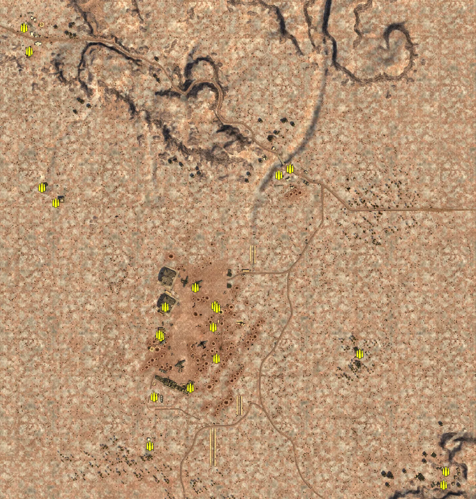
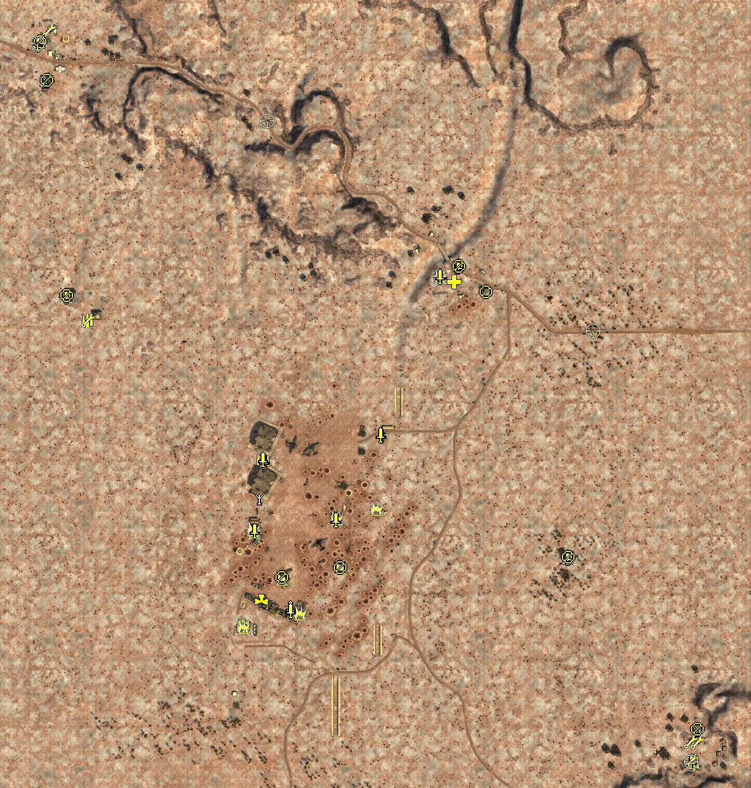
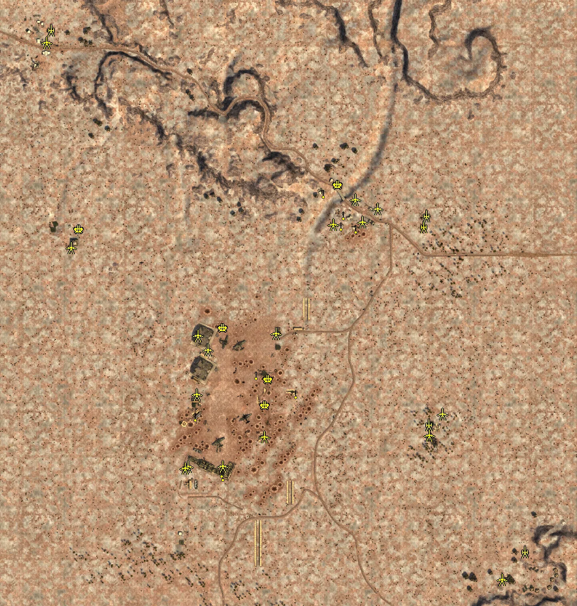
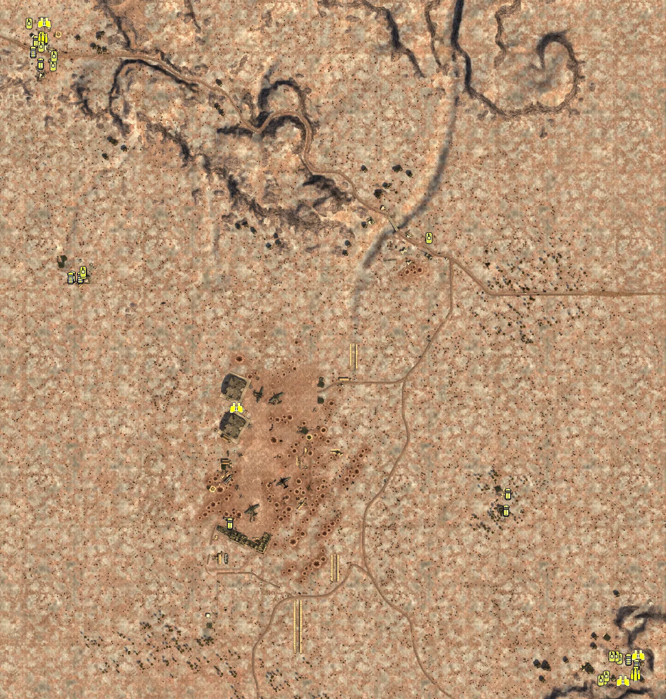

Static Ammo Crate

Pickup Kit

Static Emplacement

Vehicle

| Icon                        | SubCat            | Cat                | Name                        | Instance                                              |   Flag |    X Pos |   Y Pos |    Z Pos |
|:----------------------------|:------------------|:-------------------|:----------------------------|:------------------------------------------------------|-------:|---------:|--------:|---------:|
|       | Static Ammo Crate | Static Ammo Crate  | ammo_crate                  | ammo_crate_0                                          |      0 | -331.739 |  25.005 | -142.055 |
|       | Static Ammo Crate | Static Ammo Crate  | ammo_crate                  | ammo_crate_1                                          |      0 | -335.534 |  25.108 | -137.310 |
|       | Static Ammo Crate | Static Ammo Crate  | ammo_crate                  | ammo_crate_2                                          |      0 | -317.596 |  26.664 |  -53.039 |
|       | Static Ammo Crate | Static Ammo Crate  | ammo_crate                  | ammo_crate_3                                          |      0 | -226.679 |  25.617 |    6.531 |
|       | Static Ammo Crate | Static Ammo Crate  | ammo_crate                  | ammo_crate_4                                          |      0 | -227.015 |  25.620 |    6.260 |
|       | Static Ammo Crate | Static Ammo Crate  | ammo_crate                  | ammo_crate_5                                          |      0 | -163.231 |  24.908 | -208.702 |
|       | Static Ammo Crate | Static Ammo Crate  | ammo_crate                  | ammo_crate_6                                          |      0 | -242.098 |  25.754 | -298.390 |
|       | Static Ammo Crate | Static Ammo Crate  | ammo_crate                  | ammo_crate_7                                          |      0 | -167.648 |  24.153 |  -49.404 |
|       | Static Ammo Crate | Static Ammo Crate  | ammo_crate                  | ammo_crate_8                                          |      0 | -161.551 |  24.551 |  -55.713 |
|       | Static Ammo Crate | Static Ammo Crate  | ammo_crate                  | ammo_crate_9                                          |      0 | -351.556 |  23.553 | -324.841 |
|       | Static Ammo Crate | Static Ammo Crate  | ammo_crate                  | ammo_crate_10                                         |      0 |   60.336 |  28.297 |  366.355 |
|       | Static Ammo Crate | Static Ammo Crate  | ammo_crate                  | ammo_crate_11                                         |      0 |  524.867 |  22.867 | -591.570 |
|       | Static Ammo Crate | Static Ammo Crate  | ammo_crate                  | ammo_crate_12                                         |      0 |  524.887 |  23.047 | -591.597 |
|       | Static Ammo Crate | Static Ammo Crate  | ammo_crate                  | ammo_crate_13                                         |      0 |  532.290 |  22.872 | -551.115 |
|       | Static Ammo Crate | Static Ammo Crate  | ammo_crate                  | ammo_crate_14                                         |      0 |  532.310 |  23.053 | -551.142 |
|       | Static Ammo Crate | Static Ammo Crate  | ammo_crate                  | ammo_crate_15                                         |      0 |  270.954 |  23.898 | -194.708 |
|       | Static Ammo Crate | Static Ammo Crate  | ammo_crate                  | ammo_crate_16                                         |      0 |  270.956 |  23.720 | -194.705 |
|       | Static Ammo Crate | Static Ammo Crate  | ammo_crate                  | ammo_crate_17                                         |      0 | -746.327 |  33.531 |  793.102 |
|       | Static Ammo Crate | Static Ammo Crate  | ammo_crate                  | ammo_crate_18                                         |      0 | -649.929 |  24.332 |  263.272 |
|       | Static Ammo Crate | Static Ammo Crate  | ammo_crate                  | ammo_crate_19                                         |      0 | -692.257 |  21.931 |  308.790 |
|       | Static Ammo Crate | Static Ammo Crate  | ammo_crate                  | ammo_crate_20                                         |      0 | -173.310 |  25.088 | -114.233 |
|       | Static Ammo Crate | Static Ammo Crate  | ammo_crate                  | ammo_crate_21                                         |      0 | -365.312 |  24.448 | -473.678 |
|       | Static Ammo Crate | Static Ammo Crate  | ammo_crate                  | ammo_crate_22                                         |      0 | -365.313 |  24.629 | -473.678 |
|       | Static Ammo Crate | Static Ammo Crate  | ammo_crate                  | ammo_crate_23                                         |      0 |   25.567 |  25.431 |  346.896 |
|       | Static Ammo Crate | Static Ammo Crate  | ammo_crate                  | ammo_crate_24                                         |      0 | -729.669 |  33.999 |  722.158 |
|       | Ammo Kit          | Pickup Kit         | GA_PickUpAmmokit            | CP_64_SR_SidiRezegh_KitAmmo0                          |      3 | -742.747 |  32.807 |  795.471 |
|       | Ammo Kit          | Pickup Kit         | GA_PickUpAmmokit            | CP_64_SR_SidiRezeghMosque_KitAmmo0                    |      8 | -650.592 |  24.329 |  262.436 |
|       | Ammo Kit          | Pickup Kit         | GA_PickUpAmmokit            | CP_64_SR_Blockhouse_KitAmmo0                          |      4 |   25.849 |  25.050 |  348.396 |
|       | Ammo Kit          | Pickup Kit         | BA_PickUpAmmokit            | CP_64_SR_Blockhouse_KitAmmo00                         |      4 |   59.770 |  27.551 |  367.147 |
|       | Ammo Kit          | Pickup Kit         | GA_PickUpAmmokit            | CP_64_SR_19FlakRegimentHKL_KitAmmo0                   |      5 | -173.515 |  24.268 | -116.399 |
|       | Ammo Kit          | Pickup Kit         | BA_PickUpAmmokit            | CP_64_SR_19FlakRegimentHKL_KitAmmo00                  |      5 | -173.637 |  24.217 | -119.378 |
|       | Ammo Kit          | Pickup Kit         | GA_PickUpAmmokit            | CP_64_SR_19FlakRegimentDepot_KitAmmo0                 |      6 | -311.611 |  26.071 |   -7.058 |
|       | Ammo Kit          | Pickup Kit         | BA_PickUpAmmokit            | CP_64_SR_19FlakRegimentDepot_KitAmmo00                |      6 | -315.586 |  26.067 |   -4.889 |
|       | Ammo Kit          | Pickup Kit         | GA_PickUpAmmokit            | CP_64_SR_19FlakRegimentGefechtsstand_KitAmmo0         |      7 | -354.171 |  23.555 | -325.166 |
|       | Ammo Kit          | Pickup Kit         | BA_PickUpAmmokit            | CP_64_SR_19FlakRegimentGefechtsstand_KitAmmo00        |      7 | -350.298 |  23.549 | -322.977 |
|       | Ammo Kit          | Pickup Kit         | BA_PickUpAmmokit            | CP_64_SR_18thBattalionHeadquarters_KitAmmo00          |      1 |  513.123 |  22.930 | -587.123 |
|       | Ammo Kit          | Pickup Kit         | BA_PickUpAmmokit            | CP_64_SR_18thBattalionOutpost_KitAmmo00               |      2 |  271.489 |  23.719 | -194.358 |
|       | Tankhunter Kit    | Pickup Kit         | GA_PickUpTankHunterK98Short | CP_64_SR_SidiRezeghMosque_KitTankHunter0              |      8 | -692.603 |  21.739 |  309.559 |
|       | Tankhunter Kit    | Pickup Kit         | GA_PickUpTankHunterK98Short | CP_64_SR_Blockhouse_KitAntitank0                      |      4 |   25.721 |  25.432 |  347.345 |
|       | Tankhunter Kit    | Pickup Kit         | GA_PickUpTankHunterK98Short | CP_64_SR_19FlakRegimentHKL_KitAntitank0               |      5 |  -95.979 |  23.779 |  -98.318 |
|       | Tankhunter Kit    | Pickup Kit         | GA_PickUpSapperMp40         | CP_64_SR_19FlakRegimentHKL_KitCommando1               |      5 | -173.444 |  25.073 | -115.728 |
|       | Tankhunter Kit    | Pickup Kit         | GA_PickUpTankHunterK98Short | CP_64_SR_19FlakRegimentHKL_KitAntitank1               |      5 | -164.899 |  24.490 | -210.595 |
|       | Tankhunter Kit    | Pickup Kit         | GA_PickUpTankHunterK98Short | CP_64_SR_19FlakRegimentDepot_KitAntitank0             |      6 | -330.385 |  25.004 | -143.389 |
|       | Tankhunter Kit    | Pickup Kit         | GA_PickUpSapperMp40         | CP_64_SR_19FlakRegimentDepot_KitCommando1             |      6 | -331.864 |  24.991 | -143.338 |
|       | Tankhunter Kit    | Pickup Kit         | BA_PickUpSapperTommyS       | CP_64_SR_AlliedDefense_KitSapper01                    |     12 | -332.608 |  24.991 | -137.314 |
|       | Tankhunter Kit    | Pickup Kit         | GA_PickUpTankHunterK98Short | CP_64_SR_19FlakRegimentGefechtsstand_KitAntitank0     |      7 | -242.631 |  25.826 | -298.806 |
|       | Tankhunter Kit    | Pickup Kit         | GA_PickUpSapperMp40         | CP_64_SR_19FlakRegimentGefechtsstand_KitCommando1     |      7 | -278.085 |  25.787 | -232.254 |
|       | Tankhunter Kit    | Pickup Kit         | GA_PickUpTankHunterK98Short | CP_64_SR_19FlakRegimentGefechtsstand_KitAntitank1     |      7 | -351.998 |  24.103 | -325.499 |
|   | Deployable Arty   | Pickup Kit         | BA_PickupMortar             | CP_64_SR_18thBattalionHeadquarters_Lewis              |      1 |  518.309 |  24.781 | -524.213 |
|   | Deployable Arty   | Pickup Kit         | GA_PickUpMortar             | CP_64_SR_AxisReinforcements_dummy_KitMortar0          |     13 | -730.946 |  33.262 |  721.359 |
|   | Deployable Arty   | Pickup Kit         | BA_PickUpMortar             | CP_64_SR_AlliedDefense_KitMortar00                    |     12 | -322.421 |  26.745 |  -79.000 |
|      | Commando Kit      | Pickup Kit         | GA_PickUpCommandoMp40       | CP_64_SR_SidiRezegh_KitCommando0                      |      3 | -745.768 |  33.525 |  792.382 |
|      | Commando Kit      | Pickup Kit         | GA_PickUpCommandoMp40       | CP_64_SR_AxisReinforcements_dummy_KitCommando1        |     13 | -692.359 |  22.100 |  308.707 |
|      | Commando Kit      | Pickup Kit         | GA_PickUpCommandoMp40       | CP_64_SR_Blockhouse_KitCommando0                      |      4 |   60.927 |  28.265 |  365.706 |
|      | Commando Kit      | Pickup Kit         | BA_PickUpCommandoTommyD     | CP_64_SR_Blockhouse_KitCommando00                     |      4 |   26.294 |  25.358 |  345.857 |
|      | Commando Kit      | Pickup Kit         | GA_PickUpCommandoMp40       | CP_64_SR_19FlakRegimentHKL_KitCommando0               |      5 |  -86.994 |  25.857 |   42.072 |
|      | Commando Kit      | Pickup Kit         | BA_PickUpCommandoTommyD     | CP_64_SR_19FlakRegimentHKL_KitCommando00              |      5 |  -87.594 |  25.827 |   42.039 |
|      | Commando Kit      | Pickup Kit         | BA_PickUpCommandoTommyD     | CP_64_SR_19FlakRegimentHKL_KitCommando01              |      5 | -173.770 |  24.533 | -120.714 |
|      | Commando Kit      | Pickup Kit         | GA_PickUpCommandoMp40       | CP_64_SR_19FlakRegimentDepot_KitCommando0             |      6 | -312.210 |  26.432 |   -8.007 |
|      | Commando Kit      | Pickup Kit         | BA_PickUpCommandoTommyD     | CP_64_SR_19FlakRegimentDepot_KitCommando00            |      6 | -314.459 |  26.372 |   -4.626 |
|      | Commando Kit      | Pickup Kit         | BA_PickUpCommandoTommyD     | CP_64_SR_19FlakRegimentDepot_KitCommando01            |      6 | -330.474 |  24.995 | -142.120 |
|      | Commando Kit      | Pickup Kit         | GA_PickUpCommandoMp40       | CP_64_SR_19FlakRegimentGefechtsstand_KitCommando0     |      7 | -261.437 |  23.755 | -290.452 |
|      | Commando Kit      | Pickup Kit         | BA_PickUpCommandoTommyD     | CP_64_SR_19FlakRegimentGefechtsstand_KitCommando00    |      7 | -260.993 |  23.317 | -294.873 |
|      | Commando Kit      | Pickup Kit         | BA_PickUpCommandoTommyD     | CP_64_SR_18thBattalionHeadquarters_KitCommando00      |      1 |  509.499 |  23.553 | -584.140 |
|      | Commando Kit      | Pickup Kit         | BA_PickUpCommandoTommyD     | CP_64_SR_18thBattalionOutpost_KitCommando00           |      2 |  271.309 |  24.102 | -193.308 |
|  | Easteregg         | Pickup Kit         | GA_PickUpDrilling           | CP_64_SR_19FlakRegimentGefechtsstand_KitDrilling0     |      7 | -316.501 |  31.300 | -277.278 |
|   | Engineer Kit      | Pickup Kit         | GA_PickUPTankerWalther      | CP_64_SR_AxisReinforcements_dummy_0                   |     13 | -723.385 |  33.651 |  818.387 |
|   | Engineer Kit      | Pickup Kit         | GA_PickUPTankerWalther      | CP_64_SR_AxisReinforcements_dummy_1                   |     13 | -724.623 |  33.437 |  818.078 |
|   | Engineer Kit      | Pickup Kit         | GA_PickUPTankerWalther      | CP_64_SR_AxisReinforcements_dummy_KitTanker0          |     13 | -729.486 |  33.981 |  722.747 |
|   | Engineer Kit      | Pickup Kit         | GA_PickUPTankerWalther      | CP_64_SR_AxisReinforcements_dummy_KitTanker1          |     13 | -745.804 |  33.533 |  793.373 |
|   | Engineer Kit      | Pickup Kit         | GA_PickUPTankerWalther      | CP_64_SR_AxisReinforcements_dummy_KitTanker2          |     13 | -649.830 |  25.244 |  262.448 |
|   | Engineer Kit      | Pickup Kit         | BA_PickUPTankerWebley       | CP_64_SR_18thBattalionHeadquarters_KitTanker00        |      1 |  508.888 |  23.979 | -583.487 |
|   | Engineer Kit      | Pickup Kit         | BA_PickUPTankerWebley       | CP_64_SR_AlliedAttack1_dummy_KitTanker00              |      9 |  519.576 |  23.851 | -547.954 |
|   | Engineer Kit      | Pickup Kit         | BA_PickUPTankerWebley       | CP_64_SR_AlliedAttack3_dummy_KitTanker00              |     11 |  507.121 |  23.852 | -546.926 |
|      | Medic Kit         | Pickup Kit         | GA_PickUpMedicP08           | CP_64_SR_Blockhouse_KitCommando_0                     |      4 |   52.728 |  27.615 |  335.505 |
|         | MG Kit            | Pickup Kit         | GA_PickUpSupportMG34        | CP_64_SR_SidiRezegh_KitSupport0                       |      3 | -728.806 |  33.997 |  722.593 |
|         | MG Kit            | Pickup Kit         | GA_PickUpSupportMG34        | CP_64_SR_AxisReinforcements_dummy_KitSupport1         |     13 | -690.549 |  21.302 |  310.350 |
|         | MG Kit            | Pickup Kit         | BA_PickUpSupportLewis       | CP_64_SR_Blockhouse_KitSupport00                      |      4 |   62.352 |  27.680 |  365.883 |
|         | MG Kit            | Pickup Kit         | GA_PickUpSupportMG34        | CP_64_SR_19FlakRegimentHKL_KitSupport0                |      5 | -166.295 |  24.132 | -211.514 |
|         | MG Kit            | Pickup Kit         | BA_PickUpSupportLewis       | CP_64_SR_18thBattalionOutpost_KitSupport00            |      2 |  272.020 |  23.809 | -191.624 |
|        | Deployable MG     | Pickup Kit         | GA_PickUpMG34Lafette        | CP_64_SR_AxisReinforcements_dummy_KitSupport0         |     13 | -741.995 |  32.860 |  797.016 |
|        | Deployable MG     | Pickup Kit         | GA_PickUpMG34Lafette        | CP_64_SR_19FlakRegimentGefechtsstand_KitSupport0      |      7 | -277.707 |  25.017 | -231.253 |
|        | Deployable MG     | Pickup Kit         | BA_PickUpVickers303         | CP_64_SR_18thBattalionHeadquarters_KitSupport00       |      1 |  520.094 |  24.789 | -521.900 |
|        | Deployable MG     | Pickup Kit         | BA_PickUpVickers303         | CP_64_SR_Blockhouse_KitSupport01                      |      4 |  114.253 |  30.848 |  317.195 |
|     | Sniper Kit        | Pickup Kit         | GA_PickUpSniperK98          | CP_64_SR_SidiRezegh_KitSniper0                        |      3 | -306.030 |  44.549 |  644.868 |
|     | Sniper Kit        | Pickup Kit         | BA_PickUpSniperNo4          | CP_64_SR_18thBattalionHeadquarters_KitSniper00        |      1 |  319.690 |  26.567 |  241.858 |
|     | Sniper Kit        | Pickup Kit         | GA_PickUpSniperK98          | CP_64_SR_SidiRezegh_KitSniper0_0                      |      3 | -747.062 |  33.587 |  793.588 |
|     | Sniper Kit        | Pickup Kit         | BA_PickUpSniperNo4          | CP_64_SR_18thBattalionHeadquarters_KitSniper00_0      |      1 |  507.809 |  23.867 | -584.880 |
|       | FIXME UNASSIGNED  | FIXME UNASSIGNED   | commander_artillery_allied  | CP_64_SR_18thBattalionHeadquarters_CommanderArtillery |      1 |  930.512 |  32.360 | -926.743 |
|       | FIXME UNASSIGNED  | FIXME UNASSIGNED   | commander_smoke_allied      | CP_64_SR_18thBattalionHeadquarters_CommanderSmoke     |      1 |  926.225 |  32.360 | -934.743 |
|       | FIXME UNASSIGNED  | FIXME UNASSIGNED   | commander_artillery_axis    | CP_64_SR_SidiRezegh_CommanderArtillery                |     13 | -289.351 |  50.221 | 1006.023 |
|       | FIXME UNASSIGNED  | FIXME UNASSIGNED   | commander_smoke_axis        | CP_64_SR_SidiRezegh_CommanderSmoke                    |     13 | -282.708 |  50.408 | 1008.196 |
|       | FIXME UNASSIGNED  | FIXME UNASSIGNED   | commander_artillery_allied  | CP_64_SR_AlliedAttack3_dummy_CommanderArtillery2      |     11 |  941.345 |  32.360 | -918.527 |
|       | Artillery         | Static Emplacement | 3inchmortar                 | CP_64_SR_18thBattalionOutpost_Mortar                  |      2 |  251.974 |  24.785 | -183.257 |
|       | Artillery         | Static Emplacement | lefh18                      | CP_64_SR_SidiRezegh_AADefense                         |      3 | -692.386 |  32.672 |  802.421 |
|       | Artillery         | Static Emplacement | 25pdr                       | CP_64_SR_18thBattalionHeadquarters_25pdr1             |      4 |  238.983 |  27.046 |  311.489 |
|       | Artillery         | Static Emplacement | 25pdr                       | CP_64_SR_18thBattalionHeadquarters_25pdr2             |      4 |  245.662 |  26.450 |  337.508 |
|       | Artillery         | Static Emplacement | 25pdr                       | CP_64_SR_18thBattalionHeadquarters_arti               |      1 |  491.725 |  24.785 | -499.653 |
|       | Anti-aircraft Gun | Static Emplacement | flak18                      | CP_64_SR_19FlakRegimentHKL_Flak18_1                   |      5 | -157.086 |  25.189 | -133.591 |
|       | Anti-aircraft Gun | Static Emplacement | flak18                      | CP_64_SR_19FlakRegimentHKL_Flak18_2                   |      5 | -149.381 |  24.518 |  -68.782 |
|       | Anti-aircraft Gun | Static Emplacement | flak18ns                    | CP_64_SR_19FlakRegimentDepot_Flak18ns                 |      6 | -261.690 |  25.126 |   58.798 |
|       | Anti-aircraft Gun | Static Emplacement | flak18ns                    | CP_64_SR_SidiRezeghMosque_Flak18ns1                   |      8 | -622.174 |  24.899 |  305.136 |
|       | Anti-aircraft Gun | Static Emplacement | flak18                      | CP_64_SR_Blockhouse_88                                |      4 |   24.956 |  28.268 |  416.398 |
|        | Static MG         | Static Emplacement | mg34_bipod                  | CP_64_SR_Blockhouse_MG                                |      4 |   32.562 |  27.704 |  314.080 |
|        | Static MG         | Static Emplacement | mg34_lafette                | CP_64_SR_Blockhouse_MG2                               |      4 |   70.003 |  27.143 |  307.425 |
|        | Static MG         | Static Emplacement | zwillingssockel36           | CP_64_SR_Blockhouse_AADefense                         |      4 |   38.580 |  27.495 |  341.178 |
|        | Static MG         | Static Emplacement | mg34_bipod                  | CP_64_SR_19FlakRegimentHKL_MG1                        |      5 |  -80.326 |  25.435 | -104.808 |
|        | Static MG         | Static Emplacement | lewis_bipod                 | CP_64_SR_19FlakRegimentHKL_BritMG                     |      5 | -178.580 |  25.732 |  -57.600 |
|        | Static MG         | Static Emplacement | lewis_bipod                 | CP_64_SR_19FlakRegimentGefechtsstand_MG1              |      7 | -261.550 |  31.516 | -310.979 |
|        | Static MG         | Static Emplacement | lewis_bipod                 | CP_64_SR_19FlakRegimentGefechtsstand_MG2              |      7 | -264.972 |  31.511 | -302.170 |
|        | Static MG         | Static Emplacement | lewis_bipod                 | CP_64_SR_AlliedDefense_MGDefense                      |     12 | -330.598 |  26.465 | -161.835 |
|        | Static MG         | Static Emplacement | mg34_lafette                | CP_64_SR_Blockhouse_Lafette2                          |      4 |  -11.061 |  31.401 |  395.399 |
|        | Anti-tank Gun     | Static Emplacement | 2pdr                        | CP_64_SR_18thBattalionHeadquarters_ATDefense          |      1 |  435.384 |  24.859 | -569.496 |
|        | Anti-tank Gun     | Static Emplacement | 2pdr                        | CP_64_SR_18thBattalionOutpost_ATDefense               |      2 |  253.307 |  25.288 | -208.541 |
|        | Anti-tank Gun     | Static Emplacement | pak35_static                | CP_64_SR_SidiRezegh_ATDefense                         |      3 | -703.401 |  34.424 |  771.026 |
|        | Anti-tank Gun     | Static Emplacement | pak38_static                | CP_64_SR_Blockhouse_ATDefense                         |      4 |   85.991 |  27.265 |  323.014 |
|        | Anti-tank Gun     | Static Emplacement | 2pdr                        | CP_64_SR_18thBattalionOutpost_ATDefense2              |      2 |  286.494 |  25.119 | -156.091 |
|        | Anti-tank Gun     | Static Emplacement | pak38_static                | CP_64_SR_19FlakRegimentDepot_ATDefense                |      6 | -300.090 |  26.563 |    4.420 |
|        | Anti-tank Gun     | Static Emplacement | pak38_static                | CP_64_SR_19FlakRegimentGefechtsstand_ATDefense        |      7 | -350.103 |  25.985 | -286.502 |
|        | Anti-tank Gun     | Static Emplacement | pak35_static                | CP_64_SR_19FlakRegimentGefechtsstand_ATDefense2       |      7 | -262.930 |  25.241 | -286.404 |
|        | Anti-tank Gun     | Static Emplacement | cannone_da_47_32_static     | CP_64_SR_SidiRezeghMosque_ATDefense                   |      8 | -642.100 |  25.567 |  258.521 |
|        | Anti-tank Gun     | Static Emplacement | pak38_static                | CP_64_SR_19FlakRegimentGefechtsstand_ATDefense3       |      7 | -158.629 |  25.631 | -213.427 |
|        | Anti-tank Gun     | Static Emplacement | 2pdr                        | CP_64_SR_AlliedDefense_ATDefense1                     |     12 | -129.696 |  25.175 |   44.868 |
|        | Anti-tank Gun     | Static Emplacement | 2pdr                        | CP_64_SR_AlliedDefense_ATDefense2                     |     12 | -325.228 |  26.272 |   40.114 |
|        | Anti-tank Gun     | Static Emplacement | 2pdr                        | CP_64_SR_AlliedDefense_ATDefense3                     |     12 | -328.117 |  25.529 | -106.965 |
|        | Anti-tank Gun     | Static Emplacement | 2pdr                        | CP_64_SR_AlliedDefense_ATDefense4                     |     12 | -356.839 |  25.164 | -291.363 |
|        | Anti-tank Gun     | Static Emplacement | cannone_da_47_32_static     | CP_64_SR_Blockhouse_ATDefense2                        |      4 |  124.018 |  26.000 |  356.497 |
|        | Anti-tank Gun     | Static Emplacement | 2pdr                        | CP_64_SR_Blockhouse_AlliedATDefense0                  |      4 |   68.064 |  27.203 |  379.126 |
|        | Anti-tank Gun     | Static Emplacement | 2pdr                        | CP_64_SR_Blockhouse_AlliedATDefense1                  |      4 |   13.475 |  25.947 |  317.141 |
|      | Radio             | Static Emplacement | britcommradio               | CP_64_SR_18thBattalionHeadquarters_AlliedCommander    |      1 |  568.652 |  22.838 | -542.054 |
|      | Radio             | Static Emplacement | britcommradio               | CP_64_SR_AlliedDefense_CommandRadio                   |     12 | -337.280 |  26.702 | -121.875 |
|        | APC               | Vehicle            | universalcarrier_bren       | CP_64_SR_18thBattalionOutpost_ArmoredRecon            |      2 |  277.090 |  25.000 | -226.875 |
|        | APC               | Vehicle            | sdkfz251_10                 | CP_64_SR_19FlakRegimentGefechtsstand_Recon            |      7 | -320.988 |  25.000 | -254.864 |
|        | APC               | Vehicle            | sdkfz251_10                 | CP_64_SR_AxisReinforcements_dummy_Recon               |     13 | -662.371 |  25.614 |  279.444 |
|        | APC               | Vehicle            | universalcarrier_bren       | CP_64_SR_18thBattalionOutpost_ArmoredRecon2           |      2 |  281.235 |  25.089 | -190.595 |
|        | APC               | Vehicle            | sdkfz250_3_alt              | CP_64_SR_SidiRezegh_250                               |      3 | -741.284 |  32.807 |  788.012 |
|        | APC               | Vehicle            | sdkfz7_dak                  | CP_64_SR_SidiRezegh_Sdkfz7                            |      3 | -730.910 |  33.275 |  739.653 |
|        | Car               | Vehicle            | chevy30cwt                  | CP_64_SR_18thBattalionHeadquarters_LightRecon         |      1 |  559.462 |  22.837 | -561.040 |
|        | Car               | Vehicle            | bmw_r75                     | CP_64_SR_SidiRezegh_Transport1                        |      3 | -729.493 |  32.682 |  797.432 |
|        | Car               | Vehicle            | fiat626                     | CP_64_SR_SidiRezegh_Transport2                        |      3 | -747.167 |  33.275 |  764.991 |
|        | Car               | Vehicle            | kubeldak                    | CP_64_SR_SidiRezeghMosque_LightRecon                  |      8 | -645.451 |  24.978 |  276.827 |
|        | Car               | Vehicle            | bedfordoyd_nocanvas         | CP_64_SR_18thBattalionHeadquarters_Truck_0            |      1 |  541.549 |  22.869 | -549.288 |
|        | Car               | Vehicle            | bedfordoyd                  | CP_64_SR_18thBattalionHeadquarters_Truck2             |      1 |  558.500 |  22.837 | -575.509 |
|        | Car               | Vehicle            | opelblitz_dak               | CP_64_SR_SidiRezegh_Truck3                            |      3 | -722.969 |  32.774 |  792.879 |
|        | Car               | Vehicle            | kettenkrad_dak              | CP_64_SR_SidiRezeghMosque_LightTank                   |      8 | -666.218 |  25.622 |  276.311 |
|      | Scout Vehicle     | Vehicle            | dingo_na                    | CP_64_SR_18thBattalionHeadquarters_Truck              |      1 |  562.717 |  22.837 | -540.286 |
|      | Scout Vehicle     | Vehicle            | dingo_na                    | CP_64_SR_18thBattalionHeadquarters_LightRecon2        |      1 |  530.104 |  22.844 | -595.558 |
|      | Scout Vehicle     | Vehicle            | sdkfz222                    | CP_64_SR_19FlakRegimentDepot_SdKfz251                 |      6 | -307.353 |  25.754 |   -4.843 |
|      | Scout Vehicle     | Vehicle            | aecdorchester_de            | CP_64_SR_SidiRezegh_Command                           |      3 | -723.223 |  32.655 |  827.874 |
|       | Supply Vehicle    | Vehicle            | bedfordoyd_ammo             | CP_64_SR_18thBattalionHeadquarters_Truck4             |      1 |  557.349 |  22.837 | -582.352 |
|       | Supply Vehicle    | Vehicle            | opelblitz_dak_ammo          | CP_64_SR_SidiRezegh_Truck2                            |      3 | -726.487 |  32.682 |  794.961 |
|       | Tank              | Vehicle            | m3stuarthoney               | CP_64_SR_18thBattalionHeadquarters_LightArmor         |      1 |  488.647 |  22.930 | -593.053 |
|       | Tank              | Vehicle            | crusadermk1early            | CP_64_SR_18thBattalionHeadquarters_HeavyArmor         |      1 |  493.912 |  22.930 | -586.255 |
|       | Tank              | Vehicle            | fiatl6_40                   | CP_64_SR_Blockhouse_LightArmor                        |      4 |  109.601 |  25.148 |  362.049 |
|       | Tank              | Vehicle            | matildaii                   | CP_64_SR_AlliedAttack1_dummy_HevyTank1                |      9 |  521.749 |  22.872 | -548.375 |
|       | Tank              | Vehicle            | crusadermk1early            | CP_64_SR_AlliedAttack2_dummy_HeavyTank                |     10 |  514.903 |  22.872 | -542.978 |
|       | Tank              | Vehicle            | m3stuarthoney               | CP_64_SR_AlliedAttack1_dummy_LightTank                |      9 |  481.843 |  22.930 | -595.263 |
|       | Tank              | Vehicle            | valentineii                 | CP_64_SR_AlliedAttack3_dummy_LightTank                |     11 |  505.606 |  22.872 | -543.200 |
|       | Tank              | Vehicle            | pziii_je_dak                | CP_64_SR_AxisReinforcements_dummy_HeavyTank1          |     13 | -730.434 |  33.353 |  776.404 |
|       | Tank              | Vehicle            | pziic                       | CP_64_SR_AxisReinforcements_dummy_LightTank           |     13 | -756.291 |  33.272 |  826.197 |
|       | Tank              | Vehicle            | pziii_je_dak                | CP_64_SR_AxisReinforcements_dummy_MediumTank          |     13 | -703.971 |  34.451 |  734.940 |
|       | Tank              | Vehicle            | pzivd_na                    | CP_64_SR_AxisReinforcements_dummy_HeavyTank2          |     13 | -638.369 |  25.128 |  284.648 |
|       | Tank              | Vehicle            | pziii_je_dak                | CP_64_SR_SidiRezegh_PzIIIPermanent                    |      3 | -702.130 |  33.240 |  755.096 |
|       | Tank              | Vehicle            | carrom13_40                 | CP_64_SR_SidiRezeghMosque_Fiat                        |      8 | -638.769 |  24.996 |  289.281 |

