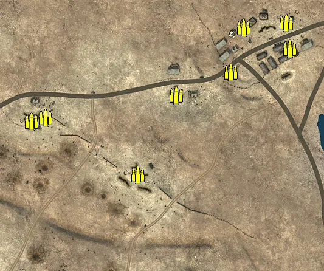
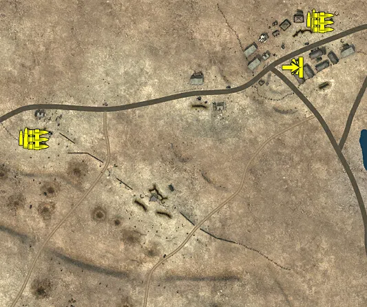
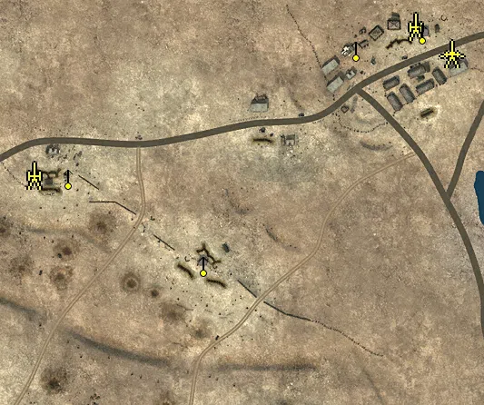
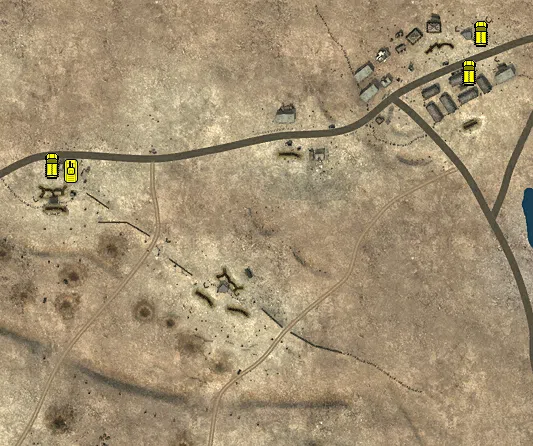

Static Ammo Crate

Pickup Kit

Static Emplacement

Vehicle

| gpo_subcat   | gpo_cat    | gpo_name                |    pos_x |   pos_y |    pos_z |   flag | is_locked   |   team | instance                                              | gpo_cat_disp       | gpo_subcat_disp   |
|:-------------|:-----------|:------------------------|---------:|--------:|---------:|-------:|:------------|-------:|:------------------------------------------------------|:-------------------|:------------------|
| ammo_crate   | ammo_crate | ammo_crate              |  -36.537 |  49.426 |  -32.843 |      0 | False       |      0 | ammo_crate_0                                          | Static Ammo Crate  | Static Ammo Crate |
| ammo_crate   | ammo_crate | ammo_crate              |   30.521 |  51.511 |  -12.171 |      0 | False       |      0 | ammo_crate_1                                          | Static Ammo Crate  | Static Ammo Crate |
| ammo_crate   | ammo_crate | ammo_crate              |  227.606 |  48.606 | -135.597 |      0 | False       |      0 | ammo_crate_2                                          | Static Ammo Crate  | Static Ammo Crate |
| ammo_crate   | ammo_crate | ammo_crate              |  310.101 |  48.917 | -126.931 |      0 | False       |      0 | ammo_crate_3                                          | Static Ammo Crate  | Static Ammo Crate |
| ammo_crate   | ammo_crate | ammo_crate              |   14.477 |  50.278 |  -40.43  |      0 | False       |      0 | ammo_crate_4                                          | Static Ammo Crate  | Static Ammo Crate |
| ammo_crate   | ammo_crate | ammo_crate              | -196.347 |  47.61  |   22.525 |      0 | False       |      0 | ammo_crate_5                                          | Static Ammo Crate  | Static Ammo Crate |
| ammo_crate   | ammo_crate | ammo_crate              |  -79.491 |  74.566 | -440.837 |      0 | False       |      0 | ammo_crate_6                                          | Static Ammo Crate  | Static Ammo Crate |
| ammo_crate   | ammo_crate | ammo_crate              | -256.233 |  48.615 |   65.307 |      0 | False       |      0 | ammo_crate_7                                          | Static Ammo Crate  | Static Ammo Crate |
| ammo_crate   | ammo_crate | ammo_crate              |   19.523 |  39.852 |  262.452 |      0 | False       |      0 | ammo_crate_8                                          | Static Ammo Crate  | Static Ammo Crate |
| ammo_crate   | ammo_crate | ammo_crate              |   -3.192 |  38.418 |  256.405 |      0 | False       |      0 | ammo_crate_9                                          | Static Ammo Crate  | Static Ammo Crate |
| ammo_crate   | ammo_crate | ammo_crate              |  415.858 |  24.095 |  417.673 |      0 | False       |      0 | ammo_crate_10                                         | Static Ammo Crate  | Static Ammo Crate |
| ammo_crate   | ammo_crate | ammo_crate              |  172.205 |  42.533 |  167.781 |      0 | False       |      0 | ammo_crate_11                                         | Static Ammo Crate  | Static Ammo Crate |
| ammo_crate   | ammo_crate | ammo_crate              |  324.748 |  22.658 |  337.07  |      0 | False       |      0 | ammo_crate_12                                         | Static Ammo Crate  | Static Ammo Crate |
| ammo_crate   | ammo_crate | ammo_crate              |  421.883 |  21.713 |  375.537 |      0 | False       |      0 | ammo_crate_13                                         | Static Ammo Crate  | Static Ammo Crate |
| ammo_crate   | ammo_crate | ammo_crate              |  346.365 |  22.831 |  409.534 |      0 | False       |      0 | ammo_crate_14                                         | Static Ammo Crate  | Static Ammo Crate |
| ammo_crate   | ammo_crate | ammo_crate              |  235.498 |  26.91  |  298.958 |      0 | False       |      0 | ammo_crate_15                                         | Static Ammo Crate  | Static Ammo Crate |
| ammo         | kit        | BA_PickUpAmmokit        |  401.229 |  23.244 |  428.307 |    205 | False       |      0 | CP_16_Tobruk_Tobruk_Outskirts_DE_GB_AmmoCrates        | Pickup Kit         | Ammo Kit          |
| ammo         | kit        | BA_PickUpAmmokit        |  -17.404 |  40.635 |  256.498 |    204 | False       |      0 | CP_16_Tobruk_Forte_Airente_DE_GB_AmmoCrates           | Pickup Kit         | Ammo Kit          |
| at_rifle     | kit        | BA_PickUpAntitankBoys   |  370.28  |  21.106 |  358.431 |    205 | False       |      0 | CP_16_Tobruk_Tobruk_Outskirts_DE_GB_ATrifle           | Pickup Kit         | AT Rifle          |
| mg           | kit        | BA_PickUpSupportBrenMK1 |  415.388 |  24.235 |  422.865 |    205 | False       |      0 | CP_16_Tobruk_Tobruk_Outskirts_DE_GB_Support           | Pickup Kit         | MG Kit            |
| mg           | kit        | GA_PickUpSupportMG34    |    0.619 |  38.417 |  253.483 |    204 | False       |      0 | CP_16_Tobruk_Forte_Airente_DE_GB_Support              | Pickup Kit         | MG Kit            |
| misc         | noidea     | britcommradio           |  166.997 |  42.532 |  170.353 |    202 | False       |      0 | CP_16_Tobruk_Argub_Bdawa_DE_GB_CommRadio              | FIXME UNASSIGNED   | MISCELLANEOUS     |
| misc         | noidea     | britcommradio           |   -3.642 |  38.417 |  254.982 |    204 | False       |      0 | CP_16_Tobruk_Forte_Airente_DE_GB_CommRadio            | FIXME UNASSIGNED   | MISCELLANEOUS     |
| misc         | noidea     | britcommradio           |  413.626 |  24.092 |  423.633 |    205 | False       |      0 | CP_16_Tobruk_Tobruk_Outskirts_DE_GB_CommRadio         | FIXME UNASSIGNED   | MISCELLANEOUS     |
| noidea       | noidea     | commander_mortar_allied |  400.924 |  72.138 | -482.396 |    204 | True        |      0 | CP_16_Tobruk_Forte_Pilastrino_DE_GB_CommArtillery     | FIXME UNASSIGNED   | FIXME UNASSIGNED  |
| noidea       | noidea     | commander_mortar_allied |  406.529 |  72.199 | -480.801 |    204 | True        |      0 | CP_16_Tobruk_Forte_Pilastrino_DE_GB_CommArtillery_0   | FIXME UNASSIGNED   | FIXME UNASSIGNED  |
| noidea       | noidea     | commander_smoke_allied  |  411.211 |  72.191 | -479.312 |    204 | True        |      0 | CP_16_Tobruk_Forte_Pilastrino_DE_GB_CommSmoke         | FIXME UNASSIGNED   | FIXME UNASSIGNED  |
| noidea       | noidea     | commander_mortar_allied | -321.69  |  41.036 |  295.003 |    205 | True        |      0 | CP_16_Tobruk_Tobruk_Outskirts_DE_GB_CommArtillery     | FIXME UNASSIGNED   | FIXME UNASSIGNED  |
| noidea       | noidea     | commander_mortar_allied | -326.922 |  41.313 |  299.327 |    205 | True        |      0 | CP_16_Tobruk_Tobruk_Outskirts_DE_GB_CommArtillery_0   | FIXME UNASSIGNED   | FIXME UNASSIGNED  |
| arty         | static     | sgwr34                  |  -18.296 |  40.679 |  262.585 |    204 | True        |      0 | CP_16_Tobruk_Argub_Bdawa_DE_GB_LightMortar            | Static Emplacement | Artillery         |
| arty         | static     | 3inchmortar             |  402.158 |  23.396 |  426.755 |    205 | True        |      0 | CP_16_Tobruk_Tobruk_Outskirts_DE_GB_LightMortar       | Static Emplacement | Artillery         |
| mg_nest      | static     | lewis_bipod             |  168.769 |  44.139 |  165.01  |    202 | False       |      0 | CP_16_Tobruk_Argub_Bdawa_DE_GB_LightMG                | Static Emplacement | Static MG         |
| mg_nest      | static     | lewis_bipod             |  409.637 |  25.705 |  421.056 |    205 | False       |      0 | CP_16_Tobruk_Tobruk_Outskirts_DE_GB_LightMG           | Static Emplacement | Static MG         |
| mg_nest      | static     | mg15_bipod              |   20.401 |  42.595 |  261.397 |    204 | False       |      0 | CP_16_Tobruk_Forte_Airente_DE_GB_MedMG                | Static Emplacement | Static MG         |
| mg_nest      | static     | vickers303_tripod       |  336.884 |  22.694 |  402.062 |    205 | False       |      0 | CP_16_Tobruk_Tobruk_Outskirts_DE_GB_MedMG             | Static Emplacement | Static MG         |
| pak          | static     | 2pdr                    |  442.076 |  21.32  |  396.797 |    205 | False       |      0 | CP_16_Tobruk_Tobruk_Outskirts_DE_GB_LightArtillery2_0 | Static Emplacement | Anti-tank Gun     |
| apc          | vehicle    | universalcarrier_bren   |  425.956 |  22.341 |  422.919 |    205 | False       |      0 | CP_16_Tobruk_Tobruk_Outskirts_DE_GB_PersonelCarrier2  | Vehicle            | APC               |
| apc          | vehicle    | sdkfz251_1              |   -2.677 |  39.198 |  291.41  |    204 | False       |      0 | CP_16_Tobruk_Forte_Airente_DE_GB_PersonelCarrier2     | Vehicle            | APC               |
| apc          | vehicle    | universalcarrier_bren   |  414.483 |  21.167 |  383.791 |    201 | False       |      0 | CP_16_Tobruk_Outpost_DE_GB_PersonelCarrier2           | Vehicle            | APC               |
| tank         | vehicle    | FiatL6_40               |   15.64  |  39.687 |  285.438 |    201 | True        |      0 | CP_16_Tobruk_Outpost_DE_GB_LightArmour                | Vehicle            | Tank              |

