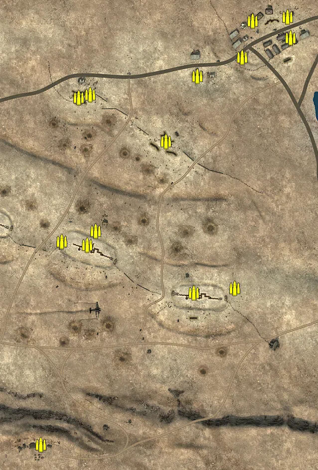
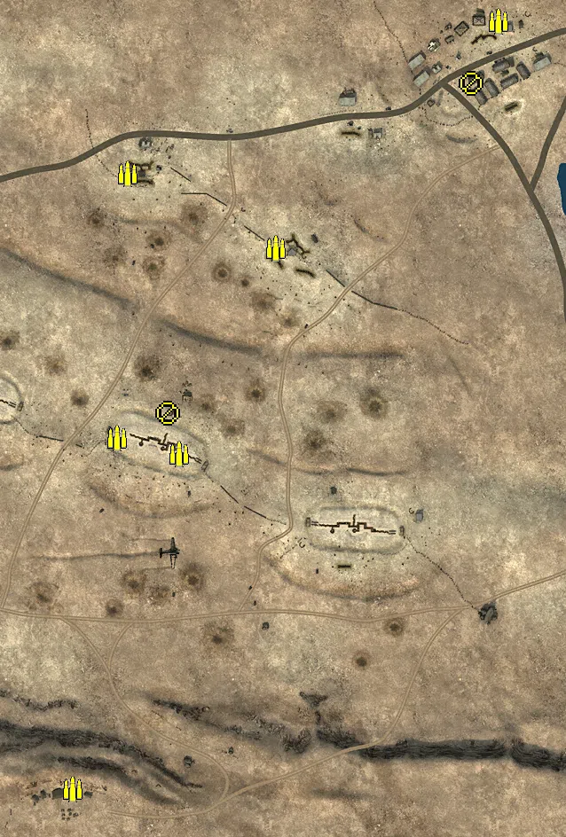
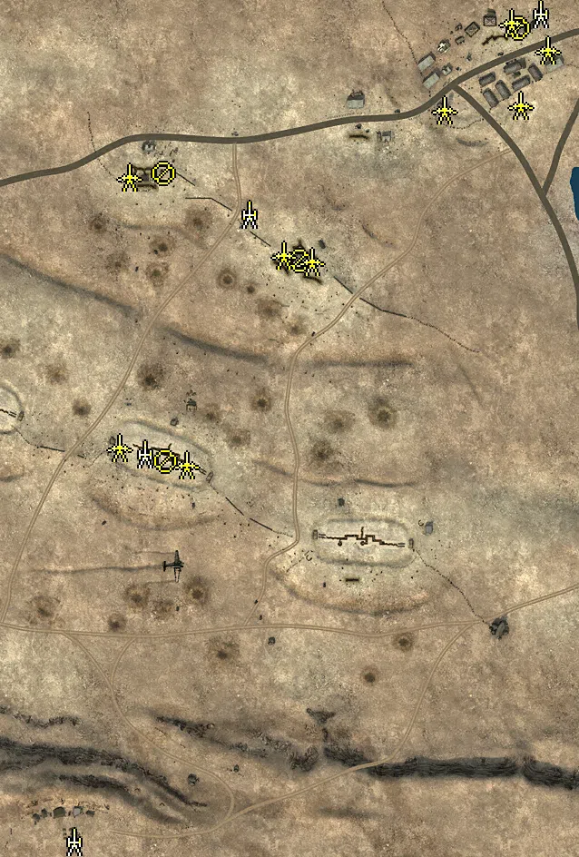
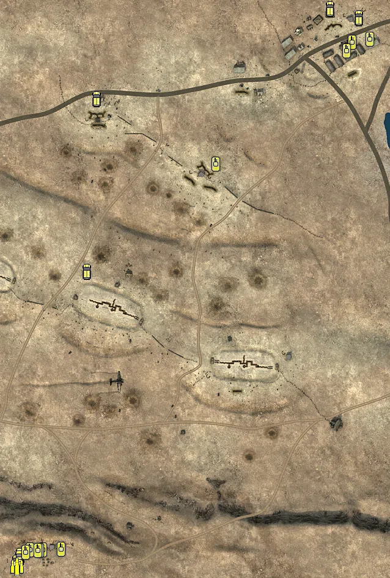

Static Ammo Crate

Pickup Kit

Static Emplacement

Vehicle

| gpo_subcat   | gpo_cat    | gpo_name                   |    pos_x |   pos_y |    pos_z |   flag | is_locked   |   team | instance                                              | gpo_cat_disp       | gpo_subcat_disp   |
|:-------------|:-----------|:---------------------------|---------:|--------:|---------:|-------:|:------------|-------:|:------------------------------------------------------|:-------------------|:------------------|
| ammo_crate   | ammo_crate | ammo_crate                 |  -36.537 |  49.426 |  -32.843 |      0 | False       |      0 | ammo_crate_0                                          | Static Ammo Crate  | Static Ammo Crate |
| ammo_crate   | ammo_crate | ammo_crate                 |   30.521 |  51.511 |  -12.171 |      0 | False       |      0 | ammo_crate_1                                          | Static Ammo Crate  | Static Ammo Crate |
| ammo_crate   | ammo_crate | ammo_crate                 |  227.606 |  48.606 | -135.597 |      0 | False       |      0 | ammo_crate_2                                          | Static Ammo Crate  | Static Ammo Crate |
| ammo_crate   | ammo_crate | ammo_crate                 |  310.101 |  48.917 | -126.931 |      0 | False       |      0 | ammo_crate_3                                          | Static Ammo Crate  | Static Ammo Crate |
| ammo_crate   | ammo_crate | ammo_crate                 |   14.477 |  50.278 |  -40.43  |      0 | False       |      0 | ammo_crate_4                                          | Static Ammo Crate  | Static Ammo Crate |
| ammo_crate   | ammo_crate | ammo_crate                 | -196.347 |  47.61  |   22.525 |      0 | False       |      0 | ammo_crate_5                                          | Static Ammo Crate  | Static Ammo Crate |
| ammo_crate   | ammo_crate | ammo_crate                 |  -79.491 |  74.566 | -440.837 |      0 | False       |      0 | ammo_crate_6                                          | Static Ammo Crate  | Static Ammo Crate |
| ammo_crate   | ammo_crate | ammo_crate                 | -256.233 |  48.615 |   65.307 |      0 | False       |      0 | ammo_crate_7                                          | Static Ammo Crate  | Static Ammo Crate |
| ammo_crate   | ammo_crate | ammo_crate                 |   19.523 |  39.852 |  262.452 |      0 | False       |      0 | ammo_crate_8                                          | Static Ammo Crate  | Static Ammo Crate |
| ammo_crate   | ammo_crate | ammo_crate                 |   -3.192 |  38.418 |  256.405 |      0 | False       |      0 | ammo_crate_9                                          | Static Ammo Crate  | Static Ammo Crate |
| ammo_crate   | ammo_crate | ammo_crate                 |  415.858 |  24.095 |  417.673 |      0 | False       |      0 | ammo_crate_10                                         | Static Ammo Crate  | Static Ammo Crate |
| ammo_crate   | ammo_crate | ammo_crate                 |  172.205 |  42.533 |  167.781 |      0 | False       |      0 | ammo_crate_11                                         | Static Ammo Crate  | Static Ammo Crate |
| ammo_crate   | ammo_crate | ammo_crate                 |  324.748 |  22.658 |  337.07  |      0 | False       |      0 | ammo_crate_12                                         | Static Ammo Crate  | Static Ammo Crate |
| ammo_crate   | ammo_crate | ammo_crate                 |  421.883 |  21.713 |  375.537 |      0 | False       |      0 | ammo_crate_13                                         | Static Ammo Crate  | Static Ammo Crate |
| ammo_crate   | ammo_crate | ammo_crate                 |  346.365 |  22.831 |  409.534 |      0 | False       |      0 | ammo_crate_14                                         | Static Ammo Crate  | Static Ammo Crate |
| ammo_crate   | ammo_crate | ammo_crate                 |  235.498 |  26.91  |  298.958 |      0 | False       |      0 | ammo_crate_15                                         | Static Ammo Crate  | Static Ammo Crate |
| ammo         | kit        | BA_PickUpAmmokit           |  149.516 |  41.196 |  171.817 |    302 | False       |      0 | CP_32_Tobruk_Argub_Bdawa_DE_GB_AmmoCrates             | Pickup Kit         | Ammo Kit          |
| ammo         | kit        | BA_PickUpAmmokit           |  401.229 |  23.244 |  428.307 |    305 | False       |      0 | CP_32_Tobruk_Tobruk_Outskirts_DE_GB_AmmoCrates        | Pickup Kit         | Ammo Kit          |
| ammo         | kit        | BA_PickUpAmmokit           |  -17.404 |  40.635 |  256.498 |    304 | False       |      0 | CP_32_Tobruk_Forte_Airente_DE_GB_AmmoCrates           | Pickup Kit         | Ammo Kit          |
| ammo         | kit        | BA_PickUpAmmokit           |   40.685 |  51.376 |  -59.837 |    301 | False       |      0 | CP_32_Tobruk_Tobruk_HQ_DE_GB_AmmoCrates               | Pickup Kit         | Ammo Kit          |
| ammo         | kit        | BA_PickUpAmmokit           |  -28.596 |  51.661 |  -41.752 |    301 | False       |      0 | CP_32_Tobruk_Tobruk_HQ_DE_GB_AmmoCrates_0             | Pickup Kit         | Ammo Kit          |
| ammo         | kit        | BA_PickUpAmmokit           |  -79.15  |  74.564 | -438.341 |    303 | False       |      0 | CP_32_Tobruk_Forte_Pilastrino_DE_GB_AmmoCrates        | Pickup Kit         | Ammo Kit          |
| at_rifle     | kit        | BA_PickUpAntitankBoys      |  370.28  |  21.106 |  358.431 |    305 | False       |      0 | CP_32_Tobruk_Tobruk_Outskirts_DE_GB_ATrifle           | Pickup Kit         | AT Rifle          |
| at_rifle     | kit        | BA_PickUpAntitankBoys      |   27.935 |  51.4   |  -14.275 |    301 | False       |      0 | CP_32_Tobruk_Tobruk_HQ_DE_GB_ATrifle                  | Pickup Kit         | AT Rifle          |
| misc         | noidea     | britcommradio              |   28.566 |  51.434 |  -12.373 |    301 | False       |      0 | CP_32_Tobruk_Tobruk_HQ_CommRadio                      | FIXME UNASSIGNED   | MISCELLANEOUS     |
| misc         | noidea     | britcommradio              |  166.997 |  42.532 |  170.353 |    302 | False       |      0 | CP_32_Tobruk_Argub_Bdawa_CommRadio                    | FIXME UNASSIGNED   | MISCELLANEOUS     |
| misc         | noidea     | gercommradio               |  -73.174 |  74.564 | -439.901 |    303 | False       |      0 | CP_32_Tobruk_Forte_Pilastrino_CommRadio               | FIXME UNASSIGNED   | MISCELLANEOUS     |
| misc         | noidea     | britcommradio              |   -3.642 |  38.417 |  254.982 |    304 | False       |      0 | CP_32_Tobruk_Forte_Airente_CommRadio                  | FIXME UNASSIGNED   | MISCELLANEOUS     |
| misc         | noidea     | britcommradio              |  413.626 |  24.092 |  423.633 |    305 | False       |      0 | CP_32_Tobruk_Tobruk_Outskirts_CommRadio               | FIXME UNASSIGNED   | MISCELLANEOUS     |
| noidea       | noidea     | commander_artillery_allied |  400.924 |  72.138 | -482.396 |    303 | True        |      0 | CP_32_Tobruk_Forte_Pilastrino_CommArtillery           | FIXME UNASSIGNED   | FIXME UNASSIGNED  |
| noidea       | noidea     | commander_artillery_allied |  406.529 |  72.199 | -480.801 |    303 | True        |      0 | CP_32_Tobruk_Forte_Pilastrino_0_1                     | FIXME UNASSIGNED   | FIXME UNASSIGNED  |
| noidea       | noidea     | commander_smoke_allied     |  411.211 |  72.191 | -479.312 |    303 | True        |      0 | CP_32_Tobruk_Forte_Pilastrino_CommSmoke               | FIXME UNASSIGNED   | FIXME UNASSIGNED  |
| noidea       | noidea     | commander_mortar_allied    | -321.69  |  41.036 |  295.003 |    305 | True        |      0 | CP_32_Tobruk_Tobruk_Outskirts_CommArtillery           | FIXME UNASSIGNED   | FIXME UNASSIGNED  |
| noidea       | noidea     | commander_mortar_allied    | -326.922 |  41.313 |  299.327 |    305 | True        |      0 | CP_32_Tobruk_Tobruk_Outskirts_0_1                     | FIXME UNASSIGNED   | FIXME UNASSIGNED  |
| arty         | static     | 3inchmortar                |   -1.942 |  52.144 |  -47.755 |    301 | True        |      0 | CP_32_Tobruk_Tobruk_HQ_LightMortar                    | Static Emplacement | Artillery         |
| arty         | static     | 3inchmortar                |  112.869 |  40.353 |  215.846 |    302 | True        |      0 | CP_32_Tobruk_Argub_Bdawa_LightMortar                  | Static Emplacement | Artillery         |
| arty         | static     | schneider_1913             |  -79.881 |  76.335 | -475.107 |    303 | False       |      0 | CP_32_Tobruk_Forte_Pilastrino_Howitzer                | Static Emplacement | Artillery         |
| arty         | static     | 25pdr                      |  433.935 |  24.028 |  437.023 |    305 | True        |      0 | CP_32_Tobruk_Tobruk_Outskirts_Howitzer                | Static Emplacement | Artillery         |
| mg_nest      | static     | lewis_bipod                |   21.089 |  52.982 |  -55.547 |    301 | False       |      0 | CP_32_Tobruk_Tobruk_HQ_LightMG                        | Static Emplacement | Static MG         |
| mg_nest      | static     | lewis_bipod                |  168.769 |  44.139 |  165.01  |    302 | False       |      0 | CP_32_Tobruk_Argub_Bdawa_LightMG                      | Static Emplacement | Static MG         |
| mg_nest      | static     | lewis_bipod                |   19.444 |  42.637 |  260.786 |    304 | False       |      0 | CP_32_Tobruk_Forte_Airente_LightMG                    | Static Emplacement | Static MG         |
| mg_nest      | static     | lewis_bipod                |  409.637 |  25.705 |  421.056 |    305 | False       |      0 | CP_32_Tobruk_Tobruk_Outskirts_LightMG                 | Static Emplacement | Static MG         |
| pak          | static     | 2pdr                       |   43.861 |  52.262 |  -59.776 |    301 | False       |      0 | CP_32_Tobruk_Tobruk_HQ_LightArtillery2                | Static Emplacement | Anti-tank Gun     |
| pak          | static     | 2pdr                       |  -30.099 |  51.853 |  -40.606 |    301 | False       |      0 | CP_32_Tobruk_Tobruk_HQ_0                              | Static Emplacement | Anti-tank Gun     |
| pak          | static     | 2pdr                       |  151.099 |  41.31  |  170.772 |    302 | False       |      0 | CP_32_Tobruk_Argub_Bdawa_LightArtillery2              | Static Emplacement | Anti-tank Gun     |
| pak          | static     | 2pdr                       |  181.546 |  42.248 |  163.539 |    302 | False       |      0 | CP_32_Tobruk_Argub_Bdawa_0                            | Static Emplacement | Anti-tank Gun     |
| pak          | static     | 2pdr                       |  -19.177 |  40.816 |  256.98  |    304 | False       |      0 | CP_32_Tobruk_Forte_Airente_LightArtillery2            | Static Emplacement | Anti-tank Gun     |
| pak          | static     | 2pdr                       |  402.364 |  23.458 |  426.773 |    305 | False       |      0 | CP_32_Tobruk_Tobruk_Outskirts_LightArtillery2         | Static Emplacement | Anti-tank Gun     |
| pak          | static     | 2pdr                       |  442.076 |  21.32  |  396.797 |    305 | False       |      0 | CP_32_Tobruk_Tobruk_Outskirts_0                       | Static Emplacement | Anti-tank Gun     |
| pak          | static     | 2pdr                       |  327.689 |  22.444 |  330.713 |    305 | False       |      0 | CP_32_Tobruk_Tobruk_Outskirts_DE_GB_LightArtillery2   | Static Emplacement | Anti-tank Gun     |
| pak          | static     | 2pdr                       |  412.117 |  17.703 |  335.553 |    305 | False       |      0 | CP_32_Tobruk_Tobruk_Outskirts_DE_GB_LightArtillery2_0 | Static Emplacement | Anti-tank Gun     |
| apc          | vehicle    | universalcarrier_bren      |  -19.076 |  49.778 |    8.947 |    301 | False       |      0 | CP_32_Tobruk_Tobruk_HQ_PersonelCarrier2               | Vehicle            | APC               |
| apc          | vehicle    | universalcarrier_bren      |   -2.772 |  39.245 |  291.015 |    304 | False       |      0 | CP_32_Tobruk_Forte_Airente_PersonelCarrier2           | Vehicle            | APC               |
| apc          | vehicle    | universalcarrier_bren      |  425.956 |  22.341 |  422.919 |    305 | False       |      0 | CP_32_Tobruk_Tobruk_Outskirts_PersonelCarrier2        | Vehicle            | APC               |
| apc          | vehicle    | universalcarrier_bren      |  378.817 |  23.183 |  438.297 |    305 | False       |      0 | CP_32_Tobruk_Tobruk_Outskirts_0_2                     | Vehicle            | APC               |
| apc          | vehicle    | sdkfz251_1                 | -133.598 |  76.271 | -466.147 |    303 | False       |      0 | CP_32_Tobruk_Forte_Pilastrino_DE_GB_PersonelCarrier2  | Vehicle            | APC               |
| car          | vehicle    | opelblitz_dak              | -127.652 |  76.7   | -455.361 |    303 | False       |      0 | CP_32_Tobruk_Forte_Pilastrino_Truck                   | Vehicle            | Car               |
| car          | vehicle    | opelblitz_dak              | -129.18  |  76.514 | -458.563 |    303 | False       |      0 | CP_32_Tobruk_Forte_Pilastrino_0_0                     | Vehicle            | Car               |
| supply       | vehicle    | opelblitz_dak_ammo         | -133.233 |  76.137 | -472.919 |    303 | False       |      0 | CP_32_Tobruk_Forte_Pilastrino_DE_GB_TruckAmmo         | Vehicle            | Supply Vehicle    |
| tank         | vehicle    | markvi                     |  191.645 |  40.039 |  183.882 |    302 | True        |      0 | CP_32_Tobruk_Argub_Bdawa_LightArmour2                 | Vehicle            | Tank              |
| tank         | vehicle    | pzivd_na                   | -111.536 |  76.342 | -446.388 |    303 | True        |      0 | CP_32_Tobruk_Forte_Pilastrino_HeavyTank               | Vehicle            | Tank              |
| tank         | vehicle    | pziii_je_dak               |  -91.295 |  75.014 | -445.766 |    303 | True        |      0 | CP_32_Tobruk_Forte_Pilastrino_MediumTank2             | Vehicle            | Tank              |
| tank         | vehicle    | FiatL6_40                  |  -60.743 |  74.044 | -444.929 |    303 | True        |      0 | CP_32_Tobruk_Forte_Pilastrino_LightArmour             | Vehicle            | Tank              |
| tank         | vehicle    | pziii_je_dak               |  -95.521 |  74.959 | -446.774 |    303 | True        |      0 | CP_32_Tobruk_Forte_Pilastrino_0                       | Vehicle            | Tank              |
| tank         | vehicle    | carrom13_40                | -119.194 |  76.511 | -450.163 |    303 | True        |      0 | CP_32_Tobruk_Forte_Pilastrino_ItalianMedTank          | Vehicle            | Tank              |
| tank         | vehicle    | carrom11_39_au             |  444.399 |  20.445 |  387.968 |    305 | True        |      0 | CP_32_Tobruk_Tobruk_Outskirts_MediumTank4             | Vehicle            | Tank              |
| tank         | vehicle    | carrom11_39_au             |  414.696 |  21.153 |  383.449 |    305 | True        |      0 | CP_32_Tobruk_Tobruk_Outskirts_0_0                     | Vehicle            | Tank              |
| tank         | vehicle    | markvi                     |  406.401 |  19.988 |  368.725 |    305 | True        |      0 | CP_32_Tobruk_Tobruk_Outskirts_LightArmour2            | Vehicle            | Tank              |
| tank         | vehicle    | FiatL6_40                  |  -99.399 |  75.247 | -447.453 |    303 | True        |      0 | CP_32_Tobruk_Forte_Pilastrino_DE_GB_LightArmour       | Vehicle            | Tank              |

