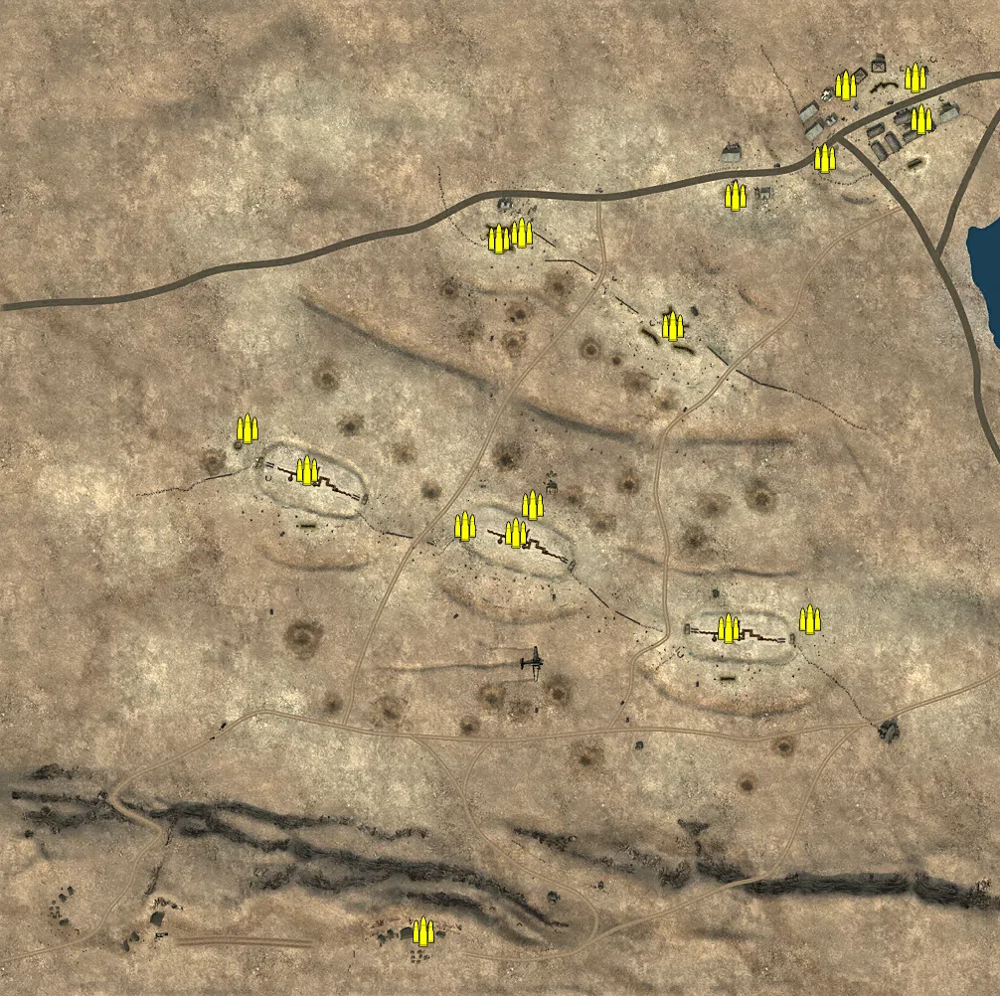
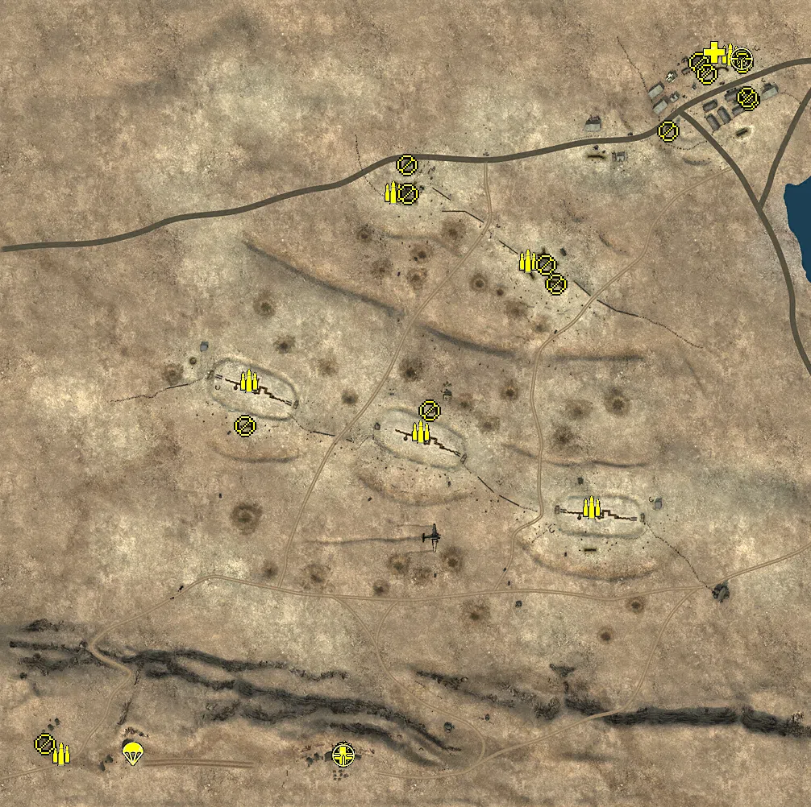
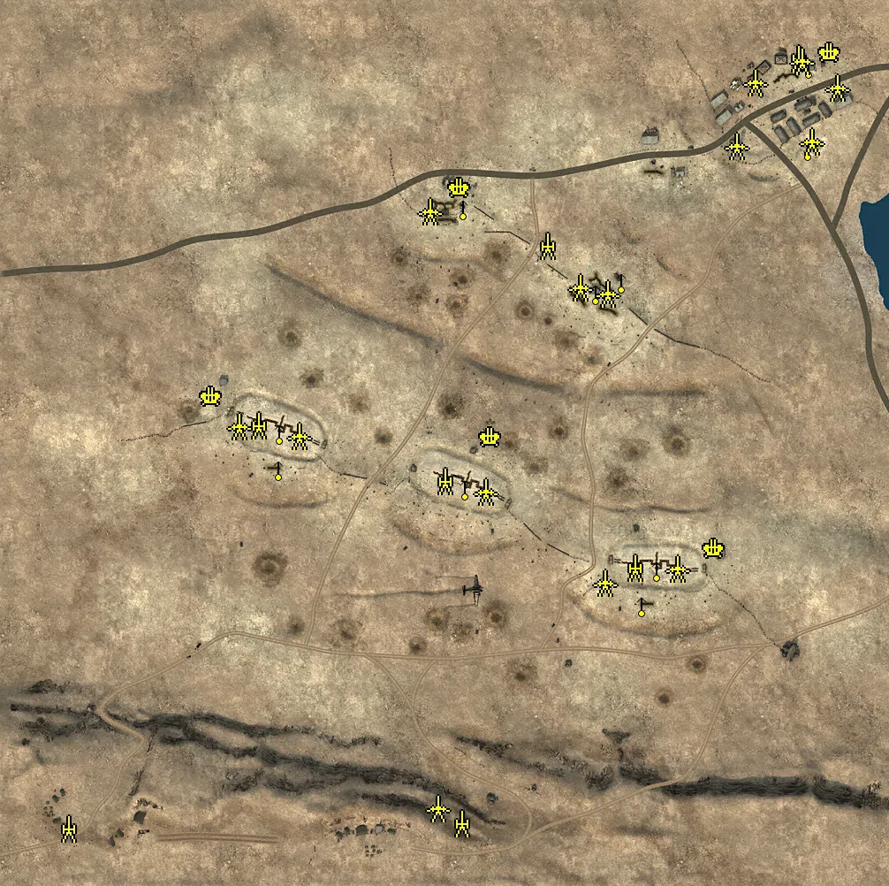
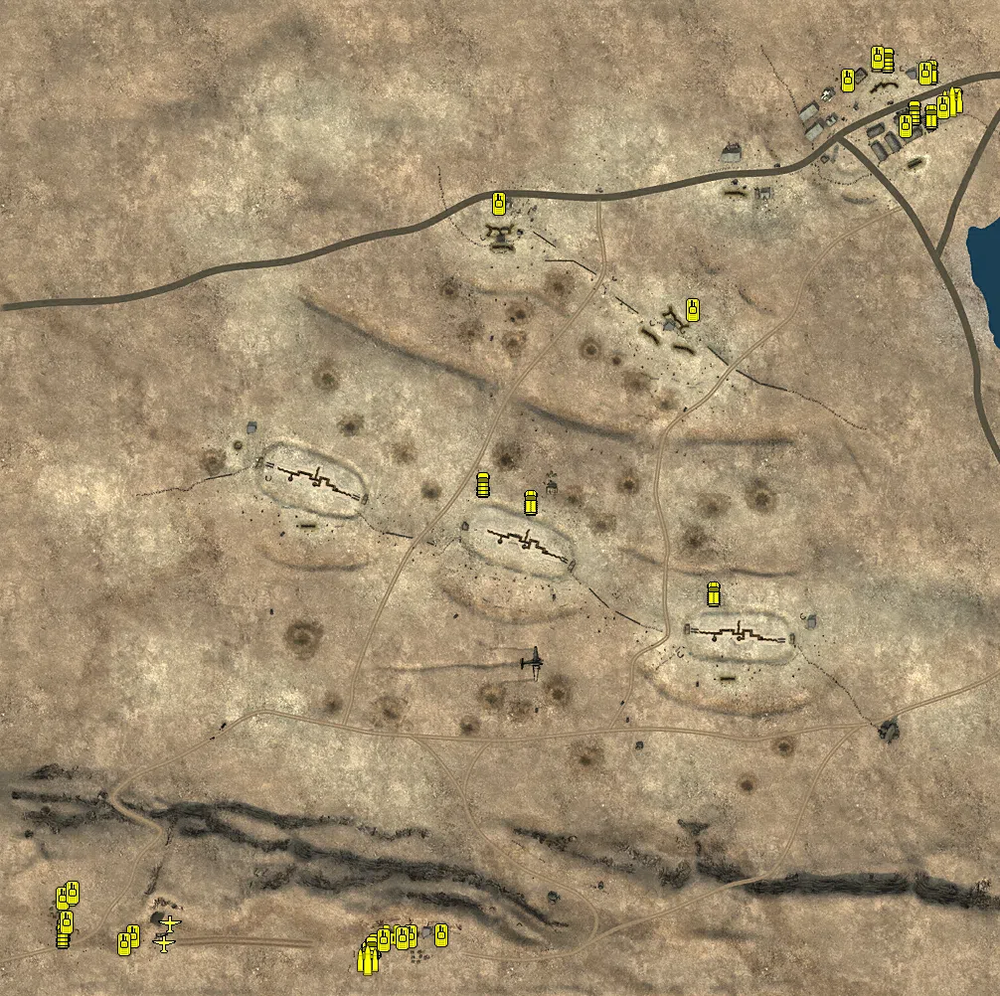

Static Ammo Crate

Pickup Kit

Static Emplacement

Vehicle

| gpo_subcat   | gpo_cat    | gpo_name                   |    pos_x |   pos_y |    pos_z |   flag | is_locked   |   team | instance                                               | gpo_cat_disp       | gpo_subcat_disp   |
|:-------------|:-----------|:---------------------------|---------:|--------:|---------:|-------:|:------------|-------:|:-------------------------------------------------------|:-------------------|:------------------|
| ammo_crate   | ammo_crate | ammo_crate                 |  -36.537 |  49.426 |  -32.843 |      0 | False       |      0 | ammo_crate_0                                           | Static Ammo Crate  | Static Ammo Crate |
| ammo_crate   | ammo_crate | ammo_crate                 |   30.521 |  51.511 |  -12.171 |      0 | False       |      0 | ammo_crate_1                                           | Static Ammo Crate  | Static Ammo Crate |
| ammo_crate   | ammo_crate | ammo_crate                 |  227.606 |  48.606 | -135.597 |      0 | False       |      0 | ammo_crate_2                                           | Static Ammo Crate  | Static Ammo Crate |
| ammo_crate   | ammo_crate | ammo_crate                 |  310.101 |  48.917 | -126.931 |      0 | False       |      0 | ammo_crate_3                                           | Static Ammo Crate  | Static Ammo Crate |
| ammo_crate   | ammo_crate | ammo_crate                 |   14.477 |  50.278 |  -40.43  |      0 | False       |      0 | ammo_crate_4                                           | Static Ammo Crate  | Static Ammo Crate |
| ammo_crate   | ammo_crate | ammo_crate                 | -196.347 |  47.61  |   22.525 |      0 | False       |      0 | ammo_crate_5                                           | Static Ammo Crate  | Static Ammo Crate |
| ammo_crate   | ammo_crate | ammo_crate                 |  -79.491 |  74.566 | -440.837 |      0 | False       |      0 | ammo_crate_6                                           | Static Ammo Crate  | Static Ammo Crate |
| ammo_crate   | ammo_crate | ammo_crate                 | -256.233 |  48.615 |   65.307 |      0 | False       |      0 | ammo_crate_7                                           | Static Ammo Crate  | Static Ammo Crate |
| ammo_crate   | ammo_crate | ammo_crate                 |   19.523 |  39.852 |  262.452 |      0 | False       |      0 | ammo_crate_8                                           | Static Ammo Crate  | Static Ammo Crate |
| ammo_crate   | ammo_crate | ammo_crate                 |   -3.192 |  38.418 |  256.405 |      0 | False       |      0 | ammo_crate_9                                           | Static Ammo Crate  | Static Ammo Crate |
| ammo_crate   | ammo_crate | ammo_crate                 |  415.858 |  24.095 |  417.673 |      0 | False       |      0 | ammo_crate_10                                          | Static Ammo Crate  | Static Ammo Crate |
| ammo_crate   | ammo_crate | ammo_crate                 |  172.205 |  42.533 |  167.781 |      0 | False       |      0 | ammo_crate_11                                          | Static Ammo Crate  | Static Ammo Crate |
| ammo_crate   | ammo_crate | ammo_crate                 |  324.748 |  22.658 |  337.07  |      0 | False       |      0 | ammo_crate_12                                          | Static Ammo Crate  | Static Ammo Crate |
| ammo_crate   | ammo_crate | ammo_crate                 |  421.883 |  21.713 |  375.537 |      0 | False       |      0 | ammo_crate_13                                          | Static Ammo Crate  | Static Ammo Crate |
| ammo_crate   | ammo_crate | ammo_crate                 |  346.365 |  22.831 |  409.534 |      0 | False       |      0 | ammo_crate_14                                          | Static Ammo Crate  | Static Ammo Crate |
| ammo_crate   | ammo_crate | ammo_crate                 |  235.498 |  26.91  |  298.958 |      0 | False       |      0 | ammo_crate_15                                          | Static Ammo Crate  | Static Ammo Crate |
| ammo         | kit        | BA_PickUpAmmokit           |  401.229 |  23.244 |  428.307 |    106 | False       |      0 | CP_64_Tobruk_Tobruk_Outskirts_DE_GB_AmmoCrates         | Pickup Kit         | Ammo Kit          |
| ammo         | kit        | BA_PickUpAmmokit           |  149.516 |  41.196 |  171.817 |    105 | False       |      0 | CP_64_Tobruk_Argub_Bdawa_DE_GB_AmmoCrates              | Pickup Kit         | Ammo Kit          |
| ammo         | kit        | BA_PickUpAmmokit           |  -17.404 |  40.635 |  256.589 |    104 | False       |      0 | CP_64_Tobruk_Forte_Airente_DE_GB_AmmoCrates            | Pickup Kit         | Ammo Kit          |
| ammo         | kit        | BA_PickUpAmmokit           |   17.035 |  50.849 |  -40.153 |    102 | False       |      0 | CP_64_Tobruk_Tobruk_HQ_DE_GB_AmmoCrates                | Pickup Kit         | Ammo Kit          |
| ammo         | kit        | BA_PickUpAmmokit           | -195.753 |  47.525 |   23.347 |    103 | False       |      0 | CP_64_Tobruk_Bir_Baccara_DE_GB_AmmoCrates              | Pickup Kit         | Ammo Kit          |
| ammo         | kit        | BA_PickUpAmmokit           |  229.435 |  48.608 | -133.943 |    107 | False       |      0 | CP_64_Tobruk_Forte_Solaro_DE_GB_AmmoCrates             | Pickup Kit         | Ammo Kit          |
| ammo         | kit        | BA_PickUpAmmokit           |  -78.399 |  74.564 | -438.381 |    101 | False       |      0 | CP_64_Tobruk_Forte_Pilastrino_DE_GB_AmmoCrates         | Pickup Kit         | Ammo Kit          |
| ammo         | kit        | BA_PickUpAmmokit           | -429.289 |  74.812 | -439.911 |    101 | False       |      0 | CP_64_Tobruk_Forte_Pilastrino_DE_GB_AmmoCrates_0       | Pickup Kit         | Ammo Kit          |
| at_rifle     | kit        | GA_PickUpAntitankPZB39     |  -79.269 |  74.563 | -439.364 |    101 | False       |      0 | CP_64_Tobruk_Forte_Pilastrino_DE_GB_ATrifle            | Pickup Kit         | AT Rifle          |
| at_rifle     | kit        | BA_PickUpAntitankBoys      |   27.935 |  51.4   |  -14.275 |    102 | False       |      0 | CP_64_Tobruk_Tobruk_HQ_DE_GB_ATrifle                   | Pickup Kit         | AT Rifle          |
| at_rifle     | kit        | BA_PickUpAntitankBoys      |  415.075 |  24.116 |  420.67  |    106 | False       |      0 | CP_64_Tobruk_Tobruk_Outskirts_DE_GB_ATrifle            | Pickup Kit         | AT Rifle          |
| at_rifle     | kit        | BA_PickUpAntitankBoys      |  424.055 |  21.738 |  371.599 |    106 | False       |      0 | CP_64_Tobruk_Tobruk_Outskirts_DE_GB_ATrifle_0          | Pickup Kit         | AT Rifle          |
| at_rifle     | kit        | BA_PickUpAntitankBoys      |  361.844 |  23.835 |  418.382 |    106 | False       |      0 | CP_64_Tobruk_Tobruk_Outskirts_DE_GB_ATrifle_1          | Pickup Kit         | AT Rifle          |
| at_rifle     | kit        | BA_PickUpAntitankBoys      |   -0.443 |  39.717 |  291.342 |    104 | False       |      0 | CP_64_Tobruk_Forte_Airente_DE_GB_ATrifle               | Pickup Kit         | AT Rifle          |
| at_rifle     | kit        | BA_PickUpAntitankBoys      |  185.232 |  39.066 |  143.119 |    105 | False       |      0 | CP_64_Tobruk_Argub_Bdawa_DE_GB_ATrifle                 | Pickup Kit         | AT Rifle          |
| at_rifle     | kit        | BA_PickUpAntitankBoys      | -201.05  |  46.801 |  -33.335 |    103 | False       |      0 | CP_64_Tobruk_Bir_Baccara_DE_GB_ATrifle                 | Pickup Kit         | AT Rifle          |
| at_rifle     | kit        | BA_PickUpAntitankBoys      |  371.817 |  21.291 |  403.652 |    106 | False       |      0 | CP_64_Tobruk_Tobruk_Outskirts_DE_GB_ATrifle_2          | Pickup Kit         | AT Rifle          |
| medic        | kit        | BA_PickUpMedicWebley       |  380.806 |  23.988 |  431.177 |    106 | False       |      0 | CP_64_Tobruk_Tobruk_Outskirts_DE_GB_Medic              | Pickup Kit         | Medic Kit         |
| medic        | kit        | GA_PickUpMedicP08          |  -79.575 |  74.552 | -442.913 |    101 | False       |      0 | CP_64_Tobruk_Forte_Pilastrino_DE_GB_Medic              | Pickup Kit         | Medic Kit         |
| mg           | kit        | BA_PickUpSupportBrenMK1    |    0.727 |  38.941 |  254.672 |    104 | False       |      0 | CP_64_Tobruk_Forte_Airente_DE_GB_Support               | Pickup Kit         | MG Kit            |
| mg           | kit        | BA_PickUpSupportBrenMK1    |  422.009 |  21.719 |  374.711 |    106 | False       |      0 | CP_64_Tobruk_Tobruk_Outskirts_DE_GB_Support            | Pickup Kit         | MG Kit            |
| mg_dep       | kit        | BA_PickUpVickers303        |  323.906 |  22.661 |  333.318 |    106 | False       |      0 | CP_64_Tobruk_Tobruk_Outskirts_DE_GB_Support_0          | Pickup Kit         | Deployable MG     |
| mg_dep       | kit        | GA_PickUpMG34Lafette       | -449.449 |  75.403 | -427.782 |    101 | False       |      0 | CP_64_Tobruk_Forte_Pilastrino_DE_GB_HSupport           | Pickup Kit         | Deployable MG     |
| mg_dep       | kit        | BA_PickUpVickers303        |  172.052 |  42.523 |  166.984 |    105 | False       |      0 | CP_64_Tobruk_Argub_Bdawa_DE_GB_HSupport                | Pickup Kit         | Deployable MG     |
| mg_dep       | kit        | BA_PickUpVickers303        |  415.711 |  24.096 |  418.341 |    106 | False       |      0 | CP_64_Tobruk_Tobruk_Outskirts_DE_GB_HSupport           | Pickup Kit         | Deployable MG     |
| parachute    | kit        | GA_PickUpPilotP08          | -340.128 |  76.101 | -440.199 |    101 | False       |      0 | CP_64_Tobruk_Forte_Pilastrino_DE_GB_Pilot              | Pickup Kit         | Parachute Kit     |
| sniper       | kit        | BA_PickUpSniperNo4         |  415.328 |  24.229 |  422.869 |    106 | False       |      0 | CP_64_Tobruk_Tobruk_Outskirts_DE_GB_Sniper             | Pickup Kit         | Sniper Kit        |
| sniper       | kit        | GA_PickUpSniperK98         |  -79.462 |  74.692 | -441.791 |    101 | False       |      0 | CP_64_Tobruk_Forte_Pilastrino_DE_GB_Sniper             | Pickup Kit         | Sniper Kit        |
| noidea       | noidea     | commander_artillery_allied | -369.593 |  42.381 |  459.583 |    106 | True        |      0 | CP_64_Tobruk_Tobruk_Outskirts_DE_GB_CommArtillery      | FIXME UNASSIGNED   | FIXME UNASSIGNED  |
| noidea       | noidea     | commander_artillery_allied | -374.021 |  42.734 |  454.98  |    106 | True        |      0 | CP_64_Tobruk_Tobruk_Outskirts_DE_GB_CommArtillery_0    | FIXME UNASSIGNED   | FIXME UNASSIGNED  |
| noidea       | noidea     | commander_artillery_allied | -378.092 |  42.78  |  452.198 |    106 | True        |      0 | CP_64_Tobruk_Tobruk_Outskirts_DE_GB_CommArtillery_1    | FIXME UNASSIGNED   | FIXME UNASSIGNED  |
| noidea       | noidea     | commander_artillery_allied |  465.141 |  70.698 | -480.815 |    101 | True        |      0 | CP_64_Tobruk_Forte_Pilastrino_DE_GB_CommArtillery      | FIXME UNASSIGNED   | FIXME UNASSIGNED  |
| noidea       | noidea     | commander_artillery_allied |  469.108 |  70.492 | -477.136 |    101 | True        |      0 | CP_64_Tobruk_Forte_Pilastrino_DE_GB_CommArtillery_0    | FIXME UNASSIGNED   | FIXME UNASSIGNED  |
| noidea       | noidea     | commander_artillery_allied |  472.368 |  70.358 | -473.234 |    101 | True        |      0 | CP_64_Tobruk_Forte_Pilastrino_DE_GB_CommArtillery_1    | FIXME UNASSIGNED   | FIXME UNASSIGNED  |
| noidea       | noidea     | commander_smoke_allied     |  475.302 |  70.361 | -469.8   |    101 | True        |      0 | CP_64_Tobruk_Forte_Pilastrino_DE_GB_CommSmoke          | FIXME UNASSIGNED   | FIXME UNASSIGNED  |
| noidea       | noidea     |                            |  -21.335 |  40.532 |  260.019 |    104 | False       |      0 | CP_64_Tobruk_Forte_Airente_DE_GB_Mortar                | FIXME UNASSIGNED   | FIXME UNASSIGNED  |
| arty         | static     | 3inchmortar                | -212.857 |  49.469 |   15.174 |    103 | True        |      0 | CP_64_Tobruk_Bir_Baccara_DE_GB_LightMortar             | Static Emplacement | Artillery         |
| arty         | static     | 3inchmortar                |  213.436 |  50.474 | -146.372 |    107 | True        |      0 | CP_64_Tobruk_Forte_Solaro_DE_GB_LightMortar            | Static Emplacement | Artillery         |
| arty         | static     | 3inchmortar                |   -1.868 |  52.121 |  -47.879 |    102 | True        |      0 | CP_64_Tobruk_Argub_Bdawa_DE_GB_LightMortar             | Static Emplacement | Artillery         |
| arty         | static     | sgwr34                     |   17.274 |  70.508 | -435.442 |    101 | True        |      0 | CP_64_Tobruk_Forte_Pilastrino_DE_GB_LightMortar        | Static Emplacement | Artillery         |
| arty         | static     | schneider_1913             | -427.752 |  74.9   | -441.084 |    101 | False       |      0 | CP_64_Tobruk_Forte_Pilastrino_DE_GB_Howitzer           | Static Emplacement | Artillery         |
| arty         | static     | 25pdr                      |  397.871 |  23.702 |  430.05  |    106 | True        |      0 | CP_64_Tobruk_Tobruk_Outskirts_DE_GB_Howitzer           | Static Emplacement | Artillery         |
| arty         | static     | 25pdr                      |  114.068 |  40.782 |  217.878 |    105 | True        |      0 | CP_64_Tobruk_Tobruk_HQ_25pdr                           | Static Emplacement | Artillery         |
| flak         | static     | breda_35_20mm              |  302.825 |  49.298 | -123.821 |    107 | False       |      0 | CP_64_Tobruk_Forte_Solaro_DE_GB_AntiAirSmall           | Static Emplacement | Anti-aircraft Gun |
| flak         | static     | breda_35_20mm              | -266.105 |  48.819 |   47.561 |    103 | False       |      0 | CP_64_Tobruk_Bir_Baccara_DE_GB_AntiAirSmall            | Static Emplacement | Anti-aircraft Gun |
| flak         | static     | breda_35_20mm              |  433.539 |  23.721 |  436.705 |    106 | False       |      0 | CP_64_Tobruk_Tobruk_Outskirts_DE_GB_AntiAirSmall       | Static Emplacement | Anti-aircraft Gun |
| flak         | static     | breda_35_20mm              |   50.338 |  49.141 |    1.957 |    102 | False       |      0 | CP_64_Tobruk_Tobruk_HQ_DE_GB_AntiAirSmall              | Static Emplacement | Anti-aircraft Gun |
| flak         | static     | breda_35_20mm              |   15.027 |  39.91  |  284.493 |    104 | False       |      0 | CP_64_Tobruk_Forte_Airente_DE_GB_AntiAirSmall          | Static Emplacement | Anti-aircraft Gun |
| mg_nest      | static     | lewis_bipod                |   21.089 |  52.982 |  -55.547 |    102 | False       |      0 | CP_64_Tobruk_Tobruk_HQ_DE_GB_LightMG                   | Static Emplacement | Static MG         |
| mg_nest      | static     | lewis_bipod                | -189.239 |  50.286 |    7.022 |    103 | False       |      0 | CP_64_Tobruk_Bir_Baccara_DE_GB_LightMG                 | Static Emplacement | Static MG         |
| mg_nest      | static     | lewis_bipod                |  237.656 |  51.318 | -148.136 |    107 | False       |      0 | CP_64_Tobruk_Forte_Solaro_DE_GB_LightMG                | Static Emplacement | Static MG         |
| mg_nest      | static     | lewis_bipod                |   19.444 |  42.637 |  260.786 |    104 | False       |      0 | CP_64_Tobruk_Forte_Airente_DE_GB_LightMG               | Static Emplacement | Static MG         |
| mg_nest      | static     | lewis_bipod                |  409.637 |  25.705 |  421.056 |    106 | False       |      0 | CP_64_Tobruk_Tobruk_Outskirts_DE_GB_LightMG            | Static Emplacement | Static MG         |
| mg_nest      | static     | vickers303_tripod          |  408.867 |  17.22  |  328.414 |    106 | False       |      0 | CP_64_Tobruk_Tobruk_Outskirts_DE_GB_MedMG              | Static Emplacement | Static MG         |
| mg_nest      | static     | brenaa                     |  198.294 |  40.104 |  177.904 |    105 | False       |      0 | CP_64_Tobruk_Argub_Bdawa_DE_GB_AntiAirMG               | Static Emplacement | Static MG         |
| mg_nest      | static     | lewis_bipod                |  221.104 |  50.838 | -187.698 |    107 | False       |      0 | CP_64_Tobruk_Forte_Solaro_DE_GB_LightMG_0              | Static Emplacement | Static MG         |
| mg_nest      | static     | lewis_bipod                | -189.593 |  48.329 |  -33.978 |    103 | False       |      0 | CP_64_Tobruk_Bir_Baccara_DE_GB_LightMG_0               | Static Emplacement | Static MG         |
| mg_nest      | static     | lewis_bipod                |  168.758 |  44.147 |  165.055 |    105 | False       |      0 | CP_64_Tobruk_Argub_Bdawa_DE_GB_LightMG                 | Static Emplacement | Static MG         |
| pak          | static     | 2pdr                       |   43.861 |  52.262 |  -59.776 |    102 | False       |      0 | CP_64_Tobruk_Tobruk_HQ_LightArtillery2                 | Static Emplacement | Anti-tank Gun     |
| pak          | static     | 2pdr                       |  178.908 |  50.891 | -162.63  |    107 | False       |      0 | CP_64_Tobruk_Forte_Solaro_DE_GB_LightArtillery2        | Static Emplacement | Anti-tank Gun     |
| pak          | static     | 2pdr                       | -235.205 |  49.799 |   14.426 |    103 | False       |      0 | CP_64_Tobruk_Bir_Baccara_DE_GB_LightArtillery2         | Static Emplacement | Anti-tank Gun     |
| pak          | static     | 2pdr                       | -166.964 |  49.615 |    3.067 |    103 | False       |      0 | CP_64_Tobruk_Bir_Baccara_DE_GB_LightArtillery2_0       | Static Emplacement | Anti-tank Gun     |
| pak          | static     | 2pdr                       |  260.948 |  50.622 | -146.538 |    107 | False       |      0 | CP_64_Tobruk_Forte_Solaro_DE_GB_LightArtillery2_0      | Static Emplacement | Anti-tank Gun     |
| pak          | static     | 2pdr                       |  -19.177 |  40.816 |  256.98  |    104 | False       |      0 | CP_64_Tobruk_Forte_Airente_DE_GB_LightArtillery2       | Static Emplacement | Anti-tank Gun     |
| pak          | static     | 2pdr                       |  181.546 |  42.248 |  163.539 |    105 | False       |      0 | CP_64_Tobruk_Argub_Bdawa_DE_GB_LightArtillery2         | Static Emplacement | Anti-tank Gun     |
| pak          | static     | 2pdr                       |  151.099 |  41.31  |  170.772 |    105 | False       |      0 | CP_64_Tobruk_Argub_Bdawa_DE_GB_LightArtillery2_0       | Static Emplacement | Anti-tank Gun     |
| pak          | static     | 2pdr                       |  402.364 |  23.458 |  426.773 |    106 | False       |      0 | CP_64_Tobruk_Tobruk_Outskirts_DE_GB_LightArtillery2    | Static Emplacement | Anti-tank Gun     |
| pak          | static     | 2pdr                       |  442.076 |  21.32  |  396.797 |    106 | False       |      0 | CP_64_Tobruk_Tobruk_Outskirts_DE_GB_LightArtillery2_0  | Static Emplacement | Anti-tank Gun     |
| pak          | static     | pak35_static               |  -10.354 |  69.91  | -418.451 |    101 | False       |      0 | CP_64_Tobruk_Forte_Pilastrino_DE_GB_LightArtillery2    | Static Emplacement | Anti-tank Gun     |
| pak          | static     | 2pdr                       |  412.726 |  17.797 |  335.526 |    106 | False       |      0 | CP_64_Tobruk_Tobruk_Outskirts_DE_GB_LightArtillery2_1  | Static Emplacement | Anti-tank Gun     |
| pak          | static     | 2pdr                       |  327.689 |  22.444 |  330.713 |    106 | False       |      0 | CP_64_Tobruk_Tobruk_Outskirts_DE_GB_LightArtillery2_2  | Static Emplacement | Anti-tank Gun     |
| pak          | static     | 2pdr                       |  348.574 |  22.903 |  403.352 |    106 | False       |      0 | CP_64_Tobruk_Tobruk_Outskirts_DE_GB_LightArtillery2_3  | Static Emplacement | Anti-tank Gun     |
| radio        | static     | britcommradio              | -193.014 |  47.607 |   22.412 |    103 | False       |      0 | CP_64_Tobruk_Bir_Baccara_DE_GB_CommRadio               | Static Emplacement | Radio             |
| radio        | static     | britcommradio              |   28.566 |  51.434 |  -12.373 |    102 | False       |      0 | CP_64_Tobruk_Tobruk_HQ_DE_GB_CommRadio                 | Static Emplacement | Radio             |
| radio        | static     | britcommradio              |  230.824 |  48.608 | -136.036 |    107 | False       |      0 | CP_64_Tobruk_Forte_Solaro_DE_GB_CommRadio              | Static Emplacement | Radio             |
| radio        | static     | britcommradio              |   -3.642 |  38.417 |  254.982 |    104 | False       |      0 | CP_64_Tobruk_Forte_Airente_DE_GB_CommRadio             | Static Emplacement | Radio             |
| radio        | static     | britcommradio              |  166.997 |  42.532 |  170.353 |    105 | False       |      0 | CP_64_Tobruk_Argub_Bdawa_DE_GB_CommRadio               | Static Emplacement | Radio             |
| radio        | static     | britcommradio              |  413.626 |  24.092 |  423.633 |    106 | False       |      0 | CP_64_Tobruk_Tobruk_Outskirts_DE_GB_CommRadio          | Static Emplacement | Radio             |
| radio        | static     | gercommradio               |  -73.174 |  74.564 | -439.901 |    101 | False       |      0 | CP_64_Tobruk_Forte_Pilastrino_DE_GB_CommRadio          | Static Emplacement | Radio             |
| apc          | vehicle    | sdkfz251_1                 | -135.393 |  76.251 | -463.066 |    101 | False       |      0 | CP_64_Tobruk_Forte_Pilastrino_DE_GB_PersonelCarrier    | Vehicle            | APC               |
| apc          | vehicle    | universalcarrier_bren      |  213.433 |  47.314 | -100.713 |    107 | False       |      0 | CP_64_Tobruk_Forte_Solaro_DE_GB_PersonelCarrier2       | Vehicle            | APC               |
| apc          | vehicle    | universalcarrier_bren      |   28.986 |  51.266 |   -9.064 |    102 | False       |      0 | CP_64_Tobruk_Tobruk_HQ_DE_GB_PersonelCarrier2          | Vehicle            | APC               |
| apc          | vehicle    | universalcarrier_bren      |  431.756 |  21.174 |  378.519 |    106 | False       |      0 | CP_64_Tobruk_Tobruk_Outskirts_DE_GB_PersonelCarrier2   | Vehicle            | APC               |
| apc          | vehicle    | universalcarrier_bren      |  431.586 |  22.864 |  424.231 |    106 | False       |      0 | CP_64_Tobruk_Tobruk_Outskirts_DE_GB_PersonelCarrier2_0 | Vehicle            | APC               |
| car          | vehicle    | chevy30cwt_portee          |  414.696 |  21.153 |  383.449 |    108 | True        |      0 | CP_64_Tobruk_Tobruk_Outskirts_DE_GB_MediumTank2_1      | Vehicle            | Car               |
| car          | vehicle    | opelblitz_dak              | -127.652 |  76.7   | -455.361 |    101 | False       |      0 | CP_64_Tobruk_Forte_Pilastrino_DE_GB_Truck              | Vehicle            | Car               |
| car          | vehicle    | opelblitz_dak              | -441.196 |  74.773 | -439.101 |    101 | False       |      0 | CP_64_Tobruk_Forte_Pilastrino_DE_GB_Truck_0            | Vehicle            | Car               |
| car          | vehicle    | bedfordoyd                 |  457.418 |  20.489 |  395.903 |    106 | False       |      0 | CP_64_Tobruk_Tobruk_Outskirts_DE_GB_Truck              | Vehicle            | Car               |
| car          | vehicle    | opelblitz_dak              | -130.565 |  76.457 | -458.243 |    101 | False       |      0 | CP_64_Tobruk_Forte_Pilastrino_DE_GB_Truck_1            | Vehicle            | Car               |
| car          | vehicle    | opelblitz_dak              | -442.099 |  74.984 | -445.003 |    101 | False       |      0 | CP_64_Tobruk_Forte_Pilastrino_DE_GB_Truck_2            | Vehicle            | Car               |
| car          | vehicle    | chevy30cwt_portee          |  387.864 |  23.646 |  435.809 |    108 | True        |      0 | CP_64_Tobruk_Tobruk_Outskirts_DE_GB_AntiAirMobile      | Vehicle            | Car               |
| car          | vehicle    | chevy30cwt_portee          |  -19.343 |  49.788 |    8.942 |    102 | True        |      0 | CP_64_Tobruk_Tobruk_HQ_DE_GB_AntiAirMobile             | Vehicle            | Car               |
| plane        | vehicle    | ju87b2                     | -333.798 |  76.169 | -432.945 |    101 | True        |      0 | CP_64_Tobruk_Forte_Pilastrino_LightbomberPlane         | Vehicle            | Airplane          |
| plane        | vehicle    | mc200_alt                  | -339.565 |  76.261 | -452.616 |    101 | True        |      0 | CP_64_Tobruk_Forte_Pilastrino_mc200                    | Vehicle            | Airplane          |
| recon        | vehicle    | sdkfz222                   | -111.432 |  76.352 | -446.468 |    101 | True        |      0 | CP_64_Tobruk_Forte_Pilastrino_DE_GB_LightArmour_1      | Vehicle            | Scout Vehicle     |
| supply       | vehicle    | opelblitz_dak_ammo         | -135.191 |  76.139 | -469.778 |    101 | False       |      0 | CP_64_Tobruk_Forte_Pilastrino_DE_GB_TruckAmmo          | Vehicle            | Supply Vehicle    |
| supply       | vehicle    | bedfordoyd_ammo            |  453.386 |  20.614 |  394.011 |    106 | False       |      0 | CP_64_Tobruk_Tobruk_Outskirts_DE_GB_TruckAmmo          | Vehicle            | Supply Vehicle    |
| tank         | vehicle    | fiatl6_40                  | -434.428 |  73.763 | -403.545 |    101 | True        |      0 | CP_64_Tobruk_Forte_Pilastrino_LightArmour              | Vehicle            | Tank              |
| tank         | vehicle    | carrom11_39_au             |  426.116 |  22.304 |  422.316 |    106 | True        |      0 | CP_64_Tobruk_Tobruk_Outskirts_DE_GB_MediumTank2        | Vehicle            | Tank              |
| tank         | vehicle    | carrom11_39_au             |  444.459 |  20.442 |  388.031 |    106 | True        |      0 | CP_64_Tobruk_Tobruk_Outskirts_DE_GB_MediumTank2_0      | Vehicle            | Tank              |
| tank         | vehicle    | markvi                     |  348.176 |  23.249 |  415.25  |    106 | True        |      0 | CP_64_Tobruk_Tobruk_Outskirts_DE_GB_LightArmour2       | Vehicle            | Tank              |
| tank         | vehicle    | matildaii                  |  378.172 |  23.148 |  438.278 |    108 | True        |      0 | CP_64_Tobruk_Tobruk_Outskirts_DE_GB_HeavyTank3         | Vehicle            | Tank              |
| tank         | vehicle    | markvi                     |   -2.689 |  39.254 |  290.874 |    104 | True        |      0 | CP_64_Tobruk_Forte_Airente_DE_GB_LightArmour2          | Vehicle            | Tank              |
| tank         | vehicle    | markvi                     |  191.524 |  40.041 |  184.077 |    105 | True        |      0 | CP_64_Tobruk_Argub_Bdawa_DE_GB_LightArmour2            | Vehicle            | Tank              |
| tank         | vehicle    | pziii_je_dak               |  -91.96  |  74.969 | -445.501 |    101 | True        |      0 | CP_64_Tobruk_Forte_Pilastrino_DE_GB_MediumTank2        | Vehicle            | Tank              |
| tank         | vehicle    | pziii_je_dak               |  -99.736 |  75.312 | -448.115 |    101 | True        |      0 | CP_64_Tobruk_Forte_Pilastrino_DE_GB_MediumTank2_0      | Vehicle            | Tank              |
| tank         | vehicle    | pzivd_na                   |  -60.735 |  74.043 | -444.959 |    101 | True        |      0 | CP_64_Tobruk_Forte_Pilastrino_DE_GB_LightArmour        | Vehicle            | Tank              |
| tank         | vehicle    | carrom13_40                | -370.9   |  75.428 | -445.678 |    101 | True        |      0 | CP_64_Tobruk_Forte_Pilastrino_DE_GB_MediumTank2_3      | Vehicle            | Tank              |
| tank         | vehicle    | carrom13_40                | -379.89  |  75.019 | -454.224 |    101 | True        |      0 | CP_64_Tobruk_Forte_Pilastrino_DE_GB_HeavyTank_0        | Vehicle            | Tank              |
| tank         | vehicle    | FiatL6_40                  | -441.557 |  73.935 | -408.252 |    101 | True        |      0 | CP_64_Tobruk_Forte_Pilastrino_DE_GB_LightArmour_0      | Vehicle            | Tank              |
| tank         | vehicle    | fiatl6_40                  | -431.857 |  73.682 | -402.25  |    101 | True        |      0 | CP_64_Tobruk_Forte_Pilastrino_DE_GB_LightArmour2       | Vehicle            | Tank              |
| tank         | vehicle    | pzivd_na                   | -119.194 |  76.511 | -450.163 |    101 | True        |      0 | CP_64_Tobruk_Forte_Pilastrino_DE_GB_ItalianMedTank     | Vehicle            | Tank              |
| tank         | vehicle    | carrom13_40                | -438.413 |  73.803 | -432.167 |    101 | True        |      0 | CP_64_Tobruk_Forte_Pilastrino_DE_GB_LightArmour_2      | Vehicle            | Tank              |
| tank         | vehicle    | carrom13_40_au             |  406.349 |  19.984 |  368.696 |    108 | True        |      0 | CP_64_Tobruk_Tobruk_Outskirts_DE_GB_ItalianHeavyTank   | Vehicle            | Tank              |

