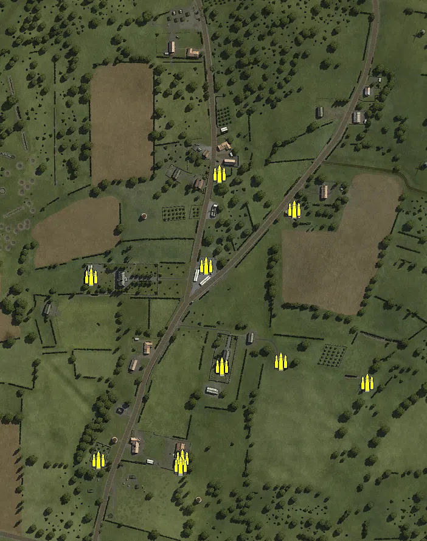
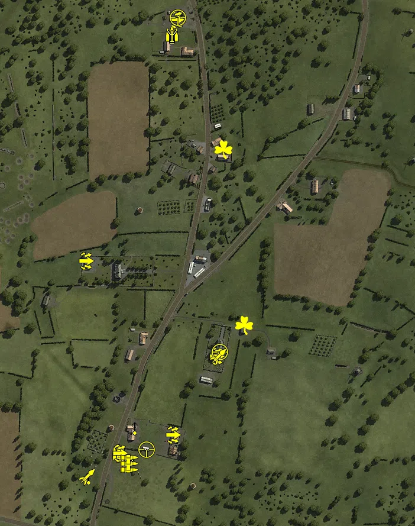
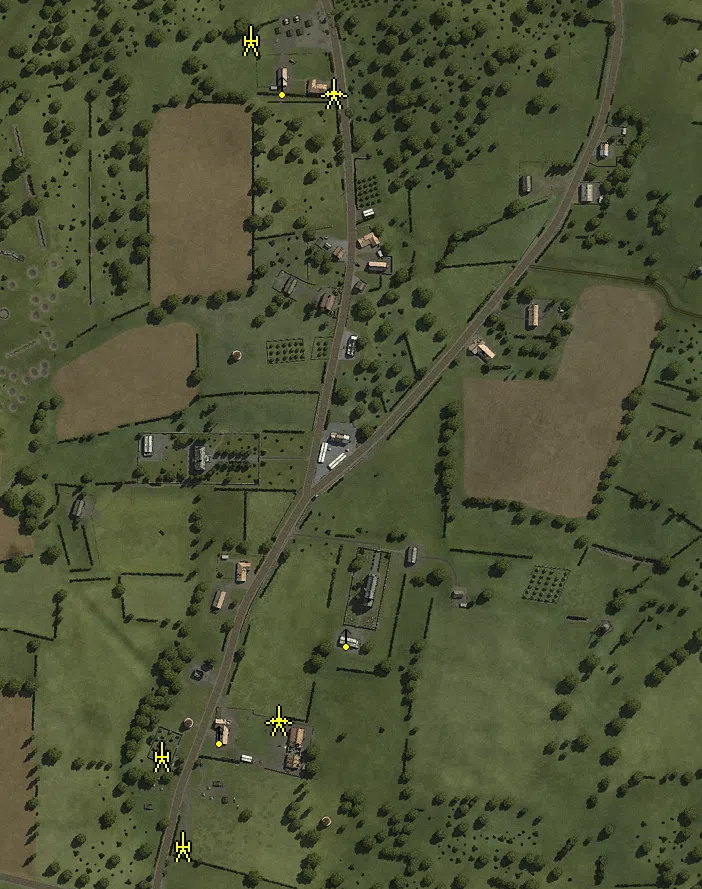
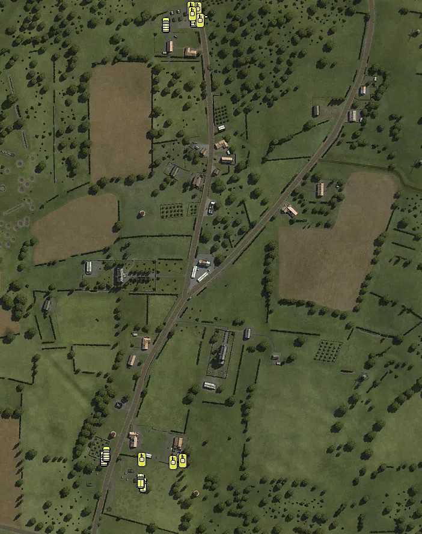

Static Ammo Crate

Pickup Kit

Static Emplacement

Vehicle

| gpo_subcat   | gpo_cat    | gpo_name                   |    pos_x |   pos_y |    pos_z |   flag | is_locked   |   team | instance                              | gpo_cat_disp       | gpo_subcat_disp   |
|:-------------|:-----------|:---------------------------|---------:|--------:|---------:|-------:|:------------|-------:|:--------------------------------------|:-------------------|:------------------|
| ammo_crate   | ammo_crate | ammo_crate                 |   88.075 |  27.596 | -155.591 |      0 | False       |      0 | ammo_crate_0                          | Static Ammo Crate  | Static Ammo Crate |
| ammo_crate   | ammo_crate | ammo_crate                 |   86.921 |  27.593 | -155.366 |      0 | False       |      0 | ammo_crate_1                          | Static Ammo Crate  | Static Ammo Crate |
| ammo_crate   | ammo_crate | ammo_crate                 |   21.546 |  25     | -305.235 |      0 | False       |      0 | ammo_crate_2                          | Static Ammo Crate  | Static Ammo Crate |
| ammo_crate   | ammo_crate | ammo_crate                 | -129.142 |  25.232 |   -7.969 |      0 | False       |      0 | ammo_crate_3                          | Static Ammo Crate  | Static Ammo Crate |
| ammo_crate   | ammo_crate | ammo_crate                 |   18.664 |  25     | -319.522 |      0 | False       |      0 | ammo_crate_4                          | Static Ammo Crate  | Static Ammo Crate |
| ammo_crate   | ammo_crate | ammo_crate                 |   18.9   |  25.003 | -318.202 |      0 | False       |      0 | ammo_crate_5                          | Static Ammo Crate  | Static Ammo Crate |
| ammo_crate   | ammo_crate | ammo_crate                 |   83.038 |  25.077 |  161.275 |      0 | False       |      0 | ammo_crate_6                          | Static Ammo Crate  | Static Ammo Crate |
| ammo_crate   | ammo_crate | ammo_crate                 |  206.445 |  24.978 |  102.59  |      0 | False       |      0 | ammo_crate_7                          | Static Ammo Crate  | Static Ammo Crate |
| ammo_crate   | ammo_crate | ammo_crate                 | -365.609 |  46.695 |  245.719 |      0 | False       |      0 | ammo_crate_8                          | Static Ammo Crate  | Static Ammo Crate |
| ammo_crate   | ammo_crate | ammo_crate                 | -129.141 |  24.978 |   -7.949 |      0 | False       |      0 | ammo_crate_9                          | Static Ammo Crate  | Static Ammo Crate |
| ammo_crate   | ammo_crate | ammo_crate                 | -128.046 |  24.978 |   -7.932 |      0 | False       |      0 | ammo_crate_10                         | Static Ammo Crate  | Static Ammo Crate |
| ammo_crate   | ammo_crate | ammo_crate                 |   61.177 |  25.295 |   10.16  |      0 | False       |      0 | ammo_crate_11                         | Static Ammo Crate  | Static Ammo Crate |
| ammo_crate   | ammo_crate | ammo_crate                 | -319.366 |  40.315 |  119.765 |      0 | False       |      0 | ammo_crate_12                         | Static Ammo Crate  | Static Ammo Crate |
| ammo_crate   | ammo_crate | ammo_crate                 | -116.021 |  25.033 | -308.653 |      0 | False       |      0 | ammo_crate_13                         | Static Ammo Crate  | Static Ammo Crate |
| ammo_crate   | ammo_crate | ammo_crate                 |   88.081 |  27.867 | -155.617 |      0 | False       |      0 | ammo_crate_14                         | Static Ammo Crate  | Static Ammo Crate |
| ammo_crate   | ammo_crate | ammo_crate                 |   87.012 |  27.865 | -155.392 |      0 | False       |      0 | ammo_crate_15                         | Static Ammo Crate  | Static Ammo Crate |
| ammo_crate   | ammo_crate | ammo_crate                 |   21.556 |  25     | -306.187 |      0 | False       |      0 | ammo_crate_16                         | Static Ammo Crate  | Static Ammo Crate |
| ammo_crate   | ammo_crate | ammo_crate                 | -365.641 |  46.948 |  245.711 |      0 | False       |      0 | ammo_crate_17                         | Static Ammo Crate  | Static Ammo Crate |
| ammo_crate   | ammo_crate | ammo_crate                 |   18.69  |  25.236 | -319.511 |      0 | False       |      0 | ammo_crate_18                         | Static Ammo Crate  | Static Ammo Crate |
| ammo_crate   | ammo_crate | ammo_crate                 |   18.926 |  25.265 | -318.195 |      0 | False       |      0 | ammo_crate_19                         | Static Ammo Crate  | Static Ammo Crate |
| ammo_crate   | ammo_crate | ammo_crate                 |   83.066 |  25.339 |  161.275 |      0 | False       |      0 | ammo_crate_20                         | Static Ammo Crate  | Static Ammo Crate |
| ammo_crate   | ammo_crate | ammo_crate                 |  206.433 |  25.24  |  102.568 |      0 | False       |      0 | ammo_crate_21                         | Static Ammo Crate  | Static Ammo Crate |
| ammo_crate   | ammo_crate | ammo_crate                 | -128.012 |  25.24  |   -7.887 |      0 | False       |      0 | ammo_crate_22                         | Static Ammo Crate  | Static Ammo Crate |
| ammo_crate   | ammo_crate | ammo_crate                 |   61.169 |  25.557 |   10.185 |      0 | False       |      0 | ammo_crate_23                         | Static Ammo Crate  | Static Ammo Crate |
| ammo_crate   | ammo_crate | ammo_crate                 |  183.626 |  27.332 | -146.699 |      0 | False       |      0 | ammo_crate_24                         | Static Ammo Crate  | Static Ammo Crate |
| ammo_crate   | ammo_crate | ammo_crate                 | -319.345 |  40.559 |  119.777 |      0 | False       |      0 | ammo_crate_25                         | Static Ammo Crate  | Static Ammo Crate |
| ammo_crate   | ammo_crate | ammo_crate                 | -365.574 |  46.697 |  244.575 |      0 | False       |      0 | ammo_crate_26                         | Static Ammo Crate  | Static Ammo Crate |
| ammo_crate   | ammo_crate | ammo_crate                 |  326.177 |  48.497 | -182.401 |      0 | False       |      0 | ammo_crate_27                         | Static Ammo Crate  | Static Ammo Crate |
| ammo         | kit        | UW_PickUpAmmokit           |  -76.618 |  26     | -318.822 |    202 | False       |      0 | 352_Headquarters_DE_US_Ammo_32        | Pickup Kit         | Ammo Kit          |
| ammo         | kit        | UW_PickUpAmmokit           |   12.977 |  26.9   |  388.273 |    201 | False       |      0 | 32_29th_Division_DE_US_Ammo           | Pickup Kit         | Ammo Kit          |
| arty_dep     | kit        | UW_PickUpMortar            |  -61.437 |  25.8   | -336.383 |    202 | False       |      0 | 352_Headquarters_deploy_mortor_32     | Pickup Kit         | Deployable Arty   |
| arty_dep     | kit        | UW_PickUpMortar            |   12.386 |  26.471 |  387.665 |    201 | False       |      0 | 32_29th_Division_DE_US_Mortar         | Pickup Kit         | Deployable Arty   |
| assault      | kit        | UW_PickUpAssaultM1Thompson |  -75.866 |  26.001 | -318.68  |    202 | False       |      0 | 352_Headquarters_DE_US_Assault_32     | Pickup Kit         | Assault Kit       |
| assault      | kit        | UW_PickUpAssaultM1Thompson |   20.036 |  25.958 |  413.844 |    201 | False       |      0 | 32_29th_Division_DE_US_AssaultGrease  | Pickup Kit         | Assault Kit       |
| assault      | kit        | UW_PickUpAssaultM1Thompson | -133.109 |  29.129 |    5.525 |    206 | False       |      0 | 32_Chateau_DE_US_Assault              | Pickup Kit         | Assault Kit       |
| assault      | kit        | UW_PickUpAssaultM1Thompson |   87.681 |  28.12  | -155.458 |    205 | False       |      0 | 32_Church_DE_US_Assault               | Pickup Kit         | Assault Kit       |
| assault      | kit        | UW_PickUpAssaultM1Thompson |   14.396 |  25.567 | -287.813 |    202 | False       |      0 | 32_352_Headquarters_DE_US_Assault     | Pickup Kit         | Assault Kit       |
| easteregg    | kit        | GW_PickUpFarmer            |  135.056 |  25.342 | -102.896 |    205 | False       |      0 | 32_Church_DE_US_Winchester            | Pickup Kit         | Easteregg         |
| easteregg    | kit        | GW_PickUpFarmer            |  100.237 |  25.044 |  193.757 |    203 | False       |      0 | 32_Villiers_Fossard_DE_US_Winchester  | Pickup Kit         | Easteregg         |
| mg           | kit        | UW_PickUpSupportM1918BAR   |  -58.861 |  25.794 | -336.696 |    202 | False       |      0 | 352_Headquarters_DE_US_SupportMG42_32 | Pickup Kit         | MG Kit            |
| mg_dep       | kit        | UW_PickUp30Cal             | -127.952 |  26.189 | -359.417 |    202 | False       |      0 | 352_Headquarters_DE_US_DepMG_32       | Pickup Kit         | Deployable MG     |
| mg_dep       | kit        | UW_PickUp30Cal             |  -50.377 |  28.524 | -275.266 |    202 | False       |      0 | 32_352_Headquarters_DE_US_DepMG       | Pickup Kit         | Deployable MG     |
| sniper       | kit        | UW_PickUpSniperSpringfield |   94.304 |  45.2   | -147.816 |    205 | False       |      0 | 32_Church_DE_US_Sniper                | Pickup Kit         | Sniper Kit        |
| sniper       | kit        | UW_PickUpSniperSpringfield |   22.897 |  25.864 |  417.116 |    201 | False       |      0 | 32_29th_Division_DE_US_Sniper         | Pickup Kit         | Sniper Kit        |
| sniper       | kit        | UW_PickUpSniperSpringfield |  -29.595 |  25.804 | -312.66  |    202 | False       |      0 | 32_352_Headquarters_DE_US_Sniper      | Pickup Kit         | Sniper Kit        |
| zooka        | kit        | GW_PickUpPanzerschreck     | -130.627 |  26.199 | -358.876 |    202 | False       |      0 | 352_Headquarters_DE_US_Antitank_32    | Pickup Kit         | HEAT Thrower      |
| zooka        | kit        | GW_PickUpPanzerfaust30m    |   90.697 |  27.576 | -155.705 |    205 | False       |      0 | 32_Church_DE_US_AntitankFaust         | Pickup Kit         | HEAT Thrower      |
| arty         | static     | sgwr34_france              | -117.448 |  25.142 | -308.987 |    202 | False       |      0 | 352_Headquarters_mortor_32            | Static Emplacement | Artillery         |
| arty         | static     | lefh18_france              |  -95.565 |  27.71  | -399.168 |    202 | False       |      0 | 352_Headquarters_lefh18_32            | Static Emplacement | Artillery         |
| arty         | static     | m2a1_howitzer_105mm        |  -27.552 |  28.652 |  407.145 |    201 | False       |      0 | 29th_Division_105_Howitzer_32         | Static Emplacement | Artillery         |
| mg_nest      | static     | mg42_bipod                 |   68.441 |  29.008 | -189.956 |    205 | False       |      0 | 32_Church_mg42                        | Static Emplacement | Static MG         |
| mg_nest      | static     | mg42_bipod                 |  -59.215 |  29.117 | -287.04  |    202 | False       |      0 | 32_352_Headquarters_mg42              | Static Emplacement | Static MG         |
| mg_nest      | static     | m1919a4notri               |    4.388 |  31.12  |  362.301 |    201 | False       |      0 | 32_29th_Division_30cal                | Static Emplacement | Static MG         |
| pak          | static     | 57mm_m1_atgun              |   54.698 |  25.016 |  353.699 |    201 | False       |      0 | 32_29th_Division_test                 | Static Emplacement | Anti-tank Gun     |
| pak          | static     | pak40                      |   -0.309 |  25     | -273.354 |    202 | False       |      0 | 32_352_Headquarters_pak_40            | Static Emplacement | Anti-tank Gun     |
| apc          | vehicle    | sdkfz251_d                 |  -40.43  |  25.012 | -359.717 |    202 | False       |      0 | 352_Headquarters_hanomag_32           | Vehicle            | APC               |
| apc          | vehicle    | sdkfz251_d                 |  -43.956 |  25.001 | -352.572 |    202 | False       |      0 | 352_Headquarters_hanomag_2_32         | Vehicle            | APC               |
| car          | vehicle    | opelblitz_fr               | -104.591 |  25     | -315.91  |    202 | False       |      0 | 352_Headquarters_opel_blitz_32        | Vehicle            | Car               |
| car          | vehicle    | kubelwagen_fr              | -101.471 |  25     | -307.763 |    202 | False       |      0 | 352_Headquarters_kubelwagon_32        | Vehicle            | Car               |
| car          | vehicle    | gmc                        |   -1.82  |  26.316 |  405.668 |    201 | False       |      0 | 29th_Division_GMC_truck_32            | Vehicle            | Car               |
| car          | vehicle    | willysmb_us_alt            |   45.175 |  24.98  |  414.797 |    201 | False       |      0 | 29th_Division_willys_32               | Vehicle            | Car               |
| pak_sp       | vehicle    | m4a1_76mm                  |   53.219 |  24.853 |  422.015 |    201 | True        |      0 | 29th_Division_m4a1_76_32              | Vehicle            | Mobile PaK        |
| tank         | vehicle    | m10                        |   50.961 |  25.023 |  431.703 |    201 | True        |      0 | 29th_Division_Hellcat18_32            | Vehicle            | Tank              |
| tank         | vehicle    | m4a1mid_eu                 |   55.036 |  24.859 |  413.301 |    201 | True        |      0 | 29th_Division_m4a1mid_eu_1_32         | Vehicle            | Tank              |
| tank         | vehicle    | stug_iv                    |   25.567 |  25.014 | -319.715 |    202 | True        |      0 | 352_Headquarters_Stugiv_skirt_32      | Vehicle            | Tank              |
| tank         | vehicle    | stug_iv_alt                |  -41.828 |  25     | -317.735 |    202 | True        |      0 | 352_Headquarters_stugiv_noskirt_32    | Vehicle            | Tank              |
| tank         | vehicle    | pzivh                      |    9.683 |  25     | -323.094 |    202 | True        |      0 | 352_Headquarters_pzivh_32             | Vehicle            | Tank              |
| tank         | vehicle    | m3a1                       |   40.367 |  25.182 |  432.939 |    201 | False       |      0 | 29th_Division_m3a1_1_32               | Vehicle            | Tank              |
| tank         | vehicle    | m3a1                       |   42.268 |  25.072 |  424.219 |    201 | False       |      0 | 29th_Division_m3a1_2_32               | Vehicle            | Tank              |

