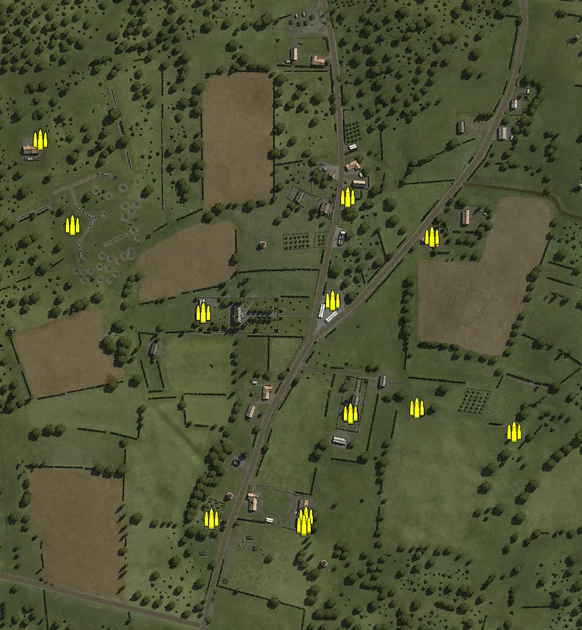
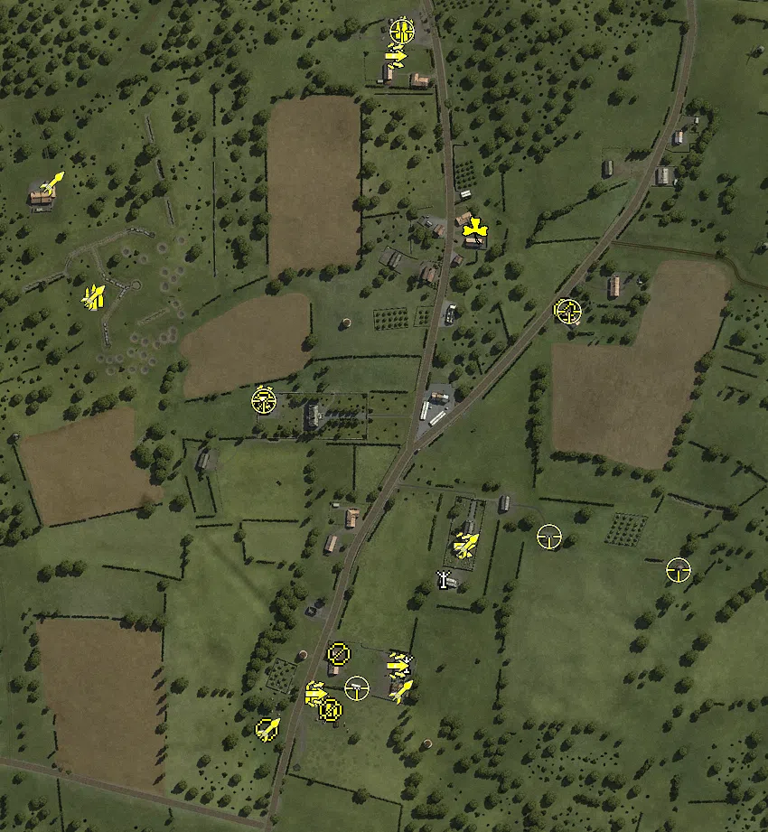
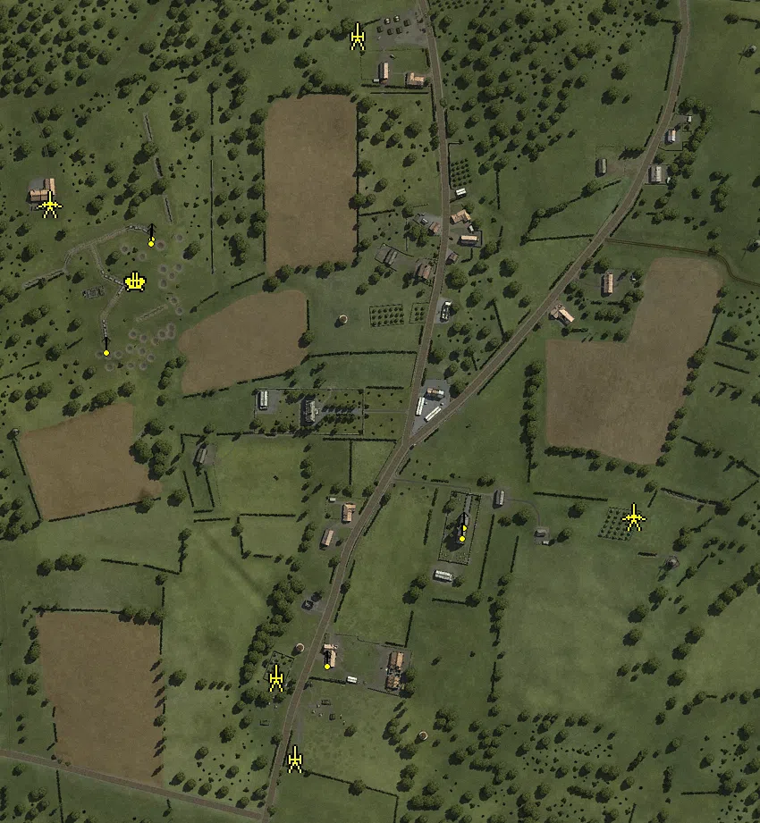
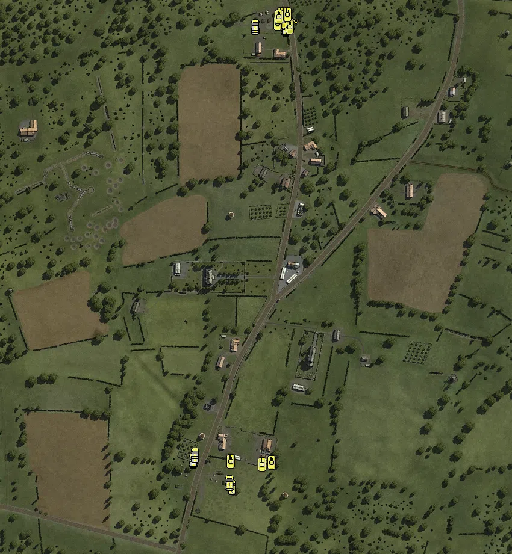

Static Ammo Crate

Pickup Kit

Static Emplacement

Vehicle

| gpo_subcat   | gpo_cat    | gpo_name                   |    pos_x |   pos_y |    pos_z |   flag | is_locked   |   team | instance                             | gpo_cat_disp       | gpo_subcat_disp   |
|:-------------|:-----------|:---------------------------|---------:|--------:|---------:|-------:|:------------|-------:|:-------------------------------------|:-------------------|:------------------|
| ammo_crate   | ammo_crate | ammo_crate                 |   88.075 |  27.596 | -155.591 |      0 | False       |      0 | ammo_crate_0                         | Static Ammo Crate  | Static Ammo Crate |
| ammo_crate   | ammo_crate | ammo_crate                 |   86.921 |  27.593 | -155.366 |      0 | False       |      0 | ammo_crate_1                         | Static Ammo Crate  | Static Ammo Crate |
| ammo_crate   | ammo_crate | ammo_crate                 |   21.546 |  25     | -305.235 |      0 | False       |      0 | ammo_crate_2                         | Static Ammo Crate  | Static Ammo Crate |
| ammo_crate   | ammo_crate | ammo_crate                 | -129.142 |  25.232 |   -7.969 |      0 | False       |      0 | ammo_crate_3                         | Static Ammo Crate  | Static Ammo Crate |
| ammo_crate   | ammo_crate | ammo_crate                 |   18.664 |  25     | -319.522 |      0 | False       |      0 | ammo_crate_4                         | Static Ammo Crate  | Static Ammo Crate |
| ammo_crate   | ammo_crate | ammo_crate                 |   18.9   |  25.003 | -318.202 |      0 | False       |      0 | ammo_crate_5                         | Static Ammo Crate  | Static Ammo Crate |
| ammo_crate   | ammo_crate | ammo_crate                 |   83.038 |  25.077 |  161.275 |      0 | False       |      0 | ammo_crate_6                         | Static Ammo Crate  | Static Ammo Crate |
| ammo_crate   | ammo_crate | ammo_crate                 |  206.445 |  24.978 |  102.59  |      0 | False       |      0 | ammo_crate_7                         | Static Ammo Crate  | Static Ammo Crate |
| ammo_crate   | ammo_crate | ammo_crate                 | -365.609 |  46.695 |  245.719 |      0 | False       |      0 | ammo_crate_8                         | Static Ammo Crate  | Static Ammo Crate |
| ammo_crate   | ammo_crate | ammo_crate                 | -129.141 |  24.978 |   -7.949 |      0 | False       |      0 | ammo_crate_9                         | Static Ammo Crate  | Static Ammo Crate |
| ammo_crate   | ammo_crate | ammo_crate                 | -128.046 |  24.978 |   -7.932 |      0 | False       |      0 | ammo_crate_10                        | Static Ammo Crate  | Static Ammo Crate |
| ammo_crate   | ammo_crate | ammo_crate                 |   61.177 |  25.295 |   10.16  |      0 | False       |      0 | ammo_crate_11                        | Static Ammo Crate  | Static Ammo Crate |
| ammo_crate   | ammo_crate | ammo_crate                 | -319.366 |  40.315 |  119.765 |      0 | False       |      0 | ammo_crate_12                        | Static Ammo Crate  | Static Ammo Crate |
| ammo_crate   | ammo_crate | ammo_crate                 | -116.021 |  25.033 | -308.653 |      0 | False       |      0 | ammo_crate_13                        | Static Ammo Crate  | Static Ammo Crate |
| ammo_crate   | ammo_crate | ammo_crate                 |   88.081 |  27.867 | -155.617 |      0 | False       |      0 | ammo_crate_14                        | Static Ammo Crate  | Static Ammo Crate |
| ammo_crate   | ammo_crate | ammo_crate                 |   87.012 |  27.865 | -155.392 |      0 | False       |      0 | ammo_crate_15                        | Static Ammo Crate  | Static Ammo Crate |
| ammo_crate   | ammo_crate | ammo_crate                 |   21.556 |  25     | -306.187 |      0 | False       |      0 | ammo_crate_16                        | Static Ammo Crate  | Static Ammo Crate |
| ammo_crate   | ammo_crate | ammo_crate                 | -365.641 |  46.948 |  245.711 |      0 | False       |      0 | ammo_crate_17                        | Static Ammo Crate  | Static Ammo Crate |
| ammo_crate   | ammo_crate | ammo_crate                 |   18.69  |  25.236 | -319.511 |      0 | False       |      0 | ammo_crate_18                        | Static Ammo Crate  | Static Ammo Crate |
| ammo_crate   | ammo_crate | ammo_crate                 |   18.926 |  25.265 | -318.195 |      0 | False       |      0 | ammo_crate_19                        | Static Ammo Crate  | Static Ammo Crate |
| ammo_crate   | ammo_crate | ammo_crate                 |   83.066 |  25.339 |  161.275 |      0 | False       |      0 | ammo_crate_20                        | Static Ammo Crate  | Static Ammo Crate |
| ammo_crate   | ammo_crate | ammo_crate                 |  206.433 |  25.24  |  102.568 |      0 | False       |      0 | ammo_crate_21                        | Static Ammo Crate  | Static Ammo Crate |
| ammo_crate   | ammo_crate | ammo_crate                 | -128.012 |  25.24  |   -7.887 |      0 | False       |      0 | ammo_crate_22                        | Static Ammo Crate  | Static Ammo Crate |
| ammo_crate   | ammo_crate | ammo_crate                 |   61.169 |  25.557 |   10.185 |      0 | False       |      0 | ammo_crate_23                        | Static Ammo Crate  | Static Ammo Crate |
| ammo_crate   | ammo_crate | ammo_crate                 |  183.626 |  27.332 | -146.699 |      0 | False       |      0 | ammo_crate_24                        | Static Ammo Crate  | Static Ammo Crate |
| ammo_crate   | ammo_crate | ammo_crate                 | -319.345 |  40.559 |  119.777 |      0 | False       |      0 | ammo_crate_25                        | Static Ammo Crate  | Static Ammo Crate |
| ammo_crate   | ammo_crate | ammo_crate                 | -365.574 |  46.697 |  244.575 |      0 | False       |      0 | ammo_crate_26                        | Static Ammo Crate  | Static Ammo Crate |
| ammo_crate   | ammo_crate | ammo_crate                 |  326.177 |  48.497 | -182.401 |      0 | False       |      0 | ammo_crate_27                        | Static Ammo Crate  | Static Ammo Crate |
| ammo         | kit        | UW_PickUpAmmokit           |  -61.191 |  25.801 | -336.466 |      1 | False       |      0 | 352_Headquarters_DE_US_Ammo          | Pickup Kit         | Ammo Kit          |
| ammo         | kit        | UW_PickUpAmmokit           |  -76.634 |  25.997 | -318.934 |      1 | False       |      0 | 352_Headquarters_DE_US_Ammo_0        | Pickup Kit         | Ammo Kit          |
| ammo         | kit        | UW_PickUpAmmokit           |   22.858 |  25.872 |  417.145 |      2 | False       |      0 | 29th_Division_DE_US_Ammo_0           | Pickup Kit         | Ammo Kit          |
| ammo         | kit        | UW_PickUpAmmokit           | -320.683 |  40.512 |  120.291 |    101 | False       |      0 | Hill_108_DE_US_Ammo                  | Pickup Kit         | Ammo Kit          |
| arty_dep     | kit        | UW_PickUpMortar            |   23.581 |  25.301 | -283.987 |      1 | False       |      0 | 352_Headquarters_DE_US_Mortar        | Pickup Kit         | Deployable Arty   |
| arty_dep     | kit        | UW_PickUpMortar            |   65.187 |  25.015 | -189.742 |      7 | False       |      0 | Church_DE_US_Mortar                  | Pickup Kit         | Deployable Arty   |
| arty_dep     | kit        | UW_PickUpMortar            |   12.52  |  26.47  |  387.798 |      2 | False       |      0 | 29th_Division_DE_US_Mortar           | Pickup Kit         | Deployable Arty   |
| assault      | kit        | UW_PickUpAssaultM1Thompson |   12.321 |  26.374 |  387.238 |      2 | False       |      0 | 29th_Division_DE_US_AssaultGrease    | Pickup Kit         | Assault Kit       |
| assault      | kit        | UW_PickUpAssaultM1Thompson |  -75.919 |  26.001 | -318.728 |      1 | False       |      0 | 352_Headquarters_DE_US_AssaultGrease | Pickup Kit         | Assault Kit       |
| assault      | kit        | UW_PickUpAssaultM1Thompson |   87.681 |  28.119 | -155.465 |      7 | False       |      0 | Church_DE_US_Assault                 | Pickup Kit         | Assault Kit       |
| assault      | kit        | UW_PickUpAssaultM1Thompson | -132.743 |  25.875 |    7.745 |      6 | False       |      0 | Chateau_DE_US_Assault                | Pickup Kit         | Assault Kit       |
| assault      | kit        | UW_PickUpAssaultM1Thompson |   14.393 |  25.56  | -287.812 |      1 | False       |      0 | 352_Headquarters_DE_US_Assault       | Pickup Kit         | Assault Kit       |
| easteregg    | kit        | GW_PickUpFarmer            |  100.629 |  25.636 |  194.394 |      3 | False       |      0 | Villiers_Fossard_DE_US_Winchester    | Pickup Kit         | Easteregg         |
| mg           | kit        | UW_PickUpSupportM1918BAR   | -130.366 |  26.187 | -359.35  |      1 | False       |      0 | 352_Headquarters_DE_US_SupportMG42   | Pickup Kit         | MG Kit            |
| mg_dep       | kit        | UW_PickUp30Cal             | -132.836 |  28.334 |    3.36  |      6 | False       |      0 | Chateau_DE_US_DepMG                  | Pickup Kit         | Deployable MG     |
| mg_dep       | kit        | UW_PickUp30Cal             |  -58.833 |  25.817 | -336.697 |      1 | False       |      0 | 352_Headquarters_DE_US_DepMG         | Pickup Kit         | Deployable MG     |
| mg_dep       | kit        | UW_PickUp30Cal             |  -50.384 |  28.52  | -275.263 |      1 | False       |      0 | 352_Headquarters_DE_US_DepMG_64      | Pickup Kit         | Deployable MG     |
| mg_dep       | kit        | UW_PickUp30Cal             |  199.673 |  28.268 |  106.274 |      5 | False       |      0 | Les_Foulons_DE_US_DepMG              | Pickup Kit         | Deployable MG     |
| sniper       | kit        | UW_PickUpSniperSpringfield |  205.356 |  26.416 |  103.717 |      5 | False       |      0 | Les_Foulons_DE_US_Sniper_1           | Pickup Kit         | Sniper Kit        |
| sniper       | kit        | UW_PickUpSniperSpringfield |  -29.567 |  25.797 | -312.663 |      1 | False       |      0 | 352_Headquarters_DE_US_Sniper_1      | Pickup Kit         | Sniper Kit        |
| sniper       | kit        | UW_PickUpSniperSpringfield |  183.467 |  27.896 | -145.28  |      7 | False       |      0 | Church_DE_US_Sniper_2                | Pickup Kit         | Sniper Kit        |
| sniper       | kit        | UW_PickUpSniperSpringfield | -132.945 |  29.112 |    5.371 |      6 | False       |      0 | Chateau_sniper                       | Pickup Kit         | Sniper Kit        |
| sniper       | kit        | UW_PickUpSniperSpringfield |   20.022 |  25.955 |  414.053 |      2 | False       |      0 | 29th_Division_DE_US_Sniper           | Pickup Kit         | Sniper Kit        |
| sniper       | kit        | GW_PickUpSniperfg42_ZF     |  326.208 |  48.76  | -182.44  |    102 | False       |      0 | Windmill_fg42_scope_64               | Pickup Kit         | Sniper Kit        |
| zooka        | kit        | GW_PickUpPanzerfaust30m    |   90.677 |  27.606 | -155.707 |      7 | False       |      0 | Church_DE_US_AntitankFaust           | Pickup Kit         | HEAT Thrower      |
| zooka        | kit        | GW_PickUpPanzerfaust30m    |   91.771 |  27.944 | -154.51  |      7 | False       |      0 | Church_DE_US_AntitankFaust_2         | Pickup Kit         | HEAT Thrower      |
| zooka        | kit        | GW_PickUpPanzerfaust30m    |   18.904 |  25.003 | -317.017 |      1 | False       |      0 | 352_Headquarters_DE_US_AntitankFaust | Pickup Kit         | HEAT Thrower      |
| zooka        | kit        | GW_PickUpPanzerschreck     | -127.593 |  26.178 | -359.242 |      1 | False       |      0 | 352_Headquarters_DE_US_Antitank      | Pickup Kit         | HEAT Thrower      |
| zooka        | kit        | GW_PickUpPanzerfaust30m    | -322.271 |  40.337 |  120.433 |    101 | False       |      0 | Hill_108_DE_US_AntitankFaust         | Pickup Kit         | HEAT Thrower      |
| zooka        | kit        | UW_PickUpBazooka           | -366.881 |  46.781 |  245.836 |    101 | False       |      0 | Hill_108_DE_US_AntitankFaust_0       | Pickup Kit         | HEAT Thrower      |
| noidea       | noidea     | p51d_flyover               |  261.156 | 146.235 |  699.531 |      2 | False       |      0 | 29th_Division_p51flyover             | FIXME UNASSIGNED   | FIXME UNASSIGNED  |
| noidea       | noidea     | p51d_flyover               |  315.927 | 154.864 |  722.919 |      2 | False       |      0 | 29th_Division_p51flyover2            | FIXME UNASSIGNED   | FIXME UNASSIGNED  |
| noidea       | noidea     | p51d_flyover               |  241.549 | 158.791 |  764.655 |      2 | False       |      0 | 29th_Division_p51flyover3            | FIXME UNASSIGNED   | FIXME UNASSIGNED  |
| noidea       | noidea     | usair_c47_flyover          |  318.543 | 162.011 |  785.989 |      2 | False       |      0 | 29th_Division_bomber_flyover_64      | FIXME UNASSIGNED   | FIXME UNASSIGNED  |
| noidea       | noidea     | usair_c47_damaged_flyover  |  287.331 | 151.163 |  835.039 |      2 | False       |      0 | 29th_Division_c47_flyover2_64        | FIXME UNASSIGNED   | FIXME UNASSIGNED  |
| noidea       | noidea     | p51d_flyover               |  266.283 | 157.579 |  920.321 |      2 | False       |      0 | 29th_Division_p51flyover_3_64        | FIXME UNASSIGNED   | FIXME UNASSIGNED  |
| noidea       | noidea     | p51d_flyover               |  384.796 | 158.698 |  846.154 |      2 | False       |      0 | 29th_Division_p51flyover_5_64        | FIXME UNASSIGNED   | FIXME UNASSIGNED  |
| arty         | static     | sgwr34_france              | -117.123 |  25.136 | -309.251 |      1 | False       |      0 | 352_Headquarters_mortor              | Static Emplacement | Artillery         |
| arty         | static     | lefh18_france              |  -95.969 |  27.699 | -399.822 |      1 | False       |      0 | 352_Headquarters_lefh18              | Static Emplacement | Artillery         |
| arty         | static     | m2a1_howitzer_105mm        |  -25.689 |  28.645 |  408.813 |      2 | False       |      0 | 29th_Division_m2a1_howitzer          | Static Emplacement | Artillery         |
| flak         | static     | flak18_fr                  | -273.022 |  41.705 |  133.809 |    101 | False       |      0 | Hill_108_88mm                        | Static Emplacement | Anti-aircraft Gun |
| mg_nest      | static     | mg42_bipod                 |   94.443 |  28.317 | -132.049 |      7 | False       |      0 | Church_mg                            | Static Emplacement | Static MG         |
| mg_nest      | static     | mg34_bipod                 |   91.922 |  45.312 | -143.524 |      7 | False       |      0 | Church_mg_tower_north                | Static Emplacement | Static MG         |
| mg_nest      | static     | mg42_bipod                 | -305.524 |  38.134 |   64.359 |    101 | False       |      0 | Hill_108_mg_42_64                    | Static Emplacement | Static MG         |
| mg_nest      | static     | mg42_bipod                 | -254.603 |  42.565 |  190.784 |    101 | False       |      0 | Hill_108_mg_42_2_64                  | Static Emplacement | Static MG         |
| mg_nest      | static     | mg42_bipod                 |  -59.215 |  29.116 | -287.051 |      1 | False       |      0 | 352_Headquarters_MG42_64             | Static Emplacement | Static MG         |
| mg_nest      | static     | mg42_bipod                 | -256.474 |  42.652 |  186.174 |    101 | False       |      0 | Hill_108_mg42_2                      | Static Emplacement | Static MG         |
| pak          | static     | pak40                      |  282.792 |  34.583 | -129.381 |    102 | False       |      0 | Windmill_pak_40_64                   | Static Emplacement | Anti-tank Gun     |
| pak          | static     | pak38_fr                   | -370.402 |  46.696 |  220.631 |    101 | False       |      0 | Hill_108_mobile_AT                   | Static Emplacement | Anti-tank Gun     |
| apc          | vehicle    | sdkfz251_d                 |  -40.42  |  25.012 | -359.625 |      1 | False       |      0 | 352_Headquarters_hanomag_1_64        | Vehicle            | APC               |
| apc          | vehicle    | sdkfz251_d                 |  -44.024 |  25.001 | -352.617 |      1 | False       |      0 | 352_Headquarters_hanomag_2_64        | Vehicle            | APC               |
| car          | vehicle    | opelblitz_fr               | -104.143 |  25     | -315.531 |      1 | False       |      0 | 352_Headquarters_opelblitz_64        | Vehicle            | Car               |
| car          | vehicle    | gmc                        |   -1.464 |  26.294 |  404.887 |      2 | False       |      0 | 29th_Division_GMC_truck_64           | Vehicle            | Car               |
| car          | vehicle    | willysmb_us_alt            |   49.116 |  24.891 |  402.483 |      2 | False       |      0 | 29th_Division_willys_alt_64          | Vehicle            | Car               |
| car          | vehicle    | kubelwagen_fr              | -100.893 |  25     | -306.722 |      1 | False       |      0 | 352_Headquarters_kubelwagon_64       | Vehicle            | Car               |
| pak_sp       | vehicle    | m4a1_76mm                  |   54.169 |  24.856 |  414.767 |      2 | True        |      0 | 29th_Division_76mm_64                | Vehicle            | Mobile PaK        |
| tank         | vehicle    | m4a1mid_eu                 |   56.341 |  24.856 |  404.36  |      2 | True        |      0 | 29th_Division_m4a1mid_64             | Vehicle            | Tank              |
| tank         | vehicle    | stug_iv_alt                |  -41.828 |  25     | -317.738 |      1 | True        |      0 | 352_Headquarters_stug_noskirts_64    | Vehicle            | Tank              |
| tank         | vehicle    | stug_iv                    |   25.525 |  25.014 | -319.842 |      1 | True        |      0 | 352_Headquarters_stug_skirts_64      | Vehicle            | Tank              |
| tank         | vehicle    | m3a1                       |   42.2   |  25.114 |  425.128 |      2 | False       |      0 | 29th_Division_m3a1_1_64              | Vehicle            | Tank              |
| tank         | vehicle    | m3a1                       |   44.727 |  25.011 |  413.99  |      2 | False       |      0 | 29th_Division_m3a1_2_64              | Vehicle            | Tank              |
| tank         | vehicle    | pzivh                      |    9.721 |  25     | -323.059 |      1 | True        |      0 | 352_Headquarters_pzivh_64            | Vehicle            | Tank              |
| tank         | vehicle    | m10                        |   52.048 |  24.895 |  424.704 |      2 | True        |      0 | 29th_Division_hellcat64              | Vehicle            | Tank              |
| tank         | vehicle    | m3a1                       |   35.729 |  25.103 |  409.808 |      2 | False       |      0 | 29th_Division_m3a1_3_64              | Vehicle            | Tank              |
| tank         | vehicle    | m3a1                       |   37.782 |  25.157 |  421.288 |      2 | False       |      0 | 29th_Division_m3a1_4_64              | Vehicle            | Tank              |

