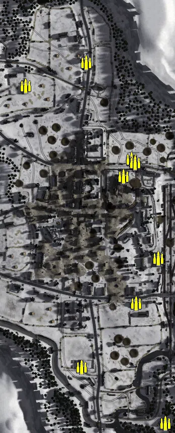
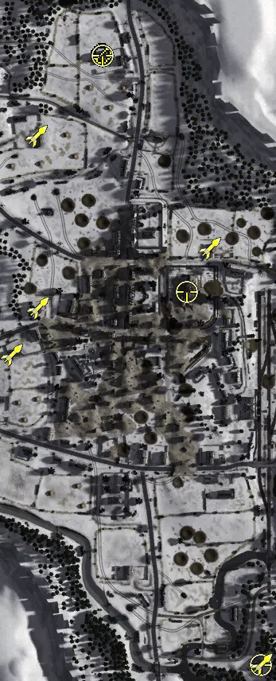
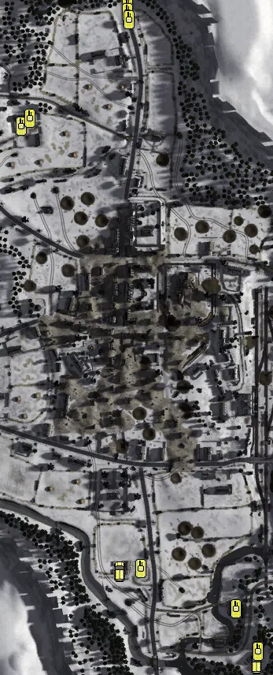

Static Ammo Crate

Pickup Kit

Vehicle

| gpo_subcat   | gpo_cat    | gpo_name                   |    pos_x |   pos_y |    pos_z |   flag | is_locked   |   team | instance                                  | gpo_cat_disp      | gpo_subcat_disp   |
|:-------------|:-----------|:---------------------------|---------:|--------:|---------:|-------:|:------------|-------:|:------------------------------------------|:------------------|:------------------|
| ammo_crate   | ammo_crate | ammo_crate                 |  362.711 |  27.398 |  252.072 |      0 | False       |      0 | ammo_crate_0                              | Static Ammo Crate | Static Ammo Crate |
| ammo_crate   | ammo_crate | ammo_crate                 |  365.921 |  34.802 | -137.98  |      0 | False       |      0 | ammo_crate_1                              | Static Ammo Crate | Static Ammo Crate |
| ammo_crate   | ammo_crate | ammo_crate                 | -184.545 |  21.512 | -260.156 |      0 | False       |      0 | ammo_crate_2                              | Static Ammo Crate | Static Ammo Crate |
| ammo_crate   | ammo_crate | ammo_crate                 |  123.947 |  28.32  | -203.893 |      0 | False       |      0 | ammo_crate_3                              | Static Ammo Crate | Static Ammo Crate |
| ammo_crate   | ammo_crate | ammo_crate                 |  136.065 |  25.347 |  -96.151 |      0 | False       |      0 | ammo_crate_4                              | Static Ammo Crate | Static Ammo Crate |
| ammo_crate   | ammo_crate | ammo_crate                 | -176.436 |  32.914 |  342.346 |      0 | False       |      0 | ammo_crate_5                              | Static Ammo Crate | Static Ammo Crate |
| ammo_crate   | ammo_crate | ammo_crate                 |  157.356 |  23.728 |  128.989 |      0 | False       |      0 | ammo_crate_6                              | Static Ammo Crate | Static Ammo Crate |
| ammo_crate   | ammo_crate | ammo_crate                 |   92.609 |  26.143 | -201.14  |      0 | False       |      0 | ammo_crate_7                              | Static Ammo Crate | Static Ammo Crate |
| ammo_crate   | ammo_crate | ammo_crate                 | -296.226 |  32.097 |  295.86  |      0 | False       |      0 | ammo_crate_8                              | Static Ammo Crate | Static Ammo Crate |
| ammo_crate   | ammo_crate | ammo_crate                 |  373.135 |  34.805 | -148.48  |      0 | False       |      0 | ammo_crate_9                              | Static Ammo Crate | Static Ammo Crate |
| ammo_crate   | ammo_crate | ammo_crate                 | -426.062 |  33.502 |  293.584 |      0 | False       |      0 | ammo_crate_10                             | Static Ammo Crate | Static Ammo Crate |
| ammo_crate   | ammo_crate | ammo_crate                 |  -77.403 |  25.803 | -133.669 |      0 | False       |      0 | ammo_crate_11                             | Static Ammo Crate | Static Ammo Crate |
| ammo_crate   | ammo_crate | ammo_crate                 |  -19.052 |  17.167 | -371.161 |      0 | False       |      0 | ammo_crate_12                             | Static Ammo Crate | Static Ammo Crate |
| ammo_crate   | ammo_crate | ammo_crate                 |  -85.753 |  24.795 |  150.736 |      0 | False       |      0 | ammo_crate_13                             | Static Ammo Crate | Static Ammo Crate |
| ammo_crate   | ammo_crate | ammo_crate                 | -101.627 |  27.467 |  116.932 |      0 | False       |      0 | ammo_crate_14                             | Static Ammo Crate | Static Ammo Crate |
| ammo_crate   | ammo_crate | ammo_crate                 |  -33.362 |  18.905 |  -44.7   |      0 | False       |      0 | ammo_crate_15                             | Static Ammo Crate | Static Ammo Crate |
| ammo_crate   | ammo_crate | ammo_crate                 |  -79.027 |  27.822 |  143.581 |      0 | False       |      0 | ammo_crate_16                             | Static Ammo Crate | Static Ammo Crate |
| mg_dep       | kit        | UW_PickupM1917a1           | -218.768 |  37.321 |  398.491 |    206 | False       |      0 | CP_32_stvith_roadtomalmedy_hmg            | Pickup Kit        | Deployable MG     |
| sniper       | kit        | GW_PickupSniperg43_zf      |  -18.772 |  17.163 | -370.364 |    201 | False       |      0 | CP_32_stvith_wiesenbach_sniper            | Pickup Kit        | Sniper Kit        |
| sniper       | kit        | UW_PickupSniperSpringfield | -112.025 |  42.728 |   99.219 |    203 | False       |      0 | CP_32_stvith_stjosephkloster_sniperallies | Pickup Kit        | Sniper Kit        |
| sniper       | kit        | UW_PickupSniperSpringfield | -217.669 |  37.313 |  396.262 |    206 | False       |      0 | CP_32_stvith_roadtomalmedy_sniper         | Pickup Kit        | Sniper Kit        |
| zooka        | kit        | GW_PickupPanzerschreck     |  -17.828 |  16.395 | -368.882 |    201 | False       |      0 | CP_32_stvith_wiesenbach_at                | Pickup Kit        | HEAT Thrower      |
| zooka        | kit        | GW_PickupPanzerschreck     | -331.722 |  29.682 |   20.246 |    205 | False       |      0 | CP_32_stvith_buchlerturm_axisat           | Pickup Kit        | HEAT Thrower      |
| zooka        | kit        | UW_PickupBazooka           | -298.996 |  29.663 |   78.767 |    205 | False       |      0 | CP_32_stvith_buchlerturm_alliedat         | Pickup Kit        | HEAT Thrower      |
| zooka        | kit        | UW_PickupBazooka           |  -82.771 |  25.442 |  153.837 |    203 | False       |      0 | CP_32_stvith_stjosephkloster_atallies     | Pickup Kit        | HEAT Thrower      |
| zooka        | kit        | UW_PickupBazooka           | -300.622 |  32.007 |  295.051 |    206 | False       |      0 | CP_32_stvith_roadtomalmedy_at             | Pickup Kit        | HEAT Thrower      |
| apc          | vehicle    | sdkfz251_d_win             |  -20.821 |  16.395 | -374.971 |    201 | False       |      0 | CP_32_stvith_wiesenbach_apc               | Vehicle           | APC               |
| apc          | vehicle    | sdkfz251_d_win             | -195.434 |  18.27  | -257.878 |    202 | False       |      0 | CP_32_stvith_crossroads_apc               | Vehicle           | APC               |
| tank         | vehicle    | panther_g_win_alt          |  -18.636 |  16.395 | -360.265 |    201 | True        |      0 | CP_32_stvith_wiesenbach_panther           | Vehicle           | Tank              |
| tank         | vehicle    | hetzer_win                 |  -47.436 |  12.546 | -305.95  |    201 | True        |      0 | CP_32_stvith_wiesenbach_hetzer            | Vehicle           | Tank              |
| tank         | vehicle    | panther_g_win              | -167.852 |  18.101 | -255.144 |    202 | True        |      0 | CP_32_stvith_crossroads_panther           | Vehicle           | Tank              |
| tank         | vehicle    | m3a1_win                   | -185.103 |  39.296 |  457.718 |    206 | False       |      0 | CP_32_stvith_roadtomalmedy_apc            | Vehicle           | Tank              |
| tank         | vehicle    | m4a3_win                   | -184.696 |  39.105 |  450.279 |    206 | True        |      0 | CP_32_stvith_roadtomalmedy_sherman1       | Vehicle           | Tank              |
| tank         | vehicle    | m4a3_76_win_alt            | -183.085 |  39.061 |  440.889 |    206 | True        |      0 | CP_32_stvith_roadtomalmedy_sherman2       | Vehicle           | Tank              |
| tank         | vehicle    | m36_win                    | -320.478 |  31.757 |  306.012 |    206 | True        |      0 | CP_32_stvith_roadtomalmedy_m36            | Vehicle           | Tank              |
| tank         | vehicle    | m4a3_win                   | -308.687 |  31.757 |  315.897 |    206 | True        |      0 | CP_32_stvith_roadtomalmedy_sherman3       | Vehicle           | Tank              |

