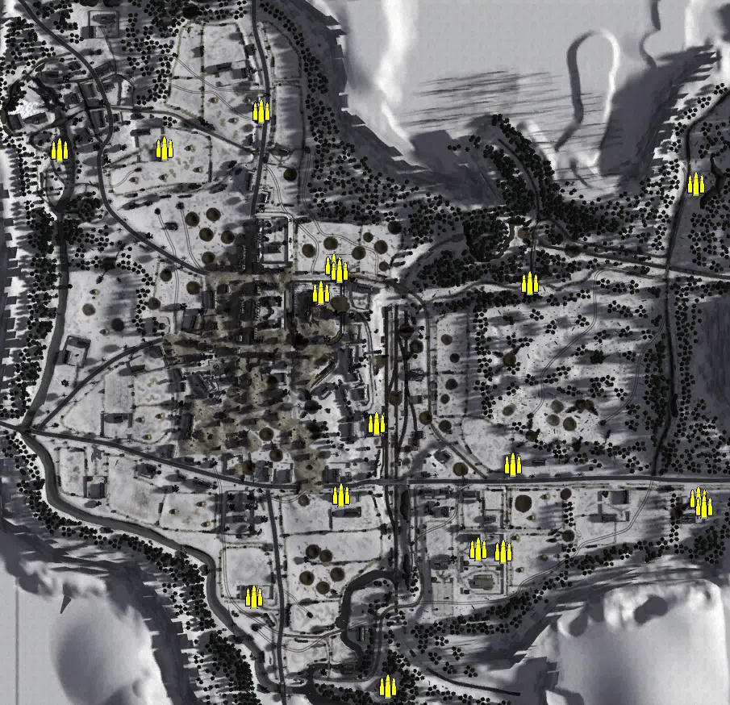
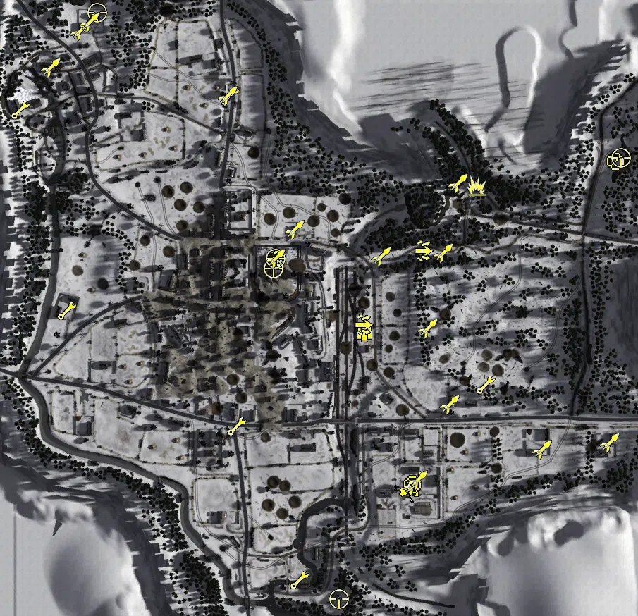
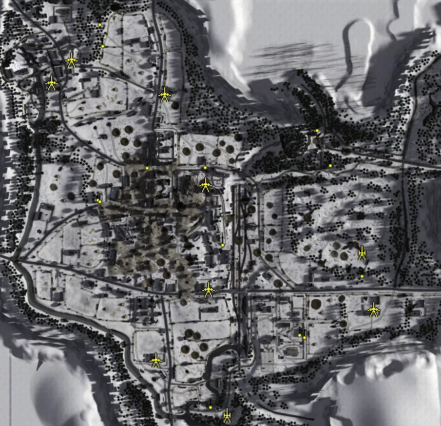
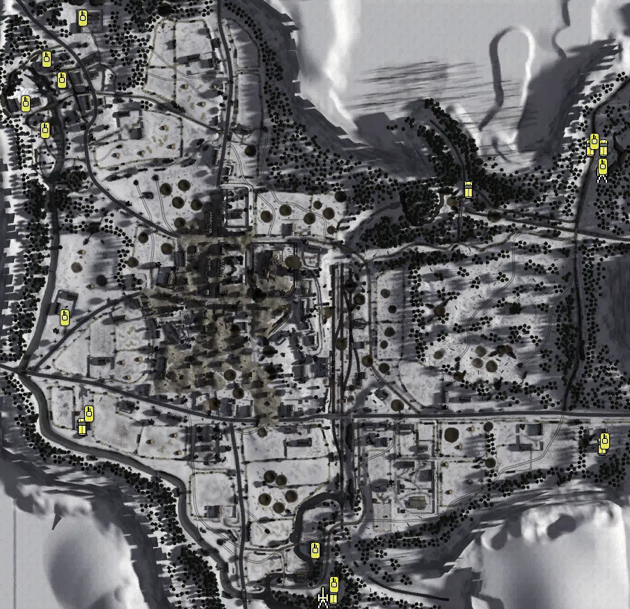

Static Ammo Crate

Pickup Kit

Static Emplacement

Vehicle

| Icon                        | SubCat            | Cat                | Name                        | Instance                                            |   Flag |    X Pos |   Y Pos |    Z Pos |
|:----------------------------|:------------------|:-------------------|:----------------------------|:----------------------------------------------------|-------:|---------:|--------:|---------:|
|       | Static Ammo Crate | Static Ammo Crate  | ammo_crate                  | ammo_crate_0                                        |      0 |  362.711 |  27.398 |  252.072 |
|       | Static Ammo Crate | Static Ammo Crate  | ammo_crate                  | ammo_crate_1                                        |      0 |  365.921 |  34.802 | -137.980 |
|       | Static Ammo Crate | Static Ammo Crate  | ammo_crate                  | ammo_crate_2                                        |      0 | -184.545 |  21.512 | -260.156 |
|       | Static Ammo Crate | Static Ammo Crate  | ammo_crate                  | ammo_crate_3                                        |      0 |  123.947 |  28.320 | -203.893 |
|       | Static Ammo Crate | Static Ammo Crate  | ammo_crate                  | ammo_crate_4                                        |      0 |  136.065 |  25.347 |  -96.151 |
|       | Static Ammo Crate | Static Ammo Crate  | ammo_crate                  | ammo_crate_5                                        |      0 | -176.436 |  32.914 |  342.346 |
|       | Static Ammo Crate | Static Ammo Crate  | ammo_crate                  | ammo_crate_6                                        |      0 |  157.356 |  23.728 |  128.989 |
|       | Static Ammo Crate | Static Ammo Crate  | ammo_crate                  | ammo_crate_7                                        |      0 |   92.609 |  26.143 | -201.140 |
|       | Static Ammo Crate | Static Ammo Crate  | ammo_crate                  | ammo_crate_8                                        |      0 | -296.226 |  32.097 |  295.860 |
|       | Static Ammo Crate | Static Ammo Crate  | ammo_crate                  | ammo_crate_9                                        |      0 |  373.135 |  34.805 | -148.480 |
|       | Static Ammo Crate | Static Ammo Crate  | ammo_crate                  | ammo_crate_10                                       |      0 | -426.062 |  33.502 |  293.584 |
|       | Static Ammo Crate | Static Ammo Crate  | ammo_crate                  | ammo_crate_11                                       |      0 |  -77.403 |  25.803 | -133.669 |
|       | Static Ammo Crate | Static Ammo Crate  | ammo_crate                  | ammo_crate_12                                       |      0 |  -19.052 |  17.167 | -371.161 |
|       | Static Ammo Crate | Static Ammo Crate  | ammo_crate                  | ammo_crate_13                                       |      0 |  -85.753 |  24.795 |  150.736 |
|       | Static Ammo Crate | Static Ammo Crate  | ammo_crate                  | ammo_crate_14                                       |      0 | -101.627 |  27.467 |  116.932 |
|       | Static Ammo Crate | Static Ammo Crate  | ammo_crate                  | ammo_crate_15                                       |      0 |  -33.362 |  18.905 |  -44.700 |
|       | Static Ammo Crate | Static Ammo Crate  | ammo_crate                  | ammo_crate_16                                       |      0 |  -79.027 |  27.822 |  143.581 |
|       | Ammo Kit          | Pickup Kit         | GW_PickUpAmmokit            | CP_64_Stvith_Trainstation_Ammokit1                  |    103 |   16.992 |  18.584 |   10.460 |
|       | Tankhunter Kit    | Pickup Kit         | GW_PickUpGeballteLadung     | CP_64_Stvith_Aachener_path_gebalte                  |    101 |  176.116 |  28.033 |  217.138 |
|    | Assault Kit       | Pickup Kit         | UW_PickUpAssaultM3Greasegun | CP_64_Stvith_St_Joseph_Kloster_DE_US_AssaultGrease  |    102 | -109.913 |  28.692 |  113.023 |
|    | Assault Kit       | Pickup Kit         | GW_PickUpAssaultBeretta     | CP_64_Stvith_Trainstation_DE_US_BERETApickup        |    103 |   14.764 |  19.319 |   18.748 |
|    | Assault Kit       | Pickup Kit         | GW_PickUpAssaultG43         | CP_64_Stvith_German_Positions_g43                   |    110 |   99.584 |  24.809 |  124.184 |
|  | Easteregg         | Pickup Kit         | GW_PickUpFarmer             | CP_64_Stvith_German_Positions_farmer                |    104 |   80.986 |  25.586 | -217.610 |
|   | Engineer Kit      | Pickup Kit         | UW_PickUpEngineer           | CP_64_Stvith_Walleroder_Wood_Engy                   |    105 |  189.290 |  24.105 |  -65.989 |
|   | Engineer Kit      | Pickup Kit         | UW_PickUpEngineer           | CP_64_Stvith_Rosenhuegels_Farms_Engy                |    104 |   90.903 |  25.124 | -201.384 |
|   | Engineer Kit      | Pickup Kit         | UW_PickUpEngineer           | CP_64_Stvith_Wiesenbach_Engy                        |    204 |  -74.863 |  12.123 | -342.705 |
|   | Engineer Kit      | Pickup Kit         | UW_PickUpEngineer           | CP_64_Stvith_Crossroads_Engy                        |    107 | -163.696 |  24.572 | -124.630 |
|   | Engineer Kit      | Pickup Kit         | UW_PickUpEngineer           | CP_64_Stvith_Buchler_Turm_Engy                      |    112 | -405.369 |  27.210 |   38.894 |
|   | Engineer Kit      | Pickup Kit         | UW_PickUpEngineer           | CP_64_Stvith_Road_to_Malmedy_Engy                   |    111 | -173.570 |  34.025 |  343.599 |
|   | Engineer Kit      | Pickup Kit         | UW_PickUpEngineer           | CP_64_Stvith_Ober_Emmels_engy                       |    109 | -471.048 |  39.143 |  323.666 |
|   | Engineer Kit      | Pickup Kit         | UW_PickUpEngineer           | CP_64_Stvith_Nieder_Emmels_Engy_1                   |    106 | -374.479 |  46.336 |  447.879 |
|        | Deployable MG     | Pickup Kit         | GW_PickUpMG42Lafette        | CP_64_Stvith_German_Positions_Lafette               |    110 |  372.995 |  26.672 |  250.882 |
|        | Deployable MG     | Pickup Kit         | UW_PickUpM1917a1            | CP_64_Stvith_Rosenhuegels_Farms_US_M1917            |    104 |   84.913 |  25.729 | -207.624 |
|     | Sniper Kit        | Pickup Kit         | UW_PickUpSniperSpringfield  | CP_64_Stvith_St_Joseph_Kloster_USsniper             |    102 | -112.346 |  42.762 |   99.444 |
|     | Sniper Kit        | Pickup Kit         | GW_PickUpSniperg43_ZF       | CP_64_Stvith_German_Positions_GERsniper             |    110 |  381.190 |  26.757 |  255.777 |
|     | Sniper Kit        | Pickup Kit         | GW_PickUpSniperg43_ZF       | CP_64_Stvith_St_Joseph_Kloster_gersniper            |    102 | -108.545 |  28.697 |  112.783 |
|     | Sniper Kit        | Pickup Kit         | UW_PickUpSniperSpringfield  | CP_64_Stvith_Nieder_Emmels_ussniper                 |    106 | -362.044 |  46.659 |  461.653 |
|     | Sniper Kit        | Pickup Kit         | GW_PickUpSniperK98          | CP_64_Stvith_Wiesenbach_snipek98                    |    204 |  -18.667 |  17.149 | -370.281 |
|     | HEAT Thrower      | Pickup Kit         | UW_PickUpBazooka            | CP_64_Stvith_Walleroder_Wood_DE_US_Antitank         |    105 |  138.303 |  26.123 |  -94.182 |
|     | HEAT Thrower      | Pickup Kit         | UW_PickUpBazooka            | CP_64_Stvith_Walleroder_Wood_DE_US_Antitank_0       |    105 |  268.528 |  29.278 | -158.402 |
|     | HEAT Thrower      | Pickup Kit         | UW_PickUpBazooka            | CP_64_Stvith_St_Joseph_Kloster_DE_US_Antitank       |    102 | -109.258 |  28.726 |  112.738 |
|     | HEAT Thrower      | Pickup Kit         | UW_PickUpBazooka            | CP_64_Stvith_Road_to_Malmedy_DE_US_Antitank         |    111 | -177.014 |  32.963 |  343.791 |
|     | HEAT Thrower      | Pickup Kit         | UW_PickUpBazooka            | CP_64_Stvith_Ober_Emmels_DE_US_Antitank             |    109 | -428.333 |  43.113 |  383.679 |
|     | HEAT Thrower      | Pickup Kit         | UW_PickUpBazooka            | CP_64_Stvith_Ober_Emmels_DE_US_Antitank_0           |    109 | -386.239 |  46.064 |  435.956 |
|     | HEAT Thrower      | Pickup Kit         | UW_PickUpBazooka            | CP_64_Stvith_Rosenhuegels_Farms_DE_US_AntitankFaust |    104 |   85.935 |  26.190 | -208.987 |
|     | HEAT Thrower      | Pickup Kit         | UW_PickUpBazookaM9          | CP_64_Stvith_Rosenhuegels_Farms_Bazzoka             |    104 |   92.649 |  26.534 | -201.197 |
|     | HEAT Thrower      | Pickup Kit         | UW_PickUpBazookaM9          | CP_64_Stvith_Ober_Emmels_DE_US_AntitankFaust        |    109 | -372.873 |  46.650 |  447.586 |
|     | HEAT Thrower      | Pickup Kit         | UW_PickUpBazookaM9          | CP_64_Stvith_Walleroder_Wood_Bazook                 |    105 |  106.550 |  25.285 |   14.210 |
|     | HEAT Thrower      | Pickup Kit         | UW_PickUpBazooka            | CP_64_Stvith_Aachener_path_Bazook                   |    101 |  129.037 |  23.488 |  120.791 |
|     | HEAT Thrower      | Pickup Kit         | UW_PickUpBazooka            | CP_64_Stvith_Aachener_path_Bazooka                  |    101 |  150.347 |  29.076 |  220.028 |
|     | HEAT Thrower      | Pickup Kit         | UW_PickUpBazooka            | CP_64_Stvith_Friedensstrasse_Bridge_bazooka         |    108 |  -82.484 |  25.477 |  153.532 |
|     | HEAT Thrower      | Pickup Kit         | GW_PickUpPanzerschreck      | CP_64_Stvith_Friedensstrasse_Bridge_DE_GB_Antitank  |    108 |   40.725 |  22.484 |  115.819 |
|     | HEAT Thrower      | Pickup Kit         | GW_PickUpPanzerschreck      | CP_64_Stvith_Walleroder_Wood_schreck                |    105 |  365.218 |  34.944 | -148.272 |
|       | Artillery         | Static Emplacement | sgwr34_france               | CP_64_Stvith_Wiesenbach_DE_US_Mortar                |    204 |  -35.198 |  16.463 | -370.893 |
|       | Artillery         | Static Emplacement | sgwr34_france               | CP_64_Stvith_Walleroder_Wood_mortar                 |    105 |  241.652 |  22.971 |  -38.469 |
|        | Static MG         | Static Emplacement | m1919a6_emplaced            | CP_64_Stvith_Rosenhuegels_Farms_staticbrowning      |    104 |  124.512 |  29.474 | -202.724 |
|        | Static MG         | Static Emplacement | m1919a6_emplaced            | CP_64_Stvith_Walleroder_Wood_mg                     |    105 |  243.088 |  27.098 |  -76.639 |
|        | Static MG         | Static Emplacement | m1917_tripod                | CP_64_Stvith_Friedensstrasse_Bridge_USMG            |    108 |  -79.356 |  27.926 |  145.864 |
|        | Static MG         | Static Emplacement | m1919a6_emplaced            | CP_64_Stvith_Ober_Emmels_USMG                       |    109 | -295.163 |  42.923 |  439.407 |
|        | Static MG         | Static Emplacement | m1919a6_emplaced            | CP_64_Stvith_Ober_Emmels_MG                         |    109 | -289.253 |  37.663 |  394.964 |
|        | Static MG         | Static Emplacement | m1917_tripod                | CP_64_Stvith_Trainstation_m1917_tripod              |    103 |  -42.695 |  20.311 |  -13.070 |
|        | Static MG         | Static Emplacement | m1917_tripod                | CP_64_Stvith_St_Joseph_Kloster_m1917                |    102 | -198.207 |  32.149 |  145.377 |
|        | Static MG         | Static Emplacement | m1919a6_emplaced            | CP_64_Stvith_Aachener_path_MG                       |    101 |  151.377 |  29.150 |  221.787 |
|        | Static MG         | Static Emplacement | m1919a6_emplaced            | CP_64_Stvith_Aachener_path_MG_0                     |    101 |  178.035 |  27.096 |  150.054 |
|        | Static MG         | Static Emplacement | mg42_bipod                  | CP_64_Stvith_Buchler_Turm_DE_MG                     |    112 | -298.677 |  39.048 |   78.726 |
|        | Static MG         | Static Emplacement | m1917_tripod                | CP_64_Stvith_Wiesenbach_mg                          |    204 | -184.373 |  21.617 | -258.515 |
|        | Static MG         | Static Emplacement | mg42_bipod                  | CP_64_Stvith_Rosenhuegels_Farms_mg42                |    104 |  115.428 |  29.267 | -198.442 |
|        | Static MG         | Static Emplacement | m1919a6_emplaced            | CP_64_Stvith_Wiesenbach_mg_0                        |    204 |  -68.044 |  16.010 | -345.545 |
|        | Static MG         | Static Emplacement | m1919a6_emplaced            | CP_64_Stvith_Buchler_Turm_mg                        |    112 | -295.026 |  34.156 |   75.667 |
|        | Anti-tank Gun     | Static Emplacement | 57mm_m1_atgun_win           | CP_64_Stvith_Friedensstrasse_Bridge_m1ATgun_0       |    108 |  -78.961 |  25.951 |  102.151 |
|        | Anti-tank Gun     | Static Emplacement | 57mm_m1_atgun_win           | CP_64_Stvith_Trainstation_m1atgun                   |    103 |  -72.974 |  24.202 | -113.012 |
|        | Anti-tank Gun     | Static Emplacement | 57mm_m1_atgun_win           | CP_64_Stvith_Road_to_Malmedy_M1atgun                |    111 | -163.241 |  33.111 |  286.685 |
|        | Anti-tank Gun     | Static Emplacement | 57mm_m1_atgun_win           | CP_64_Stvith_Nieder_Emmels_stionnary76b             |    106 | -353.979 |  41.400 |  357.804 |
|        | Anti-tank Gun     | Static Emplacement | 57mm_m1_atgun_win           | CP_64_Stvith_Ober_Emmels_Us_stionnary57             |    109 | -394.729 |  38.481 |  310.945 |
|        | Anti-tank Gun     | Static Emplacement | 57mm_m1_atgun_win           | CP_64_Stvith_Walleroder_Wood_at_gun                 |    105 |  265.940 |  29.115 | -154.405 |
|        | Anti-tank Gun     | Static Emplacement | 57mm_m1_atgun_win           | CP_64_Stvith_Wiesenbach_ATgun                       |    204 | -180.726 |  18.270 | -258.256 |
|        | APC               | Vehicle            | sdkfz251_d_win              | CP_64_Stvith_German_Positions_sdkfz                 |    110 |  367.470 |  26.567 |  267.746 |
|        | APC               | Vehicle            | sdkfz251_d_win              | CP_64_Stvith_Buchler_Turm_Hanomag                   |    112 | -381.810 |  26.740 | -132.032 |
|        | APC               | Vehicle            | sdkfz251_d_win              | CP_64_Stvith_Wiesenbach_Hanomag                     |    204 |  -21.408 |  16.395 | -374.902 |
|        | APC               | Vehicle            | sdkfz251_d_win              | CP_64_Stvith_Aachener_path_Hannomag                 |    101 |  173.336 |  25.841 |  207.505 |
|        | APC               | Vehicle            | sdkfz251_d_win              | CP_64_Stvith_German_Positions_hanomag_aachener      |    105 |  348.497 |  26.240 |  268.440 |
|        | APC               | Vehicle            | sdkfz251_d_win              | CP_64_Stvith_German_Positions_Hanomag               |    105 |  364.993 |  34.420 | -160.295 |
|       | Mobile Arty       | Vehicle            | sdkfz251_d_sf               | CP_64_Stvith_Wiesenbach_NebelWerfer                 |    204 |  -36.585 |  16.395 | -377.106 |
|       | Mobile Arty       | Vehicle            | wespe                       | CP_64_Stvith_German_Positions_DE_WESPE              |    110 |  363.979 |  26.350 |  233.977 |
|       | Tank              | Vehicle            | panther_g_win               | CP_64_Stvith_Wiesenbach_Panther                     |    204 |  -19.776 |  16.403 | -359.453 |
|       | Tank              | Vehicle            | panther_g_win_alt           | CP_64_Stvith_German_Positions_panther2              |    110 |  365.650 |  26.600 |  241.117 |
|       | Tank              | Vehicle            | pzivh_ard_win               | CP_64_Stvith_German_Positions_Panzer4               |    110 |  354.481 |  26.146 |  277.144 |
|       | Tank              | Vehicle            | pzivh_ard_win               | CP_64_Stvith_German_Positions_panzer4b              |    204 |  -46.714 |  12.573 | -310.219 |
|       | Tank              | Vehicle            | hetzer_win                  | CP_64_Stvith_German_Positions_jagpanzer1            |    105 |  369.389 |  34.420 | -152.862 |
|       | Tank              | Vehicle            | m36_win                     | CP_64_Stvith_Watermill_DE_GB_sherman1               |    119 | -434.661 |  33.203 |  293.436 |
|       | Tank              | Vehicle            | m4a3_win                    | CP_64_Stvith_allies_tank_dummy1_M4                  |    118 | -433.126 |  42.517 |  395.018 |
|       | Tank              | Vehicle            | m4a3_76_win_alt             | CP_64_Stvith_allies_tank_dummy1_M476                |    119 | -380.835 |  45.905 |  453.667 |
|       | Tank              | Vehicle            | m3a1_win                    | CP_64_Stvith_Watermill_m3a                          |    109 | -463.495 |  39.582 |  331.482 |
|       | Tank              | Vehicle            | m3a1_win                    | CP_64_Stvith_Ober_Emmels_m3b                        |    109 | -411.230 |  40.980 |  365.298 |
|       | Tank              | Vehicle            | hetzer_win                  | CP_64_Stvith_Crossroads_DE_tank1                    |    112 | -372.143 |  26.732 | -113.777 |
|       | Tank              | Vehicle            | m4a3_win                    | CP_64_Stvith_Buchler_Turm_sherman                   |    118 | -407.361 |  26.420 |   24.176 |

