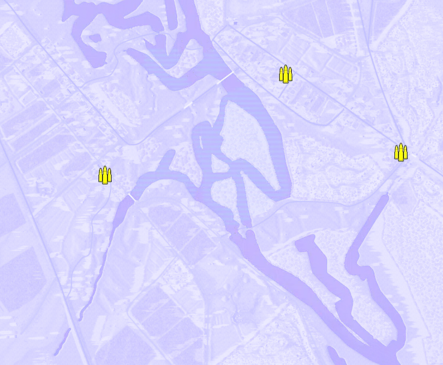
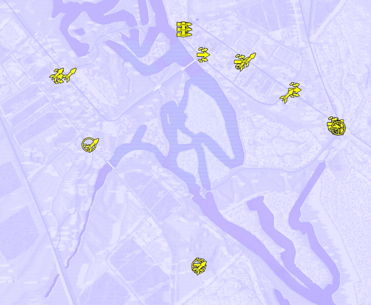
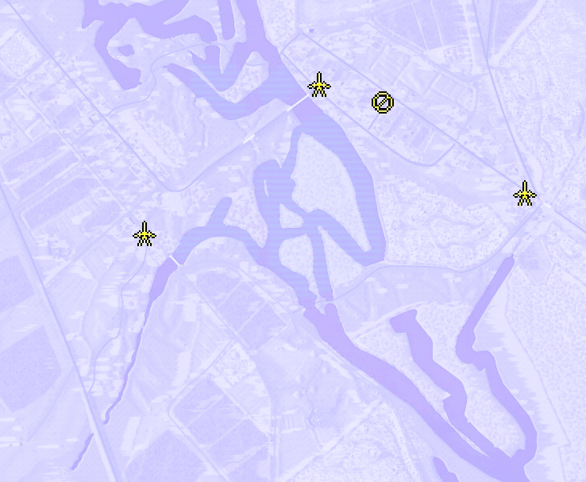
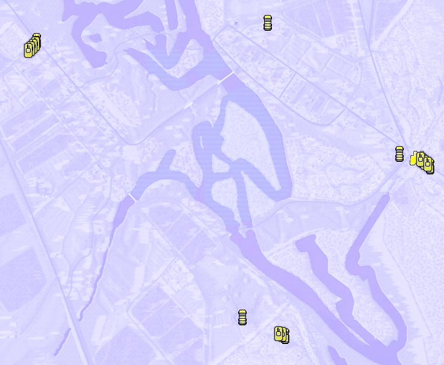

Static Ammo Crate

Pickup Kit

Static Emplacement

Vehicle

| gpo_subcat   | gpo_cat    | gpo_name                  |    pos_x |   pos_y |    pos_z |   flag | is_locked   |   team | instance                                 | gpo_cat_disp       | gpo_subcat_disp   |
|:-------------|:-----------|:--------------------------|---------:|--------:|---------:|-------:|:------------|-------:|:-----------------------------------------|:-------------------|:------------------|
| ammo_crate   | ammo_crate | ammo_crate                |  666.139 | 106.672 |  714.357 |      0 | False       |      0 | ammo_crate_0                             | Static Ammo Crate  | Static Ammo Crate |
| ammo_crate   | ammo_crate | ammo_crate                |  328.626 | 102.228 |  351.877 |      0 | False       |      0 | ammo_crate_1                             | Static Ammo Crate  | Static Ammo Crate |
| ammo_crate   | ammo_crate | ammo_crate                |  588.748 | 106.667 |  707.323 |      0 | False       |      0 | ammo_crate_2                             | Static Ammo Crate  | Static Ammo Crate |
| ammo_crate   | ammo_crate | ammo_crate                |  554.795 | 107.446 |  653.213 |      0 | False       |      0 | ammo_crate_3                             | Static Ammo Crate  | Static Ammo Crate |
| ammo_crate   | ammo_crate | ammo_crate                |  711.437 |  99.826 |   92.875 |      0 | False       |      0 | ammo_crate_4                             | Static Ammo Crate  | Static Ammo Crate |
| ammo_crate   | ammo_crate | ammo_crate                | -273.406 |  98.785 |   16.602 |      0 | False       |      0 | ammo_crate_5                             | Static Ammo Crate  | Static Ammo Crate |
| assault      | kit        | RE_PickupAssaultSVT40     |  712.452 | 100.652 |   93.787 |    301 | False       |      0 | CP_32_studienka_alliedmain_assault       | Pickup Kit         | Assault Kit       |
| assault      | kit        | RE_PickupAssaultSVT40     |  699.986 | 100.687 |  103.698 |    301 | False       |      0 | CP_32_studienka_alliedmain_assault2      | Pickup Kit         | Assault Kit       |
| assault      | kit        | RE_PickupAssaultSVT40     |  546.6   | 103.082 |  240.348 |    302 | False       |      0 | CP_32_studienka_carpenter_sniper         | Pickup Kit         | Assault Kit       |
| assault      | kit        | RE_PickupAssaultSVT40     |  329.332 | 102.239 |  351.584 |    303 | False       |      0 | CP_32_studienka_studienka_assault        | Pickup Kit         | Assault Kit       |
| assault      | kit        | RE_PickupAssaultSVT40     |  181.389 |  98.266 |  380.245 |    304 | False       |      0 | CP_32_studienka_berezinacrossing_assault | Pickup Kit         | Assault Kit       |
| assault      | kit        | RE_PickupAssaultSVT40     |  109.512 |  98.407 |  481.076 |    304 | False       |      0 | CP_32_studienka_berezinacrossing_lafette | Pickup Kit         | Assault Kit       |
| assault      | kit        | RE_PickupAssaultSVT40     | -391.194 |  99.324 |  294.782 |    307 | False       |      0 | CP_32_studienka_germanbank_assault       | Pickup Kit         | Assault Kit       |
| assault      | kit        | GW_PickupAssaultG41_GWood |  167.907 | 104.221 | -458.253 |    309 | False       |      0 | CP_32_studienka_napoleonpoint_assault    | Pickup Kit         | Assault Kit       |
| assault      | kit        | RE_PickupScoutMP40        |  712.007 | 100.422 |   92.291 |    301 | False       |      0 | CP_32_studienka_alliedmain_spetsnaz1     | Pickup Kit         | Assault Kit       |
| assault      | kit        | RE_PickupScoutPPS43       |  700.734 | 100.706 |  103.828 |    301 | False       |      0 | CP_32_studienka_alliedmain_spetsnaz2     | Pickup Kit         | Assault Kit       |
| at_rifle     | kit        | RE_PickupAntitankPTRD     |  711.076 |  99.835 |   91.604 |    301 | False       |      0 | CP_32_studienka_alliedmain_ptrd          | Pickup Kit         | AT Rifle          |
| mg           | kit        | RE_PickupMG_DT            |  109.757 |  98.431 |  480.245 |    304 | False       |      0 | CP_32_studienka_berezinacrossing_mg      | Pickup Kit         | MG Kit            |
| sniper       | kit        | RE_PickupSniper           |  721.801 | 100.913 |   88.561 |    301 | False       |      0 | CP_32_studienka_alliedmain_sniper        | Pickup Kit         | Sniper Kit        |
| sniper       | kit        | RE_PickupSniper           | -270.572 |  99.602 |   22.819 |    306 | False       |      0 | CP_32_studienka_supplydepot_sniper       | Pickup Kit         | Sniper Kit        |
| sniper       | kit        | GW_PickupSniperK98        |  165.429 | 103.8   | -461.282 |    309 | False       |      0 | CP_32_studienka_napoleonpoint_sniper     | Pickup Kit         | Sniper Kit        |
| sniper       | kit        | RE_PickupScoutBramit      |  721.221 | 100.898 |   88.17  |    301 | False       |      0 | CP_32_studienka_alliedmain_silmosin      | Pickup Kit         | Sniper Kit        |
| zooka        | kit        | GW_PickupPanzerschreck    |  518.791 | 102.114 |  216.89  |    302 | False       |      0 | CP_32_studienka_carpenter_at             | Pickup Kit         | HEAT Thrower      |
| zooka        | kit        | GW_PickupPanzerschreck    |  342.022 | 102.741 |  344.641 |    303 | False       |      0 | CP_32_studienka_studienka_at             | Pickup Kit         | HEAT Thrower      |
| zooka        | kit        | RE_PickupTankhunter_faust |  366.212 | 102.669 |  359.604 |    303 | False       |      0 | CP_32_studienka_studienka_faustnik       | Pickup Kit         | HEAT Thrower      |
| zooka        | kit        | GW_PickupPanzerschreck    | -257.875 | 100.002 |   19.643 |    306 | False       |      0 | CP_32_studienka_supplydepot_at           | Pickup Kit         | HEAT Thrower      |
| zooka        | kit        | GW_PickupPanzerschreck    | -397.37  |  99.892 |  299.734 |    307 | False       |      0 | CP_32_studienka_germanbank_at            | Pickup Kit         | HEAT Thrower      |
| zooka        | kit        | RE_PickupTankhunter_faust | -347.2   |  99.215 |  300.07  |    307 | False       |      0 | CP_32_studienka_germanbank_faustnik      | Pickup Kit         | HEAT Thrower      |
| zooka        | kit        | GW_PickupPanzerschreck    |  170.968 | 103.894 | -467.646 |    309 | False       |      0 | CP_32_studienka_napoleonpoint_at         | Pickup Kit         | HEAT Thrower      |
| mg_nest      | static     | mg34_lafette              |  340.116 | 101.403 |  340.886 |    303 | False       |      0 | CP_32_studienka_studienka_lafettestatic  | Static Emplacement | Static MG         |
| pak          | static     | zis3                      |  696.046 |  99.781 |  112.237 |    301 | False       |      0 | CP_32_studienka_alliedmain_zis3          | Static Emplacement | Anti-tank Gun     |
| pak          | static     | zis3                      |  177.881 |  97.214 |  386.894 |    304 | False       |      0 | CP_32_studienka_berezinacrossing_atgun   | Static Emplacement | Anti-tank Gun     |
| pak          | static     | zis3                      | -262.406 |  98.565 |    9.176 |    306 | False       |      0 | CP_32_studienka_supplydepot_atgun        | Static Emplacement | Anti-tank Gun     |
| apc          | vehicle    | m3_scoutcar_ru            |  806.85  | 102.109 |   46.035 |    301 | False       |      0 | CP_32_studienka_alliedmain_apc           | Vehicle            | APC               |
| apc          | vehicle    | m3_scoutcar_ru            | -501.299 |  99.023 |  463.57  |    308 | False       |      0 | CP_32_studienka_sector2_apc              | Vehicle            | APC               |
| apc          | vehicle    | sdkfz251_d                |  323.177 | 104.385 | -518.082 |    309 | False       |      0 | CP_32_studienka_napoleonpoint_apc        | Vehicle            | APC               |
| car          | vehicle    | studebaker_us6            |  703.553 |  99.835 |   88.599 |    301 | False       |      0 | CP_32_studienka_alliedmain_truck         | Vehicle            | Car               |
| car          | vehicle    | studebaker_us6            |  266.311 | 100.392 |  523.318 |    304 | False       |      0 | CP_32_studienka_berezinacrossing_truck   | Vehicle            | Car               |
| car          | vehicle    | opelblitz_fr              |  181.683 | 103.65  | -455.448 |    309 | False       |      0 | CP_32_studienka_napoleonpoint_truck      | Vehicle            | Car               |
| recon        | vehicle    | ba_64m                    |  768.065 | 100.359 |   71.241 |    301 | True        |      0 | CP_32_studienka_alliedmain_scout         | Vehicle            | Scout Vehicle     |
| tank         | vehicle    | t34_85_early              |  780.037 | 100.645 |   64.273 |    301 | True        |      0 | CP_32_studienka_alliedmain_t34a          | Vehicle            | Tank              |
| tank         | vehicle    | t34_85_late               |  788.086 | 101.04  |   58.061 |    301 | True        |      0 | CP_32_studienka_alliedmain_t34b          | Vehicle            | Tank              |
| tank         | vehicle    | valentineVII_ru           |  773.479 | 100.586 |   68.212 |    301 | True        |      0 | CP_32_studienka_alliedmain_t70           | Vehicle            | Tank              |
| tank         | vehicle    | t34_76_m43                |  797.597 | 101.696 |   52.144 |    301 | True        |      0 | CP_32_studienka_alliedmain_t34c          | Vehicle            | Tank              |
| tank         | vehicle    | valentineVII_ru           | -505.171 |  98.798 |  452.089 |    308 | True        |      0 | CP_32_studienka_sector2_t70              | Vehicle            | Tank              |
| tank         | vehicle    | t34_85_early              | -513.599 |  98.924 |  444.529 |    308 | True        |      0 | CP_32_studienka_sector2_t34a             | Vehicle            | Tank              |
| tank         | vehicle    | t34_85_late               | -522.622 |  99.118 |  435.875 |    308 | True        |      0 | CP_32_studienka_sector2_t34b             | Vehicle            | Tank              |
| tank         | vehicle    | t34_85_early              | -530.205 |  99.28  |  429.399 |    308 | True        |      0 | CP_32_studienka_sector2_t34c             | Vehicle            | Tank              |
| tank         | vehicle    | pzivh                     |  313.251 | 104.389 | -513.745 |    309 | True        |      0 | CP_32_studienka_napoleonpoint_pziv       | Vehicle            | Tank              |
| tank         | vehicle    | panthera_late             |  301.387 | 104.462 | -511.716 |    309 | True        |      0 | CP_32_studienka_napoleonpoint_panther    | Vehicle            | Tank              |

