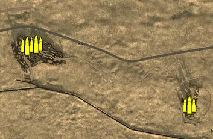
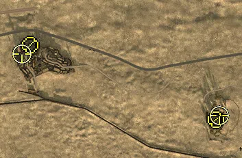
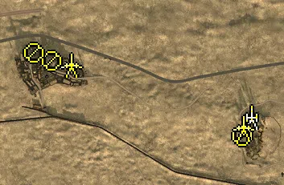
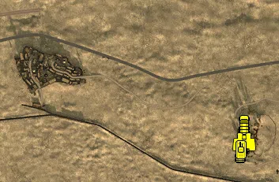

Static Ammo Crate

Pickup Kit

Static Emplacement

Vehicle

| gpo_subcat   | gpo_cat    | gpo_name                |    pos_x |   pos_y |    pos_z |   flag | is_locked   |   team | instance                                             | gpo_cat_disp       | gpo_subcat_disp   |
|:-------------|:-----------|:------------------------|---------:|--------:|---------:|-------:|:------------|-------:|:-----------------------------------------------------|:-------------------|:------------------|
| ammo_crate   | ammo_crate | ammo_crate              | -754.357 |  40.356 |  511.317 |      0 | False       |      0 | ammo_crate_0                                         | Static Ammo Crate  | Static Ammo Crate |
| ammo_crate   | ammo_crate | ammo_crate              | -784.616 |  33.903 |  506.867 |      0 | False       |      0 | ammo_crate_1                                         | Static Ammo Crate  | Static Ammo Crate |
| ammo_crate   | ammo_crate | ammo_crate              | -246.261 |  29.608 |  307.449 |      0 | False       |      0 | ammo_crate_2                                         | Static Ammo Crate  | Static Ammo Crate |
| ammo_crate   | ammo_crate | ammo_crate              |  342.257 |  25.355 |  316.067 |      0 | False       |      0 | ammo_crate_3                                         | Static Ammo Crate  | Static Ammo Crate |
| ammo_crate   | ammo_crate | ammo_crate              |  768.59  |  34.267 |  -79.423 |      0 | False       |      0 | ammo_crate_4                                         | Static Ammo Crate  | Static Ammo Crate |
| ammo_crate   | ammo_crate | ammo_crate              |  481.92  |  39.106 | -213.511 |      0 | False       |      0 | ammo_crate_5                                         | Static Ammo Crate  | Static Ammo Crate |
| ammo_crate   | ammo_crate | ammo_crate              |  793.728 |  14.963 |  280.739 |      0 | False       |      0 | ammo_crate_6                                         | Static Ammo Crate  | Static Ammo Crate |
| mg           | kit        | GA_PickUpSupportMG34    | -785.242 |  37.962 |  526.442 |    201 | False       |      0 | CP_16_Supercharge_El_Daba_DE_GB_Support              | Pickup Kit         | MG Kit            |
| mg           | kit        | BA_PickUpSupportBrenMK1 | -243.37  |  29.765 |  307.457 |    202 | False       |      0 | CP_16_Supercharge_Ghazal_DE_GB_Support               | Pickup Kit         | MG Kit            |
| sniper       | kit        | BA_PickUpSniperNo4      | -810.385 |  50.124 |  499.52  |    201 | False       |      0 | CP_16_Supercharge_El_Daba_DE_GB_Sniper               | Pickup Kit         | Sniper Kit        |
| sniper       | kit        | BA_PickUpSniperNo4      | -234.533 |  28.368 |  319.532 |    202 | False       |      0 | CP_16_Supercharge_Ghazal_DE_GB_Sniper                | Pickup Kit         | Sniper Kit        |
| noidea       | noidea     | commander_mortar_allied |  125.624 |  29.848 |  255.201 |    202 | True        |      0 | CP_16_Supercharge_Ghazal_DE_GB_CommMortar            | FIXME UNASSIGNED   | FIXME UNASSIGNED  |
| noidea       | noidea     | commander_mortar_allied |  125.493 |  30.144 |  250.545 |    202 | True        |      0 | CP_16_Supercharge_Ghazal_DE_GB_CommMortar_0          | FIXME UNASSIGNED   | FIXME UNASSIGNED  |
| noidea       | noidea     | commander_mortar_allied |  125.937 |  29.469 |  260.131 |    202 | True        |      0 | CP_16_Supercharge_Ghazal_DE_GB_CommMortar_1          | FIXME UNASSIGNED   | FIXME UNASSIGNED  |
| noidea       | noidea     | commander_mortar_allied | -965.212 |  41.543 |   32.864 |    201 | True        |      0 | CP_16_Supercharge_El_Daba_DE_GB_CommMortar           | FIXME UNASSIGNED   | FIXME UNASSIGNED  |
| arty         | static     | 25pdr                   | -249.026 |  30.976 |  365.88  |    202 | False       |      0 | CP_16_Supercharge_Ghazal_DE_GB_Howitzer              | Static Emplacement | Artillery         |
| mg_nest      | static     | mg34_bipod              | -746.484 |  41.349 |  506.953 |    203 | False       |      0 | CP_16_Supercharge_East_El_Daba_DE_GB_LightMG         | Static Emplacement | Static MG         |
| mg_nest      | static     | mg34_bipod              | -789.698 |  39.034 |  526.406 |    201 | False       |      0 | CP_16_Supercharge_El_Daba_DE_GB_LightMG              | Static Emplacement | Static MG         |
| mg_nest      | static     | lewis_bipod             | -271.596 |  28.309 |  318.263 |    202 | False       |      0 | CP_16_Supercharge_Ghazal_DE_GB_LightMG               | Static Emplacement | Static MG         |
| pak          | static     | pak38_static            | -697.584 |  36.48  |  496.267 |    203 | False       |      0 | CP_16_Supercharge_East_El_Daba_DE_GB_StaticArtillery | Static Emplacement | Anti-tank Gun     |
| pak          | static     | 6pdr_static             | -270.488 |  28.483 |  340.953 |    202 | False       |      0 | CP_16_Supercharge_Ghazal_DE_GB_LightArtillery        | Static Emplacement | Anti-tank Gun     |
| radio        | static     | britcommradio           | -750.642 |  40.355 |  511.889 |    201 | False       |      0 | CP_16_Supercharge_El_Daba_DE_GB_CommRadio            | Static Emplacement | Radio             |
| radio        | static     | britcommradio           | -784.778 |  37.954 |  524.67  |    201 | False       |      0 | CP_16_Supercharge_El_Daba_DE_GB_CommRadio_0          | Static Emplacement | Radio             |
| radio        | static     | gercommradio            | -222.982 |  33.444 |  363.201 |    202 | False       |      0 | CP_16_Supercharge_Ghazal_DE_GB_CommRadio             | Static Emplacement | Radio             |
| car          | vehicle    | bedfordoyd              | -254.578 |  29.186 |  300.928 |    202 | False       |      0 | CP_16_Supercharge_Ghazal_DE_GB_Truck                 | Vehicle            | Car               |
| car          | vehicle    | chevy30cwt              | -259.755 |  28.21  |  291.885 |    202 | False       |      0 | CP_16_Supercharge_Ghazal_DE_GB_HeavyTruck            | Vehicle            | Car               |
| car          | vehicle    | chevy30cwt              | -256.322 |  27.356 |  341.702 |    202 | False       |      0 | CP_16_Supercharge_Ghazal_DE_GB_HeavyTruck_0          | Vehicle            | Car               |
| car          | vehicle    | bedfordoyd              | -265.36  |  29.8   |  271.636 |    202 | False       |      0 | CP_16_Supercharge_Ghazal_DE_GB_Truck_0               | Vehicle            | Car               |
| recon        | vehicle    | dingo_na                | -255.435 |  28.969 |  297.299 |    202 | False       |      0 | CP_16_Supercharge_Ghazal_DE_GB_Scout                 | Vehicle            | Scout Vehicle     |
| tank         | vehicle    | m3stuarthoney           | -264.927 |  30.303 |  277.69  |    202 | True        |      0 | CP_16_Supercharge_Ghazal_DE_GB_LightTank             | Vehicle            | Tank              |

