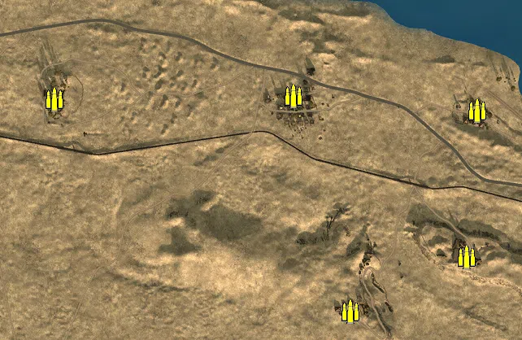
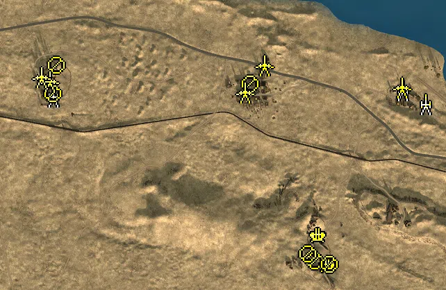
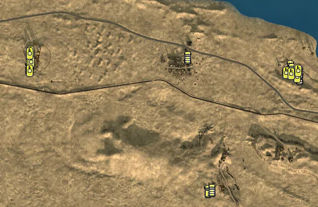

Static Ammo Crate

Pickup Kit

Static Emplacement

Vehicle

| gpo_subcat   | gpo_cat    | gpo_name                   |    pos_x |   pos_y |    pos_z |   flag | is_locked   |   team | instance                                                  | gpo_cat_disp       | gpo_subcat_disp   |
|:-------------|:-----------|:---------------------------|---------:|--------:|---------:|-------:|:------------|-------:|:----------------------------------------------------------|:-------------------|:------------------|
| ammo_crate   | ammo_crate | ammo_crate                 | -754.357 |  40.356 |  511.317 |      0 | False       |      0 | ammo_crate_0                                              | Static Ammo Crate  | Static Ammo Crate |
| ammo_crate   | ammo_crate | ammo_crate                 | -784.616 |  33.903 |  506.867 |      0 | False       |      0 | ammo_crate_1                                              | Static Ammo Crate  | Static Ammo Crate |
| ammo_crate   | ammo_crate | ammo_crate                 | -246.261 |  29.608 |  307.449 |      0 | False       |      0 | ammo_crate_2                                              | Static Ammo Crate  | Static Ammo Crate |
| ammo_crate   | ammo_crate | ammo_crate                 |  342.257 |  25.355 |  316.067 |      0 | False       |      0 | ammo_crate_3                                              | Static Ammo Crate  | Static Ammo Crate |
| ammo_crate   | ammo_crate | ammo_crate                 |  768.59  |  34.267 |  -79.423 |      0 | False       |      0 | ammo_crate_4                                              | Static Ammo Crate  | Static Ammo Crate |
| ammo_crate   | ammo_crate | ammo_crate                 |  481.92  |  39.106 | -213.511 |      0 | False       |      0 | ammo_crate_5                                              | Static Ammo Crate  | Static Ammo Crate |
| ammo_crate   | ammo_crate | ammo_crate                 |  793.728 |  14.963 |  280.739 |      0 | False       |      0 | ammo_crate_6                                              | Static Ammo Crate  | Static Ammo Crate |
| mg           | kit        | BA_PickUpSupportBrenMK1    |  804.999 |  15.548 |  279.821 |    301 | False       |      0 | CP_32_Supercharge_British_HQ_Support                      | Pickup Kit         | MG Kit            |
| mg           | kit        | GA_PickUpSupportMG34       |  342.757 |  25.344 |  315.261 |    302 | False       |      0 | CP_32_Supercharge_Sidi_Abd_el_Rahman_Support              | Pickup Kit         | MG Kit            |
| mg           | kit        | GA_PickUpSupportMG34       | -243.579 |  29.624 |  307.173 |    304 | False       |      0 | CP_32_Supercharge_Ghazal_Support                          | Pickup Kit         | MG Kit            |
| sniper       | kit        | BA_PickUpSniperNo4         |  783.681 |  16.706 |  259.067 |    301 | False       |      0 | CP_32_Supercharge_British_HQ_Sniper                       | Pickup Kit         | Sniper Kit        |
| sniper       | kit        | BA_PickUpSniperNo4         | -234.533 |  28.368 |  319.532 |    304 | False       |      0 | CP_32_Supercharge_Ghazal_Sniper                           | Pickup Kit         | Sniper Kit        |
| misc         | noidea     | britcommradio              |  769.456 |  15.116 |  256.294 |    301 | False       |      0 | CP_32_Supercharge_British_HQ_CommRadio                    | FIXME UNASSIGNED   | MISCELLANEOUS     |
| misc         | noidea     | britcommradio              |  347.134 |  28.284 |  314.944 |    302 | False       |      0 | CP_32_Supercharge_Sidi_Abd_el_Rahman_CommRadio            | FIXME UNASSIGNED   | MISCELLANEOUS     |
| misc         | noidea     | britcommradio              |  501.078 |  44.519 | -177.252 |    303 | False       |      0 | CP_32_Supercharge_Tell_el_Aqqaqir_CommRadio               | FIXME UNASSIGNED   | MISCELLANEOUS     |
| misc         | noidea     | britcommradio              | -222.982 |  33.444 |  363.201 |    304 | False       |      0 | CP_32_Supercharge_Ghazal_CommRadio                        | FIXME UNASSIGNED   | MISCELLANEOUS     |
| noidea       | noidea     | commander_artillery_allied |  912.876 |  41.992 | -877.03  |    301 | True        |      0 | CP_32_Supercharge_British_HQ_CommArtillery                | FIXME UNASSIGNED   | FIXME UNASSIGNED  |
| noidea       | noidea     | commander_artillery_allied |  908.042 |  42.009 | -882.204 |    301 | True        |      0 | CP_32_Supercharge_British_HQ_0_7                          | FIXME UNASSIGNED   | FIXME UNASSIGNED  |
| noidea       | noidea     | commander_artillery_allied |  912.184 |  41.948 | -882.056 |    301 | True        |      0 | CP_32_Supercharge_British_HQ_1_0                          | FIXME UNASSIGNED   | FIXME UNASSIGNED  |
| noidea       | noidea     | commander_smoke_allied     |  914.668 |  42.453 | -886.732 |    301 | True        |      0 | CP_32_Supercharge_British_HQ_CommSmoke                    | FIXME UNASSIGNED   | FIXME UNASSIGNED  |
| noidea       | noidea     | commander_artillery_allied | -712.669 |  31.152 |  294.82  |    304 | True        |      0 | CP_32_Supercharge_Ghazal_DE_GB_CommArtillery              | FIXME UNASSIGNED   | FIXME UNASSIGNED  |
| noidea       | noidea     | commander_artillery_allied | -712.249 |  31.279 |  285.765 |    304 | True        |      0 | CP_32_Supercharge_Ghazal_DE_GB_CommArtillery_0            | FIXME UNASSIGNED   | FIXME UNASSIGNED  |
| noidea       | noidea     | commander_artillery_allied | -711.559 |  30.926 |  274.55  |    304 | True        |      0 | CP_32_Supercharge_Ghazal_DE_GB_CommArtillery_1            | FIXME UNASSIGNED   | FIXME UNASSIGNED  |
| noidea       | noidea     | commander_smoke_allied     | -720.856 |  31.158 |  284.332 |    304 | True        |      0 | CP_32_Supercharge_Ghazal_DE_GB_CommSmoke                  | FIXME UNASSIGNED   | FIXME UNASSIGNED  |
| arty         | static     | 3inchmortar                |  777.616 |  16.305 |  292.531 |    301 | False       |      0 | CP_32_Supercharge_British_HQ_LightMortar                  | Static Emplacement | Artillery         |
| arty         | static     | 25pdr                      |  844.933 |  15.722 |  251.788 |    301 | False       |      0 | CP_32_Supercharge_British_HQ_Howitzer                     | Static Emplacement | Artillery         |
| arty         | static     | lefh18                     | -228.213 |  31.051 |  273.301 |    302 | False       |      0 | CP_32_Supercharge_Sidi_Abd_el_Rahman_DE_GB_Howitzer       | Static Emplacement | Artillery         |
| flak         | static     | flak18                     |  564.683 |  28.217 | -211.397 |    303 | False       |      0 | CP_32_Supercharge_Tell_el_Aqqaqir_HeavyArtillery          | Static Emplacement | Anti-aircraft Gun |
| flak         | static     | flak18                     |  536.526 |  24.869 | -125.24  |    303 | False       |      0 | CP_32_Supercharge_Tell_el_Aqqaqir_0_0                     | Static Emplacement | Anti-aircraft Gun |
| mg_nest      | static     | mg34_bipod                 |  340.244 |  29.349 |  310.207 |    302 | False       |      0 | CP_32_Supercharge_Sidi_Abd_el_Rahman_LightMG              | Static Emplacement | Static MG         |
| mg_nest      | static     | mg34_bipod                 |  526.019 |  43.536 | -200.889 |    303 | False       |      0 | CP_32_Supercharge_Tell_el_Aqqaqir_LightMG                 | Static Emplacement | Static MG         |
| mg_nest      | static     | mg34_bipod                 |  505.99  |  45.942 | -180.551 |    303 | False       |      0 | CP_32_Supercharge_Tell_el_Aqqaqir_0                       | Static Emplacement | Static MG         |
| mg_nest      | static     | mg34_bipod                 |  567.478 |  28.965 | -210.204 |    303 | False       |      0 | CP_32_Supercharge_Tell_el_Aqqaqir_1_0                     | Static Emplacement | Static MG         |
| mg_nest      | static     | mg15_bipod                 | -227.303 |  32.783 |  282.708 |    304 | False       |      0 | CP_32_Supercharge_Ghazal_MedMG                            | Static Emplacement | Static MG         |
| mg_nest      | static     | mg34_bipod                 | -217.216 |  34.867 |  363.697 |    304 | False       |      0 | CP_32_Supercharge_Ghazal_LightMG                          | Static Emplacement | Static MG         |
| pak          | static     | 6pdr_static                |  776.614 |  16.442 |  300.285 |    301 | False       |      0 | CP_32_Supercharge_British_HQ_LightArtillery               | Static Emplacement | Anti-tank Gun     |
| pak          | static     | pak38_static               |  380.381 |  22.713 |  364.952 |    302 | False       |      0 | CP_32_Supercharge_Sidi_Abd_el_Rahman_0                    | Static Emplacement | Anti-tank Gun     |
| pak          | static     | pak38_static               | -238.641 |  30.095 |  318.139 |    304 | False       |      0 | CP_32_Supercharge_Ghazal_StaticArtillery                  | Static Emplacement | Anti-tank Gun     |
| pak          | static     | 6pdr                       | -261.397 |  28.041 |  330.351 |    304 | False       |      0 | CP_32_Supercharge_Ghazal_LightArtillery                   | Static Emplacement | Anti-tank Gun     |
| pak          | static     | 6pdr                       |  324.008 |  25.576 |  286.118 |    302 | False       |      0 | CP_32_Supercharge_Sidi_Abd_el_Rahman_DE_GB_LightArtillery | Static Emplacement | Anti-tank Gun     |
| apc          | vehicle    | sdkfz251_1                 | -263.183 |  30.173 |  276.191 |    304 | False       |      0 | CP_32_Supercharge_Ghazal_DE_GB_PersonelCarrier2           | Vehicle            | APC               |
| apc          | vehicle    | universalcarrier_bren      |  791.797 |  15.028 |  283.069 |    301 | False       |      0 | CP_32_Supercharge_British_HQ_DE_GB_PersonelCarrier2       | Vehicle            | APC               |
| apc          | vehicle    | universalcarrier_bren      |  460.674 |  40.569 | -219.453 |    303 | False       |      0 | CP_32_Supercharge_Tell_el_Aqqaqir_DE_GB_PersonelCarrier2  | Vehicle            | APC               |
| car          | vehicle    | chevy30cwt                 |  797.335 |  15.112 |  272.842 |    301 | False       |      0 | CP_32_Supercharge_British_HQ_Truck2                       | Vehicle            | Car               |
| car          | vehicle    | chevy30cwt                 |  829.842 |  14.997 |  235.276 |    301 | False       |      0 | CP_32_Supercharge_British_HQ_TruckAA                      | Vehicle            | Car               |
| car          | vehicle    | civtruck                   |  378.314 |  26.228 |  320.468 |    302 | False       |      0 | CP_32_Supercharge_Sidi_Abd_el_Rahman_CivTruck             | Vehicle            | Car               |
| car          | vehicle    | bedfordoyd                 |  476.822 |  38.916 | -215.197 |    303 | False       |      0 | CP_32_Supercharge_Tell_el_Aqqaqir_Truck                   | Vehicle            | Car               |
| car          | vehicle    | bedfordoyd                 | -255.657 |  28.968 |  297.349 |    304 | False       |      0 | CP_32_Supercharge_Ghazal_Truck                            | Vehicle            | Car               |
| car          | vehicle    | bedfordoyd                 |  829.368 |  14.868 |  259.78  |    301 | False       |      0 | CP_32_Supercharge_British_HQ_DE_GB_Truck                  | Vehicle            | Car               |
| tank         | vehicle    | crusadermk3                |  776.18  |  15.039 |  257.028 |    301 | True        |      2 | CP_32_Supercharge_British_HQ_MediumTank                   | Vehicle            | Tank              |
| tank         | vehicle    | m4a1                       |  819.472 |  13.87  |  269.489 |    301 | True        |      2 | CP_32_Supercharge_British_HQ_HeavyTank                    | Vehicle            | Tank              |
| tank         | vehicle    | M3Grant                    |  820.751 |  14.274 |  241.414 |    301 | True        |      0 | CP_32_Supercharge_British_HQ_LightTank                    | Vehicle            | Tank              |
| tank         | vehicle    | m4a1                       |  795.638 |  14.331 |  254.524 |    301 | True        |      0 | CP_32_Supercharge_British_HQ_0_6                          | Vehicle            | Tank              |
| tank         | vehicle    | crusadermk3                |  823.772 |  13.924 |  266.029 |    301 | True        |      2 | CP_32_Supercharge_British_HQ_1                            | Vehicle            | Tank              |
| tank         | vehicle    | pzivf2                     | -260.96  |  28.238 |  293.061 |    304 | True        |      0 | CP_32_Supercharge_Ghazal_HeavyTank2                       | Vehicle            | Tank              |
| tank         | vehicle    | pziii_jl_dak               | -256.207 |  27.351 |  341.677 |    304 | True        |      0 | CP_32_Supercharge_Ghazal_HeavyTank                        | Vehicle            | Tank              |
| tank         | vehicle    | pziii_jl_dak               | -253.671 |  29.211 |  301.407 |    304 | True        |      0 | CP_32_Supercharge_Ghazal_DE_GB_MediumTank3                | Vehicle            | Tank              |
| tank         | vehicle    | pziii_je_dak               | -259.721 |  29.705 |  266.212 |    304 | True        |      0 | CP_32_Supercharge_Ghazal_DE_GB_MediumTank3_0              | Vehicle            | Tank              |
| tank         | vehicle    | pziii_je_dak               | -259.701 |  27.805 |  336.46  |    304 | True        |      0 | CP_32_Supercharge_Ghazal_DE_GB_MediumTank3_1              | Vehicle            | Tank              |

