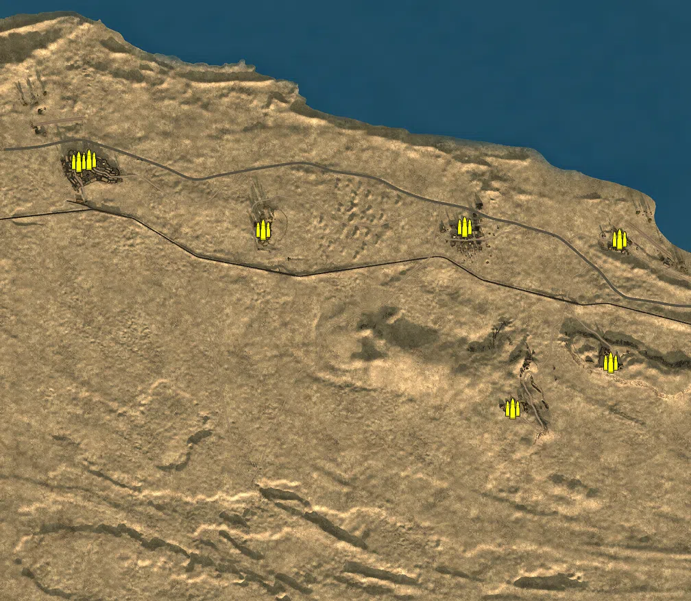
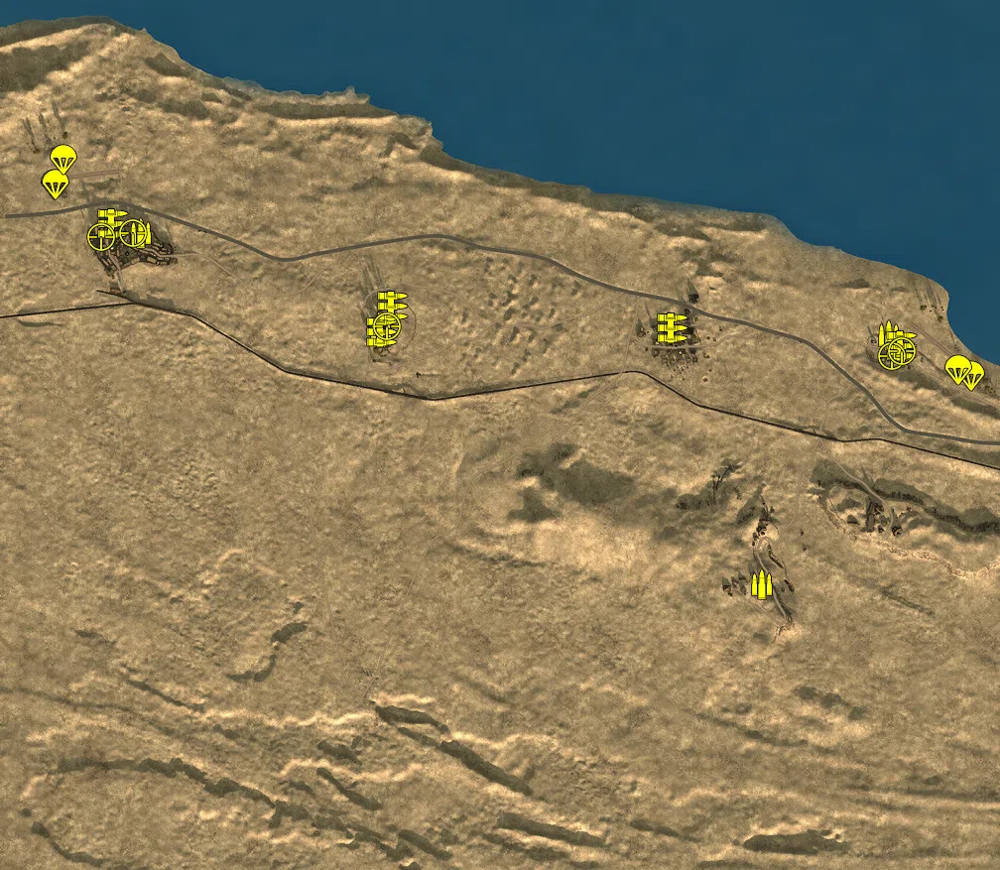

Static Ammo Crate

Pickup Kit

Static Emplacement

Vehicle

| gpo_subcat   | gpo_cat    | gpo_name                   |    pos_x |   pos_y |    pos_z |   flag | is_locked   |   team | instance                                                     | gpo_cat_disp       | gpo_subcat_disp   |
|:-------------|:-----------|:---------------------------|---------:|--------:|---------:|-------:|:------------|-------:|:-------------------------------------------------------------|:-------------------|:------------------|
| ammo_crate   | ammo_crate | ammo_crate                 | -754.357 |  40.356 |  511.317 |      0 | False       |      0 | ammo_crate_0                                                 | Static Ammo Crate  | Static Ammo Crate |
| ammo_crate   | ammo_crate | ammo_crate                 | -784.616 |  33.903 |  506.867 |      0 | False       |      0 | ammo_crate_1                                                 | Static Ammo Crate  | Static Ammo Crate |
| ammo_crate   | ammo_crate | ammo_crate                 | -246.261 |  29.608 |  307.449 |      0 | False       |      0 | ammo_crate_2                                                 | Static Ammo Crate  | Static Ammo Crate |
| ammo_crate   | ammo_crate | ammo_crate                 |  342.257 |  25.355 |  316.067 |      0 | False       |      0 | ammo_crate_3                                                 | Static Ammo Crate  | Static Ammo Crate |
| ammo_crate   | ammo_crate | ammo_crate                 |  768.59  |  34.267 |  -79.423 |      0 | False       |      0 | ammo_crate_4                                                 | Static Ammo Crate  | Static Ammo Crate |
| ammo_crate   | ammo_crate | ammo_crate                 |  481.92  |  39.106 | -213.511 |      0 | False       |      0 | ammo_crate_5                                                 | Static Ammo Crate  | Static Ammo Crate |
| ammo_crate   | ammo_crate | ammo_crate                 |  793.728 |  14.963 |  280.739 |      0 | False       |      0 | ammo_crate_6                                                 | Static Ammo Crate  | Static Ammo Crate |
| ammo         | kit        | BA_PickUpAmmokit           |  778.536 |  16.154 |  301.864 |    101 | False       |      0 | CP_64_Supercharge_British_HQ_DE_GB_AmmoCrates                | Pickup Kit         | Ammo Kit          |
| ammo         | kit        | GA_PickUpAmmokit           |  522.4   |  42.4   | -200.236 |    103 | False       |      0 | CP_64_Supercharge_Tell_el_Aqqaqir_DE_GB_AmmoCrates           | Pickup Kit         | Ammo Kit          |
| ammo         | kit        | BA_PickUpAmmokit           | -245.423 |  29.621 |  307.915 |    104 | False       |      0 | CP_64_Supercharge_Ghazal_DE_GB_AmmoCrates                    | Pickup Kit         | Ammo Kit          |
| ammo         | kit        | GA_PickUpAmmokit           | -729.153 |  36.74  |  507.109 |    105 | False       |      0 | CP_64_Supercharge_East_El_Daba_DE_GB_AmmoCrates              | Pickup Kit         | Ammo Kit          |
| mg           | kit        | GA_PickUpSupportMG34       | -785.242 |  37.962 |  526.442 |      1 | False       |      0 | CP_64_Supercharge_El_Daba_DE_GB_Support                      | Pickup Kit         | MG Kit            |
| mg           | kit        | GA_PickUpSupportMG34       | -243.579 |  29.624 |  307.173 |    104 | False       |      0 | CP_64_Supercharge_Ghazal_DE_GB_Support                       | Pickup Kit         | MG Kit            |
| mg           | kit        | GA_PickUpSupportMG34       |  342.757 |  25.344 |  315.261 |    102 | False       |      0 | CP_64_Supercharge_Sidi_Abd_el_Rahman_DE_GB_Support           | Pickup Kit         | MG Kit            |
| mg           | kit        | BA_PickUpSupportBrenMK1    |  804.999 |  15.548 |  279.821 |    101 | False       |      0 | CP_64_Supercharge_British_HQ_DE_GB_Support                   | Pickup Kit         | MG Kit            |
| mg           | kit        | BA_PickUpSupportBrenMK1    | -221.758 |  33.579 |  360.757 |    104 | False       |      0 | CP_64_Supercharge_Ghazal_DE_GB_Support_0                     | Pickup Kit         | MG Kit            |
| parachute    | kit        | BA_PickUpPilotWebley       |  944.222 |  12.816 |  220.377 |    101 | False       |      0 | CP_64_Supercharge_British_HQ_DE_GB_Pilot                     | Pickup Kit         | Parachute Kit     |
| parachute    | kit        | BA_PickUpPilotWebley       |  918.88  |  13.204 |  232.519 |    101 | False       |      0 | CP_64_Supercharge_British_HQ_DE_GB_Pilot_0                   | Pickup Kit         | Parachute Kit     |
| parachute    | kit        | GA_PickUpPilotP08          | -903.453 |  26.679 |  605.452 |      1 | False       |      0 | CP_64_Supercharge_El_Daba_DE_GB_Pilot                        | Pickup Kit         | Parachute Kit     |
| parachute    | kit        | GA_PickUpPilotP08          | -902.174 |  26.506 |  606.248 |      1 | False       |      0 | CP_64_Supercharge_El_Daba_DE_GB_Pilot_0                      | Pickup Kit         | Parachute Kit     |
| parachute    | kit        | GA_PickUpPilotP08          | -885.497 |  24.63  |  656.559 |      1 | False       |      0 | CP_64_Supercharge_El_Daba_DE_GB_Pilot_1                      | Pickup Kit         | Parachute Kit     |
| sniper       | kit        | BA_PickUpSniperNo4         | -810.385 |  50.124 |  499.52  |      1 | False       |      0 | CP_64_Supercharge_El_Daba_DE_GB_Sniper                       | Pickup Kit         | Sniper Kit        |
| sniper       | kit        | BA_PickUpSniperNo4         | -745.501 |  40.474 |  507.981 |    105 | False       |      0 | CP_64_Supercharge_East_El_Daba_DE_GB_Sniper                  | Pickup Kit         | Sniper Kit        |
| sniper       | kit        | BA_PickUpSniperNo4         |  783.681 |  16.706 |  259.067 |    101 | False       |      0 | CP_64_Supercharge_British_HQ_DE_GB_Sniper                    | Pickup Kit         | Sniper Kit        |
| sniper       | kit        | BA_PickUpSniperNo4         | -234.533 |  28.368 |  319.532 |    104 | False       |      0 | CP_64_Supercharge_Ghazal_DE_GB_Sniper                        | Pickup Kit         | Sniper Kit        |
| sniper       | kit        | BA_PickUpSniperNo4         |  804.189 |  15.501 |  270.101 |    101 | False       |      0 | CP_64_Supercharge_British_HQ_DE_GB_Sniper_0                  | Pickup Kit         | Sniper Kit        |
| noidea       | noidea     | commander_artillery_allied |  912.876 |  41.992 | -877.03  |    101 | True        |      0 | CP_64_Supercharge_British_HQ_DE_GB_CommArtillery             | FIXME UNASSIGNED   | FIXME UNASSIGNED  |
| noidea       | noidea     | commander_artillery_allied |  908.042 |  42.009 | -882.204 |    101 | True        |      0 | CP_64_Supercharge_British_HQ_DE_GB_CommArtillery_0           | FIXME UNASSIGNED   | FIXME UNASSIGNED  |
| noidea       | noidea     | commander_artillery_allied |  912.184 |  41.948 | -882.056 |    101 | True        |      0 | CP_64_Supercharge_British_HQ_DE_GB_CommArtillery_1           | FIXME UNASSIGNED   | FIXME UNASSIGNED  |
| noidea       | noidea     | commander_smoke_allied     |  914.668 |  42.453 | -886.732 |    101 | True        |      0 | CP_64_Supercharge_British_HQ_DE_GB_CommSmoke                 | FIXME UNASSIGNED   | FIXME UNASSIGNED  |
| noidea       | noidea     | commander_artillery_allied | -953.687 |  47.735 | -287.62  |      1 | True        |      0 | CP_64_Supercharge_El_Daba_DE_GB_CommArtillery                | FIXME UNASSIGNED   | FIXME UNASSIGNED  |
| noidea       | noidea     | commander_artillery_allied | -958.875 |  47.52  | -286.585 |      1 | True        |      0 | CP_64_Supercharge_El_Daba_DE_GB_CommArtillery_0              | FIXME UNASSIGNED   | FIXME UNASSIGNED  |
| noidea       | noidea     | commander_artillery_allied | -961.056 |  46.933 | -281.803 |      1 | True        |      0 | CP_64_Supercharge_El_Daba_DE_GB_CommArtillery_1              | FIXME UNASSIGNED   | FIXME UNASSIGNED  |
| flak         | static     | flak38                     |  327.158 |  28.413 |  308.88  |    102 | False       |      0 | CP_64_Supercharge_Sidi_Abd_el_Rahman_DE_GB_AntiAirSmall      | Static Emplacement | Anti-aircraft Gun |
| flak         | static     | flak18                     |  564.683 |  28.217 | -211.397 |    103 | False       |      0 | CP_64_Supercharge_Tell_el_Aqqaqir_DE_GB_HeavyArtillery       | Static Emplacement | Anti-aircraft Gun |
| flak         | static     | flak18                     |  536.526 |  24.869 | -125.24  |    103 | False       |      0 | CP_64_Supercharge_Tell_el_Aqqaqir_DE_GB_HeavyArtillery_0     | Static Emplacement | Anti-aircraft Gun |
| flak         | static     | flak38                     | -792.69  |  38.578 |  427.059 |      1 | False       |      0 | CP_64_Supercharge_El_Daba_DE_GB_AntiAirSmall                 | Static Emplacement | Anti-aircraft Gun |
| flak         | static     | bofors40mm                 |  844.948 |  15.677 |  251.715 |    101 | False       |      0 | CP_64_Supercharge_British_HQ_AntiAirSmall                    | Static Emplacement | Anti-aircraft Gun |
| flak         | static     | flak38                     | -904.49  |  28.448 |  668.931 |      1 | False       |      0 | CP_64_Supercharge_El_Daba_DE_GB_AntiAirSmall_0               | Static Emplacement | Anti-aircraft Gun |
| mg_nest      | static     | mg34_bipod                 |  526.019 |  43.536 | -200.889 |    103 | False       |      0 | CP_64_Supercharge_Tell_el_Aqqaqir_DE_GB_LightMG              | Static Emplacement | Static MG         |
| mg_nest      | static     | mg34_bipod                 |  505.99  |  45.942 | -180.551 |    103 | False       |      0 | CP_64_Supercharge_Tell_el_Aqqaqir_DE_GB_LightMG_0            | Static Emplacement | Static MG         |
| mg_nest      | static     | mg15_bipod                 | -227.303 |  32.783 |  282.708 |    104 | False       |      0 | CP_64_Supercharge_Ghazal_DE_GB_MedMG                         | Static Emplacement | Static MG         |
| mg_nest      | static     | mg34_bipod                 |  815.206 |  35.414 |  -49.582 |    106 | False       |      0 | CP_64_Supercharge_Tell_el_Eisa_LightMG                       | Static Emplacement | Static MG         |
| mg_nest      | static     | mg34_bipod                 | -789.698 |  39.034 |  526.406 |      1 | False       |      0 | CP_64_Supercharge_El_Daba_DE_GB_LightMG                      | Static Emplacement | Static MG         |
| mg_nest      | static     | mg34_bipod                 | -746.484 |  41.349 |  506.953 |    105 | False       |      0 | CP_64_Supercharge_East_El_Daba_DE_GB_LightMG                 | Static Emplacement | Static MG         |
| mg_nest      | static     | mg34_bipod                 |  340.244 |  29.349 |  310.207 |    102 | False       |      0 | CP_64_Supercharge_Sidi_Abd_el_Rahman_DE_GB_LightMG           | Static Emplacement | Static MG         |
| mg_nest      | static     | mg34_bipod                 |  567.478 |  28.965 | -210.204 |    103 | False       |      0 | CP_64_Supercharge_Tell_el_Aqqaqir_DE_GB_LightMG_1            | Static Emplacement | Static MG         |
| mg_nest      | static     | mg34_bipod                 | -217.216 |  34.867 |  363.697 |    104 | False       |      0 | CP_64_Supercharge_Ghazal_DE_GB_LightMG                       | Static Emplacement | Static MG         |
| pak          | static     | pak40_static_ws            | -237.653 |  30.152 |  317.916 |    104 | False       |      0 | CP_64_Supercharge_Ghazal_DE_GB_StaticArtillery               | Static Emplacement | Anti-tank Gun     |
| pak          | static     | pak40_static_ws            | -697.584 |  36.52  |  496.267 |    105 | False       |      0 | CP_64_Supercharge_East_El_Daba_DE_GB_StaticArtillery         | Static Emplacement | Anti-tank Gun     |
| pak          | static     | pak38                      | -786.37  |  32.145 |  419.153 |      1 | False       |      0 | CP_64_Supercharge_El_Daba_DE_GB_LightArtillery               | Static Emplacement | Anti-tank Gun     |
| pak          | static     | pak40_static_ws            | -893.583 |  28.894 |  672.833 |      1 | False       |      0 | CP_64_Supercharge_El_Daba_PAK                                | Static Emplacement | Anti-tank Gun     |
| radio        | static     | britcommradio              | -784.778 |  37.954 |  524.67  |      1 | False       |      0 | CP_64_Supercharge_El_Daba_DE_GB_CommRadio                    | Static Emplacement | Radio             |
| radio        | static     | britcommradio              | -222.982 |  33.444 |  363.201 |    104 | False       |      0 | CP_64_Supercharge_Ghazal_DE_GB_CommRadio                     | Static Emplacement | Radio             |
| radio        | static     | britcommradio              |  347.134 |  28.284 |  314.944 |    102 | False       |      0 | CP_64_Supercharge_Sidi_Abd_el_Rahman_DE_GB_CommRadio         | Static Emplacement | Radio             |
| radio        | static     | britcommradio              |  769.456 |  15.116 |  256.294 |    101 | False       |      0 | CP_64_Supercharge_British_HQ_DE_GB_CommRadio                 | Static Emplacement | Radio             |
| radio        | static     | britcommradio              |  501.078 |  44.519 | -177.252 |    103 | False       |      0 | CP_64_Supercharge_Tell_el_Aqqaqir_DE_GB_CommRadio            | Static Emplacement | Radio             |
| radio        | static     | britcommradio              |  763.73  |  34.264 |  -75.023 |    106 | False       |      0 | CP_64_Supercharge_Tell_el_Eisa_DE_GB_CommRadio               | Static Emplacement | Radio             |
| radio        | static     | britcommradio              | -750.642 |  40.355 |  511.889 |    105 | False       |      0 | CP_64_Supercharge_East_El_Daba_0                             | Static Emplacement | Radio             |
| apc          | vehicle    | universalcarrier_bren      |  467.054 |  37.481 | -202.568 |    103 | False       |      0 | CP_64_Supercharge_Tell_el_Aqqaqir_DE_GB_PersonelCarrier2     | Vehicle            | APC               |
| arty_sp      | vehicle    | bishop                     |  755.475 |  15.556 |  258.812 |    101 | True        |      2 | CP_64_Supercharge_British_HQ_DE_GB_LightMortar               | Vehicle            | Mobile Arty       |
| arty_sp      | vehicle    | bishop                     |  783.377 |  16.252 |  288.906 |    101 | True        |      2 | CP_64_Supercharge_British_HQ_DE_GB_Howitzer                  | Vehicle            | Mobile Arty       |
| car          | vehicle    | willysmbsas                |  791.342 |  15.065 |  276.97  |    101 | False       |      0 | CP_64_Supercharge_British_HQ_Scout                           | Vehicle            | Car               |
| car          | vehicle    | civtruck                   |  378.314 |  26.228 |  320.468 |    102 | False       |      0 | CP_64_Supercharge_Sidi_Abd_el_Rahman_DE_GB_CivTruck          | Vehicle            | Car               |
| car          | vehicle    | chevy30cwt_breda           |  797.335 |  15.112 |  272.842 |    101 | False       |      0 | CP_64_Supercharge_British_HQ_Truck2                          | Vehicle            | Car               |
| car          | vehicle    | chevy30cwt                 |  829.842 |  14.997 |  235.276 |    101 | False       |      0 | CP_64_Supercharge_British_HQ_DE_GB_TruckAA                   | Vehicle            | Car               |
| car          | vehicle    | vwtyp82                    | -823.624 |  33.944 |  471.489 |      1 | False       |      0 | CP_64_Supercharge_El_Daba_DE_GB_Scout                        | Vehicle            | Car               |
| car          | vehicle    | opelblitz_dak              | -819.744 |  33.885 |  458.024 |      1 | False       |      0 | CP_64_Supercharge_El_Daba_0                                  | Vehicle            | Car               |
| car          | vehicle    | chevy30cwt                 | -254.315 |  30.29  |  303.012 |    104 | False       |      0 | CP_64_Supercharge_Ghazal_DE_GB_TruckAA                       | Vehicle            | Car               |
| car          | vehicle    | bedfordoyd                 | -255.657 |  30.01  |  297.349 |    104 | False       |      0 | CP_64_Supercharge_Ghazal_DE_GB_Truck                         | Vehicle            | Car               |
| car          | vehicle    | bedfordoyd                 |  446.019 |  40.553 | -219.761 |    103 | False       |      0 | CP_64_Supercharge_Tell_el_Aqqaqir_DE_GB_Truck                | Vehicle            | Car               |
| car          | vehicle    | chevy30cwt                 |  460.563 |  40.325 | -219.443 |    103 | False       |      0 | CP_64_Supercharge_Tell_el_Aqqaqir_DE_GB_TruckAA              | Vehicle            | Car               |
| car          | vehicle    | willysmbsas                |  323.914 |  25.673 |  287.14  |    102 | False       |      0 | CP_64_Supercharge_Sidi_Abd_el_Rahman_DE_GB_Car               | Vehicle            | Car               |
| car          | vehicle    | bedfordoyd                 | -276.978 |  27.781 |  325.899 |    104 | False       |      0 | CP_64_Supercharge_Ghazal_truck                               | Vehicle            | Car               |
| car          | vehicle    | willysmbsas                |  336.674 |  25.766 |  274.132 |    102 | False       |      0 | CP_64_Supercharge_Sidi_Abd_el_Rahman_jeep                    | Vehicle            | Car               |
| car          | vehicle    | willysmbsas                | -258.812 |  30.115 |  254.869 |    104 | False       |      0 | CP_64_Supercharge_Ghazal_jeep                                | Vehicle            | Car               |
| flak_sp      | vehicle    | sdkfz7_flak_dak            | -826.684 |  33.938 |  483.126 |      1 | False       |      0 | CP_64_Supercharge_El_Daba_DE_GB_PersonelCarrier              | Vehicle            | Mobile FlaK       |
| pak_sp       | vehicle    | sdkfz7_pak_dak             | -261.037 |  27.764 |  335.006 |    104 | False       |      0 | CP_64_Supercharge_Ghazal_DE_GB_LightArtillery                | Vehicle            | Mobile PaK        |
| pak_sp       | vehicle    | sdkfz7_pak_dak_2           |  783.2   |  34.495 |  -98.278 |    106 | False       |      0 | CP_64_Supercharge_Tell_el_Eisa_LightArtillery                | Vehicle            | Mobile PaK        |
| pak_sp       | vehicle    | sdkfz7_pak_dak_3           |  360.413 |  23.662 |  349.035 |    102 | False       |      0 | CP_64_Supercharge_Sidi_Abd_el_Rahman_DE_GB_StaticArtillery_0 | Vehicle            | Mobile PaK        |
| plane        | vehicle    | spitfiremkvb               |  913.442 |  12.213 |  224.907 |    101 | True        |      2 | CP_64_Supercharge_British_HQ_FighterPlane                    | Vehicle            | Airplane          |
| plane        | vehicle    | beaufightermk1_b           |  950.698 |  12.391 |  223.809 |    101 | True        |      2 | CP_64_Supercharge_British_HQ_LightbomberPlane                | Vehicle            | Airplane          |
| plane        | vehicle    | ju87b2                     | -901.816 |  25.324 |  596.802 |    104 | True        |      0 | CP_64_Supercharge_El_Daba_DE_GB_LightbomberPlane             | Vehicle            | Airplane          |
| plane        | vehicle    | bf109f4_trop               | -894.381 |  23.109 |  651.62  |    104 | True        |      0 | CP_64_Supercharge_El_Daba_DE_GB_FighterPlane                 | Vehicle            | Airplane          |
| tank         | vehicle    | crusadermk3                |  776.18  |  15.039 |  257.028 |    101 | True        |      2 | CP_64_Supercharge_British_HQ_MediumTank                      | Vehicle            | Tank              |
| tank         | vehicle    | m4a1                       |  313.431 |  23.595 |  313.397 |    102 | True        |      1 | CP_64_Supercharge_Sidi_Abd_el_Rahman_DE_GB_HeavyTank2        | Vehicle            | Tank              |
| tank         | vehicle    | m4a1                       |  818.157 |  13.925 |  269.949 |    101 | True        |      2 | CP_64_Supercharge_British_HQ_HeavyTank                       | Vehicle            | Tank              |
| tank         | vehicle    | crusadermk3                |  805.955 |  14.602 |  283.851 |    101 | True        |      2 | CP_64_Supercharge_British_HQ_HeavyTank_0                     | Vehicle            | Tank              |
| tank         | vehicle    | m4a1                       |  795.638 |  14.331 |  254.524 |    101 | True        |      0 | CP_64_Supercharge_British_HQ_0_0                             | Vehicle            | Tank              |
| tank         | vehicle    | churchillmkiii             |  801.584 |  13.926 |  298.803 |    101 | True        |      2 | CP_64_Supercharge_British_HQ_0_1                             | Vehicle            | Tank              |
| tank         | vehicle    | pzivf2                     | -260.96  |  29.416 |  293.061 |    104 | True        |      0 | CP_64_Supercharge_Ghazal_DE_GB_HeavyTank2                    | Vehicle            | Tank              |
| tank         | vehicle    | pziii_jl_dak               | -256.207 |  27.351 |  341.677 |    104 | True        |      0 | CP_64_Supercharge_Ghazal_DE_GB_HeavyTank                     | Vehicle            | Tank              |
| tank         | vehicle    | pziii_jl_dak               | -823.532 |  33.298 |  477.074 |      1 | True        |      0 | CP_64_Supercharge_El_Daba_DE_GB_HeavyTank2_0                 | Vehicle            | Tank              |
| tank         | vehicle    | pzivf1                     | -827.329 |  33.19  |  489.678 |      1 | True        |      0 | CP_64_Supercharge_El_Daba_                                   | Vehicle            | Tank              |
| tank         | vehicle    | pziii_l_dak                | -827.81  |  33.589 |  518.281 |      1 | True        |      0 | CP_64_Supercharge_El_Daba_11                                 | Vehicle            | Tank              |
| tank         | vehicle    | m4a1                       |  821.15  |  13.862 |  267.234 |    101 | True        |      0 | CP_64_Supercharge_British_HQ_DE_GB_HeavyTank2                | Vehicle            | Tank              |
| tank         | vehicle    | crusadermk3                |  819.615 |  14.133 |  239.489 |    101 | True        |      0 | CP_64_Supercharge_British_HQ_DE_GB_MediumTank                | Vehicle            | Tank              |
| tank         | vehicle    | m4a1                       |  824.026 |  14.045 |  264.138 |    101 | True        |      0 | CP_64_Supercharge_British_HQ_DE_GB_HeavyTank2_0              | Vehicle            | Tank              |
| tank         | vehicle    | crusadermk3                | -258.874 |  29.458 |  318.313 |    104 | True        |      0 | CP_64_Supercharge_Ghazal_TANK                                | Vehicle            | Tank              |

