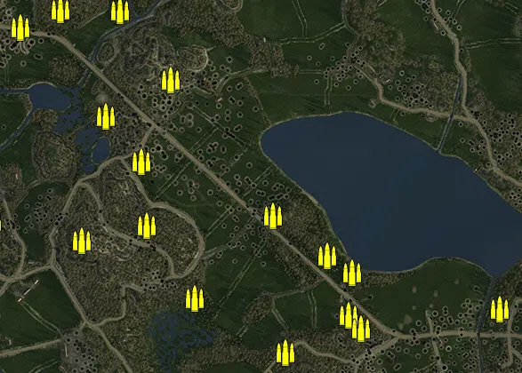
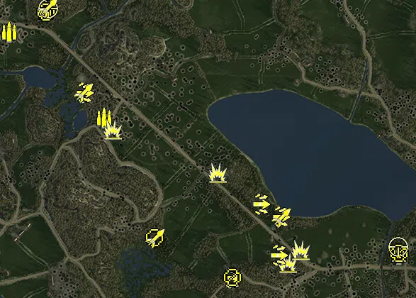
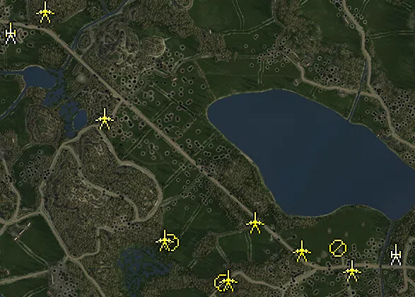
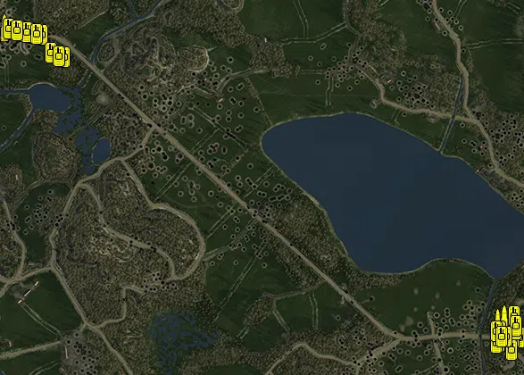

Static Ammo Crate

Pickup Kit

Static Emplacement

Vehicle

| gpo_subcat   | gpo_cat    | gpo_name                    |    pos_x |   pos_y |     pos_z |   flag | is_locked   |   team | instance                                                   | gpo_cat_disp       | gpo_subcat_disp   |
|:-------------|:-----------|:----------------------------|---------:|--------:|----------:|-------:|:------------|-------:|:-----------------------------------------------------------|:-------------------|:------------------|
| ammo_crate   | ammo_crate | ammo_crate                  |  662.406 |  27.406 |  -356.24  |      0 | False       |      0 | ammo_crate_0                                               | Static Ammo Crate  | Static Ammo Crate |
| ammo_crate   | ammo_crate | ammo_crate                  | -342.104 |  29.706 |   696.945 |      0 | False       |      0 | ammo_crate_1                                               | Static Ammo Crate  | Static Ammo Crate |
| ammo_crate   | ammo_crate | ammo_crate                  | -328.037 |  29.147 |   647.282 |      0 | False       |      0 | ammo_crate_2                                               | Static Ammo Crate  | Static Ammo Crate |
| ammo_crate   | ammo_crate | ammo_crate                  | -192.839 |  25.64  |   315.648 |      0 | False       |      0 | ammo_crate_3                                               | Static Ammo Crate  | Static Ammo Crate |
| ammo_crate   | ammo_crate | ammo_crate                  |  179.298 |  35.797 |  -453.624 |      0 | False       |      0 | ammo_crate_4                                               | Static Ammo Crate  | Static Ammo Crate |
| ammo_crate   | ammo_crate | ammo_crate                  |  -24.034 |  26.983 |  -332.007 |      0 | False       |      0 | ammo_crate_5                                               | Static Ammo Crate  | Static Ammo Crate |
| ammo_crate   | ammo_crate | ammo_crate                  | -277.461 |  57.66  |  -201.01  |      0 | False       |      0 | ammo_crate_6                                               | Static Ammo Crate  | Static Ammo Crate |
| ammo_crate   | ammo_crate | ammo_crate                  | -132.596 |  41.185 |  -167.243 |      0 | False       |      0 | ammo_crate_7                                               | Static Ammo Crate  | Static Ammo Crate |
| ammo_crate   | ammo_crate | ammo_crate                  |  322.408 |  30.612 |  -369.229 |      0 | False       |      0 | ammo_crate_8                                               | Static Ammo Crate  | Static Ammo Crate |
| ammo_crate   | ammo_crate | ammo_crate                  | -486.387 |  24.37  |   -40.296 |      0 | False       |      0 | ammo_crate_9                                               | Static Ammo Crate  | Static Ammo Crate |
| ammo_crate   | ammo_crate | ammo_crate                  |  349.288 |  30.591 |  -400.623 |      0 | False       |      0 | ammo_crate_10                                              | Static Ammo Crate  | Static Ammo Crate |
| ammo_crate   | ammo_crate | ammo_crate                  |  330.54  |  24.959 |  -273.265 |      0 | False       |      0 | ammo_crate_11                                              | Static Ammo Crate  | Static Ammo Crate |
| ammo_crate   | ammo_crate | ammo_crate                  |  151.081 |  26.616 |  -145.504 |      0 | False       |      0 | ammo_crate_12                                              | Static Ammo Crate  | Static Ammo Crate |
| ammo_crate   | ammo_crate | ammo_crate                  |  274.578 |  26.269 |  -236.849 |      0 | False       |      0 | ammo_crate_13                                              | Static Ammo Crate  | Static Ammo Crate |
| ammo_crate   | ammo_crate | ammo_crate                  | -144.394 |  27.573 |   -23.41  |      0 | False       |      0 | ammo_crate_14                                              | Static Ammo Crate  | Static Ammo Crate |
| ammo_crate   | ammo_crate | ammo_crate                  | -480.458 |  33.879 |  -157.088 |      0 | False       |      0 | ammo_crate_15                                              | Static Ammo Crate  | Static Ammo Crate |
| ammo_crate   | ammo_crate | ammo_crate                  | -559.28  |  27.83  |    93.447 |      0 | False       |      0 | ammo_crate_16                                              | Static Ammo Crate  | Static Ammo Crate |
| ammo_crate   | ammo_crate | ammo_crate                  | -224.674 |  27.301 |    78.532 |      0 | False       |      0 | ammo_crate_17                                              | Static Ammo Crate  | Static Ammo Crate |
| ammo_crate   | ammo_crate | ammo_crate                  |  -77.194 |  31.737 |   160.367 |      0 | False       |      0 | ammo_crate_18                                              | Static Ammo Crate  | Static Ammo Crate |
| ammo_crate   | ammo_crate | ammo_crate                  | -416.393 |  27.768 |   278.556 |      0 | False       |      0 | ammo_crate_19                                              | Static Ammo Crate  | Static Ammo Crate |
| ammo_crate   | ammo_crate | ammo_crate                  | -313.804 |  38.701 |   406.774 |      0 | False       |      0 | ammo_crate_20                                              | Static Ammo Crate  | Static Ammo Crate |
| ammo_crate   | ammo_crate | ammo_crate                  | -344.304 |  42.728 |   446.908 |      0 | False       |      0 | ammo_crate_21                                              | Static Ammo Crate  | Static Ammo Crate |
| ammo_crate   | ammo_crate | ammo_crate                  | -857.392 |  25.957 |   416.344 |      0 | False       |      0 | ammo_crate_22                                              | Static Ammo Crate  | Static Ammo Crate |
| ammo_crate   | ammo_crate | ammo_crate                  | -326.539 |  34.214 |   317.949 |      0 | False       |      0 | ammo_crate_23                                              | Static Ammo Crate  | Static Ammo Crate |
| ammo_crate   | ammo_crate | ammo_crate                  | -493.39  |  26.878 |   194.665 |      0 | False       |      0 | ammo_crate_24                                              | Static Ammo Crate  | Static Ammo Crate |
| ammo_crate   | ammo_crate | ammo_crate                  | -808.396 |  26.239 |   443.957 |      0 | False       |      0 | ammo_crate_25                                              | Static Ammo Crate  | Static Ammo Crate |
| ammo_crate   | ammo_crate | ammo_crate                  | -555.985 |  43.17  |   381.614 |      0 | False       |      0 | ammo_crate_26                                              | Static Ammo Crate  | Static Ammo Crate |
| ammo_crate   | ammo_crate | ammo_crate                  | -681.087 |  26.608 |  -167.806 |      0 | False       |      0 | ammo_crate_27                                              | Static Ammo Crate  | Static Ammo Crate |
| ammo_crate   | ammo_crate | ammo_crate                  | -584.42  |  26.225 |   -57.543 |      0 | False       |      0 | ammo_crate_28                                              | Static Ammo Crate  | Static Ammo Crate |
| ammo_crate   | ammo_crate | ammo_crate                  | -645.288 |  34.712 |   388.78  |      0 | False       |      0 | ammo_crate_29                                              | Static Ammo Crate  | Static Ammo Crate |
| ammo_crate   | ammo_crate | ammo_crate                  | -463.648 |  30.099 |   444.04  |      0 | False       |      0 | ammo_crate_30                                              | Static Ammo Crate  | Static Ammo Crate |
| ammo         | kit        | SE_PickUpAmmokit            | -167.925 |  29.34  |     8.814 |    207 | False       |      1 | CP_32_tali_murokallio_corridor_ammo                        | Pickup Kit         | Ammo Kit          |
| ammo         | kit        | RE_PickUpAmmokit            |  663.222 |  26.851 |  -375.513 |    201 | False       |      1 | CP_32_tali_45th_Guards_Rifle_Division_Putilov_ammo         | Pickup Kit         | Ammo Kit          |
| ammo         | kit        | SE_PickUpAmmokit            | -331.71  |  33.634 |   307.846 |    206 | False       |      1 | CP_32_tali_finnish_armoured_division_lagus_ammo_1          | Pickup Kit         | Ammo Kit          |
| ammo         | kit        | SE_PickUpAmmokit            | -435.496 |  27.878 |   250.679 |    206 | False       |      1 | CP_32_tali_finnish_armoured_division_lagus_ammo_2          | Pickup Kit         | Ammo Kit          |
| antitank     | kit        | RE_PickupTankhunter         |  349.438 |  31.413 |  -400.883 |    202 | False       |      2 | CP_32_tali_tali_village_approach_ppsh_rpg                  | Pickup Kit         | Tankhunter Kit    |
| antitank     | kit        | RE_PickupTankhunter         |  385.866 |  32.318 |  -363.389 |    202 | False       |      2 | CP_32_tali_tali_village_approach_ppshrpg                   | Pickup Kit         | Tankhunter Kit    |
| antitank     | kit        | RE_PickupTankhunter         |  151.254 |  27.45  |  -146.048 |    205 | False       |      2 | CP_32_tali_open_fields_rus_at                              | Pickup Kit         | Tankhunter Kit    |
| antitank     | kit        | RE_PickupTankhunter         | -144.66  |  27.982 |   -23.13  |    207 | False       |      0 | CP_32_tali_murokallio_corridor_se_re_at                    | Pickup Kit         | Tankhunter Kit    |
| assault      | kit        | SE_PickUpAssault_SuomiStick | -224.624 |  27.642 |    78.408 |    207 | False       |      1 | CP_32_tali_murokallio_corridor_suomi                       | Pickup Kit         | Assault Kit       |
| assault      | kit        | RE_PickUpAssaultPps42       |  274.595 |  26.614 |  -236.845 |    204 | False       |      0 | CP_32_tali_highway_pps                                     | Pickup Kit         | Assault Kit       |
| assault      | kit        | RE_PickUpAssaultPps42       |  192.219 |  34.74  |  -444.375 |    203 | False       |      2 | CP_32_tali_flank_pps                                       | Pickup Kit         | Assault Kit       |
| assault      | kit        | SE_PickUpAssault_SuomiStick |  330.05  |  25.434 |  -272.531 |    202 | False       |      1 | CP_32_tali_tali_village_approach_suomi                     | Pickup Kit         | Assault Kit       |
| assault      | kit        | RE_PickUpAssaultPps42       |  323.063 |  30.798 |  -380.549 |    202 | False       |      2 | CP_32_tali_tali_village_approach_rus_pps                   | Pickup Kit         | Assault Kit       |
| mg           | kit        | RE_PickupMG_DT              |  193.018 |  34.111 |  -442.873 |    203 | False       |      2 | CP_32_tali_flank_re_dt                                     | Pickup Kit         | MG Kit            |
| mg           | kit        | SE_PickupMG_LS26            | -331.49  |  33.79  |   306.515 |    206 | False       |      1 | CP_32_tali_finnish_armoured_division_lagus_dt              | Pickup Kit         | MG Kit            |
| mg           | kit        | SE_PickupMG_DT              |  -25.214 |  27.526 |  -330.979 |    203 | False       |      1 | CP_32_tali_flank_se_dt                                     | Pickup Kit         | MG Kit            |
| mg           | kit        | RE_PickupMG_DT              |  663.496 |  27.034 |  -374.69  |    201 | False       |      2 | CP_32_tali_45th_Guards_Rifle_Division_Putilov_LMG          | Pickup Kit         | MG Kit            |
| sniper       | kit        | SE_PickUpSniper             | -326.742 |  34.565 |   316.679 |    206 | False       |      1 | CP_32_tali_finnish_armoured_division_lagus_Sniper          | Pickup Kit         | Sniper Kit        |
| sniper       | kit        | RE_PickUpSniper             |  661.733 |  27.438 |  -355.863 |    201 | False       |      1 | CP_32_tali_45th_Guards_Rifle_Division_Putilov_Sniper       | Pickup Kit         | Sniper Kit        |
| zooka        | kit        | SE_PickupTankhunter_faust   | -326.634 |  34.77  |   317.876 |    206 | False       |      1 | CP_32_tali_finnish_armoured_division_lagus_faust           | Pickup Kit         | HEAT Thrower      |
| zooka        | kit        | SE_PickupTankhunter_faust   | -226.426 |  27.383 |    78.577 |    207 | False       |      1 | CP_32_tali_murokallio_corridor_faust                       | Pickup Kit         | HEAT Thrower      |
| zooka        | kit        | SE_PickUpPanzerschreck      |  -23.134 |  27.552 |  -331.087 |    203 | False       |      1 | CP_32_tali_flank_shreck                                    | Pickup Kit         | HEAT Thrower      |
| zooka        | kit        | SE_PickupTankhunter_faust   |  331.823 |  25.07  |  -273.191 |    202 | False       |      1 | CP_32_tali_tali_village_approach_faust                     | Pickup Kit         | HEAT Thrower      |
| noidea       | noidea     | commander_artillery_allied  | 1009.11  |  33.618 | -1022.56  |    201 | True        |      0 | CP_32_tali_45th_Guards_Rifle_Division_Putilov_ruscommarty1 | FIXME UNASSIGNED   | FIXME UNASSIGNED  |
| noidea       | noidea     | commander_artillery_allied  | 1017.1   |  33.618 | -1011.28  |    201 | True        |      0 | CP_32_tali_45th_Guards_Rifle_Division_Putilov_ruscommarty2 | FIXME UNASSIGNED   | FIXME UNASSIGNED  |
| noidea       | noidea     | commander_artillery_allied  | 1012.14  |  33.618 | -1019.17  |    201 | True        |      0 | CP_32_tali_45th_Guards_Rifle_Division_Putilov_ruscommarty3 | FIXME UNASSIGNED   | FIXME UNASSIGNED  |
| noidea       | noidea     | commander_artillery_allied  | 1014.38  |  33.618 | -1015.39  |    201 | True        |      0 | CP_32_tali_45th_Guards_Rifle_Division_Putilov_ruscommarty4 | FIXME UNASSIGNED   | FIXME UNASSIGNED  |
| noidea       | noidea     | commander_artillery_allied  | 1019.93  |  33.618 | -1007.57  |    201 | True        |      0 | CP_32_tali_45th_Guards_Rifle_Division_Putilov_ruscommarty5 | FIXME UNASSIGNED   | FIXME UNASSIGNED  |
| noidea       | noidea     | commander_artillery_axis    | -881.86  |  25.2   |   900.29  |    206 | True        |      0 | CP_32_tali_finnish_armoured_division_lagus_finncommarty1   | FIXME UNASSIGNED   | FIXME UNASSIGNED  |
| noidea       | noidea     | commander_artillery_axis    | -881.86  |  25.262 |   890.29  |    206 | True        |      0 | CP_32_tali_finnish_armoured_division_lagus_finncommarty2   | FIXME UNASSIGNED   | FIXME UNASSIGNED  |
| noidea       | noidea     | commander_artillery_axis    | -881.86  |  24.095 |   895.29  |    206 | True        |      0 | CP_32_tali_finnish_armoured_division_lagus_finncommarty3   | FIXME UNASSIGNED   | FIXME UNASSIGNED  |
| arty         | static     | m30_122mm                   |  656.249 |  26.122 |  -378.431 |    201 | False       |      0 | CP_32_tali_45th_Guards_Rifle_Division_Putilov_artillery1   | Static Emplacement | Artillery         |
| arty         | static     | m30_122mm                   | -434.618 |  27.862 |   247.5   |    206 | False       |      0 | CP_32_tali_finnish_armoured_division_lagus_artillery       | Static Emplacement | Artillery         |
| mg_nest      | static     | dp28_bipod                  |  493.438 |  31.524 |  -362.643 |    201 | False       |      0 | CP_32_tali_45th_Guards_Rifle_Division_Putilov_mg           | Static Emplacement | Static MG         |
| mg_nest      | static     | dp28_bipod                  |  168.432 |  36.974 |  -460.108 |    203 | False       |      0 | CP_32_tali_flank_dp                                        | Static Emplacement | Static MG         |
| mg_nest      | static     | dp28_bipod                  |   19.332 |  29.157 |  -345.121 |    203 | False       |      0 | CP_32_tali_flank_dp_fin                                    | Static Emplacement | Static MG         |
| pak          | static     | m1937_45mm                  |  389.261 |  30.947 |  -368.735 |    202 | False       |      0 | CP_32_tali_tali_village_approach_atgun                     | Static Emplacement | Anti-tank Gun     |
| pak          | static     | m1937_45mm                  |  532.91  |  31.952 |  -424.573 |    201 | False       |      0 | CP_32_tali_45th_Guards_Rifle_Division_Putilov_atgun        | Static Emplacement | Anti-tank Gun     |
| pak          | static     | m1937_45mm                  |  181.96  |  34.438 |  -451.142 |    203 | False       |      0 | CP_32_tali_flank_rus_at_gun                                | Static Emplacement | Anti-tank Gun     |
| pak          | static     | m1937_45mm_alt              |    2.738 |  28.181 |  -337.048 |    203 | False       |      0 | CP_32_tali_flank_fin_at_gun                                | Static Emplacement | Anti-tank Gun     |
| pak          | static     | m1937_45mm                  |  258.824 |  27.716 |  -288.561 |    204 | False       |      0 | CP_32_tali_highway_45mm                                    | Static Emplacement | Anti-tank Gun     |
| pak          | static     | pak40_static_fi             | -336.995 |  33.442 |   307.416 |    206 | True        |      0 | CP_32_tali_finnish_armoured_division_lagus_pak40           | Static Emplacement | Anti-tank Gun     |
| pak          | static     | pak40_static_fi             | -168.324 |  29.824 |     6.056 |    207 | True        |      0 | CP_32_tali_murokallio_corridor_pak40                       | Static Emplacement | Anti-tank Gun     |
| supply       | vehicle    | studebaker_us6_ammo         |  667.324 |  26.541 |  -373.681 |    201 | False       |      0 | CP_32_tali_45th_Guards_Rifle_Division_Putilov_truck_ammo   | Vehicle            | Supply Vehicle    |
| supply       | vehicle    | opelblitz_pan_ammo_finnish  | -451.576 |  28.132 |   277.007 |    206 | False       |      0 | CP_32_tali_finnish_armoured_division_lagus_truck_ammo      | Vehicle            | Supply Vehicle    |
| tank         | vehicle    | stug40_g_fi                 | -368.702 |  28.571 |   262.331 |    206 | True        |      0 | CP_32_tali_finnish_armoured_division_lagus_sturmi1         | Vehicle            | Tank              |
| tank         | vehicle    | stug40_g_fi                 | -412.889 |  28.441 |   270.157 |    206 | True        |      0 | CP_32_tali_finnish_armoured_division_lagus_sturmi2         | Vehicle            | Tank              |
| tank         | vehicle    | stug40_g_fi                 | -391.493 |  29.276 |   266.318 |    206 | True        |      0 | CP_32_tali_finnish_armoured_division_lagus_sturmi3         | Vehicle            | Tank              |
| tank         | vehicle    | is_2                        |  701.893 |  30.035 |  -416.652 |    201 | True        |      0 | CP_32_tali_45th_Guards_Rifle_Division_Putilov_is2          | Vehicle            | Tank              |
| tank         | vehicle    | isu_152                     |  687.716 |  28.76  |  -415.689 |    201 | True        |      0 | CP_32_tali_45th_Guards_Rifle_Division_Putilov_isu152       | Vehicle            | Tank              |
| tank         | vehicle    | t34_76_m43                  |  655.987 |  27.388 |  -426.513 |    201 | True        |      0 | CP_32_tali_45th_Guards_Rifle_Division_Putilov_t34_1        | Vehicle            | Tank              |
| tank         | vehicle    | t34_76_m43                  |  649.829 |  26.998 |  -427.474 |    201 | True        |      0 | CP_32_tali_45th_Guards_Rifle_Division_Putilov_t34_2        | Vehicle            | Tank              |
| tank         | vehicle    | t34_76_m43                  |  658.624 |  27.231 |  -402.01  |    201 | True        |      0 | CP_32_tali_45th_Guards_Rifle_Division_Putilov_t34_3        | Vehicle            | Tank              |
| tank         | vehicle    | t34_76_m43                  |  650.28  |  26.743 |  -401.451 |    201 | True        |      0 | CP_32_tali_45th_Guards_Rifle_Division_Putilov_t34_4        | Vehicle            | Tank              |
| tank         | vehicle    | t34_85_late                 |  682.105 |  28.488 |  -430.431 |    201 | True        |      0 | CP_32_tali_45th_Guards_Rifle_Division_Putilov_t34_5        | Vehicle            | Tank              |
| tank         | vehicle    | t34_85_late                 |  683.226 |  28.453 |  -444.778 |    201 | True        |      0 | CP_32_tali_45th_Guards_Rifle_Division_Putilov_t34_6        | Vehicle            | Tank              |
| tank         | vehicle    | t34_76_m41_finnish          | -317.983 |  25.521 |   211.676 |    203 | True        |      0 | CP_32_tali_flank_finn_t34                                  | Vehicle            | Tank              |
| tank         | vehicle    | t34_76_m43                  |  689.648 |  26.764 |  -368.171 |    201 | True        |      0 | CP_32_tali_45th_Guards_Rifle_Division_Putilov_t34_9        | Vehicle            | Tank              |
| tank         | vehicle    | stug40_g_fi                 | -433.313 |  27.885 |   273.614 |    204 | True        |      0 | CP_32_tali_highway_stug1                                   | Vehicle            | Tank              |
| tank         | vehicle    | stug40_g_fi                 | -442.629 |  27.909 |   275.695 |    204 | True        |      0 | CP_32_tali_highway_stug2                                   | Vehicle            | Tank              |
| tank         | vehicle    | t34_76_m43                  |  693.099 |  28.786 |  -397.313 |    201 | True        |      0 | CP_32_tali_45th_Guards_Rifle_Division_Putilov_t34_10       | Vehicle            | Tank              |
| tank         | vehicle    | t34_76_m43                  |  693.983 |  28.632 |  -390.227 |    201 | True        |      0 | CP_32_tali_45th_Guards_Rifle_Division_Putilov_t34_11       | Vehicle            | Tank              |
| tank         | vehicle    | stug40_g_fi                 | -402.625 |  29.07  |   268.335 |    206 | True        |      0 | CP_32_tali_finnish_armoured_division_lagus_sturmi4         | Vehicle            | Tank              |
| tank         | vehicle    | stug40_g_fi                 | -380.21  |  29.041 |   264.234 |    206 | True        |      0 | CP_32_tali_finnish_armoured_division_lagus_sturmi5         | Vehicle            | Tank              |
| tank         | vehicle    | stug40_g_fi                 | -423.482 |  27.946 |   271.863 |    206 | True        |      0 | CP_32_tali_finnish_armoured_division_lagus_sturmi6         | Vehicle            | Tank              |
| tank         | vehicle    | t34_76_m43                  |  672.336 |  28.115 |  -413.135 |    201 | True        |      0 | CP_32_tali_45th_Guards_Rifle_Division_Putilov_t34_7        | Vehicle            | Tank              |
| tank         | vehicle    | t34_85_late                 |  662.902 |  27.65  |  -413.084 |    201 | True        |      0 | CP_32_tali_45th_Guards_Rifle_Division_Putilov_t34_8        | Vehicle            | Tank              |
| tank         | vehicle    | kv1_m42                     | -348.888 |  26.224 |   221.077 |    206 | True        |      0 | CP_32_tali_finnish_armoured_division_lagus_kv1             | Vehicle            | Tank              |
| tank         | vehicle    | t34_85_finnish              | -329.596 |  25.733 |   214.823 |    206 | True        |      1 | CP_32_tali_finnish_armoured_division_lagus_t3485           | Vehicle            | Tank              |

