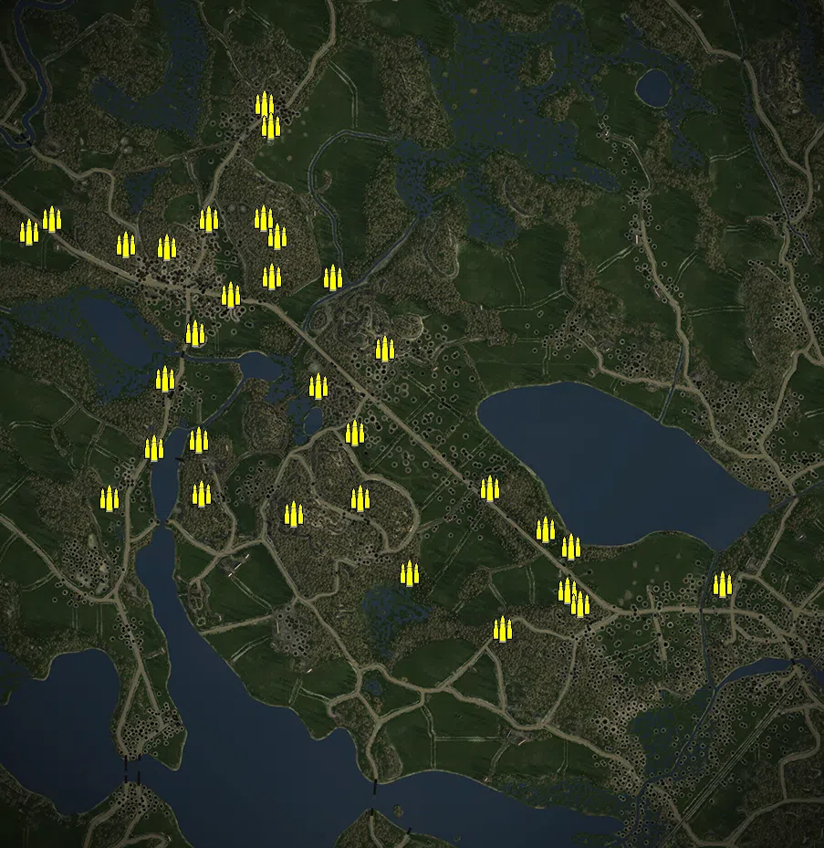
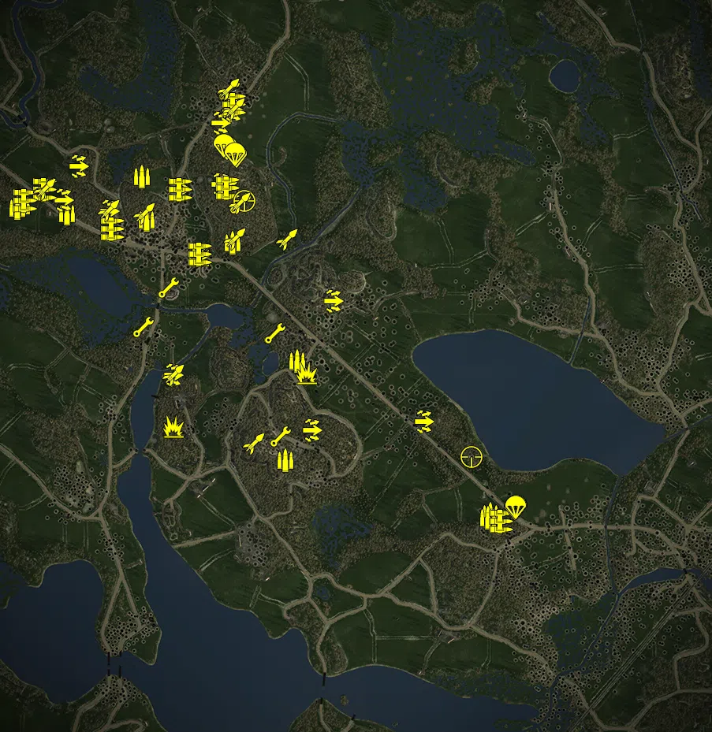
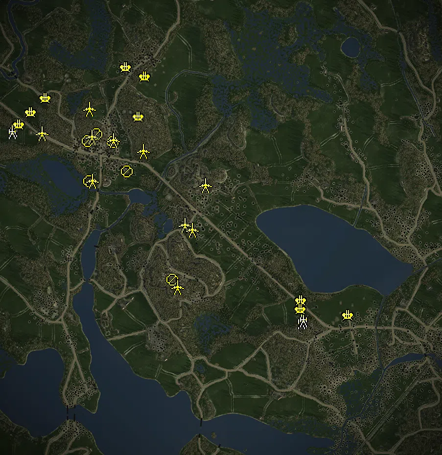
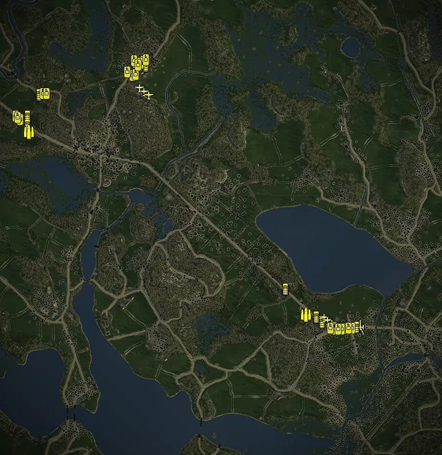

Static Ammo Crate

Pickup Kit

Static Emplacement

Vehicle

| gpo_subcat   | gpo_cat    | gpo_name                    |    pos_x |   pos_y |    pos_z |   flag | is_locked   |   team | instance                                                   | gpo_cat_disp       | gpo_subcat_disp   |
|:-------------|:-----------|:----------------------------|---------:|--------:|---------:|-------:|:------------|-------:|:-----------------------------------------------------------|:-------------------|:------------------|
| ammo_crate   | ammo_crate | ammo_crate                  |  662.406 |  27.406 | -356.24  |      0 | False       |      0 | ammo_crate_0                                               | Static Ammo Crate  | Static Ammo Crate |
| ammo_crate   | ammo_crate | ammo_crate                  | -342.104 |  29.706 |  696.945 |      0 | False       |      0 | ammo_crate_1                                               | Static Ammo Crate  | Static Ammo Crate |
| ammo_crate   | ammo_crate | ammo_crate                  | -328.037 |  29.147 |  647.282 |      0 | False       |      0 | ammo_crate_2                                               | Static Ammo Crate  | Static Ammo Crate |
| ammo_crate   | ammo_crate | ammo_crate                  | -192.839 |  25.64  |  315.648 |      0 | False       |      0 | ammo_crate_3                                               | Static Ammo Crate  | Static Ammo Crate |
| ammo_crate   | ammo_crate | ammo_crate                  |  179.298 |  35.797 | -453.624 |      0 | False       |      0 | ammo_crate_4                                               | Static Ammo Crate  | Static Ammo Crate |
| ammo_crate   | ammo_crate | ammo_crate                  |  -24.034 |  26.983 | -332.007 |      0 | False       |      0 | ammo_crate_5                                               | Static Ammo Crate  | Static Ammo Crate |
| ammo_crate   | ammo_crate | ammo_crate                  | -277.461 |  57.66  | -201.01  |      0 | False       |      0 | ammo_crate_6                                               | Static Ammo Crate  | Static Ammo Crate |
| ammo_crate   | ammo_crate | ammo_crate                  | -132.596 |  41.185 | -167.243 |      0 | False       |      0 | ammo_crate_7                                               | Static Ammo Crate  | Static Ammo Crate |
| ammo_crate   | ammo_crate | ammo_crate                  |  322.408 |  30.612 | -369.229 |      0 | False       |      0 | ammo_crate_8                                               | Static Ammo Crate  | Static Ammo Crate |
| ammo_crate   | ammo_crate | ammo_crate                  | -486.387 |  24.37  |  -40.296 |      0 | False       |      0 | ammo_crate_9                                               | Static Ammo Crate  | Static Ammo Crate |
| ammo_crate   | ammo_crate | ammo_crate                  |  349.288 |  30.591 | -400.623 |      0 | False       |      0 | ammo_crate_10                                              | Static Ammo Crate  | Static Ammo Crate |
| ammo_crate   | ammo_crate | ammo_crate                  |  330.54  |  24.959 | -273.265 |      0 | False       |      0 | ammo_crate_11                                              | Static Ammo Crate  | Static Ammo Crate |
| ammo_crate   | ammo_crate | ammo_crate                  |  151.081 |  26.616 | -145.504 |      0 | False       |      0 | ammo_crate_12                                              | Static Ammo Crate  | Static Ammo Crate |
| ammo_crate   | ammo_crate | ammo_crate                  |  274.578 |  26.269 | -236.849 |      0 | False       |      0 | ammo_crate_13                                              | Static Ammo Crate  | Static Ammo Crate |
| ammo_crate   | ammo_crate | ammo_crate                  | -144.394 |  27.573 |  -23.41  |      0 | False       |      0 | ammo_crate_14                                              | Static Ammo Crate  | Static Ammo Crate |
| ammo_crate   | ammo_crate | ammo_crate                  | -480.458 |  33.879 | -157.088 |      0 | False       |      0 | ammo_crate_15                                              | Static Ammo Crate  | Static Ammo Crate |
| ammo_crate   | ammo_crate | ammo_crate                  | -559.28  |  27.83  |   93.447 |      0 | False       |      0 | ammo_crate_16                                              | Static Ammo Crate  | Static Ammo Crate |
| ammo_crate   | ammo_crate | ammo_crate                  | -224.674 |  27.301 |   78.532 |      0 | False       |      0 | ammo_crate_17                                              | Static Ammo Crate  | Static Ammo Crate |
| ammo_crate   | ammo_crate | ammo_crate                  |  -77.194 |  31.737 |  160.367 |      0 | False       |      0 | ammo_crate_18                                              | Static Ammo Crate  | Static Ammo Crate |
| ammo_crate   | ammo_crate | ammo_crate                  | -416.393 |  27.768 |  278.556 |      0 | False       |      0 | ammo_crate_19                                              | Static Ammo Crate  | Static Ammo Crate |
| ammo_crate   | ammo_crate | ammo_crate                  | -313.804 |  38.701 |  406.774 |      0 | False       |      0 | ammo_crate_20                                              | Static Ammo Crate  | Static Ammo Crate |
| ammo_crate   | ammo_crate | ammo_crate                  | -344.304 |  42.728 |  446.908 |      0 | False       |      0 | ammo_crate_21                                              | Static Ammo Crate  | Static Ammo Crate |
| ammo_crate   | ammo_crate | ammo_crate                  | -857.392 |  25.957 |  416.344 |      0 | False       |      0 | ammo_crate_22                                              | Static Ammo Crate  | Static Ammo Crate |
| ammo_crate   | ammo_crate | ammo_crate                  | -326.539 |  34.214 |  317.949 |      0 | False       |      0 | ammo_crate_23                                              | Static Ammo Crate  | Static Ammo Crate |
| ammo_crate   | ammo_crate | ammo_crate                  | -493.39  |  26.878 |  194.665 |      0 | False       |      0 | ammo_crate_24                                              | Static Ammo Crate  | Static Ammo Crate |
| ammo_crate   | ammo_crate | ammo_crate                  | -808.396 |  26.239 |  443.957 |      0 | False       |      0 | ammo_crate_25                                              | Static Ammo Crate  | Static Ammo Crate |
| ammo_crate   | ammo_crate | ammo_crate                  | -555.985 |  43.17  |  381.614 |      0 | False       |      0 | ammo_crate_26                                              | Static Ammo Crate  | Static Ammo Crate |
| ammo_crate   | ammo_crate | ammo_crate                  | -681.087 |  26.608 | -167.806 |      0 | False       |      0 | ammo_crate_27                                              | Static Ammo Crate  | Static Ammo Crate |
| ammo_crate   | ammo_crate | ammo_crate                  | -584.42  |  26.225 |  -57.543 |      0 | False       |      0 | ammo_crate_28                                              | Static Ammo Crate  | Static Ammo Crate |
| ammo_crate   | ammo_crate | ammo_crate                  | -645.288 |  34.712 |  388.78  |      0 | False       |      0 | ammo_crate_29                                              | Static Ammo Crate  | Static Ammo Crate |
| ammo_crate   | ammo_crate | ammo_crate                  | -463.648 |  30.099 |  444.04  |      0 | False       |      0 | ammo_crate_30                                              | Static Ammo Crate  | Static Ammo Crate |
| ammo         | kit        | SE_PickUpAmmokit            | -865.565 |  25.988 |  402.624 |      1 | False       |      1 | CP_64_tali_finnish_armoured_division_lagus_ammo_1          | Pickup Kit         | Ammo Kit          |
| ammo         | kit        | SE_PickUpAmmokit            | -561.789 |  32.94  |  476.788 |    102 | False       |      1 | CP_64_tali_JR6_Inkinen_pak_ammo_1                          | Pickup Kit         | Ammo Kit          |
| ammo         | kit        | SE_PickUpAmmokit            | -331.553 |  33.671 |  307.584 |    102 | False       |      1 | CP_64_tali_JR6_Inkinen_pak_ammo_2                          | Pickup Kit         | Ammo Kit          |
| ammo         | kit        | SE_PickUpAmmokit            | -549.57  |  41.27  |  365.642 |    101 | False       |      1 | CP_64_tali_portinhoikka_ammo                               | Pickup Kit         | Ammo Kit          |
| ammo         | kit        | SE_PickUpAmmokit            | -167.894 |  29.34  |    8.803 |    103 | False       |      1 | CP_64_tali_hiihkallio_ammo                                 | Pickup Kit         | Ammo Kit          |
| ammo         | kit        | RE_PickUpAmmokit            |  322.983 |  30.744 | -380.535 |    107 | False       |      2 | CP_64_tali_45th_Guards_Rifle_Division_Putilov_ammo_1       | Pickup Kit         | Ammo Kit          |
| ammo         | kit        | RE_PickUpAmmokit            |  315.427 |  30.899 | -389.843 |    107 | False       |      2 | CP_64_tali_45th_Guards_Rifle_Division_Putilov_ammo_2       | Pickup Kit         | Ammo Kit          |
| ammo         | kit        | SE_PickUpAmmokit            | -878.433 |  26.264 |  395.298 |      1 | False       |      1 | CP_64_tali_finnish_armoured_division_lagus_ammo_2          | Pickup Kit         | Ammo Kit          |
| ammo         | kit        | SE_PickUpAmmokit            | -198.953 |  52.498 | -244.375 |    105 | False       |      1 | CP_64_tali_konkkalanvuoret_ammo_kit                        | Pickup Kit         | Ammo Kit          |
| ammo         | kit        | SE_PickUpAmmokit            | -752.01  |  27.082 |  381.639 |      1 | False       |      1 | CP_64_tali_finnish_armoured_division_lagus_ammo_3          | Pickup Kit         | Ammo Kit          |
| antitank     | kit        | RE_PickupTankhunter         | -417.3   |  28.066 |  278.007 |    101 | False       |      2 | CP_64_tali_portinhoikka_rus_ppsh                           | Pickup Kit         | Tankhunter Kit    |
| antitank     | kit        | RE_PickupTankhunter         | -144.719 |  27.972 |  -22.809 |    103 | False       |      2 | CP_64_tali_hiihkallio_rus_ppsh                             | Pickup Kit         | Tankhunter Kit    |
| antitank     | kit        | RE_PickupTankhunter         | -481.192 |  34.728 | -157.019 |    106 | False       |      2 | CP_64_tali_kolhi_farmstead_rus_ppsh                        | Pickup Kit         | Tankhunter Kit    |
| assault      | kit        | SE_PickUpAssault_SuomiStick | -761.803 |  28.62  |  416.865 |      1 | False       |      1 | CP_64_tali_finnish_armoured_division_lagus_suomi1          | Pickup Kit         | Assault Kit       |
| assault      | kit        | SE_PickUpAssault_SuomiStick | -723.878 |  27.846 |  501.086 |      1 | False       |      1 | CP_64_tali_finnish_armoured_division_lagus_suomi2          | Pickup Kit         | Assault Kit       |
| assault      | kit        | SE_PickUpAssault_SuomiStick | -364.231 |  28.476 |  612.432 |    102 | False       |      1 | CP_64_tali_JR6_Inkinen_suomi1                              | Pickup Kit         | Assault Kit       |
| assault      | kit        | SE_PickUpAssault_SuomiStick | -363.957 |  43.497 |  456.65  |    102 | False       |      1 | CP_64_tali_JR6_Inkinen_suomi2                              | Pickup Kit         | Assault Kit       |
| assault      | kit        | SE_PickUpAssault_SuomiStick | -332.782 |  30.01  |  644.093 |    102 | False       |      1 | CP_64_tali_JR6_Inkinen_suomi3                              | Pickup Kit         | Assault Kit       |
| assault      | kit        | RE_PickUpAssaultPps42       | -415.154 |  28.235 |  275.802 |    101 | False       |      2 | CP_64_tali_portinhoikka_rus_pps                            | Pickup Kit         | Assault Kit       |
| assault      | kit        | SE_PickUpAssault_SuomiStick | -645.291 |  35.038 |  388.853 |    101 | False       |      1 | CP_64_tali_portinhoikka_Suomi                              | Pickup Kit         | Assault Kit       |
| assault      | kit        | SE_PickUpAssault_SuomiStick | -483.874 |  25.81  |  -27.217 |    106 | False       |      1 | CP_64_tali_kolhi_farmstead_suomi                           | Pickup Kit         | Assault Kit       |
| assault      | kit        | SE_PickUpAssault_SuomiStick | -463.575 |  30.536 |  443.181 |    102 | False       |      1 | CP_64_tali_JR6_Inkinen_suomi                               | Pickup Kit         | Assault Kit       |
| assault      | kit        | RE_PickUpAssaultPps42       |  151.359 |  27.456 | -145.914 |    107 | False       |      2 | CP_64_tali_45th_Guards_Rifle_Division_Putilov_rus_pps      | Pickup Kit         | Assault Kit       |
| assault      | kit        | RE_PickUpAssaultPps42       | -132.664 |  41.547 | -167.179 |    105 | False       |      2 | CP_64_tali_konkkalanvuoret_rus_pps                         | Pickup Kit         | Assault Kit       |
| assault      | kit        | RE_PickUpAssaultPps42       |  -77.062 |  32.433 |  160.1   |    104 | False       |      2 | CP_64_tali_murokallio_rus_pps                              | Pickup Kit         | Assault Kit       |
| engineer     | kit        | SE_PickUpEngineer           | -340.066 |  30.13  |  695.033 |    102 | False       |      1 | CP_64_tali_JR6_Inkinen_minekit1                            | Pickup Kit         | Engineer Kit      |
| engineer     | kit        | SE_PickUpEngineer           | -345.705 |  43.115 |  448.093 |    102 | False       |      1 | CP_64_tali_JR6_Inkinen_minekit2                            | Pickup Kit         | Engineer Kit      |
| engineer     | kit        | SE_PickUpEngineer           | -312.606 |  39.009 |  407.004 |    102 | False       |      1 | CP_64_tali_JR6_Inkinen_minekit3                            | Pickup Kit         | Engineer Kit      |
| engineer     | kit        | SE_PickUpEngineer           | -494.106 |  27.067 |  194.764 |    101 | False       |      1 | CP_64_tali_portinhoikka_minekit_1                          | Pickup Kit         | Engineer Kit      |
| engineer     | kit        | SE_PickUpEngineer           | -226.509 |  27.387 |   78.668 |    103 | False       |      1 | CP_64_tali_hiihkallio_minekit_1                            | Pickup Kit         | Engineer Kit      |
| engineer     | kit        | SE_PickUpEngineer           | -558.752 |  27.854 |   94.102 |    101 | False       |      1 | CP_64_tali_portinhoikka_minekit_2                          | Pickup Kit         | Engineer Kit      |
| engineer     | kit        | SE_PickUpEngineer           | -224.729 |  27.635 |   78.296 |    103 | False       |      1 | CP_64_tali_hiihkallio_minekit_2                            | Pickup Kit         | Engineer Kit      |
| engineer     | kit        | SE_PickUpEngineer           | -209.018 |  43.47  | -183.474 |    105 | False       |      1 | CP_64_tali_konkkalanvuoret_minekit                         | Pickup Kit         | Engineer Kit      |
| mg           | kit        | SE_PickupMG_DT              | -808.462 |  26.8   |  442.81  |      1 | False       |      1 | CP_64_tali_finnish_armoured_division_lagus_dt              | Pickup Kit         | MG Kit            |
| mg           | kit        | SE_PickupMG_DT              | -344.511 |  43.094 |  446.875 |    102 | False       |      1 | CP_64_tali_JR6_Inkinen_dt                                  | Pickup Kit         | MG Kit            |
| mg           | kit        | RE_PickupMG_DT              | -414.285 |  27.959 |  277.825 |    101 | False       |      2 | CP_64_tali_portinhoikka_rus_dt                             | Pickup Kit         | MG Kit            |
| mg           | kit        | RE_PickupMG_DT              |  349.341 |  31.441 | -400.751 |    107 | False       |      2 | CP_64_tali_45th_Guards_Rifle_Division_Putilov_dt           | Pickup Kit         | MG Kit            |
| mg           | kit        | SE_PickupMG_LS26            | -858.025 |  26.985 |  414.736 |      1 | False       |      1 | CP_64_tali_finnish_armoured_division_lagus_ls26            | Pickup Kit         | MG Kit            |
| mg           | kit        | SE_PickupMG_LS26            | -328.627 |  30.092 |  658.928 |    102 | False       |      1 | CP_64_tali_JR6_Inkinen_LMG_1                               | Pickup Kit         | MG Kit            |
| mg           | kit        | SE_PickupMG_LS26            | -636.154 |  32.755 |  342.958 |      1 | False       |      1 | CP_64_tali_finnish_armoured_division_lagus_ls26_2          | Pickup Kit         | MG Kit            |
| mg           | kit        | SE_PickupMG_LS26            | -463.479 |  30.161 |  442.169 |    102 | False       |      1 | CP_64_tali_JR6_Inkinen_LMG_2                               | Pickup Kit         | MG Kit            |
| parachute    | kit        | SE_PickUpPilot              | -322.041 |  29.926 |  528.57  |    102 | False       |      1 | CP_64_tali_JR6_Inkinen_pilot1                              | Pickup Kit         | Parachute Kit     |
| parachute    | kit        | SE_PickUpPilot              | -345.645 |  29.609 |  547.689 |    102 | False       |      1 | CP_64_tali_JR6_Inkinen_pilot2                              | Pickup Kit         | Parachute Kit     |
| parachute    | kit        | SE_PickUpPilot              | -353.98  |  29.73  |  553.92  |    102 | False       |      1 | CP_64_tali_JR6_Inkinen_pilot3                              | Pickup Kit         | Parachute Kit     |
| parachute    | kit        | SE_PickUpPilot              | -326.217 |  29.866 |  531.795 |    102 | False       |      1 | CP_64_tali_JR6_Inkinen_pilot4                              | Pickup Kit         | Parachute Kit     |
| parachute    | kit        | RE_PickUpPilot              |  384.661 |  32.155 | -366.067 |    107 | False       |      2 | CP_64_tali_45th_Guards_Rifle_Division_Putilov_pilot1       | Pickup Kit         | Parachute Kit     |
| parachute    | kit        | RE_PickUpPilot              |  387.534 |  31.825 | -362.059 |    107 | False       |      2 | CP_64_tali_45th_Guards_Rifle_Division_Putilov_pilot2       | Pickup Kit         | Parachute Kit     |
| parachute    | kit        | RE_PickUpPilot              |  388.184 |  31.824 | -363.254 |    107 | False       |      2 | CP_64_tali_45th_Guards_Rifle_Division_Putilov_pilot3       | Pickup Kit         | Parachute Kit     |
| parachute    | kit        | RE_PickUpPilot              |  385.717 |  32.293 | -363.533 |    107 | False       |      2 | CP_64_tali_45th_Guards_Rifle_Division_Putilov_pilot4       | Pickup Kit         | Parachute Kit     |
| sniper       | kit        | SE_PickUpSniper             | -301.195 |  38.749 |  414.422 |    102 | False       |      1 | CP_64_tali_JR6_Inkinen_sniper                              | Pickup Kit         | Sniper Kit        |
| sniper       | kit        | RE_PickUpSniper             |  274.532 |  27.038 | -236.943 |    107 | False       |      2 | CP_64_tali_45th_Guards_Rifle_Division_Putilov_sniper       | Pickup Kit         | Sniper Kit        |
| zooka        | kit        | SE_PickUpPanzerschreck      | -807.215 |  26.338 |  446.529 |      1 | False       |      1 | CP_64_tali_finnish_armoured_division_lagus_shrek1          | Pickup Kit         | HEAT Thrower      |
| zooka        | kit        | SE_PickupTankhunter_faust   | -808.734 |  26.583 |  444.051 |      1 | False       |      1 | CP_64_tali_finnish_armoured_division_lagus_faust           | Pickup Kit         | HEAT Thrower      |
| zooka        | kit        | SE_PickUpPanzerschreck      | -645.132 |  35.318 |  390.142 |      1 | False       |      1 | CP_64_tali_finnish_armoured_division_lagus_shrek2          | Pickup Kit         | HEAT Thrower      |
| zooka        | kit        | SE_PickupTankhunter_faust   | -343.733 |  29.895 |  696.102 |    102 | False       |      1 | CP_64_tali_JR6_Inkinen_faust1                              | Pickup Kit         | HEAT Thrower      |
| zooka        | kit        | SE_PickupTankhunter_faust   | -327.622 |  29.34  |  647.999 |    102 | False       |      1 | CP_64_tali_JR6_Inkinen_faust2                              | Pickup Kit         | HEAT Thrower      |
| zooka        | kit        | SE_PickupTankhunter_faust   | -314.328 |  38.924 |  407.975 |    102 | False       |      1 | CP_64_tali_JR6_Inkinen_faust3                              | Pickup Kit         | HEAT Thrower      |
| zooka        | kit        | SE_PickUpPanzerschreck      | -341.374 |  29.873 |  697.141 |    102 | False       |      1 | CP_64_tali_JR6_Inkinen_shrek                               | Pickup Kit         | HEAT Thrower      |
| zooka        | kit        | SE_PickupTankhunter_faust   | -326.523 |  34.775 |  317.952 |    102 | False       |      1 | CP_64_tali_JR6_Inkinen_faust4                              | Pickup Kit         | HEAT Thrower      |
| zooka        | kit        | SE_PickupTankhunter_faust   | -555.758 |  43.347 |  382.565 |    101 | False       |      1 | CP_64_tali_portinhoikka_faust                              | Pickup Kit         | HEAT Thrower      |
| zooka        | kit        | SE_PickupTankhunter_faust   | -193.585 |  25.84  |  315.719 |    104 | False       |      1 | CP_64_tali_murokallio_faust                                | Pickup Kit         | HEAT Thrower      |
| zooka        | kit        | SE_PickupTankhunter_faust   | -482.767 |  26.007 |  -27.159 |    106 | False       |      1 | CP_64_tali_kolhi_farmstead_faust                           | Pickup Kit         | HEAT Thrower      |
| zooka        | kit        | SE_PickupTankhunter_faust   | -277.506 |  58.038 | -201.134 |    105 | False       |      1 | CP_64_tali_konkkalanvuoret_faust                           | Pickup Kit         | HEAT Thrower      |
| misc         | noidea     | britcommradio               |  261.565 |  26.314 | -236.794 |    107 | False       |      0 | CP_64_tali_45th_Guards_Rifle_Division_Putilov_ruscommradio | FIXME UNASSIGNED   | MISCELLANEOUS     |
| misc         | noidea     | gercommradio                | -721.039 |  27.435 |  502.926 |      1 | False       |      0 | CP_64_tali_finnish_armoured_division_lagus_commradio       | FIXME UNASSIGNED   | MISCELLANEOUS     |
| noidea       | noidea     | commander_artillery_axis    | -841.813 |  24.96  | 1114.58  |      1 | True        |      0 | CP_64_tali_finnish_armoured_division_lagus_finncommarty1   | FIXME UNASSIGNED   | FIXME UNASSIGNED  |
| noidea       | noidea     | commander_artillery_axis    | -846.813 |  24.96  | 1114.58  |      1 | True        |      0 | CP_64_tali_finnish_armoured_division_lagus_finncommarty2   | FIXME UNASSIGNED   | FIXME UNASSIGNED  |
| noidea       | noidea     | commander_artillery_axis    | -861.93  |  24.96  | 1114.58  |      1 | False       |      0 | CP_64_tali_finnish_armoured_division_lagus_finncommarty3   | FIXME UNASSIGNED   | FIXME UNASSIGNED  |
| noidea       | noidea     | commander_artillery_axis    | -856.813 |  24.96  | 1114.58  |      1 | True        |      0 | CP_64_tali_finnish_armoured_division_lagus_finncommarty4   | FIXME UNASSIGNED   | FIXME UNASSIGNED  |
| noidea       | noidea     | commander_artillery_axis    | -851.813 |  24.96  | 1114.58  |      1 | True        |      0 | CP_64_tali_finnish_armoured_division_lagus_finncommarty5   | FIXME UNASSIGNED   | FIXME UNASSIGNED  |
| noidea       | noidea     | commander_artillery_allied  |  826.513 |  28.432 | -750.042 |    107 | True        |      0 | CP_64_tali_45th_Guards_Rifle_Division_Putilov_ruscommarty1 | FIXME UNASSIGNED   | FIXME UNASSIGNED  |
| noidea       | noidea     | commander_artillery_allied  |  826.513 |  30.413 | -755.042 |    107 | True        |      0 | CP_64_tali_45th_Guards_Rifle_Division_Putilov_ruscommarty2 | FIXME UNASSIGNED   | FIXME UNASSIGNED  |
| noidea       | noidea     | commander_artillery_allied  |  821.515 |  31.036 | -760.042 |    107 | True        |      0 | CP_64_tali_45th_Guards_Rifle_Division_Putilov_ruscommarty3 | FIXME UNASSIGNED   | FIXME UNASSIGNED  |
| noidea       | noidea     | commander_artillery_allied  |  821.515 |  31.364 | -765.042 |    107 | True        |      0 | CP_64_tali_45th_Guards_Rifle_Division_Putilov_ruscommarty4 | FIXME UNASSIGNED   | FIXME UNASSIGNED  |
| noidea       | noidea     | commander_artillery_allied  |  826.513 |  31.525 | -760.042 |    107 | True        |      0 | CP_64_tali_45th_Guards_Rifle_Division_Putilov_ruscommarty5 | FIXME UNASSIGNED   | FIXME UNASSIGNED  |
| noidea       | noidea     | commander_artillery_allied  |  821.515 |  29.876 | -755.042 |    107 | True        |      0 | CP_64_tali_45th_Guards_Rifle_Division_Putilov_ruscommarty6 | FIXME UNASSIGNED   | FIXME UNASSIGNED  |
| noidea       | noidea     | commander_artillery_allied  |  826.513 |  31.643 | -765.042 |    107 | True        |      0 | CP_64_tali_45th_Guards_Rifle_Division_Putilov_ruscommarty7 | FIXME UNASSIGNED   | FIXME UNASSIGNED  |
| noidea       | noidea     | commander_artillery_allied  |  821.515 |  28.035 | -750.042 |    107 | True        |      0 | CP_64_tali_45th_Guards_Rifle_Division_Putilov_ruscommarty8 | FIXME UNASSIGNED   | FIXME UNASSIGNED  |
| arty         | static     | m30_122mm                   |  308.665 |  30.342 | -388.698 |    107 | False       |      0 | CP_64_tali_45th_Guards_Rifle_Division_Putilov_artillery1   | Static Emplacement | Artillery         |
| arty         | static     | m30_122mm                   |  316.74  |  29.771 | -380.596 |    107 | False       |      0 | CP_64_tali_45th_Guards_Rifle_Division_Putilov_artillery2   | Static Emplacement | Artillery         |
| arty         | static     | m30_122mm                   | -867.057 |  25.844 |  396.586 |      1 | False       |      0 | CP_64_tali_finnish_armoured_division_lagus_artillery1      | Static Emplacement | Artillery         |
| arty         | static     | m30_122mm                   | -874.526 |  25.874 |  388.538 |      1 | False       |      0 | CP_64_tali_finnish_armoured_division_lagus_artillery2      | Static Emplacement | Artillery         |
| flak         | static     | bofors40mm_eu               |  307.991 |  27.213 | -302.199 |    107 | True        |      0 | CP_64_tali_45th_Guards_Rifle_Division_Putilov_AA1          | Static Emplacement | Anti-aircraft Gun |
| flak         | static     | bofors40mm_eu               |  305.978 |  27.359 | -337.52  |    107 | True        |      0 | CP_64_tali_45th_Guards_Rifle_Division_Putilov_AA2          | Static Emplacement | Anti-aircraft Gun |
| flak         | static     | bofors40mm_eu               |  499.892 |  29.739 | -362.89  |    107 | True        |      0 | CP_64_tali_45th_Guards_Rifle_Division_Putilov_AA3          | Static Emplacement | Anti-aircraft Gun |
| flak         | static     | bofors40mm_eu_alt           | -796.091 |  25.397 |  465.928 |      1 | True        |      0 | CP_64_tali_finnish_armoured_division_lagus_bofors1         | Static Emplacement | Anti-aircraft Gun |
| flak         | static     | bofors40mm_eu_alt           | -736.366 |  26.135 |  524.028 |      1 | True        |      0 | CP_64_tali_finnish_armoured_division_lagus_bofors2         | Static Emplacement | Anti-aircraft Gun |
| flak         | static     | bofors40mm_eu_alt           | -330.097 |  26.199 |  611.988 |    102 | True        |      0 | CP_64_tali_JR6_Inkinen_bofors1                             | Static Emplacement | Anti-aircraft Gun |
| flak         | static     | bofors40mm_eu_alt           | -356.041 |  42.2   |  448.015 |    102 | True        |      0 | CP_64_tali_JR6_Inkinen_bofors2                             | Static Emplacement | Anti-aircraft Gun |
| flak         | static     | bofors40mm_eu_alt           | -407.981 |  27.307 |  649.817 |    102 | True        |      0 | CP_64_tali_JR6_Inkinen_bofors_3                            | Static Emplacement | Anti-aircraft Gun |
| flak         | static     | bofors40mm_eu_alt           | -843.728 |  25.336 |  416.006 |      1 | True        |      0 | CP_64_tali_finnish_armoured_division_lagus_bofors3         | Static Emplacement | Anti-aircraft Gun |
| mg_nest      | static     | dt_bipod                    | -218.758 |  52.36  | -217.75  |    105 | False       |      0 | CP_64_tali_konkkalanvuoret_dt                              | Static Emplacement | Static MG         |
| mg_nest      | static     | dp28_bipod                  | -563.658 |  37.887 |  347.959 |    101 | False       |      0 | CP_64_tali_portinhoikka_dp                                 | Static Emplacement | Static MG         |
| mg_nest      | static     | dt_bipod                    | -557.361 |  25.722 |  183.774 |    101 | False       |      0 | CP_64_tali_portinhoikka_dt2                                | Static Emplacement | Static MG         |
| mg_nest      | static     | dt_bipod                    | -461.915 |  30.977 |  343.978 |    101 | False       |      0 | CP_64_tali_portinhoikka_dt                                 | Static Emplacement | Static MG         |
| mg_nest      | static     | dp28_bipod                  | -527.012 |  41.225 |  376.417 |    101 | False       |      0 | CP_64_tali_portinhoikka_dt2_0                              | Static Emplacement | Static MG         |
| mg_nest      | static     | dp28_bipod                  | -404.145 |  27.565 |  224.282 |    101 | False       |      0 | CP_64_tali_portinhoikka_dp_0                               | Static Emplacement | Static MG         |
| pak          | static     | pak40_static_fi             | -751.329 |  27.639 |  380.265 |      1 | True        |      0 | CP_64_tali_finnish_armoured_division_lagus_pak40           | Static Emplacement | Anti-tank Gun     |
| pak          | static     | pak40_static_fi             | -168.299 |  29.832 |    6.052 |    103 | True        |      0 | CP_64_tali_hiihkallio_pak40                                | Static Emplacement | Anti-tank Gun     |
| pak          | static     | pak40_static_fi             | -197.232 |  52.992 | -247.502 |    105 | True        |      0 | CP_64_tali_konkkalanvuoret_pak40                           | Static Emplacement | Anti-tank Gun     |
| pak          | static     | pak40_static_fi             | -558.285 |  33.582 |  479.328 |    102 | True        |      0 | CP_64_tali_JR6_Inkinen_pak40_1                             | Static Emplacement | Anti-tank Gun     |
| pak          | static     | pak40_static_fi             | -337.008 |  33.436 |  307.421 |    102 | True        |      0 | CP_64_tali_JR6_Inkinen_pak40_2                             | Static Emplacement | Anti-tank Gun     |
| pak          | static     | pak40_static_fi             | -547.578 |  41.787 |  366.955 |    101 | True        |      0 | CP_64_tali_portinhoikka_pak40                              | Static Emplacement | Anti-tank Gun     |
| pak          | static     | m1937_45mm_alt              | -459.598 |  30.956 |  351.176 |    101 | False       |      0 | CP_64_tali_portinhoikka_45mm                               | Static Emplacement | Anti-tank Gun     |
| pak          | static     | m1937_45mm_alt              |  -83.14  |  35.539 |  168.243 |    104 | False       |      0 | CP_64_tali_murokallio_45mm                                 | Static Emplacement | Anti-tank Gun     |
| pak          | static     | m1937_45mm_static           | -546.862 |  25.114 |  186.027 |    101 | False       |      0 | CP_64_tali_portinhoikka_45mm_2                             | Static Emplacement | Anti-tank Gun     |
| pak          | static     | m1937_45mm                  | -138.961 |  30.6   |  -13.025 |    103 | False       |      0 | CP_64_tali_hiihkallio_rus_45mm                             | Static Emplacement | Anti-tank Gun     |
| arty_sp      | vehicle    | katjusha_bm13               |  547.9   |  30.531 | -410.959 |    107 | True        |      0 | CP_64_tali_45th_Guards_Rifle_Division_Putilov_katuysha     | Vehicle            | Mobile Arty       |
| car          | vehicle    | studebaker_us6              |  393.069 |  30.227 | -391.025 |    107 | False       |      0 | CP_64_tali_45th_Guards_Rifle_Division_Putilov_truck1       | Vehicle            | Car               |
| car          | vehicle    | studebaker_us6              |  369.877 |  31.998 | -370.1   |    107 | False       |      0 | CP_64_tali_45th_Guards_Rifle_Division_Putilov_truck2       | Vehicle            | Car               |
| car          | vehicle    | studebaker_us6              |  243.905 |  27.74  | -256.23  |    107 | False       |      0 | CP_64_tali_45th_Guards_Rifle_Division_Putilov_truck3       | Vehicle            | Car               |
| car          | vehicle    | studebaker_us6              |  533.097 |  31.844 | -411.902 |    107 | False       |      0 | CP_64_tali_45th_Guards_Rifle_Division_Putilov_truck4       | Vehicle            | Car               |
| car          | vehicle    | opelblitz_pan_nocanvas      | -809.295 |  26.017 |  449.496 |      1 | False       |      0 | CP_64_tali_finnish_armoured_division_lagus_truck1          | Vehicle            | Car               |
| car          | vehicle    | opelblitz_pan_nocanvas      | -368.019 |  28.499 |  650.233 |    102 | False       |      0 | CP_64_tali_JR6_Inkinen_truck1                              | Vehicle            | Car               |
| car          | vehicle    | opelblitz_pan_nocanvas      | -326.303 |  29.471 |  656.726 |    102 | False       |      0 | CP_64_tali_JR6_Inkinen_truck2                              | Vehicle            | Car               |
| car          | vehicle    | opelblitz_pan_nocanvas      | -761.642 |  25.865 |  538.949 |      1 | False       |      0 | CP_64_tali_finnish_armoured_division_lagus_truck2          | Vehicle            | Car               |
| car          | vehicle    | opelblitz_pan_nocanvas      | -809.847 |  26.26  |  413.465 |      1 | False       |      0 | CP_64_tali_finnish_armoured_division_lagus_truck3          | Vehicle            | Car               |
| plane        | vehicle    | la-5_fn                     |  401.289 |  30.107 | -371.275 |    107 | True        |      0 | CP_64_tali_45th_Guards_Rifle_Division_Putilov_fighter      | Vehicle            | Airplane          |
| plane        | vehicle    | la-5_fn                     |  415.893 |  29.605 | -383.64  |    107 | True        |      0 | CP_64_tali_45th_Guards_Rifle_Division_Putilov_fighter2     | Vehicle            | Airplane          |
| plane        | vehicle    | il-2_bomber                 |  434.609 |  29.49  | -395.915 |    107 | True        |      0 | CP_64_tali_45th_Guards_Rifle_Division_Putilov_IL2          | Vehicle            | Airplane          |
| plane        | vehicle    | bf109g2_finnish             | -334.337 |  27.995 |  550.273 |    102 | True        |      0 | CP_64_tali_JR6_Inkinen_fighter1                            | Vehicle            | Airplane          |
| plane        | vehicle    | bf109g2_finnish             | -351.488 |  28.013 |  565.446 |    102 | True        |      0 | CP_64_tali_JR6_Inkinen_fighter2                            | Vehicle            | Airplane          |
| plane        | vehicle    | ju87dalt                    | -314.948 |  28.204 |  536.803 |    102 | True        |      0 | CP_64_tali_JR6_Inkinen_stuka                               | Vehicle            | Airplane          |
| supply       | vehicle    | studebaker_us6_ammo         |  328.219 |  29.211 | -360.026 |    107 | False       |      0 | CP_64_tali_45th_Guards_Rifle_Division_Putilov_truck_ammo   | Vehicle            | Supply Vehicle    |
| supply       | vehicle    | opelblitz_pan_ammo_finnish  | -803.49  |  25.852 |  385.397 |      1 | False       |      0 | CP_64_tali_finnish_armoured_division_lagus_ammo_truck      | Vehicle            | Supply Vehicle    |
| tank         | vehicle    | t34_85_late                 |  486.832 |  31.74  | -417.938 |    107 | True        |      0 | CP_64_tali_45th_Guards_Rifle_Division_Putilov_t3485_1      | Vehicle            | Tank              |
| tank         | vehicle    | t34_76_m43                  |  446.171 |  29.625 | -419.643 |    107 | True        |      0 | CP_64_tali_45th_Guards_Rifle_Division_Putilov_t3476_1      | Vehicle            | Tank              |
| tank         | vehicle    | isu_152                     |  515.959 |  32.681 | -415.212 |    107 | True        |      0 | CP_64_tali_45th_Guards_Rifle_Division_Putilov_isu152_1     | Vehicle            | Tank              |
| tank         | vehicle    | is_2                        |  501.012 |  32.549 | -416.269 |    107 | True        |      0 | CP_64_tali_45th_Guards_Rifle_Division_Putilov_IS2          | Vehicle            | Tank              |
| tank         | vehicle    | t34_85_late                 |  473.191 |  30.841 | -419.089 |    107 | True        |      0 | CP_64_tali_45th_Guards_Rifle_Division_Putilov_t3485_2      | Vehicle            | Tank              |
| tank         | vehicle    | t34_76_m43                  |  460.101 |  30.161 | -419.8   |    107 | True        |      0 | CP_64_tali_45th_Guards_Rifle_Division_Putilov_t3476_2      | Vehicle            | Tank              |
| tank         | vehicle    | t26_finn                    | -379.338 |  27.885 |  615.82  |    102 | True        |      0 | CP_64_tali_JR6_Inkinen_t26_1                               | Vehicle            | Tank              |
| tank         | vehicle    | t26_finn                    | -374.635 |  29.517 |  675.46  |    102 | True        |      0 | CP_64_tali_JR6_Inkinen_t26_2                               | Vehicle            | Tank              |
| tank         | vehicle    | stug40_g_fi                 | -336.256 |  29.906 |  673.902 |    102 | True        |      0 | CP_64_tali_JR6_Inkinen_stug1                               | Vehicle            | Tank              |
| tank         | vehicle    | stug40_g_fi                 | -347.232 |  29.555 |  666.326 |    102 | True        |      0 | CP_64_tali_JR6_Inkinen_stug2                               | Vehicle            | Tank              |
| tank         | vehicle    | t50                         | -857.418 |  26.592 |  450.797 |      1 | True        |      0 | CP_64_tali_finnish_armoured_division_lagus_t50             | Vehicle            | Tank              |
| tank         | vehicle    | t34_76_m41_finnish          | -839.693 |  26.142 |  436.044 |      1 | True        |      0 | CP_64_tali_finnish_armoured_division_lagus_t34             | Vehicle            | Tank              |
| tank         | vehicle    | stug40_g_fi                 | -401.85  |  27.913 |  630.233 |    102 | True        |      0 | CP_64_tali_JR6_Inkinen_stug_5                              | Vehicle            | Tank              |
| tank         | vehicle    | stug40_g_fi                 | -368.578 |  27.929 |  619.173 |    102 | True        |      0 | CP_64_tali_JR6_Inkinen_stug_6                              | Vehicle            | Tank              |
| tank         | vehicle    | kv1_m42                     | -849.434 |  26.549 |  443.766 |      1 | True        |      0 | CP_64_tali_finnish_armoured_division_lagus_kv1             | Vehicle            | Tank              |
| tank         | vehicle    | isu_152_finnish             | -745.508 |  26.385 |  541.972 |      1 | True        |      1 | CP_64_tali_finnish_armoured_division_lagus_isu             | Vehicle            | Tank              |
| tank         | vehicle    | stug40_g_fi                 | -357.593 |  28.868 |  658.033 |    102 | True        |      0 | CP_64_tali_JR6_Inkinen_stug_3                              | Vehicle            | Tank              |
| tank         | vehicle    | stug40_g_fi                 | -326.545 |  30.152 |  680.964 |    102 | True        |      0 | CP_64_tali_JR6_Inkinen_stug_4                              | Vehicle            | Tank              |
| tank         | vehicle    | t34_76_m43                  |  427.375 |  29.207 | -415.268 |    107 | True        |      0 | CP_64_tali_45th_Guards_Rifle_Division_Putilov_t3476_3      | Vehicle            | Tank              |
| tank         | vehicle    | t34_85_finnish              | -731.149 |  27.027 |  541.37  |      1 | True        |      1 | CP_64_tali_finnish_armoured_division_lagus_t3485           | Vehicle            | Tank              |

