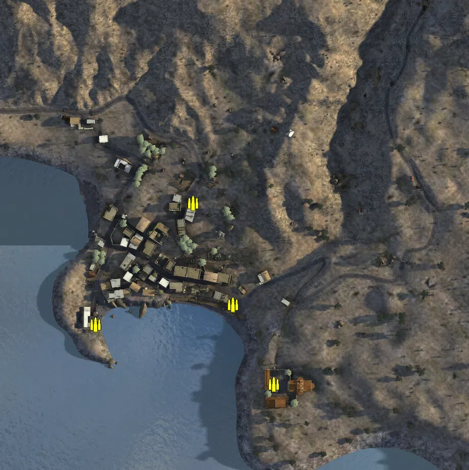
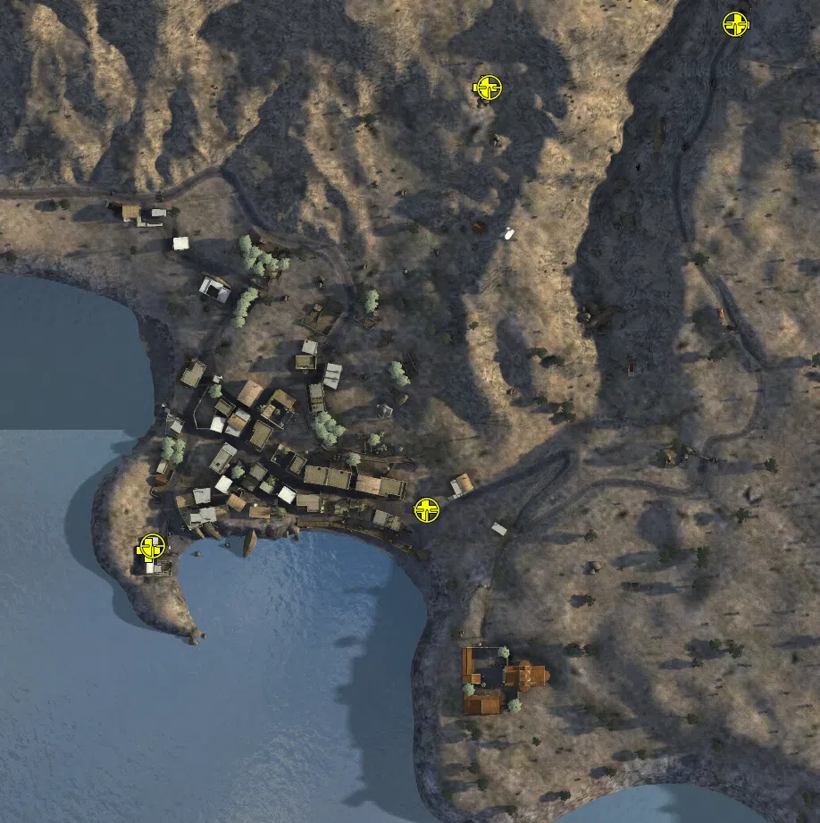
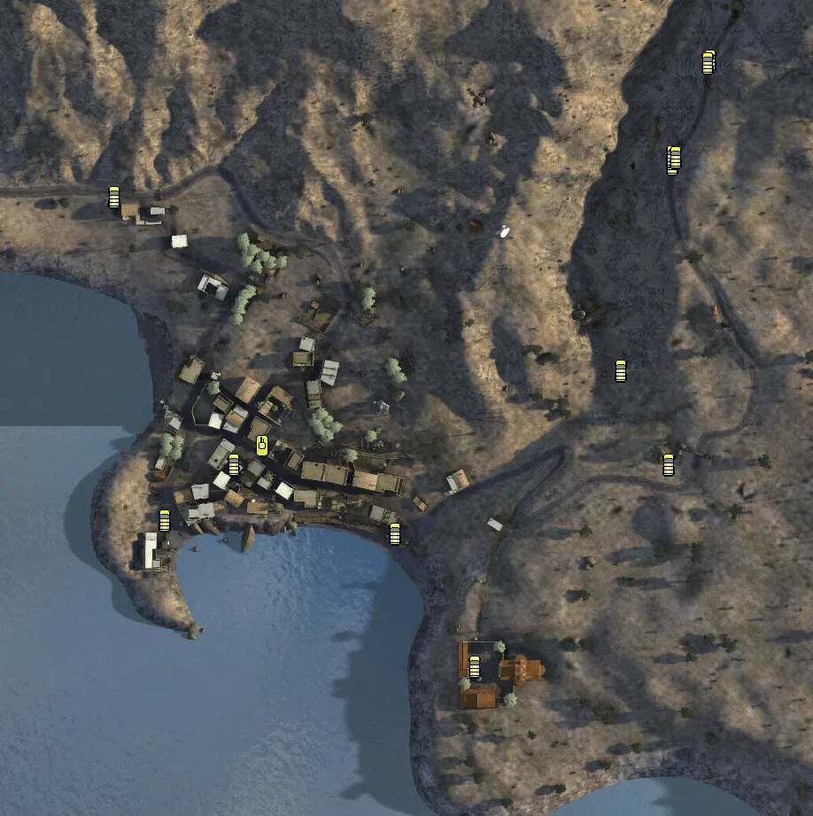

Static Ammo Crate

Pickup Kit

Static Emplacement

Vehicle

| gpo_subcat   | gpo_cat    | gpo_name              |    pos_x |   pos_y |    pos_z |   flag | is_locked   |   team | instance                                               | gpo_cat_disp       | gpo_subcat_disp   |
|:-------------|:-----------|:----------------------|---------:|--------:|---------:|-------:|:------------|-------:|:-------------------------------------------------------|:-------------------|:------------------|
| ammo_crate   | ammo_crate | ammo_crate            |  -47.813 |  88.743 |   41.43  |      0 | False       |      0 | ammo_crate_0                                           | Static Ammo Crate  | Static Ammo Crate |
| ammo_crate   | ammo_crate | ammo_crate            | -143.325 |  76.162 |  -77.652 |      0 | False       |      0 | ammo_crate_1                                           | Static Ammo Crate  | Static Ammo Crate |
| ammo_crate   | ammo_crate | ammo_crate            |   30.9   |  94.75  | -135.924 |      0 | False       |      0 | ammo_crate_2                                           | Static Ammo Crate  | Static Ammo Crate |
| ammo_crate   | ammo_crate | ammo_crate            |   -9.117 |  78.15  |  -57.793 |      0 | False       |      0 | ammo_crate_3                                           | Static Ammo Crate  | Static Ammo Crate |
| medic        | kit        | GA_PickUpMedicP08     |  175.793 | 132.661 |  226.3   |      2 | False       |      0 | CP_64_The_Battle_for_Sfakia_German_Advance_Medic       | Pickup Kit         | Medic Kit         |
| medic        | kit        | GA_PickUpMedicP08     |   34.671 | 129.593 |  191.723 |      2 | False       |      0 | CP_64_The_Battle_for_Sfakia_German_Advance_Medic2      | Pickup Kit         | Medic Kit         |
| medic        | kit        | BA_PickUpMedicWebley  |    1.062 |  79.684 |  -44.74  |      4 | False       |      0 | CP_64_The_Battle_for_Sfakia_Command_Post_Medic         | Pickup Kit         | Medic Kit         |
| medic        | kit        | BA_PickUpMedicWebley  | -154.17  |  79.689 |  -67.31  |      1 | False       |      0 | CP_64_The_Battle_for_Sfakia_Harbour_Medic              | Pickup Kit         | Medic Kit         |
| sniper       | kit        | BA_PickUpSniperNo4    |    1.804 |  79.715 |  -45.032 |      4 | False       |      0 | CP_64_The_Battle_for_Sfakia_Command_Post_Brit_Sniper   | Pickup Kit         | Sniper Kit        |
| sniper       | kit        | BA_PickUpSniperNo4    | -151.743 |  79.961 |  -65.181 |      1 | False       |      0 | CP_64_The_Battle_for_Sfakia_Harbour_Brit_Sniper        | Pickup Kit         | Sniper Kit        |
| sniper       | kit        | GA_PickUpSniperK98    |   36.934 | 130.349 |  191.684 |      2 | False       |      0 | CP_64_The_Battle_for_Sfakia_German_Advance_Ger_Sniper1 | Pickup Kit         | Sniper Kit        |
| sniper       | kit        | GA_PickUpSniperK98    |  174.384 | 132.635 |  226.847 |      2 | False       |      0 | CP_64_The_Battle_for_Sfakia_German_Advance_Ger_Sniper2 | Pickup Kit         | Sniper Kit        |
| noidea       | noidea     | commander_mortar_axis |  240.204 | 125.833 |  146.284 |      2 | True        |      0 | CP_64_The_Battle_for_Sfakia_German_Advance_Comm_Mortar | FIXME UNASSIGNED   | FIXME UNASSIGNED  |
| noidea       | noidea     | commander_smoke_axis  |  240.043 | 125.743 |  143.809 |      2 | True        |      0 | CP_64_The_Battle_for_Sfakia_German_Advance_Comm_Smoke  | FIXME UNASSIGNED   | FIXME UNASSIGNED  |
| radio        | static     | britcommradio         | -151.164 |  79.162 |  -65.084 |      1 | False       |      0 | CP_64_The_Battle_for_Sfakia_Harbour_Commander          | Static Emplacement | Radio             |
| radio        | static     | britcommradio         |   31.999 |  95.015 | -153.735 |      8 | False       |      0 | CP_64_The_Battle_for_Sfakia_The_Monastary_Commander    | Static Emplacement | Radio             |
| car          | vehicle    | citroen_11cv_cream    |  142.607 | 120.337 |  148.073 |      2 | False       |      0 | CP_64_The_Battle_for_Sfakia_Command_Post_Truck         | Vehicle            | Car               |
| car          | vehicle    | civtruck              | -172.558 |  99.69  |  129.485 |      5 | False       |      0 | CP_64_The_Battle_for_Sfakia_Main_Road_West_Truck       | Vehicle            | Car               |
| civilian     | vehicle    | rideable_bicycle      | -143.957 |  77.207 |  -52.759 |      1 | False       |      0 | CP_64_The_Battle_for_Sfakia_Harbour_bike1              | Vehicle            | Civilian Vehicle  |
| civilian     | vehicle    | rideable_bicycle      | -105.192 |  78.188 |  -21.448 |      3 | False       |      0 | CP_64_The_Battle_for_Sfakia_Town_Square_bike2          | Vehicle            | Civilian Vehicle  |
| civilian     | vehicle    | rideable_bicycle      |  -14.137 |  78.15  |  -60.383 |      4 | False       |      0 | CP_64_The_Battle_for_Sfakia_Command_Post_bike3         | Vehicle            | Civilian Vehicle  |
| civilian     | vehicle    | rideable_bicycle      |  113.594 |  86.43  |   31.503 |      6 | False       |      0 | CP_64_The_Battle_for_Sfakia_British_Rearguard_bike4    | Vehicle            | Civilian Vehicle  |
| civilian     | vehicle    | rideable_bicycle      |   30.815 |  94.894 | -135.708 |      8 | False       |      0 | CP_64_The_Battle_for_Sfakia_The_Monastary_bike5        | Vehicle            | Civilian Vehicle  |
| civilian     | vehicle    | rideable_bicycle      |  140.265 | 103.51  |  -21.679 |      6 | False       |      0 | CP_64_The_Battle_for_Sfakia_British_Rearguard_bike6    | Vehicle            | Civilian Vehicle  |
| civilian     | vehicle    | rideable_bicycle      |  164.038 | 130.797 |  206.402 |      2 | False       |      0 | CP_64_The_Battle_for_Sfakia_German_Advance_bike7       | Vehicle            | Civilian Vehicle  |
| civilian     | vehicle    | rideable_bicycle      |  162.294 | 130.435 |  204.965 |      2 | False       |      0 | CP_64_The_Battle_for_Sfakia_German_Advance_bike8       | Vehicle            | Civilian Vehicle  |
| civilian     | vehicle    | rideable_bicycle      |  142.371 | 120.916 |  152.444 |      2 | False       |      0 | CP_64_The_Battle_for_Sfakia_German_Advance_bike9       | Vehicle            | Civilian Vehicle  |
| civilian     | vehicle    | rideable_bicycle      |  144.648 | 120.976 |  151.94  |      2 | False       |      0 | CP_64_The_Battle_for_Sfakia_German_Advance_bike10      | Vehicle            | Civilian Vehicle  |
| tank         | vehicle    | markvi                |  -88.83  |  78.15  |  -10.809 |      3 | True        |      2 | CP_64_The_Battle_for_Sfakia_Town_Square_Vickers_test   | Vehicle            | Tank              |

