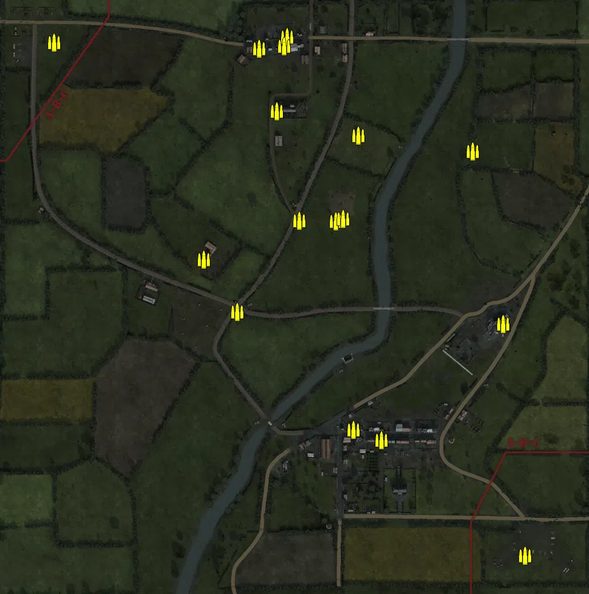
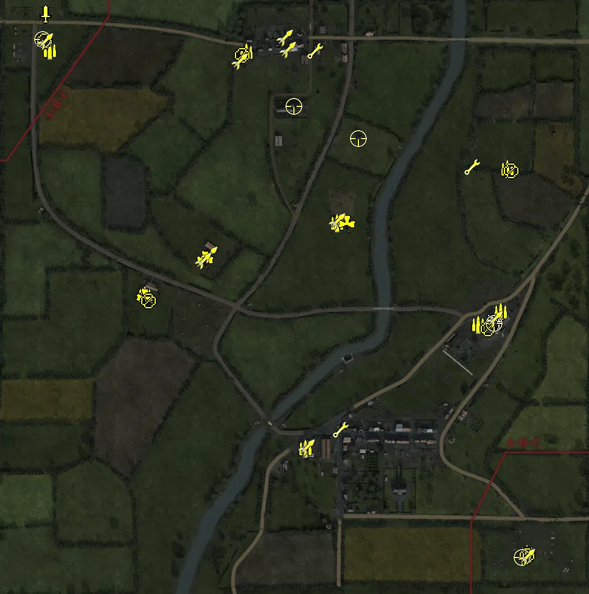
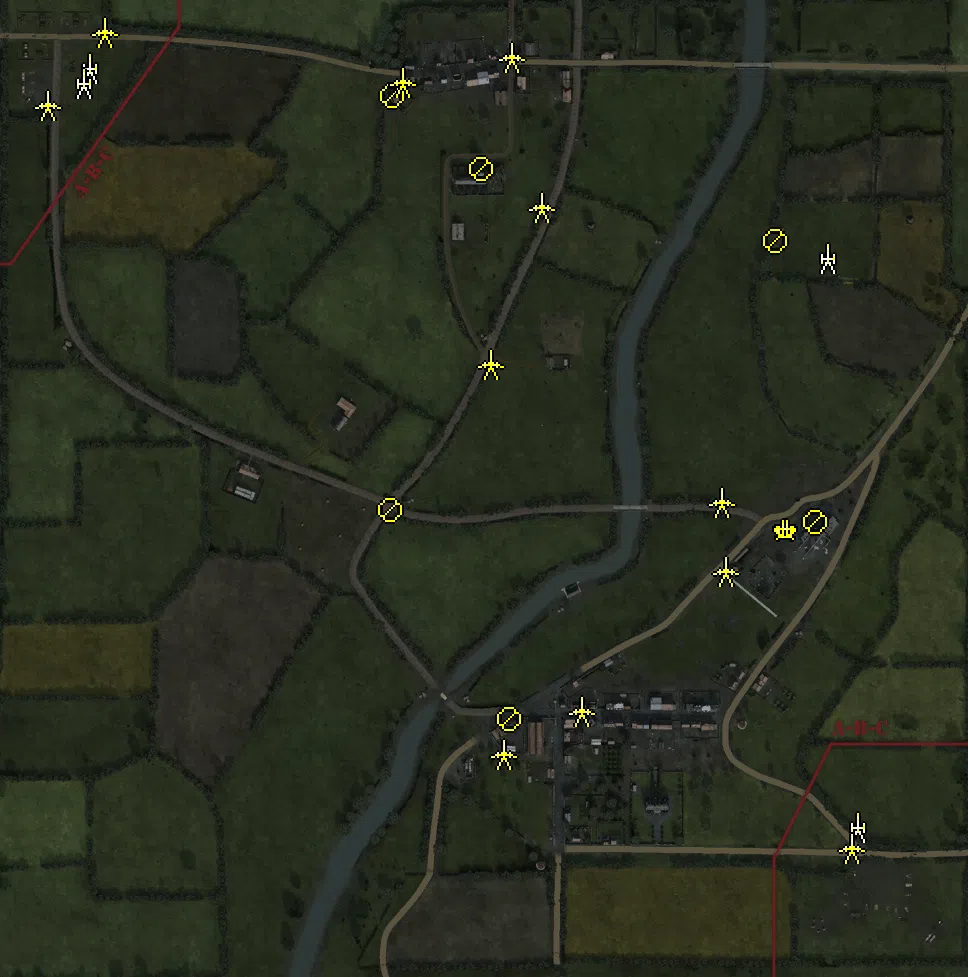
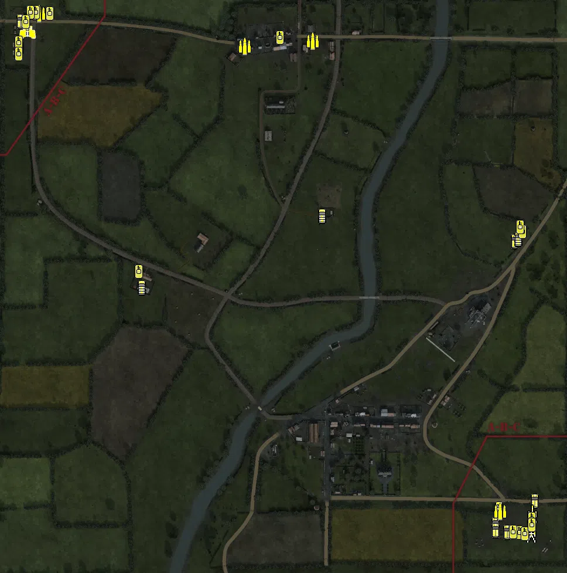

Static Ammo Crate

Pickup Kit

Static Emplacement

Vehicle

| gpo_subcat   | gpo_cat    | gpo_name                  |    pos_x |   pos_y |    pos_z |   flag | is_locked   |   team | instance                                | gpo_cat_disp       | gpo_subcat_disp   |
|:-------------|:-----------|:--------------------------|---------:|--------:|---------:|-------:|:------------|-------:|:----------------------------------------|:-------------------|:------------------|
| ammo_crate   | ammo_crate | ammo_crate                | -162.222 |  23.838 |   54.719 |      0 | False       |      0 | ammo_crate_0                            | Static Ammo Crate  | Static Ammo Crate |
| ammo_crate   | ammo_crate | ammo_crate                | -161.89  |  23.845 |   53.956 |      0 | False       |      0 | ammo_crate_1                            | Static Ammo Crate  | Static Ammo Crate |
| ammo_crate   | ammo_crate | ammo_crate                |  -24.617 |  22.081 |  420.695 |      0 | False       |      0 | ammo_crate_2                            | Static Ammo Crate  | Static Ammo Crate |
| ammo_crate   | ammo_crate | ammo_crate                |  -24.726 |  22.076 |  419.82  |      0 | False       |      0 | ammo_crate_3                            | Static Ammo Crate  | Static Ammo Crate |
| ammo_crate   | ammo_crate | ammo_crate                |  330.543 |  31.047 |  -51.572 |      0 | False       |      0 | ammo_crate_4                            | Static Ammo Crate  | Static Ammo Crate |
| ammo_crate   | ammo_crate | ammo_crate                |  329.812 |  31.052 |  -52.065 |      0 | False       |      0 | ammo_crate_5                            | Static Ammo Crate  | Static Ammo Crate |
| ammo_crate   | ammo_crate | ammo_crate                |  129.918 |  23.12  | -243.498 |      0 | False       |      0 | ammo_crate_6                            | Static Ammo Crate  | Static Ammo Crate |
| ammo_crate   | ammo_crate | ammo_crate                |  129.78  |  23.124 | -242.651 |      0 | False       |      0 | ammo_crate_7                            | Static Ammo Crate  | Static Ammo Crate |
| ammo_crate   | ammo_crate | ammo_crate                |   83.929 |  21.688 | -226.34  |      0 | False       |      0 | ammo_crate_8                            | Static Ammo Crate  | Static Ammo Crate |
| ammo_crate   | ammo_crate | ammo_crate                |   84.163 |  21.633 | -225.514 |      0 | False       |      0 | ammo_crate_9                            | Static Ammo Crate  | Static Ammo Crate |
| ammo_crate   | ammo_crate | ammo_crate                |   54.923 |  23.6   |  116.927 |      0 | False       |      0 | ammo_crate_10                           | Static Ammo Crate  | Static Ammo Crate |
| ammo_crate   | ammo_crate | ammo_crate                |  -30.296 |  22.26  |  405.034 |      0 | False       |      0 | ammo_crate_11                           | Static Ammo Crate  | Static Ammo Crate |
| ammo_crate   | ammo_crate | ammo_crate                |  -70.738 |  23.016 |  400.87  |      0 | False       |      0 | ammo_crate_12                           | Static Ammo Crate  | Static Ammo Crate |
| ammo_crate   | ammo_crate | ammo_crate                |  279.968 |  26.371 |  231.542 |      0 | False       |      0 | ammo_crate_13                           | Static Ammo Crate  | Static Ammo Crate |
| ammo_crate   | ammo_crate | ammo_crate                |  -42.353 |  23.221 |  298.295 |      0 | False       |      0 | ammo_crate_14                           | Static Ammo Crate  | Static Ammo Crate |
| ammo_crate   | ammo_crate | ammo_crate                | -106.536 |  22.501 |  -31.873 |      0 | False       |      0 | ammo_crate_15                           | Static Ammo Crate  | Static Ammo Crate |
| ammo_crate   | ammo_crate | ammo_crate                | -408.026 |  24.05  |  411.043 |      0 | False       |      0 | ammo_crate_16                           | Static Ammo Crate  | Static Ammo Crate |
| ammo_crate   | ammo_crate | ammo_crate                |   -4.961 |  21.575 |  117.568 |      0 | False       |      0 | ammo_crate_17                           | Static Ammo Crate  | Static Ammo Crate |
| ammo_crate   | ammo_crate | ammo_crate                |   67.457 |  22.062 |  120.717 |      0 | False       |      0 | ammo_crate_18                           | Static Ammo Crate  | Static Ammo Crate |
| ammo_crate   | ammo_crate | ammo_crate                |  366.471 |  26.356 | -432.966 |      0 | False       |      0 | ammo_crate_19                           | Static Ammo Crate  | Static Ammo Crate |
| ammo_crate   | ammo_crate | ammo_crate                |   92.123 |  24.027 |  257.861 |      0 | False       |      0 | ammo_crate_20                           | Static Ammo Crate  | Static Ammo Crate |
| ammo         | kit        | BW_PickUpAmmokit          |  326.297 |  31.776 |  -32.295 |      5 | False       |      0 | Point_213_DE_US_AmmoCrates1             | Pickup Kit         | Ammo Kit          |
| ammo         | kit        | GW_PickUpAmmokit          |    4.934 |  20.417 | -257.375 |    104 | False       |      0 | Villers_Bocage_ammokit                  | Pickup Kit         | Ammo Kit          |
| ammo         | kit        | BW_PickUpAmmokit          |   56.713 |  22.307 |  114.127 |    103 | False       |      0 | Farm_ammo_kit                           | Pickup Kit         | Ammo Kit          |
| ammo         | kit        | GW_PickUpAmmokit          |  -92.13  |  22.905 |  394.682 |      6 | False       |      0 | Tilly_sur_Seulles_ammokit               | Pickup Kit         | Ammo Kit          |
| ammo         | kit        | GW_PickUpAmmokit          | -259.197 |  23.925 |   -5.227 |      1 | False       |      0 | Crossroad_ammokit                       | Pickup Kit         | Ammo Kit          |
| ammo         | kit        | BW_PickUpAmmokit          |  288.856 |  30.07  |  -52.819 |      5 | False       |      0 | Point_213_ammokit                       | Pickup Kit         | Ammo Kit          |
| ammo         | kit        | GW_PickUpAmmokit          |  369.391 |  26.383 | -430.494 |    101 | False       |      0 | 130th_Lehr_ammokit                      | Pickup Kit         | Ammo Kit          |
| ammo         | kit        | BW_PickUpAmmokit          | -415.049 |  24.075 |  397.697 |      2 | False       |      0 | 7th_Armor_Division_ammokit              | Pickup Kit         | Ammo Kit          |
| ammo         | kit        | BW_PickUpAmmokit          |  336.862 |  32.06  |  202.889 |      5 | False       |      0 | Point_213_DE_GB_Ammo                    | Pickup Kit         | Ammo Kit          |
| arty_dep     | kit        | BA_PickUpMortar           | -259.068 |  27.046 |   -6.912 |      1 | False       |      0 | Crossroad_DE_GB_Mortar                  | Pickup Kit         | Deployable Arty   |
| arty_dep     | kit        | BA_PickUpMortar           |  321.867 |  42.104 |  -49.097 |      5 | False       |      0 | Point_213_DE_GB_Mortar                  | Pickup Kit         | Deployable Arty   |
| arty_dep     | kit        | BA_PickUpMortar           |  310.663 |  41.524 |  -43.226 |      5 | False       |      0 | Point_213_DE_GB_Mortar_2                | Pickup Kit         | Deployable Arty   |
| commando     | kit        | BW_PickUpCommandoStenMK2S | -422.122 |  25.444 |  458.294 |      2 | False       |      0 | 7th_Armor_Division_smg_kit              | Pickup Kit         | Commando Kit      |
| easteregg    | kit        | GW_PickUpFarmer           | -258.813 |  23.821 |   -8.464 |      1 | False       |      0 | pitchforkshotguncrossroad               | Pickup Kit         | Easteregg         |
| easteregg    | kit        | GW_PickUpFarmer           | -159.959 |  24.186 |   54.257 |      1 | False       |      0 | pitchforkshotguncrossroad2              | Pickup Kit         | Easteregg         |
| easteregg    | kit        | GW_PickUpFarmer           |   73.161 |  22.232 |  113.148 |    103 | False       |      0 | Farm_DE_US_Shotgun1                     | Pickup Kit         | Easteregg         |
| engineer     | kit        | BW_PickUpEngineer         |  278.526 |  28.983 |  205.589 |      5 | False       |      0 | Point_213_DE_GB_Mortar_0                | Pickup Kit         | Engineer Kit      |
| engineer     | kit        | BW_PickUpEngineer         |   21.027 |  24.96  |  397.023 |      6 | False       |      0 | mortorattilly                           | Pickup Kit         | Engineer Kit      |
| engineer     | kit        | BW_PickUpEngineer         |   62.767 |  21.402 | -225.656 |    104 | False       |      0 | Villers_Bocage_Mines1                   | Pickup Kit         | Engineer Kit      |
| mg           | kit        | BW_PickUpSupportBrenMK1   |  343.23  |  32.749 |  199.547 |      5 | False       |      0 | Point_213_DE_GB_DepMG                   | Pickup Kit         | MG Kit            |
| mg           | kit        | BW_PickUpSupportBrenMK1   | -252.843 |  27.837 |  -13.94  |      1 | False       |      0 | Crossroad_DepMG                         | Pickup Kit         | MG Kit            |
| mg           | kit        | BW_PickUpSupportBrenMK1   |  -99.229 |  26.366 |  389.935 |      6 | False       |      0 | Tilly_sur_Seulles_DE_US_Support3        | Pickup Kit         | MG Kit            |
| mg           | kit        | GW_PickUpSupportMG42      |  368.935 |  27.134 | -431.849 |    101 | False       |      0 | 130th_Lehr_smg_kit                      | Pickup Kit         | MG Kit            |
| mg           | kit        | BW_PickUpSupportBrenMK1   | -424.396 |  25.521 |  413.5   |      2 | False       |      0 | 7th_Armor_Division_hmg_kit              | Pickup Kit         | MG Kit            |
| mg_dep       | kit        | BA_PickUpVickers303       |  305.37  |  38.045 |  -59.749 |      5 | False       |      0 | Point_213_DE_GB_DepMG_0                 | Pickup Kit         | Deployable MG     |
| mg_dep       | kit        | GW_PickUpMG42Lafette      |  369.142 |  27.178 | -433.357 |    101 | False       |      0 | 130th_Lehr_hmg_kit                      | Pickup Kit         | Deployable MG     |
| sniper       | kit        | BW_PickUpSniperNo4        |  -14.349 |  39.925 |  306.238 |      6 | False       |      0 | sniperrifle                             | Pickup Kit         | Sniper Kit        |
| sniper       | kit        | BW_PickUpSniperNo4        |   92.404 |  32.745 |  252.955 |    103 | False       |      0 | sniperkitatwindmill                     | Pickup Kit         | Sniper Kit        |
| sniper       | kit        | BW_PickUpSniperNo4        |  315.337 |  46.35  |  -51.286 |      5 | False       |      0 | Point_213_DE_GB_K98zf41                 | Pickup Kit         | Sniper Kit        |
| sniper       | kit        | GW_PickUpSniperK98        |  360.656 |  27.04  | -436.142 |    101 | False       |      0 | 130th_Lehr_sniperkit                    | Pickup Kit         | Sniper Kit        |
| sniper       | kit        | BW_PickUpSniperNo4        | -426.877 |  25.855 |  415.879 |      2 | False       |      0 | 7th_Armor_Division_sniper_kit           | Pickup Kit         | Sniper Kit        |
| zooka        | kit        | GW_PickUpPanzerschreck    | -152.747 |  23.832 |   61.992 |      1 | False       |      0 | panzershrekcrossroad                    | Pickup Kit         | HEAT Thrower      |
| zooka        | kit        | BW_PickUpAntitankPiat     |  -28.972 |  25.12  |  419.371 |      6 | False       |      0 | zookattilly                             | Pickup Kit         | HEAT Thrower      |
| zooka        | kit        | BW_PickUpAntitankPiat     | -102.566 |  23.368 |  379.656 |      6 | False       |      0 | Tilly_sur_Seulles_DE_US_AT1             | Pickup Kit         | HEAT Thrower      |
| zooka        | kit        | BW_PickUpAntitankPiat     |    7.293 |  20.222 | -255.119 |    104 | False       |      0 | Villers_Bocage_at_kit                   | Pickup Kit         | HEAT Thrower      |
| zooka        | kit        | BW_PickUpAntitankPiat     |   56.757 |  22.475 |  117.496 |    103 | False       |      0 | Farm_at_kit                             | Pickup Kit         | HEAT Thrower      |
| zooka        | kit        | GW_PickUpPanzerfaust30m   |  -24.297 |  23.115 |  399.359 |      6 | False       |      0 | Tilly_sur_Seulles_at_kit                | Pickup Kit         | HEAT Thrower      |
| zooka        | kit        | GW_PickUpPanzerfaust30m   | -163.207 |  24.136 |   51.828 |      1 | False       |      0 | Crossroad_at_kit                        | Pickup Kit         | HEAT Thrower      |
| zooka        | kit        | BW_PickUpAntitankPiat     |  316.206 |  31.08  |  -43.737 |      5 | False       |      0 | Point_213_at_kit                        | Pickup Kit         | HEAT Thrower      |
| zooka        | kit        | GW_PickUpPanzerschreck    |  369.053 |  27.306 | -434.585 |    101 | False       |      0 | 130th_Lehr_at_kit                       | Pickup Kit         | HEAT Thrower      |
| zooka        | kit        | BW_PickUpAntitankPiat     | -422.834 |  25.509 |  413.411 |      2 | False       |      0 | 7th_Armor_Division_at_kit               | Pickup Kit         | HEAT Thrower      |
| arty         | static     | 3inchmortar               | -407.798 |  24.168 |  412.85  |      2 | False       |      0 | 7th_Armor_Division_artyalliedmain       | Static Emplacement | Artillery         |
| arty         | static     | 3inchmortar               | -413.887 |  24.188 |  398.442 |      2 | False       |      0 | 7th_Armor_Division_LightArtillery2      | Static Emplacement | Artillery         |
| arty         | static     | sgwr34_france             |  330.208 |  31.728 |  222.787 |      5 | False       |      0 | Point_213_DE_GB_LightMortar             | Static Emplacement | Artillery         |
| arty         | static     | lefh18_france             |  360.428 |  27.622 | -346.009 |    101 | False       |      0 | 130th_Lehr_LeFH18                       | Static Emplacement | Artillery         |
| flak         | static     | flak18_fr                 |  288.851 |  30.103 |  -48.834 |      5 | False       |      0 | Point_213_DE_GB_HeavyArtillery          | Static Emplacement | Anti-aircraft Gun |
| mg_nest      | static     | mg42_bipod                |  317.738 |  38.709 |  -40.831 |      5 | False       |      0 | mgnest                                  | Static Emplacement | Static MG         |
| mg_nest      | static     | mg42_bipod                |  -15.968 |  40.828 |  311.826 |      6 | False       |      0 | mg42tillychurch                         | Static Emplacement | Static MG         |
| mg_nest      | static     | mg42_bipod                | -106.614 |  23.671 |  -28.727 |      1 | False       |      0 | Crossroad_mgfarmintersection            | Static Emplacement | Static MG         |
| mg_nest      | static     | mg42_bipod                |  278.261 |  25.377 |  239.841 |      5 | False       |      0 | mg42firetrench                          | Static Emplacement | Static MG         |
| mg_nest      | static     | mg42_bipod                |   12.307 |  20.781 | -238.331 |    104 | False       |      0 | Villers_Bocage_mgvillerswestenterance   | Static Emplacement | Static MG         |
| mg_nest      | static     | mg42_bipod                | -105.42  |  27.326 |  384.925 |      6 | False       |      0 | tillyenterancemg                        | Static Emplacement | Static MG         |
| pak          | static     | pak40                     |   13.609 |  22.393 |  423.622 |      6 | False       |      0 | Tilly_sur_Seulles_DE_GB_LightArtillery2 | Static Emplacement | Anti-tank Gun     |
| pak          | static     | pak40                     |  228.007 |  26.54  |  -90.289 |      5 | False       |      0 | staticatgun                             | Static Emplacement | Anti-tank Gun     |
| pak          | static     | pak40                     |   44.279 |  22.227 |  273.623 |      6 | False       |      0 | pakattillychurch                        | Static Emplacement | Anti-tank Gun     |
| pak          | static     | pak40                     |  223.542 |  26.072 |  -20.719 |      5 | False       |      0 | pak40at213                              | Static Emplacement | Anti-tank Gun     |
| pak          | static     | pak40                     |   -7.041 |  21.468 |  117.05  |    103 | False       |      0 | pak40farm                               | Static Emplacement | Anti-tank Gun     |
| pak          | static     | pak40                     |   83.814 |  21.451 | -230.08  |    104 | False       |      0 | Villers_Bocage_atatenterancevillerswest | Static Emplacement | Anti-tank Gun     |
| pak          | static     | pak40                     |  -94.808 |  22.236 |  399.303 |      6 | False       |      0 | attillyenterance                        | Static Emplacement | Anti-tank Gun     |
| pak          | static     | pak40                     |  354.229 |  29.21  | -367.184 |    101 | False       |      0 | 130th_Lehr_pak40                        | Static Emplacement | Anti-tank Gun     |
| pak          | static     | pak40                     |    5.651 |  21.268 | -272.905 |    104 | False       |      0 | Villers_Bocage_pak40                    | Static Emplacement | Anti-tank Gun     |
| pak          | static     | 6pdr_mkiv                 | -392.677 |  24.68  |  448.838 |      2 | False       |      0 | 7th_Armor_Division_6pdr                 | Static Emplacement | Anti-tank Gun     |
| pak          | static     | 6pdr_mkiv                 | -450.349 |  24.243 |  375.534 |      2 | False       |      0 | 7th_Armor_Division_mobile_AT            | Static Emplacement | Anti-tank Gun     |
| apc          | vehicle    | sdkfz251_d_spawn          |  416.281 |  28.705 | -373.304 |    101 | True        |      0 | 130th_Lehr_axis_spawnAPC                | Vehicle            | APC               |
| apc          | vehicle    | sdkfz251_d                |  348.924 |  26.368 | -412.511 |    101 | False       |      0 | 130th_Lehr_opelblitzvillers             | Vehicle            | APC               |
| apc          | vehicle    | sdkfz251_d                |  369.289 |  26.431 | -425.615 |    101 | False       |      0 | 130th_Lehr_opelblitzvillers2            | Vehicle            | APC               |
| apc          | vehicle    | m5a1_halftrack            | -461.813 |  25.364 |  444.982 |      2 | False       |      0 | apc                                     | Vehicle            | APC               |
| apc          | vehicle    | m5a1_halftrack            | -453.146 |  24.974 |  436.937 |      2 | False       |      0 | jeep                                    | Vehicle            | APC               |
| apc          | vehicle    | sdkfz251_d                |  381.656 |  32.017 |   70.148 |      5 | False       |      0 | ammotruck213                            | Vehicle            | APC               |
| apc          | vehicle    | sdkfz251_d                |  349.309 |  26.341 | -423.247 |    101 | False       |      0 | lighttankaxismain                       | Vehicle            | APC               |
| arty_sp      | vehicle    | sdkfz251_d_sf             |  411.344 |  27.842 | -394.715 |    101 | True        |      0 | apcaxismain3                            | Vehicle            | Mobile Arty       |
| arty_sp      | vehicle    | wespe                     |  409.458 |  26.546 | -428.281 |    101 | True        |      0 | 130th_Lehr_64_Wespe                     | Vehicle            | Mobile Arty       |
| car          | vehicle    | citroen_11cv_ger          | -255.499 |  23.816 |   -9.385 |      1 | False       |      0 | Crossroad_CivTruck                      | Vehicle            | Car               |
| car          | vehicle    | schwimmwagen              |  387.762 |  32.017 |   73.523 |      5 | False       |      0 | schwimwagon1                            | Vehicle            | Car               |
| car          | vehicle    | schwimmwagen              |  355.079 |  27.234 | -385.991 |    101 | False       |      0 | kubelaxismain2                          | Vehicle            | Car               |
| car          | vehicle    | civtruck                  |   52.534 |  22.417 |  112.864 |    103 | False       |      0 | Farm_DE_GB_CivTruck1                    | Vehicle            | Car               |
| recon        | vehicle    | dingo_eu                  | -450.037 |  25.035 |  426.256 |      2 | False       |      0 | 7th_Armor_Division_willys               | Vehicle            | Scout Vehicle     |
| supply       | vehicle    | opelblitz_fr_ammo         |  357.488 |  27.132 | -391.255 |    101 | False       |      0 | bedfordaxismain                         | Vehicle            | Supply Vehicle    |
| supply       | vehicle    | bedfordoyd_france_ammo    | -429.586 |  25.003 |  458.347 |      2 | False       |      0 | bedfordalliedmain                       | Vehicle            | Supply Vehicle    |
| supply       | vehicle    | bedfordoyd_france_ammo    |  -78.875 |  22.174 |  401.679 |      6 | False       |      0 | Tilly_sur_Seulles_truck                 | Vehicle            | Supply Vehicle    |
| supply       | vehicle    | bedfordoyd_france_ammo    |   37.096 |  21.688 |  411.123 |      6 | False       |      0 | Tilly_sur_Seulles_truck_0               | Vehicle            | Supply Vehicle    |
| tank         | vehicle    | centaur_iv                |  -18.84  |  22.3   |  416.793 |      6 | True        |      0 | Tilly_sur_Seulles_tank                  | Vehicle            | Tank              |
| tank         | vehicle    | cromwell                  | -464.335 |  23.832 |  398.576 |      2 | True        |      0 | 7th_Armor_Division_Truck2               | Vehicle            | Tank              |
| tank         | vehicle    | achilles_iic              | -435.834 |  25.128 |  459.563 |      2 | True        |      0 | 7th_Armor_Division_3                    | Vehicle            | Tank              |
| tank         | vehicle    | cromwell                  | -259.513 |  23.884 |   18.481 |      1 | True        |      0 | Crossroad_cromwell                      | Vehicle            | Tank              |
| tank         | vehicle    | churchillmkiv_75mm        | -445.031 |  25.007 |  459.687 |      2 | True        |      0 | 7thadFirefly                            | Vehicle            | Tank              |
| tank         | vehicle    | pzivh_noskirt             |  390.193 |  26.548 | -426.763 |    101 | True        |      0 | 130th_Lehr_villerstiger                 | Vehicle            | Tank              |
| tank         | vehicle    | panthera_alt              |  411.212 |  27.356 | -403.814 |    101 | True        |      0 | 130th_Lehr_panthervillers1              | Vehicle            | Tank              |
| tank         | vehicle    | stug40_g                  |  398.92  |  26.518 | -429.048 |    101 | True        |      0 | 130th_Lehr_hanomagvillers1              | Vehicle            | Tank              |
| tank         | vehicle    | tiger_late                |  378.885 |  26.495 | -426.353 |    101 | True        |      0 | 130th_Lehr_hanomagvillers2              | Vehicle            | Tank              |
| tank         | vehicle    | tiger_late_222            |  394.549 |  32.144 |   85.717 |      5 | True        |      0 | tiger2131                               | Vehicle            | Tank              |
| tank         | vehicle    | pzivh_811                 |  391.145 |  32.017 |   93.902 |      5 | True        |      0 | tiger2132                               | Vehicle            | Tank              |
| tank         | vehicle    | sherman_vc_early_olive    | -411.929 |  24.576 |  458.492 |      2 | True        |      0 | 7th_Armor_Division_5                    | Vehicle            | Tank              |
| tank         | vehicle    | sherman_v_mid_olive       | -464.815 |  23.868 |  408.413 |      2 | True        |      0 | mediumtank                              | Vehicle            | Tank              |
| tank         | vehicle    | pzivh_811                 |  411.403 |  26.945 | -413.93  |    101 | True        |      0 | heavytank2                              | Vehicle            | Tank              |
| tank         | vehicle    | sherman_vc_late_olive     | -465.121 |  23.75  |  389.078 |      2 | True        |      0 | alliedmainfirefly                       | Vehicle            | Tank              |
| tank         | vehicle    | m5a1_stuart_recon         | -452.926 |  25.344 |  444.364 |      2 | True        |      0 | alliedreconstewart                      | Vehicle            | Tank              |

