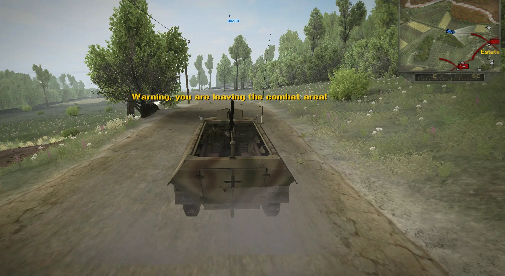
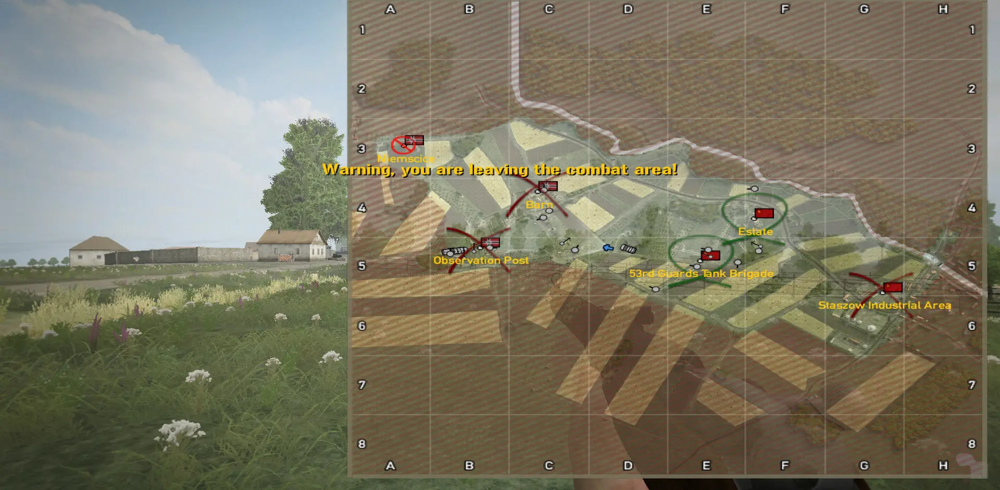
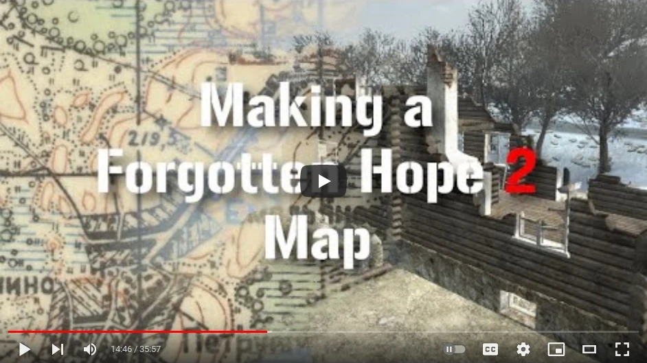
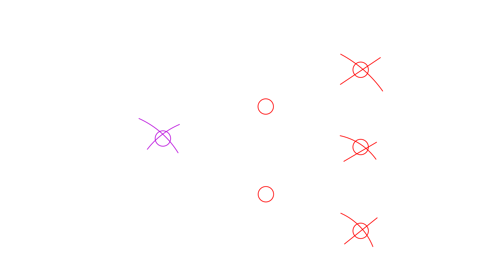
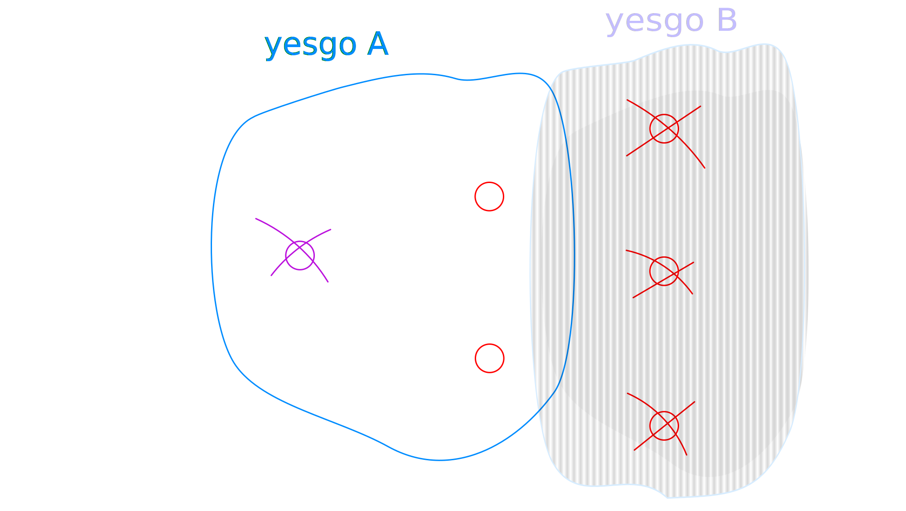
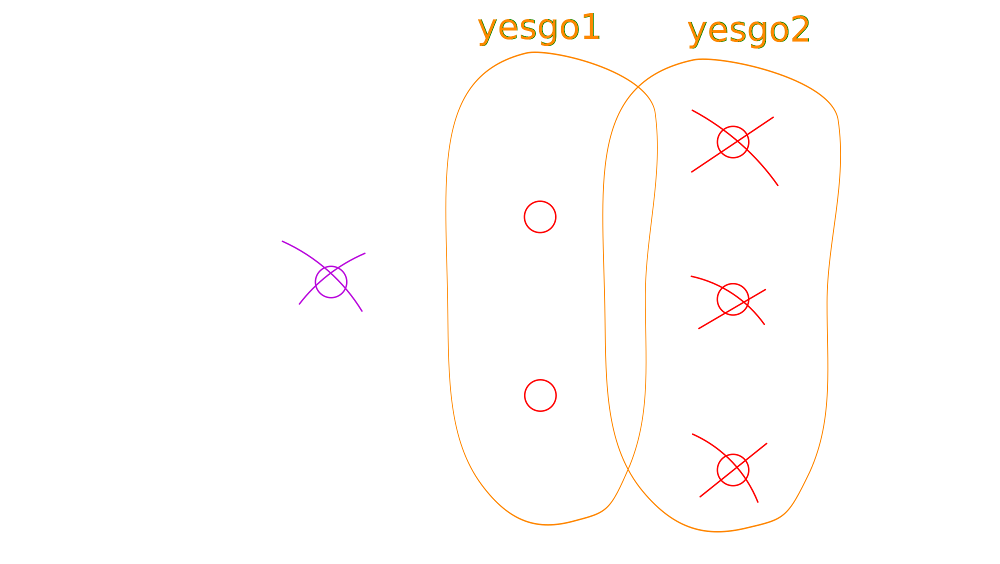
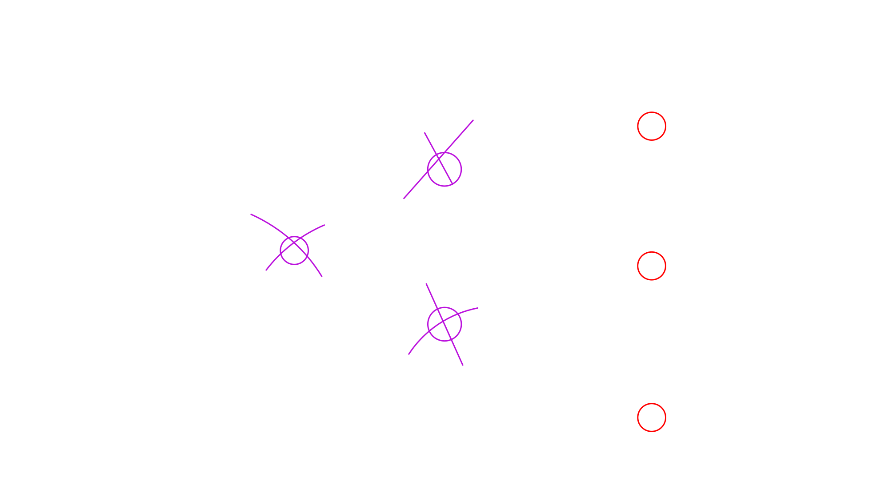
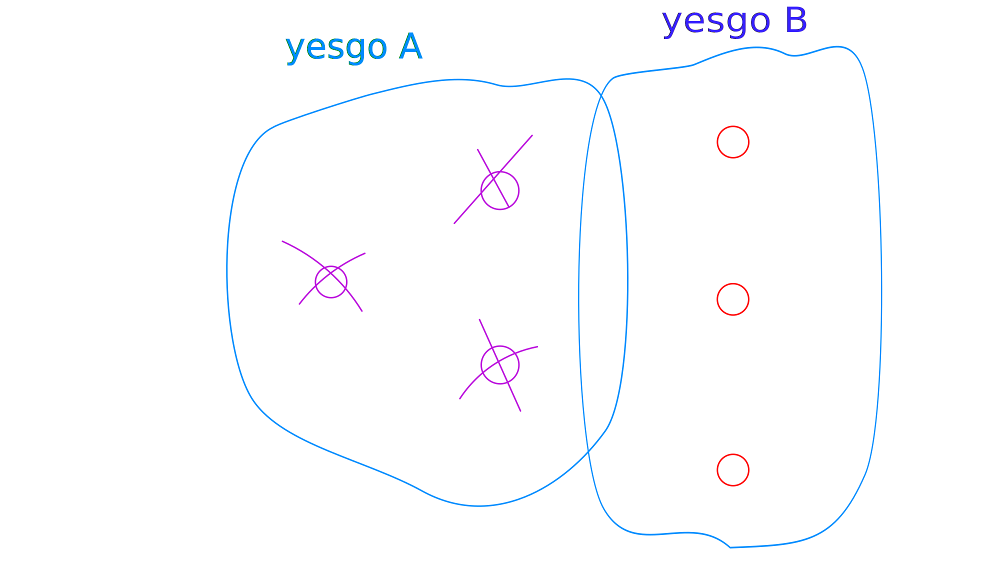
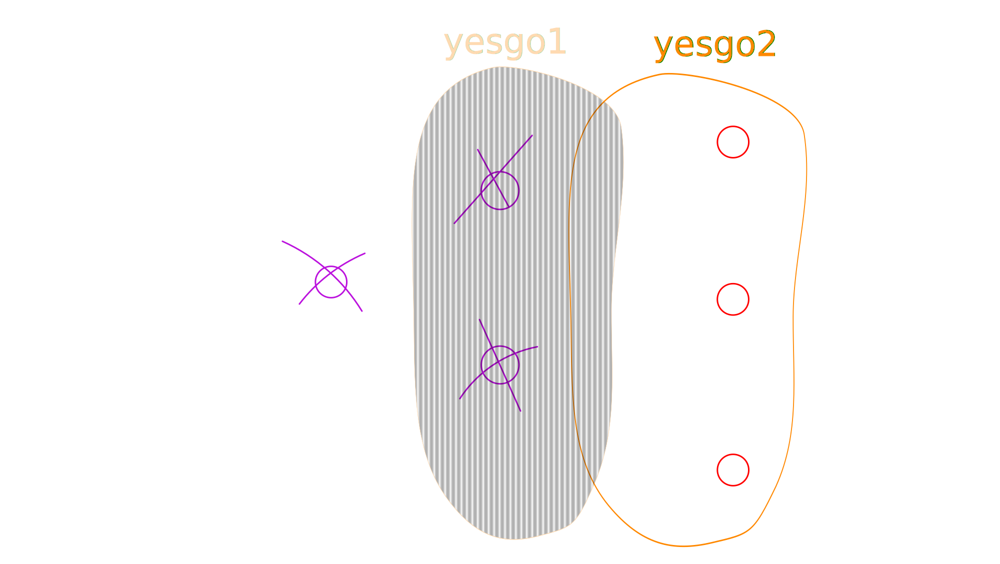

## What is it?

*During gameplay, you can dynamically create and destroy Out-of-Bound (OOB) zones
-- areas where you get the notification "Warning, you're leaving the
battle, return or die in 10 seconds".* 

For example, on a sector push map, you can prevent the attackers from
entering the area of the second sector before they have capped the flags
of the first sector. 

{width=100%}

Once the attackers capture the first sector, the second
sector area unlocks for the attackers, and the area of the first sector
locks for the defenders, so they are forced to retreat.

{width=100%}

### Video Tutorial

Ts4EVER demonstrated how to setup a dynamic OOB in one of his [mapping tutorial
videos](https://www.youtube.com/watch?v=ciUlk4jibaU&t=886s)

<figure>
[{width=67%}](https://www.youtube.com/watch?v=ciUlk4jibaU&t=886s)
<figcaption aria-hidden="true">[Ts4EVER's video, timestamp 14:46](https://www.youtube.com/watch?v=ciUlk4jibaU&t=886s)</figcaption>
</figure>
</figure>

## Simple Gameplay example

Let's say we want to add the dynamic OOBs to a sector push map with two
sectors. The blue team (allies) has a mainbase on the left and is attacking the
red team (axis). At the start of the game the first sector has two open flags,
and the second sector has three locked flags in the rear.

{width=100%} 

### OOB Areas at the start

To add OOB areas to the locked flags, we will define "yesgo-areas" for each 
team. Players can move freely inside their yesgo area, but will get the
"you're leaving the battle" warning if they leave it.

In this case, the first yesgo area for the attackers includes their
mainbase and the two flags of the open sector they are attacking.
It does not include the rear two flags. Let's call this area
`yesgo_blue_A`.

The second yesgo area for the attackers covers the 3 locked flags at
the second sector. We will configure the plugin in such a way that this
combatarea is *disabled* at the start of the round, so the attackers
cannot go there (yet). We will call this `yesgo_blue_B`.

{width=100%} 

The defenders have two yesgo areas: one covering their 3 rear
flags (`yesgo_red_2`, and another one covering the front 2 flags
(`yesgo_red_1`). Note how their yesgo areas don't cover the enemy mainbase,
otherwise they could enter it and camp there.

{width=100%} 

### Capturing a sector

Now the 1st sector has been capped, the 1st line flags lock for the
defenders, and the 2nd line flags unlock for the attackers.

{width=100%} 

The attackers' yesgo area for the rear flags now becomes active, so they
can go there.

{width=100%} 

The defender's yesgo area for the first line now gets *disabled*, so they
have to retreat to the 2nd line if they don't want to die!

{width=100%} 

## Setting up the code

In the game, the yesgo areas are created by defining `CombatAreas`.
Draw them in the editor like sketched above, and give them good names
that immediately make it clear where they are supposed to go, like
`MYMAP_yesgo_axis_sector1` or `MYMAP_yesgo_allies_northvillage`.

### Sector push setup

I'm assuming that you have the sector push system setup already, with an
associated dummyflag called `'MYMAP_sector_lock_dummy'`.

The sectorpush configuration probably looks like this (taking front
flags locks the sector, and unlocks the 3 flags in the rear):

```python
linkCPs_64 = [
    plugin(
        linkCPs,
        target='MYMAP_sector_lock_dummy',
        source='MYMAP_front_south, MYMAP_front_north'
    )
]

push_64 = [
    plugin(
        push,
        source='MYMAP_front_south, MYMAP_front_north',
        target='MYMAP_sector_lock_dummy',
        attacker=2,
        display_arrow=False,
        wants_target_marker=False
    )
    plugin(
        push,
        source='MYMAP_sector_lock_dummy',
        target='MYMAP_rear_north, MYMAP_rear_center, MYMAP_rear_south',
        attacker=2,
        display_arrow=False
    ),
]
```

### Sector OOB configuration

Now the code for the actual dynamicOOB plugin. Remember that
the allies (blue) are the attackers, and their yesgo areas (CombatAreas)
are called `yesgo_blue_A` and `yesgo_blue_B`. Axis (red) are defending,
and their yesgo areas are called `yesgo_red_1` and `yesgo_red_2`.

```python
dynamicoob_64 = [
    plugin(
        dynamicOOB,
        dynamic_flags={
            'MYMAP_sector_lock_dummy': {
                'allies': {
                    'creates': ['yesgo_blue_B'],
                    'destroys': ['yesgo_red_1'],
                },
            },
        },
        inactive_at_start=[
            'yesgo_blue_B'
        ],
        delay_allies=0, delay_axis=45,
    )
]
```

What this means, is: when team `'allies'` captures `MYMAP_sector_lock_dummy`
(the same dummyflag as in the push code), this activates ("creates") their
yesgo area in the rear, and deactivates ("destroys") the axis' yesgo area
for the front:
```python
            'MYMAP_sector_lock_dummy': {
                'allies': {
                    'creates': ['yesgo_blue_B'],
                    'destroys': ['yesgo_red_1'],
                },
            },
```

At the start, the rear combat area for allies is deactivated, so they can't 
move into the second (rear) sector yet:
```python
        inactive_at_start=[
            'yesgo_blue_B'
        ],
```

The delay for the team is how long it takes until the area
locks/unlocks. In this example, allies have zero delay, so their yesgo
area in the rear unlocks instantly. Axis have a 45 second delay, so they have
some time to retreat, before their yesgo area in the front is gone, and
they get the desertion warning.

```python
        delay_allies=0, delay_axis=45,
```


### Everything together

The whole code will look like this, roughly:

```python
from game.plugins import plugin, push, linkCPs, dynamicOOB, ...

linkCPs_64 = [
    plugin(
        linkCPs,
        target='MYMAP_sector_lock_dummy',
        source='MYMAP_front_south, MYMAP_front_north'
    )
]

push_64 = [
    plugin(
        push,
        source='MYMAP_front_south, MYMAP_front_north',
        target='MYMAP_sector_lock_dummy',
        attacker=2,
        display_arrow=False,
        wants_target_marker=False
    )
    plugin(
        push,
        source='MYMAP_sector_lock_dummy',
        target='MYMAP_rear_north, MYMAP_rear_center, MYMAP_rear_south',
        attacker=2,
        display_arrow=False
    ),
]

dynamicoob_64 = [
    plugin(
        dynamicOOB,
        dynamic_flags={
            'MYMAP_sector_lock_dummy': {
                'allies': {
                    'creates': ['yesgo_blue_B'],
                    'destroys': ['yesgo_red_1'],
                },
            },
        },
        inactive_at_start=[
            'yesgo_blue_B'
        ],
        delay_allies=0, delay_axis=45,
    )
]

...

gpm_cq = {64: push_64 + linkCPs_64 + dynamicoob_64 + ...}
```
