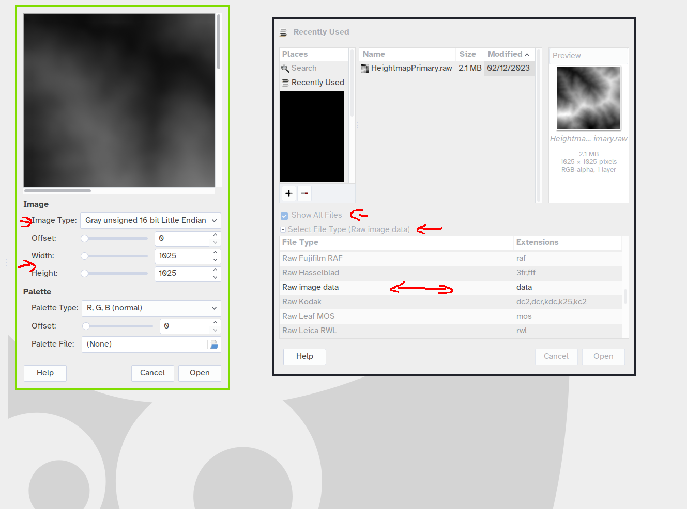

## Opening Heightmap .raw files in GIMP

This is how you open .raw files in GIMP without any plugin: (e.g. `HeightmapPrimary.raw`)

- click "select filetype" -> tell it to open the .raw file as filetype "Raw Image Data" 
  - click "show all files" if it doesnt show the file in the folder
- then tell it the image type, and the Width/height, explicitly 
  - open as 16bit unsigned grayscale image (Little Endian)
  - you get the width/height from heightdata.con, usually 1025x1025 or 513x513
- remember to flip the picture in GIMP afterwards! 
  - in the preview pic, the heightmap is upside-down
- save as .xcf/export as PNG, to avoid introducing undesired image compression artifacts into the heightmap
